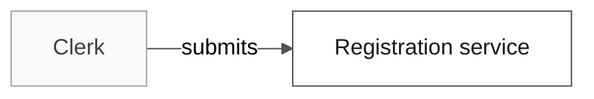

# Design: Sample Feature

## Architecture Overview

One validation component inside the registration service serves REQ-001 and NFR-001.

## System Context

## Component Map

| Component | Responsibility | Requirements |
| --- | --- | --- |
| C-01 DocumentValidator | Checks document numbers | REQ-001, NFR-001 |

## Deployment View

NOT APPLICABLE: the component ships inside the existing service.

## State Model

NOT APPLICABLE: validation is stateless.

## Critical Sequences

The clerk submits, C-01 validates, and the service answers DOC-01 on failure.

## Data Flow and Lifecycle

NOT APPLICABLE: no data is persisted.

## Data Model

NOT APPLICABLE: no entity changes.

## Interfaces and Contracts

See `contracts/validation.openapi.yaml`.

## Error Model

| Failure | Response | Requirement |
| --- | --- | --- |
| Invalid document | DOC-01 | REQ-001 |

## Security Design

Inputs are validated before use; no secret is involved.

## Threat Model

| Threat | Mitigation | Residual risk |
| --- | --- | --- |
| Oversized input | Reject inputs longer than the document format | Low |

## Observability Design

Latency is recorded per request for NFR-001.

## Testing Strategy

Unit tests TST-001 and a load test TST-002, written before implementation.

## Implementation Surface

| Surface | Current state | Planned change |
| --- | --- | --- |
| `tests/test_sample.py` | exists | extend |

## Delivery and Traceability View

| Requirements | Component | Plan item | Tasks | Tests |
| --- | --- | --- | --- | --- |
| REQ-001 | C-01 | P1.1 | T001, T002 | TST-001 |
| NFR-001 | C-01 | P1.2 | T003, T004 | TST-002 |

## Risks and Trade-Offs

DR-001 trades reuse for latency; RISK-001 in ANALYSIS.md stays open.

## Phased Development

| Phase | Scope |
| --- | --- |
| P1 | REQ-001 and NFR-001 |
