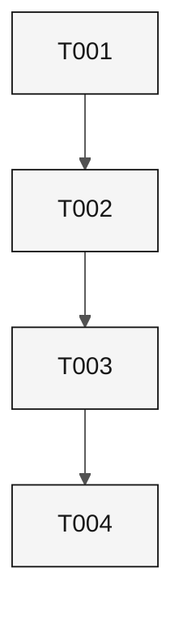

# Tasks: Sample Feature

## Pre-Implementation Gate

- [ ] Requirements are ready for review.

## Execution Rules

`[S]` is sequential, `[P]` is parallel, and RED precedes GREEN.

## Dependency Graph

## Phase 1

- [ ] **T001 [S] [Plan:P1.1] RED** Add a failing document-validation test. Traces REQ-001.
  - Files: `tests/test_sample.py`.
  - Acceptance: TST-001 fails for the missing rule.
- [ ] **T002 [S] [Plan:P1.1] GREEN** Implement the document rule. Traces REQ-001.
  - Files: `tests/test_sample.py`.
  - Acceptance: TST-001 passes.
- [ ] **T003 [S] [Plan:P1.2] RED** Add a failing latency test. Traces NFR-001.
  - Files: `tests/test_sample.py`.
  - Acceptance: TST-002 fails above 300 ms.
- [ ] **T004 [S] [Plan:P1.2] GREEN** Meet the latency budget. Traces NFR-001.
  - Files: `tests/test_sample.py`.
  - Acceptance: TST-002 passes.

## Completion Gate

- [ ] Every task has evidence in `evidence/`.

## Execution log

Task closure: 0 of 4. No task is checked until acceptance evidence exists.
