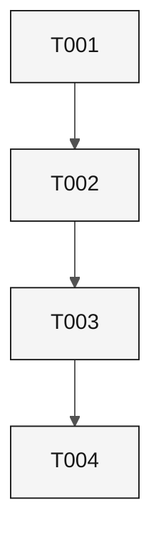

<!-- GENERATED BY .github/scripts/generate-sdd-support-artifacts.py; DO NOT EDIT DIRECTLY. -->
# Test-Driven Development Plan: Sample Feature

## Provenance and authority

This generated review projection preserves canonical source content; it is not a new requirements authority or an execution report. Hashes bind original bytes; parsing normalizes line endings only. `SPECIFICATION.md`, `TASKS.md`, `TESTING.md`, decisions and checkpoints remain authoritative. Generation does not verify execution, approval or live acceptance. Missing source details below require author review; they are not permission to substitute generic scenarios or results.

| Source snapshot | SHA-256 |
| --- | --- |
| [`ANALYSIS.md`](ANALYSIS.md) | `7e158bbfe39a5911e2b0c71ad428e35ee6befb2722dfa4993ff65f7a5ac02056` |
| [`DECISIONS.md`](DECISIONS.md) | `b6bfa009f71985e0607f4bfbb000ffbdf3c1c4d4d3700d56d9dbb7f925675e34` |
| [`DESIGN.md`](DESIGN.md) | `7a96de6d0872481c3edbb639b49d16fd12b55546e9e2375caddcd55649d99178` |
| [`SPECIFICATION.md`](SPECIFICATION.md) | `0e8d0d43992cfe6eb8ae4e4ef286775cf945c4333cc2bd426c026cc0feafd505` |
| [`TASKS.md`](TASKS.md) | `0d4b43e8dcdc2d75c1ae7f87ddf74769042664cfadab64370d236eea1b9f435f` |
| [`TESTING.md`](TESTING.md) | `bdb91b44720b85693b295410c354dcc3a19fbcc527542f571e0e22de52ed2bdc` |
| [`checkpoints/plan-to-tasks.yaml`](checkpoints/plan-to-tasks.yaml) | `9765718153e42762b8e5518d7d45fc0eafd7e16c45e818121c6f47fb3037aad0` |
| [`checkpoints/spec-to-plan.yaml`](checkpoints/spec-to-plan.yaml) | `984df0ddc9fc8c48c291b46195f4b8fe9be39c1a658e83aea5eacdade41264d8` |
| [`checkpoints/test-coverage.yaml`](checkpoints/test-coverage.yaml) | `c9e4aacba8dcc8ede7c330ea78066979cec0cb8f5622ba4abfaee80254b784f2` |

## Document control and entry gate

- Feature: `001-sample-feature`.
- Source checkpoint date: `2026-09-24`.
- Mode: source-bound test-plan projection for independent review.
- Execution status: not established by generation; retain the canonical execution ledger and actual test artifacts.
- Entry gate: reviewed requirement/acceptance scope, verified dependencies, named test scenarios and an approved runner. A missing source binding is not an approved default.

## Execution order and lifecycle

Plans are displayed in dependency order and all contributing plan dependencies are retained. Unknown/external dependencies are not satisfied by this projection. The canonical task graph and source phase declarations govern intra-plan execution; listed task order does not invent missing task edges.

### RED

Execute the source-declared negative scenario before changing its behavior and retain the observed assertion failure, source/test revisions and command. For existing implementation, use a new specific regression or a verified pre-change revision; never remove working behavior to fabricate history. Setup failures are not RED.

### GREEN

Implement the canonical work package below and rerun its source acceptance scenarios and declared commands. Record actual outcomes separately from the source's completion claims.

### REFACTOR

Preserve the mapped acceptance, negative and regression assertions while removing duplication. Rerun the affected source test selection and retain results. Missing scenario/command bindings block an executable handoff and require source authoring, not a default command.

### Dependency Graph



## Work packages

### T001

- Requirement(s): REQ-001
- Contributing plans: P1.1
- Source-declared plan dependencies: none declared

#### T001 work and phase declaration

> - [ ] **T001 [S] [Plan:P1.1] RED** Add a failing document-validation test. Traces REQ-001.
>   - Files: `tests/test_sample.py`.
>   - Acceptance: TST-001 fails for the missing rule.

| Test | Requirement | Test surface | Tier | Source acceptance assertion | Declared test command |
| --- | --- | --- | --- | --- | --- |
| TST-001 | REQ-001 | `tests/test_sample.py` | not-recorded | AC-REQ-001-01 Given an invalid document number, When the clerk submits, Then the service returns DOC-01. | Explicit checkpoint command; preserved verbatim below. |

#### T001 declared test command for TST-001

```text
python3 -m pytest tests/test_sample.py -k document
```

### T002

- Requirement(s): REQ-001
- Contributing plans: P1.1
- Source-declared plan dependencies: none declared

#### T002 work and phase declaration

> - [ ] **T002 [S] [Plan:P1.1] GREEN** Implement the document rule. Traces REQ-001.
>   - Files: `tests/test_sample.py`.
>   - Acceptance: TST-001 passes.

| Test | Requirement | Test surface | Tier | Source acceptance assertion | Declared test command |
| --- | --- | --- | --- | --- | --- |
| TST-001 | REQ-001 | `tests/test_sample.py` | not-recorded | AC-REQ-001-01 Given an invalid document number, When the clerk submits, Then the service returns DOC-01. | Explicit checkpoint command; preserved verbatim below. |

#### T002 declared test command for TST-001

```text
python3 -m pytest tests/test_sample.py -k document
```

### T003

- Requirement(s): NFR-001
- Contributing plans: P1.2
- Source-declared plan dependencies: none declared

#### T003 work and phase declaration

> - [ ] **T003 [S] [Plan:P1.2] RED** Add a failing latency test. Traces NFR-001.
>   - Files: `tests/test_sample.py`.
>   - Acceptance: TST-002 fails above 300 ms.

| Test | Requirement | Test surface | Tier | Source acceptance assertion | Declared test command |
| --- | --- | --- | --- | --- | --- |
| TST-002 | NFR-001 | `tests/test_sample.py` | not-recorded | AC-NFR-001-01 Given nominal load, When 1000 validations run, Then the 95th percentile is at most 300 ms. | Explicit checkpoint command; preserved verbatim below. |

#### T003 declared test command for TST-002

```text
python3 -m pytest tests/test_sample.py -k budget
```

### T004

- Requirement(s): NFR-001
- Contributing plans: P1.2
- Source-declared plan dependencies: none declared

#### T004 work and phase declaration

> - [ ] **T004 [S] [Plan:P1.2] GREEN** Meet the latency budget. Traces NFR-001.
>   - Files: `tests/test_sample.py`.
>   - Acceptance: TST-002 passes.

| Test | Requirement | Test surface | Tier | Source acceptance assertion | Declared test command |
| --- | --- | --- | --- | --- | --- |
| TST-002 | NFR-001 | `tests/test_sample.py` | not-recorded | AC-NFR-001-01 Given nominal load, When 1000 validations run, Then the 95th percentile is at most 300 ms. | Explicit checkpoint command; preserved verbatim below. |

#### T004 declared test command for TST-002

```text
python3 -m pytest tests/test_sample.py -k budget
```

## Source test scenarios

| Test | Requirements | Location | Level | Status |
| --- | --- | --- | --- | --- |
| TST-001 | REQ-001 | `tests/test_sample.py` | unit | Planned |
| TST-002 | NFR-001 | `tests/test_sample.py` | performance | Planned |

## Canonical acceptance scenarios

Acceptance remains in the source declarations and mapped assertions above.

## Source-declared package commands

### Commands

Run `python3 -m pytest tests/test_sample.py`.

## Source failure, measurement and evidence guidance

### Failure and measurement

TST-001 must fail before T002; TST-002 measures the 95th percentile over 1000 runs.

### Evidence contract

Each run stores command, revision, date, and exit status in `evidence/`.

### Exit criteria

Every test passes and its evidence is stored in `evidence/`.

## Evidence and exit gate

Source execution claims remain in TASKS.md, TESTING.md and checkpoints. They are not independently verified by generating this file. An executable handoff needs complete scenario and command bindings; completion additionally requires retained phase logs, revisions, environment, timestamp, exit status, approval scope and measured acceptance where applicable. Preserve missing evidence as missing.

## Review record

This file creates no reviewer identity or approval. Bind any subsequent acceptance to its generated bytes and the source snapshot above; program authorization does not fabricate phase outcomes.

## Document quality checks

These validate the documents, not the behavior of each mapped test:

```bash
python3 .github/scripts/validate-spec-artifacts.py .spec/001-sample-feature
python3 .github/scripts/validate-design-diagrams.py --spec-root .spec/001-sample-feature
python3 .github/scripts/validate-sdd-documents.py --package 001-sample-feature
```
