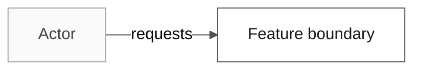
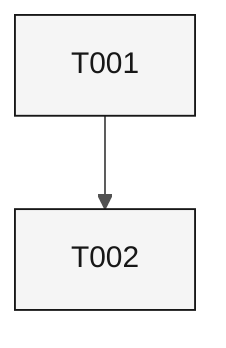

# SDD artifact templates

These are the templates for **architect packages**: the specifications the `@architect` agent writes through its prompts and this skill. Requirement statements follow the [EARS notation](./ears-notation.md); presentation follows the [document and Mermaid standard](./sdd-document-and-mermaid-standard.md). Packages created with GitHub Spec-Kit commands use Spec-Kit's own templates in `.specify/templates/` and are not covered here.

`python3 .github/scripts/export-spec-library.py --new-package <NNN>-<slug>` writes every authored template below into a new package, and `python3 .github/scripts/generate-sdd-support-artifacts.py --package <NNN>` derives the generated files. A complete worked example that passes every gate lives in [`.github/scripts/tests/fixtures/kit-repo/.spec/001-sample-feature/`](../../../scripts/tests/fixtures/kit-repo/.spec/001-sample-feature/SPECIFICATION.md).

## Package layout

```text
.spec/
├── CONSTITUTION.md                 # one per repository
└── <NNN>-<feature>/
    ├── checkpoints/
    │   ├── spec-to-plan.yaml
    │   ├── plan-to-tasks.yaml
    │   └── test-coverage.yaml
    ├── contracts/
    │   ├── manifest.yaml
    │   └── <contract files>
    ├── evidence/
    │   └── README.md
    ├── ANALYSIS.md
    ├── CHECKLIST.md                # generated
    ├── CROSS_ANALYSIS.md           # generated
    ├── DECISIONS.md
    ├── DESIGN.md
    ├── FRD.md
    ├── NFRD.md
    ├── SOURCE_TRACEABILITY.md      # generated
    ├── SPECIFICATION.md
    ├── TASKS.md
    ├── TDD.md                      # generated unless hand-authored
    ├── TESTING.md
    └── VERIFICATION.md             # generated
```

## Artifact responsibilities

| File | Written by | Stage | Responsibility |
| --- | --- | --- | --- |
| `FRD.md` | `/write-ears-spec` | Requirements | Functional scope, actors, domain lifecycle, requirement summary; cites IDs, never restates them |
| `NFRD.md` | `/write-ears-spec` | Requirements | Quality applicability, measurement envelopes, security and technology constraints |
| `SPECIFICATION.md` | `/write-ears-spec` | Requirements | The only home of EARS statements, sources, acceptance IDs, and status |
| `SOURCE_TRACEABILITY.md` | generator | Complete | Source register projected per requirement |
| `ANALYSIS.md` | `/design-modular-monolith` | Design | Evidence inventory, gaps, options, risks |
| `DESIGN.md` | `/design-modular-monolith` | Design | The 18-view design portfolio and delivery trace |
| `DECISIONS.md` | `/generate-adr`, `/design-modular-monolith` | Design | `DR-NNN` decisions; repository-wide ones also become ADRs |
| `contracts/` | `/design-modular-monolith` | Design | Interface contracts and `manifest.yaml` |
| `checkpoints/spec-to-plan.yaml` | `/design-modular-monolith` | Design | Requirement to design component and plan item |
| `TASKS.md` | `/break-down-tasks` | Complete | RED/GREEN checkbox tasks, dependency graph, ledger |
| `TESTING.md` | `/break-down-tasks` | Complete | `TST-NNN` catalog, commands, failure, evidence contract |
| `checkpoints/plan-to-tasks.yaml`, `test-coverage.yaml` | `/break-down-tasks` | Complete | Plan item to task; requirement to test |
| `TDD.md`, `CHECKLIST.md`, `CROSS_ANALYSIS.md`, `VERIFICATION.md` | generator | Complete | Derived test plan, review gates, cross-analysis, verification |
| `evidence/` | Stage 3 implementation | Complete | Dated run evidence cited by checked tasks |

Never hand-edit a generated file; change its sources and regenerate.

## CONSTITUTION.md

```markdown
# Constitution: <Repository or Product>

- Status: Draft
- Owner: <accountable role>
- Version: 0.1.0

## Principles

### CON-001: <Principle>

- Rule: <testable, non-negotiable rule>
- Source: <instruction file, ADR, or policy that justifies it>
- Enforcement: <gate or review that detects a violation>
- Consequence: <what happens on violation>

## Governance

- Amendment: <who approves and how the version changes>
```

## SPECIFICATION.md

```markdown
---
title: "Specification: <Feature>"
feature_id: "<NNN>-<feature>"
status: "Draft"
implementation_status: "Not started"
constitution: "../CONSTITUTION.md"
---

# Specification: <Feature>

## Problem and outcome

<Observed problem, affected actors, and the observable outcome.>

## Scope and non-goals

- In scope: <items>
- Out of scope: <items>

## Actors and dependencies

| Actor or dependency | Role | Source |
| --- | --- | --- |
| <actor> | <responsibility> | SRC-001 |

## Source register

| Source ID | Evidence | Relevance | Confidence |
| --- | --- | --- | --- |
| SRC-001 | `<repository path>` | <requirements it governs> | High |

## Requirements

- **REQ-001:** When <trigger>, the <system> shall <one observable response>.
  source_legacy: <repository path#Lstart-Lend or [GREENFIELD] justification>
  - Priority: P0. Source: SRC-001. Status: Draft.
  - Pattern: Event-driven
  - Rationale: <why>
  - Acceptance: AC-REQ-001-01 Given <state>, When <trigger>, Then <outcome>.
  - Verification: TST-001
- **NFR-001:** While <state>, the <system> shall <measurable response>.
  source_legacy: <repository path#Lstart-Lend or [GREENFIELD] justification>
  - Priority: P1. Source: SRC-001. Status: Draft.
  - Pattern: State-driven
  - Rationale: <why>
  - Acceptance: AC-NFR-001-01 Given <workload>, When <measurement>, Then <threshold>.
  - Verification: TST-002

## Assumptions, blockers, and open questions

| ID | Type | Statement | Owner | Impact |
| --- | --- | --- | --- | --- |
| Q-001 | question | <open question> | <owner> | <affected IDs> |

## Dispositions

NOT APPLICABLE: no requirement has been split, merged, or retired.

## Review record

NOT APPLICABLE: no review has taken place yet.
```

## ANALYSIS.md

```markdown
# Analysis: <Feature>

## Evidence inventory

| Source ID | Evidence | Relevance | Confidence |
| --- | --- | --- | --- |
| SRC-001 | `<repository path>` | <requirements> | High |

## Gap analysis

| Finding | Affected | Resolution |
| --- | --- | --- |
| <gap> | REQ-001 | <question or decision> |

## Options and trade-offs

| Option | Decision |
| --- | --- |
| <option> | <DR-NNN or open> |

## Risk register

| Risk | Mitigation |
| --- | --- |
| RISK-001 <trigger and impact> | <mitigation> |
```

## DESIGN.md

````markdown
# Design: <Feature>

## Architecture Overview

<Components and boundaries that serve REQ-001.>

## System Context



## Component Map

| Component | Responsibility | Requirements |
| --- | --- | --- |
| C-01 <name> | <responsibility> | REQ-001 |

## Deployment View

<Runtime placement, or NOT APPLICABLE: reason.>

## State Model

<Lifecycle states, or NOT APPLICABLE: reason.>

## Critical Sequences

<Success, failure, and recovery sequences.>

## Data Flow and Lifecycle

<Movement, retention, deletion, or NOT APPLICABLE: reason.>

## Data Model

<Entities and source-to-target fields, or NOT APPLICABLE: reason.>

## Interfaces and Contracts

See `contracts/manifest.yaml`.

## Error Model

| Failure | Response | Requirement |
| --- | --- | --- |
| <failure> | <response> | REQ-001 |

## Security Design

<Trust boundaries, identity, authorization, data protection.>

## Threat Model

| Threat | Mitigation | Residual risk |
| --- | --- | --- |
| <threat> | <mitigation> | <level> |

## Observability Design

<Signals, correlation, redaction.>

## Testing Strategy

<Tiers and what each proves; tests are written before code.>

## Implementation Surface

| Surface | Current state | Planned change |
| --- | --- | --- |
| `<path>` | exists/planned | <bounded delta> |

## Delivery and Traceability View

| Requirements | Component | Plan item | Tasks | Tests |
| --- | --- | --- | --- | --- |
| REQ-001 | C-01 | P1.1 | T001, T002 | TST-001 |

## Risks and Trade-Offs

<Link DR-NNN decisions and RISK-NNN entries.>

## Phased Development

| Phase | Scope |
| --- | --- |
| P1 | REQ-001 |
````

## DECISIONS.md

```markdown
# Decisions: <Feature>

## DR-001: <Decision>

- Status: proposed
- Requirements: REQ-001
- Context: <decision driver>
- Decision: <selected option>
- Alternatives: <rejected options and why>
- Consequences: <positive and negative>
- Revisit trigger: <condition>
```

## TASKS.md

````markdown
# Tasks: <Feature>

## Pre-Implementation Gate

- [ ] Requirements are ready for review.

## Execution Rules

`[S]` is sequential, `[P]` is parallel, and RED precedes GREEN for every requirement.

## Dependency Graph



## Phase 1

- [ ] **T001 [S] [Plan:P1.1] RED** Add a failing test for the rule. Traces REQ-001.
  - Files: `<test path>`.
  - Acceptance: TST-001 fails for the missing behavior.
- [ ] **T002 [S] [Plan:P1.1] GREEN** Implement the minimum behavior. Traces REQ-001.
  - Files: `<implementation path>`, `<test path>`.
  - Acceptance: TST-001 passes.

## Completion Gate

- [ ] Every checked task cites its evidence in `evidence/`.

## Execution log

Task closure: 0 of 2. No task is checked until acceptance evidence exists.
````

A checked task adds `- Evidence: evidence/<date>-T001.md` and appears in a line `Marked complete by verification sweep: T001`.

## TESTING.md

```markdown
# Testing: <Feature>

## Test catalog

| Test | Requirements | Location | Level | Status |
| --- | --- | --- | --- | --- |
| TST-001 | REQ-001 | `<test path>` | unit | Planned |

## Commands

Run `<targeted test command>`.

## Failure and measurement

TST-001 must fail before its GREEN task; state measurement windows for NFR tests.

## Evidence contract

Each run stores command, revision, date, and exit status in `evidence/`.

## Exit criteria

Every test passes and its evidence is stored in `evidence/`.
```

## TDD.md

Generated from the checkpoints by `generate-sdd-support-artifacts.py --include-supplements`. Hand-author it only when the team needs a different test-first narrative; the generator never overwrites a file without its marker.

```markdown
# TDD: <Feature>

## Ordered RED and GREEN steps

| Step | Task | Requirement | Test | Expected result |
| --- | --- | --- | --- | --- |
| 1 | T001 RED | REQ-001 | TST-001 | Fails |
| 2 | T002 GREEN | REQ-001 | TST-001 | Passes |
```

## CHECKLIST.md

Generated. Run `python3 .github/scripts/generate-sdd-support-artifacts.py --package <NNN>`.

```markdown
# Checklist: <Feature>

Generated from SPECIFICATION.md, DESIGN.md, TASKS.md, TESTING.md, and the checkpoints.
```

## CROSS_ANALYSIS.md

Generated. It maps every requirement to design, plan items, tasks, and tests.

```markdown
# Cross Analysis: <Feature>

Generated from the checkpoints; every gap is a hard error at generation time.
```

## VERIFICATION.md

Generated. It records planned verification per requirement and never claims execution.

```markdown
# Verification: <Feature>

Generated from test-coverage.yaml and TESTING.md.
```

## SOURCE_TRACEABILITY.md

Generated. It projects the source register onto every requirement.

```markdown
# Source Traceability: <Feature>

Generated from SPECIFICATION.md and ANALYSIS.md.
```

## checkpoints/spec-to-plan.yaml

```yaml
feature: {id: "<NNN>", slug: <feature>}
checkpoint: {generated_on: "<YYYY-MM-DD>", mapping_status: incomplete}
requirements:
  REQ-001: {design_components: [C-01], plan_items: [P1.1]}
```

## checkpoints/plan-to-tasks.yaml

```yaml
feature: {id: "<NNN>", slug: <feature>}
checkpoint: {generated_on: "<YYYY-MM-DD>", mapping_status: incomplete}
gate: {status: open, reason: "<why implementation may or may not start>"}
plan_items:
  P1.1: {requirements: [REQ-001], tasks: [T001, T002]}
```

## checkpoints/test-coverage.yaml

```yaml
feature: {id: "<NNN>", slug: <feature>}
checkpoint: {generated_on: "<YYYY-MM-DD>", mapping_status: incomplete}
requirements:
  REQ-001: {tests: [TST-001]}
tests:
  TST-001: {file: <test path>, command: "<targeted test command>"}
```

Set `mapping_status: complete` only when every requirement, task, and test is mapped.

## contracts/manifest.yaml

```yaml
schema_version: 1
feature: {id: "<NNN>", slug: <feature>}
contracts:
  <resource>.openapi.yaml: {status: provided}
```

A contract the feature does not expose uses `{status: not_applicable, reason: "<why, 40+ characters>", evidence: <repository path>, decision: DR-001}` and the file stays absent.

## evidence/README.md

```markdown
# Evidence

Dated execution evidence for checked tasks. Empty until a task runs.
```

## Consistency rules

- One requirement ID has one normative statement, in `SPECIFICATION.md`; other files cite the ID mid-sentence or in table cells, never at the start of a line.
- Every active requirement appears in `FRD.md` or `NFRD.md`, `DESIGN.md`, `TASKS.md`, `TESTING.md`, and all three checkpoints.
- Status never exceeds evidence: `Implemented` needs every task checked and in the ledger; `Verified` also needs a test citing every requirement.
- Unknown values stay `PENDING` or `BLOCKED` with an owner; an empty section states `NOT APPLICABLE: <reason>`.
