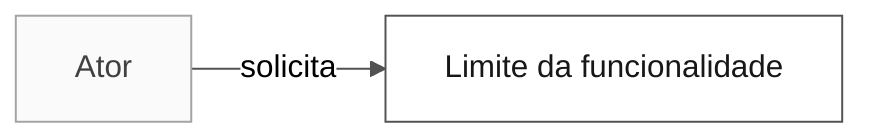
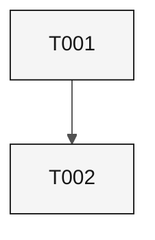

# Modelos de artefatos SDD

Estes são os modelos para **pacotes do architect**: as especificações que o agente `@architect` escreve por meio de seus prompts e desta skill. As declarações de requisitos seguem a [notação EARS](./ears-notation.md); a apresentação segue o [padrão de documentos e Mermaid](./sdd-document-and-mermaid-standard.md). Pacotes criados com comandos do GitHub Spec-Kit usam os próprios modelos do Spec-Kit em `.specify/templates/` e não são abordados aqui.

`python3 .github/scripts/export-spec-library.py --new-package <NNN>-<slug>` grava cada modelo autoral abaixo em um novo pacote, e `python3 .github/scripts/generate-sdd-support-artifacts.py --package <NNN>` deriva os arquivos gerados. Um exemplo completo que passa por todos os gates está em [`.github/scripts/tests/fixtures/kit-repo/.spec/001-sample-feature/`](../../../scripts/tests/fixtures/kit-repo/.spec/001-sample-feature/SPECIFICATION.md).

## Layout do pacote

```text
.spec/
├── CONSTITUTION.md                 # um por repositório
└── <NNN>-<feature>/
    ├── checkpoints/
    │   ├── spec-to-plan.yaml
    │   ├── plan-to-tasks.yaml
    │   └── test-coverage.yaml
    ├── contracts/
    │   ├── manifest.yaml
    │   └── <contract files>
    ├── evidence/
    │   └── README.md
    ├── ANALYSIS.md
    ├── CHECKLIST.md                # gerado
    ├── CROSS_ANALYSIS.md           # gerado
    ├── DECISIONS.md
    ├── DESIGN.md
    ├── FRD.md
    ├── NFRD.md
    ├── SOURCE_TRACEABILITY.md      # gerado
    ├── SPECIFICATION.md
    ├── TASKS.md
    ├── TDD.md                      # gerado, exceto quando escrito manualmente
    ├── TESTING.md
    └── VERIFICATION.md             # gerado
```

## Responsabilidades dos artefatos

| Arquivo | Escrito por | Etapa | Responsabilidade |
| --- | --- | --- | --- |
| `FRD.md` | `/write-ears-spec` | Requisitos | Escopo funcional, atores, ciclo de vida do domínio e resumo de requisitos; cita IDs, nunca os reformula |
| `NFRD.md` | `/write-ears-spec` | Requisitos | Aplicabilidade de qualidade, envelopes de medição e restrições de segurança e tecnologia |
| `SPECIFICATION.md` | `/write-ears-spec` | Requisitos | Único local das declarações EARS, fontes, IDs de aceitação e status |
| `SOURCE_TRACEABILITY.md` | gerador | Completo | Registro de fontes projetado por requisito |
| `ANALYSIS.md` | `/design-modular-monolith` | Design | Inventário de evidências, lacunas, opções e riscos |
| `DESIGN.md` | `/design-modular-monolith` | Design | Portfólio de design com 18 visões e rastreio da entrega |
| `DECISIONS.md` | `/generate-adr`, `/design-modular-monolith` | Design | Decisões `DR-NNN`; as válidas para todo o repositório também se tornam ADRs |
| `contracts/` | `/design-modular-monolith` | Design | Contratos de interface e `manifest.yaml` |
| `checkpoints/spec-to-plan.yaml` | `/design-modular-monolith` | Design | Requisito para componente de design e item de plano |
| `TASKS.md` | `/break-down-tasks` | Completo | Tarefas RED/GREEN com checkbox, grafo de dependências e registro |
| `TESTING.md` | `/break-down-tasks` | Completo | Catálogo `TST-NNN`, comandos, falhas e contrato de evidências |
| `checkpoints/plan-to-tasks.yaml`, `test-coverage.yaml` | `/break-down-tasks` | Completo | Item de plano para tarefa; requisito para teste |
| `TDD.md`, `CHECKLIST.md`, `CROSS_ANALYSIS.md`, `VERIFICATION.md` | gerador | Completo | Plano de testes, gates de revisão, análise cruzada e verificação derivados |
| `evidence/` | Implementação da Etapa 3 | Completo | Evidências datadas de execução citadas por tarefas marcadas |

Nunca edite manualmente um arquivo gerado; altere suas fontes e gere-o novamente.

## CONSTITUTION.md

```markdown
# Constituição: <Repository or Product>

- Status: Rascunho
- Responsável: <accountable role>
- Version: 0.1.0

## Princípios

### CON-001: <Principle>

- Regra: <testable, non-negotiable rule>
- Fonte: <instruction file, ADR, or policy that justifies it>
- Aplicação: <gate or review that detects a violation>
- Consequência: <what happens on violation>

## Governança

- Alteração: <who approves and how the version changes>
```

## SPECIFICATION.md

```markdown
---
title: "SPECIFICATION: <Feature>"
feature_id: "<NNN>-<feature>"
status: "Draft"
implementation_status: "Not started"
constitution: "../CONSTITUTION.md"
---

# SPECIFICATION: <Feature>

## Problem and outcome

<Observed problem, affected actors, and the observable outcome.>

## Scope and non-goals

- Incluído no escopo: <items>
- Fora do escopo: <items>

## Actors and dependencies

| Ator ou dependência | Papel | Fonte |
| --- | --- | --- |
| <actor> | <responsibility> | SRC-001 |

## Source register

| ID da fonte | Evidência | Relevância | Confiança |
| --- | --- | --- | --- |
| SRC-001 | `<repository path>` | <requirements it governs> | Alta |

## Requirements

- **REQ-001:** When <trigger>, the <system> shall <one observable response>.
  source_legacy: <repository path#Lstart-Lend or [GREENFIELD] justification>
  - Priority: P0. Source: SRC-001. Status: Draft.
  - Pattern: Event-driven
  - Justificativa: <why>
  - Acceptance: AC-REQ-001-01 Given <state>, When <trigger>, Then <outcome>.
  - Verification: TST-001
- **NFR-001:** While <state>, the <system> shall <measurable response>.
  source_legacy: <repository path#Lstart-Lend or [GREENFIELD] justification>
  - Priority: P1. Source: SRC-001. Status: Draft.
  - Pattern: State-driven
  - Justificativa: <why>
  - Acceptance: AC-NFR-001-01 Given <workload>, When <measurement>, Then <threshold>.
  - Verification: TST-002

## Assumptions, blockers, and open questions

| ID | Tipo | Declaração | Responsável | Impacto |
| --- | --- | --- | --- | --- |
| Q-001 | pergunta | <open question> | <owner> | <affected IDs> |

## Dispositions

NÃO APLICÁVEL: nenhum requisito foi dividido, mesclado ou retirado.

## Review record

NÃO APLICÁVEL: nenhuma revisão ocorreu até o momento.
```

## ANALYSIS.md

```markdown
# Análise: <Feature>

## Evidence inventory

| ID da fonte | Evidência | Relevância | Confiança |
| --- | --- | --- | --- |
| SRC-001 | `<repository path>` | <requirements> | Alta |

## Gap analysis

| Achado | Afetado | Resolução |
| --- | --- | --- |
| <gap> | REQ-001 | <question or decision> |

## Options and trade-offs

| Opção | Decisão |
| --- | --- |
| <option> | <DR-NNN or open> |

## Risk register

| Risco | Mitigação |
| --- | --- |
| RISK-001 <trigger and impact> | <mitigation> |
```

## DESIGN.md

````markdown
# DESIGN: <Feature>

## Architecture Overview

<Components and boundaries that serve REQ-001.>

## System Context



## Component Map

| Componente | Responsabilidade | Requisitos |
| --- | --- | --- |
| C-01 <name> | <responsibility> | REQ-001 |

## Deployment View

<Runtime placement, or NOT APPLICABLE: reason.>

## State Model

<Lifecycle states, or NOT APPLICABLE: reason.>

## Critical Sequences

<Success, failure, and recovery sequences.>

## Data Flow and Lifecycle

<Movement, retention, deletion, or NOT APPLICABLE: reason.>

## Data Model

<Entities and source-to-target fields, or NOT APPLICABLE: reason.>

## Interfaces and Contracts

Consulte `contracts/manifest.yaml`.

## Error Model

| Falha | Resposta | Requisito |
| --- | --- | --- |
| <failure> | <response> | REQ-001 |

## Security Design

<Trust boundaries, identity, authorization, data protection.>

## Threat Model

| Ameaça | Mitigação | Risco residual |
| --- | --- | --- |
| <threat> | <mitigation> | <level> |

## Observability Design

<Signals, correlation, redaction.>

## Testing Strategy

<Tiers and what each proves; tests are written before code.>

## Implementation Surface

| Superfície | Estado atual | Mudança planejada |
| --- | --- | --- |
| `<path>` | existente/planejado | <bounded delta> |

## Delivery and Traceability View

| Requisitos | Componente | Item do plano | Tarefas | Testes |
| --- | --- | --- | --- | --- |
| REQ-001 | C-01 | P1.1 | T001, T002 | TST-001 |

## Risks and Trade-Offs

<Link DR-NNN decisions and RISK-NNN entries.>

## Phased Development

| Fase | Escopo |
| --- | --- |
| P1 | REQ-001 |
````

## DECISIONS.md

```markdown
# Decisões: <Feature>

## DR-001: <Decision>

- Status: proposto
- Requisitos: REQ-001
- Contexto: <decision driver>
- Decisão: <selected option>
- Alternativas: <rejected options and why>
- Consequências: <positive and negative>
- Gatilho de revisão: <condition>
```

## TASKS.md

````markdown
# TASKS: <Feature>

## Pre-Implementation Gate

- [ ] Os requisitos estão prontos para revisão.

## Execution Rules

`[S]` é sequencial, `[P]` é paralelo e RED precede GREEN para cada requisito.

## Dependency Graph



## Fase 1

- [ ] **T001 [S] [Plan:P1.1] RED** Adicione um teste que falhe para a regra. Rastreia REQ-001.
  - Arquivos: `<test path>`.
  - Aceitação: TST-001 falha devido ao comportamento ausente.
- [ ] **T002 [S] [Plan:P1.1] GREEN** Implemente o comportamento mínimo. Rastreia REQ-001.
  - Arquivos: `<implementation path>`, `<test path>`.
  - Aceitação: TST-001 passa.

## Completion Gate

- [ ] Toda tarefa marcada cita sua evidência em `evidence/`.

## Execution log

Encerramento de tarefas: 0 de 2. Nenhuma tarefa é marcada até que exista evidência de aceitação.
````

Uma tarefa marcada adiciona `- Evidence: evidence/<date>-T001.md` e aparece em uma linha `Marked complete by verification sweep: T001`.

## TESTING.md

```markdown
# TESTING: <Feature>

## Test catalog

| Teste | Requisitos | Local | Nível | Status |
| --- | --- | --- | --- | --- |
| TST-001 | REQ-001 | `<test path>` | unitário | Planejado |

## Commands

Execute `<targeted test command>`.

## Failure and measurement

TST-001 deve falhar antes de sua tarefa GREEN; declare as janelas de medição dos testes NFR.

## Evidence contract

Cada execução armazena comando, revisão, data e status de saída em `evidence/`.

## Exit criteria

Todos os testes passam e suas evidências são armazenadas em `evidence/`.
```

## TDD.md

Gerado a partir dos checkpoints por `generate-sdd-support-artifacts.py --include-supplements`. Escreva-o manualmente somente quando a equipe precisar de uma narrativa test-first diferente; o gerador nunca sobrescreve um arquivo sem seu marcador.

```markdown
# TDD: <Feature>

## Ordered RED and GREEN steps

| Etapa | Tarefa | Requisito | Teste | Resultado esperado |
| --- | --- | --- | --- | --- |
| 1 | T001 RED | REQ-001 | TST-001 | Falha |
| 2 | T002 GREEN | REQ-001 | TST-001 | Passa |
```

## CHECKLIST.md

Gerado. Execute `python3 .github/scripts/generate-sdd-support-artifacts.py --package <NNN>`.

```markdown
# Checklist: <Feature>

Gerado a partir de SPECIFICATION.md, DESIGN.md, TASKS.md, TESTING.md e dos checkpoints.
```

## CROSS_ANALYSIS.md

Gerado. Ele mapeia cada requisito para design, itens de plano, tarefas e testes.

```markdown
# Análise cruzada: <Feature>

Gerada a partir dos checkpoints; toda lacuna é um erro impeditivo no momento da geração.
```

## VERIFICATION.md

Gerado. Ele registra a verificação planejada por requisito e nunca alega execução.

```markdown
# Verificação: <Feature>

Gerada a partir de test-coverage.yaml e TESTING.md.
```

## SOURCE_TRACEABILITY.md

Gerado. Ele projeta o registro de fontes em cada requisito.

```markdown
# Rastreabilidade de fontes: <Feature>

Gerada a partir de SPECIFICATION.md e ANALYSIS.md.
```

## checkpoints/spec-to-plan.yaml

```yaml
feature: {id: "<NNN>", slug: <feature>}
checkpoint: {generated_on: "<YYYY-MM-DD>", mapping_status: incomplete}
requirements:
  REQ-001: {design_components: [C-01], plan_items: [P1.1]}
```

## checkpoints/plan-to-tasks.yaml

```yaml
feature: {id: "<NNN>", slug: <feature>}
checkpoint: {generated_on: "<YYYY-MM-DD>", mapping_status: incomplete}
gate: {status: open, reason: "<why implementation may or may not start>"}
plan_items:
  P1.1: {requirements: [REQ-001], tasks: [T001, T002]}
```

## checkpoints/test-coverage.yaml

```yaml
feature: {id: "<NNN>", slug: <feature>}
checkpoint: {generated_on: "<YYYY-MM-DD>", mapping_status: incomplete}
requirements:
  REQ-001: {tests: [TST-001]}
tests:
  TST-001: {file: <test path>, command: "<targeted test command>"}
```

Defina `mapping_status: complete` somente quando todos os requisitos, tarefas e testes estiverem mapeados.

## contracts/manifest.yaml

```yaml
schema_version: 1
feature: {id: "<NNN>", slug: <feature>}
contracts:
  <resource>.openapi.yaml: {status: provided}
```

Um contrato que a funcionalidade não expõe usa `{status: not_applicable, reason: "<why, 40+ characters>", evidence: <repository path>, decision: DR-001}`, e o arquivo permanece ausente.

## evidence/README.md

```markdown
# Evidências

Evidências de execução datadas para tarefas marcadas. Permanece vazio até que uma tarefa seja executada.
```

## Regras de consistência

- Um ID de requisito tem uma declaração normativa, em `SPECIFICATION.md`; outros arquivos citam o ID no meio da frase ou em células de tabela, nunca no início de uma linha.
- Todo requisito ativo aparece em `FRD.md` ou `NFRD.md`, `DESIGN.md`, `TASKS.md`, `TESTING.md` e nos três checkpoints.
- O status nunca excede as evidências: `Implemented` exige todas as tarefas marcadas e presentes no registro; `Verified` também exige um teste que cite cada requisito.
- Valores desconhecidos permanecem `PENDING` ou `BLOCKED`, com responsável; uma seção vazia declara `NOT APPLICABLE: <reason>`.
