# .spec/

> **Path:** [Individual challenge kit](../README.md) › **Specs**

This folder stores GitHub Spec-Kit artifacts. For each feature, you record what to build (`spec.md`), how to build it (`plan.md`), and in which order (`tasks.md`) before writing implementation code.

  

| Field | Value |
|---|---|
| **Target audience** | Individual participant acting as requirements engineer, architect, DBA, and technical lead |
| **Prerequisites** | Stage 1 evidence and C1 self-check completed |
| **Stage** | Stage 2 — Specification |
| **Expected outcome** | An `NNN-short-name` folder with complete, traceable Spec-Kit artifacts |

---

## Concept: Spec-Driven Development

Spec-Driven Development (SDD) fully specifies a feature before implementation. GitHub Spec-Kit automates this flow with slash commands in Copilot Chat.

Workshop CI verifies that every REQ-ID has `source_legacy:` pointing to the actual legacy system. This ensures SIFAP 2.0 preserves rules discovered from the original Natural/Adabas sources.

The fixed challenge capability is beneficiary consultation: list, search, and detail for **all** beneficiaries migrated from Adabas to PostgreSQL, applying the validation rules you discover.

---

## Folder structure

```text
.spec/
└── <NNN>-<feature>/
    ├── spec.md          # EARS requirements and source traceability
    ├── research.md      # decisions, rationale, alternatives, risks
    ├── plan.md          # Modular Monolith design and delivery view
    ├── data-model.md    # source-to-target entities and fields
    ├── contracts/       # /api/v1 contracts, or a README stating why none
    ├── quickstart.md    # runnable validation scenarios
    ├── tasks.md         # ordered tasks, tests, verification ledger
    └── checklists/      # requirement-quality gates
```

`.specify/feature.json` pins the active folder so the `/speckit.*` commands resolve `.spec/`. The [SDD artifacts instruction](../.github/instructions/sdd-artifacts.instructions.md) defines every file; a file that does not apply states why.

---

## Spec-Kit flow

```mermaid
%%{init: {'theme':'neutral','themeVariables':{'fontFamily':'ui-sans-serif, system-ui, sans-serif','primaryColor':'#F5F5F5','primaryTextColor':'#171717','primaryBorderColor':'#171717','lineColor':'#525252','secondaryColor':'#FFFFFF','tertiaryColor':'#FAFAFA','background':'#FFFFFF'}}}%%
flowchart LR
    classDef step fill:#F5F5F5,stroke:#171717,color:#171717
    classDef result fill:#FFFFFF,stroke:#171717,color:#171717,stroke-width:2px

    A["/speckit.specify"]:::step --> B["/speckit.clarify"]:::step
    B --> C["/speckit.plan"]:::step
    C --> D["/speckit.tasks"]:::step
    D --> E["/speckit.analyze"]:::step
    E --> F["Stage 3 implementation"]:::result
```



| Command | Generated artifact | What to verify |
|---|---|---|
| `/speckit.constitution` | `.specify/memory/constitution.md` | Non-negotiable project rules |
| `/speckit.specify` | `spec.md` | REQ-IDs, EARS patterns, acceptance criteria, and `source_legacy:` |
| `/speckit.clarify` | Questions resolved in the specification | Ambiguities closed |
| `/speckit.plan` | `plan.md` plus supporting artifacts | Architecture, data, risks, and contracts |
| `/speckit.tasks` | `tasks.md` | Execution order, tests, dependencies, evidence expectations |
| `/speckit.analyze` | Gap report | Inconsistencies resolved before Stage 3 |

---

## Step by step

- [ ] Select the Stage 1 discovery for beneficiary consultation.
- [ ] Create `spec/<NNN>-<feature>` from `develop`.
- [ ] Create the `.spec/<NNN>-<feature>/` folder.
- [ ] Run `/speckit.specify` and write `spec.md` with EARS requirements and `source_legacy:`.
- [ ] Run `/speckit.clarify` and resolve questions before planning.
- [ ] Run `/speckit.plan` and include data migration, reconciliation, and `/api/v1` contract choices.
- [ ] Run `/speckit.tasks` and place tests before implementation for business rules.
- [ ] Run `/speckit.analyze` and fix inconsistencies before C2.

---

## Branch convention

> [!IMPORTANT]
> The correct challenge branch flow is `spec/<NNN>-<feature>` → `develop`, then `impl/<NNN>-<feature>` → `develop`. There is no `stage` branch.

- One branch per specification: `spec/<NNN>-<feature>`, created from `develop`.
- The implementation branch is `impl/<NNN>-<feature>`, created from updated `develop`, never from `spec/*`.
- Commits that implement behavior must cite the REQ-ID: `Implements REQ-XXX`.

---

## Completion criteria for C2

- [ ] Every feature has an `NNN-short-name` folder.
- [ ] Every legacy requirement has `source_legacy:` pointing to a valid legacy file and lines.
- [ ] Every greenfield requirement has a `[GREENFIELD]` rationale.
- [ ] `plan.md` describes migration, reconciliation, rerun, and beneficiary consultation coverage.
- [ ] `tasks.md` places tests before implementation for business rules.

---

## Common mistakes and how to avoid them

| Symptom | Cause | Correction |
|---|---|---|
| CI rejects the PR because `source_legacy:` is missing | Requirement written without consulting the legacy system | Reread the corresponding Natural/DDM source and add `source_legacy:` |
| `spec.md` approved without acceptance criteria | EARS requirement is not verifiable | Choose an EARS pattern and evidence-backed acceptance criteria |
| `tasks.md` has no tests | Tasks created without considering verification | Add at least one test for each business rule |
| Feature covers only sample records | Scope reduced below the challenge finish line | Keep the complete migrated beneficiary population in scope |

---

## References

- [Spec-Kit reference card](../09-cheat-sheets/spec-kit-workflow.md)
- [EARS notation](../07-concepts/05-ears-notation.md)
- [Official Spec-Kit](https://github.com/github/spec-kit)
- [Spec-Driven Development](https://github.com/github/spec-kit/blob/main/spec-driven.md)

---

### Continue reading

| Previous | Next |
|---|---|
| [Spec-Kit in 1 page](../09-cheat-sheets/spec-kit-workflow.md)<br/><sub>Sequence: specify → clarify → plan → tasks → analyze.</sub> | [Stage 2 — Specification](../02-modern-spec/GUIDE.md)<br/><sub>Create the specification from discovery.</sub> |

<sub>[Back to the kit index](../README.md)</sub>
