# .spec/

> **Caminho:** [Kit do desafio individual](../README.md) › **Especificações**

Esta pasta armazena os artefatos do GitHub Spec-Kit. Para cada funcionalidade, você registra o que construir (`spec.md`), como construir (`plan.md`) e em qual ordem (`tasks.md`) antes de escrever o código de implementação.

  

| Campo | Valor |
|---|---|
| **Público-alvo** | Participante individual atuando como engenheiro de requisitos, arquiteto, DBA e líder técnico |
| **Pré-requisitos** | Evidências da Etapa 1 e autoverificação C1 concluídas |
| **Etapa** | Etapa 2 — Especificação |
| **Resultado esperado** | Uma pasta `NNN-short-name` com artefatos completos e rastreáveis do Spec-Kit |

---

## Conceito: Spec-Driven Development

Spec-Driven Development (SDD) especifica completamente uma funcionalidade antes da implementação. O GitHub Spec-Kit automatiza esse fluxo com comandos slash no Copilot Chat.

A CI do workshop verifica se cada REQ-ID tem `source_legacy:` apontando para o sistema legado real. Isso garante que o SIFAP 2.0 preserve as regras descobertas nas fontes originais Natural/Adabas.

A funcionalidade definida para o desafio é a consulta de beneficiários: listagem, busca e detalhes de **todos** os beneficiários migrados do Adabas para o PostgreSQL, aplicando as regras de validação que você descobrir.

---

## Estrutura da pasta

```text
.spec/
└── <NNN>-<feature>/
    ├── spec.md          # EARS requirements and source traceability
    ├── research.md      # decisions, rationale, alternatives, risks
    ├── plan.md          # Modular Monolith design and delivery view
    ├── data-model.md    # source-to-target entities and fields
    ├── contracts/       # /api/v1 contracts, or a README stating why none
    ├── quickstart.md    # runnable validation scenarios
    ├── tasks.md         # ordered tasks, tests, verification ledger
    └── checklists/      # requirement-quality gates
```

`.specify/feature.json` fixa a pasta ativa para que os comandos `/speckit.*` resolvam `.spec/`. A [instrução dos artefatos SDD](../.github/instructions/sdd-artifacts.instructions.md) define cada arquivo; um arquivo não aplicável informa o motivo.

---

## Fluxo do Spec-Kit

```mermaid
%%{init: {'theme':'neutral','themeVariables':{'fontFamily':'ui-sans-serif, system-ui, sans-serif','primaryColor':'#F5F5F5','primaryTextColor':'#171717','primaryBorderColor':'#171717','lineColor':'#525252','secondaryColor':'#FFFFFF','tertiaryColor':'#FAFAFA','background':'#FFFFFF'}}}%%
flowchart LR
    classDef step fill:#F5F5F5,stroke:#171717,color:#171717
    classDef result fill:#FFFFFF,stroke:#171717,color:#171717,stroke-width:2px

    A["/speckit.specify"]:::step --> B["/speckit.clarify"]:::step
    B --> C["/speckit.plan"]:::step
    C --> D["/speckit.tasks"]:::step
    D --> E["/speckit.analyze"]:::step
    E --> F["Implementação da Etapa 3"]:::result
```



| Comando | Artefato gerado | O que verificar |
|---|---|---|
| `/speckit.constitution` | `.specify/memory/constitution.md` | Regras inegociáveis do projeto |
| `/speckit.specify` | `spec.md` | REQ-IDs, padrões EARS, critérios de aceitação e `source_legacy:` |
| `/speckit.clarify` | Perguntas resolvidas na especificação | Ambiguidades solucionadas |
| `/speckit.plan` | `plan.md` e artefatos de apoio | Arquitetura, dados, riscos e contratos |
| `/speckit.tasks` | `tasks.md` | Ordem de execução, testes, dependências e expectativas de evidências |
| `/speckit.analyze` | Relatório de lacunas | Inconsistências resolvidas antes da Etapa 3 |

---

## Passo a passo

- [ ] Selecione a descoberta da Etapa 1 para a consulta de beneficiários.
- [ ] Crie `spec/<NNN>-<feature>` a partir de `develop`.
- [ ] Crie a pasta `.spec/<NNN>-<feature>/`.
- [ ] Execute `/speckit.specify` e escreva `spec.md` com requisitos EARS e `source_legacy:`.
- [ ] Execute `/speckit.clarify` e resolva as perguntas antes do planejamento.
- [ ] Execute `/speckit.plan` e inclua as decisões de migração de dados, reconciliação e contrato `/api/v1`.
- [ ] Execute `/speckit.tasks` e posicione os testes de regras de negócio antes da implementação.
- [ ] Execute `/speckit.analyze` e corrija as inconsistências antes de C2.

---

## Convenção de branches

> [!IMPORTANT]
> O fluxo correto de branches do desafio é `spec/<NNN>-<feature>` → `develop` e depois `impl/<NNN>-<feature>` → `develop`. Não existe branch `stage`.

- Uma branch por especificação: `spec/<NNN>-<feature>`, criada a partir de `develop`.
- A branch de implementação é `impl/<NNN>-<feature>`, criada a partir de `develop` atualizado, nunca de `spec/*`.
- Os commits que implementam comportamento devem citar o REQ-ID: `Implements REQ-XXX`.

---

## Critérios de conclusão de C2

- [ ] Cada funcionalidade tem uma pasta `NNN-short-name`.
- [ ] Cada requisito legado tem `source_legacy:` apontando para um arquivo legado e linhas válidas.
- [ ] Cada requisito greenfield tem uma justificativa `[GREENFIELD]`.
- [ ] `plan.md` descreve a cobertura de migração, reconciliação, reexecução e consulta de beneficiários.
- [ ] `tasks.md` posiciona os testes de regras de negócio antes da implementação.

---

## Erros comuns e como evitá-los

| Sintoma | Causa | Correção |
|---|---|---|
| A CI rejeita o PR porque `source_legacy:` está ausente | Requisito escrito sem consultar o sistema legado | Releia a fonte Natural/DDM correspondente e adicione `source_legacy:` |
| `spec.md` aprovado sem critérios de aceitação | O requisito EARS não é verificável | Escolha um padrão EARS e critérios de aceitação respaldados por evidências |
| `tasks.md` não tem testes | Tarefas criadas sem considerar a verificação | Adicione pelo menos um teste para cada regra de negócio |
| A funcionalidade cobre apenas registros de exemplo | Escopo reduzido abaixo da linha de chegada do desafio | Mantenha no escopo toda a população de beneficiários migrada |

---

## Referências

- [Cartão de referência do Spec-Kit](../09-cheat-sheets/spec-kit-workflow.md)
- [Notação EARS](../07-concepts/05-ears-notation.md)
- [Spec-Kit oficial](https://github.com/github/spec-kit)
- [Spec-Driven Development](https://github.com/github/spec-kit/blob/main/spec-driven.md)

---

### Continue a leitura

| Anterior | Próximo |
|---|---|
| [Spec-Kit em 1 página](../09-cheat-sheets/spec-kit-workflow.md)<br/><sub>Sequência: specify → clarify → plan → tasks → analyze.</sub> | [Etapa 2 — Especificação](../02-modern-spec/GUIDE.md)<br/><sub>Crie a especificação a partir da descoberta.</sub> |

<sub>[Voltar ao índice do kit](../README.md)</sub>
