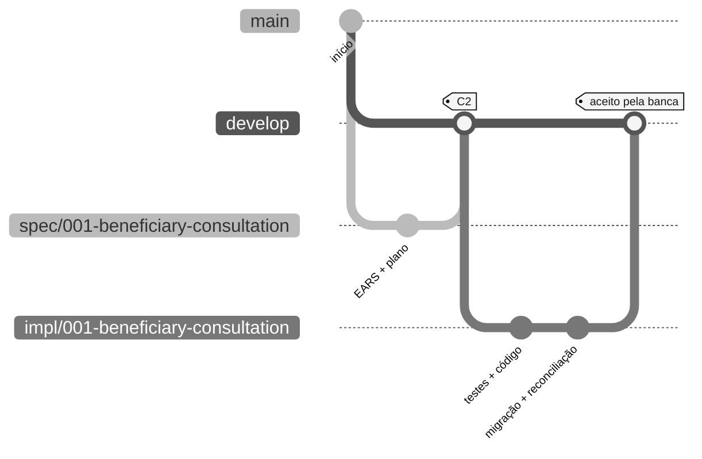

# Fluxo de trabalho Git do desafio individual

> **Trilha:** [Kit do desafio individual](README.md) › **Fluxo de trabalho Git**

Use um repositório por participante. O trabalho começa a partir de `develop`, e a banca avalia o PR final de envio.

  

| Campo | Valor |
|---|---|
| **Público-alvo** | Um participante trabalhando em seu próprio repositório |
| **Pré-requisitos** | Git instalado, repositório clonado, `develop` disponível |
| **Tempo estimado** | 10 minutos de leitura |
| **Resultado esperado** | Você consegue criar a branch de especificação, criar a branch de implementação e enviar o PR para avaliação |

---

## Branches usadas no desafio

| Branch | Finalidade | Origem | Destino do PR |
|---|---|---|---|
| `main` | Branch estável e validada | Padrão do repositório | Não usada para o envio durante o desafio |
| `develop` | Branch de integração do desafio | Criada a partir de `main` durante a configuração | A banca avalia os envios para esta branch |
| `spec/<NNN>-<feature>` | Artefatos de especificação da Etapa 2 | `develop` | `develop` |
| `impl/<NNN>-<feature>` | Implementação, testes e migração da Etapa 3 | `develop`, depois que a especificação estiver pronta | `develop` |

Somente os prefixos `spec/` e `impl/` são usados no desafio individual. `infra/`, `agent/<issue-NN>` e branches separadas de documentação estão fora do percurso cronometrado do desafio.

> [!IMPORTANT]
> Toda branch `impl/<NNN>-<feature>` começa a partir de `develop`, nunca de `spec/*`. Não existe uma branch `stage`.

---

## Árvore visual de branches



---

## Etapa 2: crie a branch de especificação

```bash
git checkout develop
git pull
git checkout -b spec/<NNN>-<feature>
```

Faça commits do trabalho de especificação com mensagens claras:

```bash
git add .spec docs/adr 02-modern-spec
git commit -m "docs: drafts REQ-XXX beneficiary consultation spec"
git push -u origin spec/<NNN>-<feature>
```

Abra um PR para `develop` quando o C2 estiver pronto. O PR registra a especificação; ele não é o envio final para avaliação.

---

## Etapa 3: crie a branch de implementação

Depois que a branch de especificação tiver sido integrada ou estiver disponível em `develop`:

```bash
git checkout develop
git pull
git checkout -b impl/<NNN>-<feature>
```

Faça commits dos testes, da implementação, dos scripts de migração e das evidências em etapas pequenas:

```bash
git add backend frontend infra .spec docs
git commit -m "test: covers REQ-XXX beneficiary search"
git commit -m "feat: implements REQ-XXX beneficiary search"
git commit -m "db: reconciles beneficiary migration for REQ-XXX"
git push -u origin impl/<NNN>-<feature>
```

---

## PR de envio

O envio para avaliação é sempre:

```text
impl/<NNN>-<feature> -> develop
```

Antes de abri-lo, verifique:

- [ ] A CI está verde localmente, na medida do possível.
- [ ] O comando `mvn verify` do backend passa; os testes do frontend passam, caso um frontend tenha sido criado.
- [ ] Todo requisito tem REQ-ID, redação EARS e `source_legacy:`.
- [ ] A reconciliação de dados comprova contagem da origem = carregados + rejeições explicadas, nenhuma perda sem explicação e reexecução sem duplicidades.
- [ ] Listagem, pesquisa e detalhes cobrem toda a população migrada de beneficiários.

Abra o PR:

```bash
gh pr create \
  --base develop \
  --head impl/<NNN>-<feature> \
  --title "feat: implement beneficiary consultation" \
  --body-file .github/PULL_REQUEST_TEMPLATE.md
```

Depois, preencha o checklist no GitHub e notifique a banca. O horário de criação do PR é o horário do envio. Os dois primeiros envios aceitos vencem; um envio rejeitado pode ser corrigido e reenviado com um novo horário.

---

## Regras para mensagens de commit

- A primeira linha tem no máximo 72 caracteres.
- Comece com um tipo: `feat:` `fix:` `docs:` `test:` `db:` `refactor:` `chore:`.
- Cite o REQ-ID quando um comportamento, teste ou trabalho de migração implementar um requisito.
- Não use `wip` nem `temp`.
- Nunca inclua segredos, credenciais, CPF, NIS, valores de benefícios ou outros dados sensíveis.

Exemplos:

```bash
git commit -m "docs: records ADR-0003 challenge branch flow"
git commit -m "test: covers REQ-004 beneficiary detail"
git commit -m "feat: implements REQ-004 beneficiary detail"
git commit -m "db: reconciles migrated beneficiaries for REQ-009"
```

---

## Regras de ouro

> [!IMPORTANT]
> Sem exceções durante o desafio.

1. Nunca faça commit diretamente em `main`.
2. Inicie todas as branches a partir de `develop`.
3. Use somente os prefixos de branch `spec/` e `impl/` no desafio cronometrado.
4. Não execute orquestração paralela de subagentes.
5. CI vermelha não vence; corrija-a antes de notificar a banca.
6. Um PR sem o checklist de envio preenchido não está pronto para validação.

---

## Comandos de emergência

| Situação | Comando |
|---|---|
| Fiz commit em `develop` por engano | `git reset --soft HEAD~1 && git switch -c impl/<NNN>-<feature> && git commit` |
| O rebase travou | `git rebase --abort` |
| Conflito de merge | Abra o arquivo, resolva `<<<<<<<` e execute `git add <file> && git rebase --continue` |
| Excluí uma branch por engano | Execute `git reflog`, encontre o SHA e depois execute `git checkout -b <name> <sha>` |

Se estiver travado por 20 minutos, peça ajuda ao suporte do workshop e registre o bloqueio.

---

### Continue a leitura

| Anterior | Próximo |
|---|---|
| [Fluxo do desafio](00-TEAM-FLOW.md)<br/><sub>Cronograma das 14:00 às 17:40 e linha de chegada.</sub> | [Etapa 1: arqueologia](01-archaeology/GUIDE.md)<br/><sub>Leia o sistema legado e catalogue as regras de negócio.</sub> |

<sub>[Voltar ao índice do kit](README.md)</sub>
