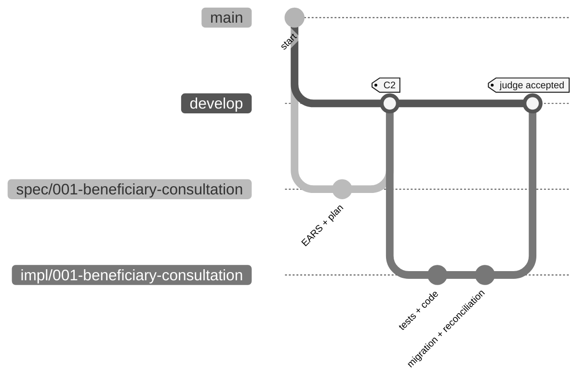

# Individual challenge Git workflow

> **Track:** [Individual challenge kit](README.md) › **Git workflow**

Use one repository per participant. Work starts from `develop`, and the judge reviews the final submission PR.

  

| Field | Value |
|---|---|
| **Target audience** | One participant working in their own repository |
| **Prerequisites** | Git installed, repository cloned, `develop` available |
| **Estimated time** | 10 minutes of reading |
| **Expected result** | You can create the spec branch, create the implementation branch, and submit the judged PR |

---

## Branches used in the challenge

| Branch | Purpose | Origin | PR target |
|---|---|---|---|
| `main` | Stable validated branch | Repository default | Not used for the timed submission |
| `develop` | Integration branch for the challenge | From `main` during setup | Judge reviews submissions into this branch |
| `spec/<NNN>-<feature>` | Stage 2 specification artifacts | `develop` | `develop` |
| `impl/<NNN>-<feature>` | Stage 3 implementation, tests, and migration | `develop` after the spec is ready | `develop` |

Only `spec/` and `impl/` prefixes are used in the individual challenge. `infra/`, `agent/<issue-NN>`, and separate documentation branches are outside the timed challenge path.

> [!IMPORTANT]
> Every `impl/<NNN>-<feature>` branch starts from `develop`, never from `spec/*`. There is no `stage` branch.

---

## Visual branch tree



---

## Stage 2: create the spec branch

```bash
git checkout develop
git pull
git checkout -b spec/<NNN>-<feature>
```

Commit specification work with clear messages:

```bash
git add .spec docs/adr 02-modern-spec
git commit -m "docs: drafts REQ-XXX beneficiary consultation spec"
git push -u origin spec/<NNN>-<feature>
```

Open a PR to `develop` when C2 is ready. The PR records the specification; it is not the final judged submission.

---

## Stage 3: create the implementation branch

After the specification branch is merged or otherwise available on `develop`:

```bash
git checkout develop
git pull
git checkout -b impl/<NNN>-<feature>
```

Commit tests, implementation, migration scripts, and evidence in small steps:

```bash
git add backend frontend infra .spec docs
git commit -m "test: covers REQ-XXX beneficiary search"
git commit -m "feat: implements REQ-XXX beneficiary search"
git commit -m "db: reconciles beneficiary migration for REQ-XXX"
git push -u origin impl/<NNN>-<feature>
```

---

## Submission PR

The judged submission is always:

```text
impl/<NNN>-<feature> -> develop
```

Before opening it, verify:

- [ ] CI is green locally as far as possible.
- [ ] Backend `mvn verify` passes; frontend tests pass if a frontend was built.
- [ ] Every requirement has REQ-ID, EARS wording, and `source_legacy:`.
- [ ] Data reconciliation proves source count = loaded + explained rejects, no unexplained losses, and rerun without duplicates.
- [ ] Listing, search, and detail cover the complete migrated beneficiary population.

Open the PR:

```bash
gh pr create \
  --base develop \
  --head impl/<NNN>-<feature> \
  --title "feat: implement beneficiary consultation" \
  --body-file .github/PULL_REQUEST_TEMPLATE.md
```

Then complete the checklist in GitHub and notify the judge. The PR creation time is the submission timestamp. The first two accepted submissions win; a rejected submission can be fixed and resubmitted with a new timestamp.

---

## Commit message rules

- First line has at most 72 characters.
- Start with a type: `feat:` `fix:` `docs:` `test:` `db:` `refactor:` `chore:`.
- Cite the REQ-ID when behavior, tests, or migration work implements a requirement.
- Do not use `wip` or `temp`.
- Never include secrets, credentials, CPF, NIS, benefit amounts, or other sensitive data.

Examples:

```bash
git commit -m "docs: records ADR-0003 challenge branch flow"
git commit -m "test: covers REQ-004 beneficiary detail"
git commit -m "feat: implements REQ-004 beneficiary detail"
git commit -m "db: reconciles migrated beneficiaries for REQ-009"
```

---

## Golden rules

> [!IMPORTANT]
> No exceptions during the challenge.

1. Never commit directly to `main`.
2. Start every branch from `develop`.
3. Use only `spec/` and `impl/` branch prefixes for the timed challenge.
4. Do not run parallel sub-agent orchestration.
5. CI red does not win; fix it before notifying the judge.
6. A PR without the submission checklist filled is not ready for validation.

---

## Emergency commands

| Situation | Command |
|---|---|
| I committed on `develop` by mistake | `git reset --soft HEAD~1 && git switch -c impl/<NNN>-<feature> && git commit` |
| Rebase got stuck | `git rebase --abort` |
| Merge conflict | Open the file, resolve `<<<<<<<`, then `git add <file> && git rebase --continue` |
| I deleted a branch by mistake | `git reflog`, find the SHA, then `git checkout -b <name> <sha>` |

If you are stuck for 20 minutes, ask workshop support and record the blocker.

---

### Continue reading

| Previous | Next |
|---|---|
| [Challenge flow](00-TEAM-FLOW.md)<br/><sub>14:00-17:40 schedule and finish line.</sub> | [Stage 1: archaeology](01-archaeology/GUIDE.md)<br/><sub>Read the legacy system and catalog business rules.</sub> |

<sub>[Back to the kit index](README.md)</sub>
