# Sitemap: visual map of the individual challenge kit

> **Track:** [Individual challenge kit](README.md) › **Sitemap**

Use this map to find stage guides, role responsibilities, artifacts, and submission references.

 

---

## Challenge flow

```mermaid
%%{init: {'theme':'neutral','themeVariables':{'fontFamily':'ui-sans-serif, system-ui, sans-serif','primaryColor':'#F5F5F5','primaryTextColor':'#171717','primaryBorderColor':'#171717','lineColor':'#525252','secondaryColor':'#FFFFFF','tertiaryColor':'#FAFAFA','background':'#FFFFFF'}}}%%
flowchart LR
    classDef step fill:#F5F5F5,stroke:#171717,color:#171717
    classDef check fill:#FFFFFF,stroke:#525252,color:#171717
    classDef result fill:#FFFFFF,stroke:#171717,color:#171717,stroke-width:2px

    E1["Stage 1<br/>Archaeology<br/>@archaeologist"]:::step
    C1["C1 self-check"]:::check
    E2["Stage 2<br/>Specification<br/>@architect"]:::step
    C2["C2 self-check"]:::check
    E3["Stage 3<br/>Implementation + migration<br/>@builder"]:::step
    C3["C3 submission PR"]:::check
    J["Judge validation"]:::result

    E1 --> C1 --> E2 --> C2 --> E3 --> C3 --> J
```

Stage 4 remains in the repository as post-challenge reference material and is not part of the 14:00-17:40 challenge. See [ADR-0003](docs/adr/0003-individual-challenge-format.md).

---

## Ordered repository structure

| Prefix | Folder / file | When to read it |
|---|---|---|
| **00** | [`README.md`](README.md) | First arrival - challenge overview |
| **00** | [`00-START-HERE.md`](00-START-HERE.md) | Pre-work and 14:00 launch |
| **00** | [`00-SETUP.md`](00-SETUP.md) | Set up laptop, repository, Copilot, Spec-Kit, and data readiness |
| **00** | [`00-TEAM-FLOW.md`](00-TEAM-FLOW.md) | Canonical 14:00-17:40 schedule |
| **00** | [`00-SITEMAP.md`](00-SITEMAP.md) | This file |
| **00** | [`00-GIT-WORKFLOW.md`](00-GIT-WORKFLOW.md) | Branches, PRs, and judge submission |
| **01** | [`01-archaeology/`](01-archaeology/) | Stage 1 - read legacy SIFAP |
| **02** | [`02-modern-spec/`](02-modern-spec/) | Stage 2 - EARS, ADRs, design |
| **03** | [`03-implementation/`](03-implementation/) | Stage 3 - Java + Next.js + tests + migration |
| **04** | [`04-evolution/`](04-evolution/) | Not used in the individual challenge; post-challenge reference only |
| **05** | [`05-personas/`](05-personas/) | 10 role responsibilities you cover yourself |
| **06** | [`06-stage-agents/`](06-stage-agents/) | Stage agents and cross-stage `@dba` |
| **07** | [`07-concepts/`](07-concepts/) | Core concepts: EARS, ADR, SDD, agents |
| **09** | [`09-cheat-sheets/`](09-cheat-sheets/) | Quick reference cards |
| `docs/` | [`docs/`](docs/) | FAQ, troubleshooting, data migration, STATUS, ADRs |
| `.spec/` | [`.spec/`](.spec/) | Spec-Kit artifacts created in Stage 2 |

---

## Artifact flow

```mermaid
%%{init: {'theme':'neutral','themeVariables':{'fontFamily':'ui-sans-serif, system-ui, sans-serif','primaryColor':'#F5F5F5','primaryTextColor':'#171717','primaryBorderColor':'#171717','lineColor':'#525252','secondaryColor':'#FFFFFF','tertiaryColor':'#FAFAFA','background':'#FFFFFF'}}}%%
flowchart LR
    classDef step fill:#F5F5F5,stroke:#171717,color:#171717
    classDef artifact fill:#FAFAFA,stroke:#A3A3A3,color:#404040
    classDef result fill:#FFFFFF,stroke:#171717,color:#171717,stroke-width:2px

    LEGACY["legacy sources<br/>DDMs/FDT"]:::artifact
    DISC["Stage 1 evidence<br/>rules + data questions"]:::artifact
    SPEC["Stage 2 spec<br/>REQ + source_legacy"]:::artifact
    PLAN["plan + tasks<br/>migration design"]:::artifact
    CODE["Stage 3 code<br/>tests + migration"]:::artifact
    DATA["reconciliation<br/>complete population"]:::artifact
    PR["submission PR<br/>impl -> develop"]:::result

    LEGACY --> DISC --> SPEC --> PLAN --> CODE --> DATA --> PR
```

---

## Recommended path

| Need | Start with | Then | Then |
|---|---|---|---|
| First time here | [00-START-HERE.md](00-START-HERE.md) | [00-TEAM-FLOW.md](00-TEAM-FLOW.md) | [00-SETUP.md](00-SETUP.md) |
| Stage 1 | [01-archaeology/GUIDE.md](01-archaeology/GUIDE.md) | [legacy checklist](01-archaeology/LEGACY-EXPLORATION-CHECKLIST.md) | [data migration guide](docs/DATA-MIGRATION.md) |
| Stage 2 | [02-modern-spec/GUIDE.md](02-modern-spec/GUIDE.md) | [.spec README](.spec/README.md) | [ADR index](docs/adr/README.md) |
| Stage 3 | [03-implementation/GUIDE.md](03-implementation/GUIDE.md) | [Git workflow](00-GIT-WORKFLOW.md) | [PR template](.github/PULL_REQUEST_TEMPLATE.md) |
| Role responsibility | [05-personas/](05-personas/) | [agents and personas](07-concepts/02-agents-and-personas.md) | [Copilot modes](09-cheat-sheets/copilot-3-modes.md) |

---

### Continue reading

| Previous | Next |
|---|---|
| [Start here](00-START-HERE.md) Pre-work and 14:00 launch. | [Git workflow](00-GIT-WORKFLOW.md) Branch and submission rules. |

[Back to the kit index](README.md)
