# Mapa do site: visão visual do kit do desafio individual

> **Trilha:** [Kit do desafio individual](README.md) › **Mapa do site**

Use este mapa para encontrar os guias das etapas, as responsabilidades das funções, os artefatos e as referências de envio.

 

---

## Fluxo do desafio

```mermaid
%%{init: {'theme':'neutral','themeVariables':{'fontFamily':'ui-sans-serif, system-ui, sans-serif','primaryColor':'#F5F5F5','primaryTextColor':'#171717','primaryBorderColor':'#171717','lineColor':'#525252','secondaryColor':'#FFFFFF','tertiaryColor':'#FAFAFA','background':'#FFFFFF'}}}%%
flowchart LR
    classDef step fill:#F5F5F5,stroke:#171717,color:#171717
    classDef check fill:#FFFFFF,stroke:#525252,color:#171717
    classDef result fill:#FFFFFF,stroke:#171717,color:#171717,stroke-width:2px

    E1["Etapa 1<br/>Arqueologia<br/>@archaeologist"]:::step
    C1["C1 autoverificação"]:::check
    E2["Etapa 2<br/>Especificação<br/>@architect"]:::step
    C2["C2 autoverificação"]:::check
    E3["Etapa 3<br/>Implementação + migração<br/>@builder"]:::step
    C3["C3 PR de envio"]:::check
    J["Validação da banca"]:::result

    E1 --> C1 --> E2 --> C2 --> E3 --> C3 --> J
```

A Etapa 4 permanece no repositório como material de referência pós-desafio e não faz parte do desafio das 14:00 às 17:40. Consulte a [ADR-0003](docs/adr/0003-individual-challenge-format.md).

---

## Estrutura ordenada do repositório

| Prefixo | Pasta/arquivo | Quando ler |
|---|---|---|
| **00** | [`README.md`](README.md) | Primeira chegada: visão geral do desafio |
| **00** | [`00-START-HERE.md`](00-START-HERE.md) | Atividades prévias e início às 14:00 |
| **00** | [`00-SETUP.md`](00-SETUP.md) | Configure computador, repositório, Copilot, Spec-Kit e preparação dos dados |
| **00** | [`00-TEAM-FLOW.md`](00-TEAM-FLOW.md) | Cronograma oficial das 14:00 às 17:40 |
| **00** | [`00-SITEMAP.md`](00-SITEMAP.md) | Este arquivo |
| **00** | [`00-GIT-WORKFLOW.md`](00-GIT-WORKFLOW.md) | Branches, PRs e envio para a banca |
| **01** | [`01-archaeology/`](01-archaeology/) | Etapa 1: leia o SIFAP legado |
| **02** | [`02-modern-spec/`](02-modern-spec/) | Etapa 2: EARS, ADRs e design |
| **03** | [`03-implementation/`](03-implementation/) | Etapa 3: Java + Next.js + testes + migração |
| **04** | [`04-evolution/`](04-evolution/) | Não usada no desafio individual; apenas referência pós-desafio |
| **05** | [`05-personas/`](05-personas/) | 10 responsabilidades de função que você cobre sozinho |
| **06** | [`06-stage-agents/`](06-stage-agents/) | Agentes de etapa e `@dba` entre etapas |
| **07** | [`07-concepts/`](07-concepts/) | Conceitos fundamentais: EARS, ADR, SDD e agentes |
| **09** | [`09-cheat-sheets/`](09-cheat-sheets/) | Cartões de referência rápida |
| `docs/` | [`docs/`](docs/) | FAQ, solução de problemas, migração de dados, STATUS e ADRs |
| `.spec/` | [`.spec/`](.spec/) | Artefatos do Spec-Kit criados na Etapa 2 |

---

## Fluxo de artefatos

```mermaid
%%{init: {'theme':'neutral','themeVariables':{'fontFamily':'ui-sans-serif, system-ui, sans-serif','primaryColor':'#F5F5F5','primaryTextColor':'#171717','primaryBorderColor':'#171717','lineColor':'#525252','secondaryColor':'#FFFFFF','tertiaryColor':'#FAFAFA','background':'#FFFFFF'}}}%%
flowchart LR
    classDef step fill:#F5F5F5,stroke:#171717,color:#171717
    classDef artifact fill:#FAFAFA,stroke:#A3A3A3,color:#404040
    classDef result fill:#FFFFFF,stroke:#171717,color:#171717,stroke-width:2px

    LEGACY["fontes legados<br/>DDMs/FDT"]:::artifact
    DISC["evidências da Etapa 1<br/>regras + perguntas sobre dados"]:::artifact
    SPEC["especificação da Etapa 2<br/>REQ + source_legacy"]:::artifact
    PLAN["plano + tarefas<br/>design da migração"]:::artifact
    CODE["código da Etapa 3<br/>testes + migração"]:::artifact
    DATA["reconciliação<br/>população completa"]:::artifact
    PR["PR de envio<br/>impl -> develop"]:::result

    LEGACY --> DISC --> SPEC --> PLAN --> CODE --> DATA --> PR
```

---

## Percurso recomendado

| Necessidade | Comece por | Depois | Em seguida |
|---|---|---|---|
| Primeira vez aqui | [00-START-HERE.md](00-START-HERE.md) | [00-TEAM-FLOW.md](00-TEAM-FLOW.md) | [00-SETUP.md](00-SETUP.md) |
| Etapa 1 | [01-archaeology/GUIDE.md](01-archaeology/GUIDE.md) | [checklist do legado](01-archaeology/LEGACY-EXPLORATION-CHECKLIST.md) | [guia de migração de dados](docs/DATA-MIGRATION.md) |
| Etapa 2 | [02-modern-spec/GUIDE.md](02-modern-spec/GUIDE.md) | [README de .spec](.spec/README.md) | [índice de ADRs](docs/adr/README.md) |
| Etapa 3 | [03-implementation/GUIDE.md](03-implementation/GUIDE.md) | [fluxo de trabalho Git](00-GIT-WORKFLOW.md) | [template de PR](.github/PULL_REQUEST_TEMPLATE.md) |
| Responsabilidade de função | [05-personas/](05-personas/) | [agentes e personas](07-concepts/02-agents-and-personas.md) | [modos do Copilot](09-cheat-sheets/copilot-3-modes.md) |

---

### Continue a leitura

| Anterior | Próximo |
|---|---|
| [Comece aqui](00-START-HERE.md) Atividades prévias e início às 14:00. | [Fluxo de trabalho Git](00-GIT-WORKFLOW.md) Regras de branch e envio. |

[Voltar ao índice do kit](README.md)
