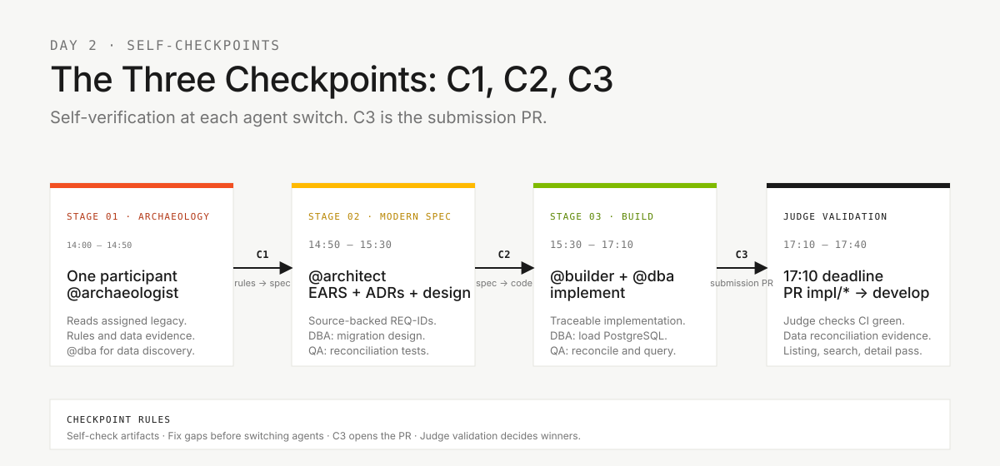

# Challenge flow: one participant, three stages, one finish line

> **Track:** [Team kit](README.md) › **Challenge flow**

**Keep this document pinned on your screen during the whole challenge.** It answers four questions: what you do in each stage, when you switch agents, how you check your own work, and what counts as the finish line.

  

| Field | Value |
|---|---|
| **Target audience** | Every challenge participant |
| **Prerequisites** | Pre-work finished before 14:00 (§2) |
| **Estimated time** | 5 minutes |
| **Expected result** | You know the schedule, the checkpoints, the finish line, and how to submit |

---

## 1. The format

- **Individual.** You work alone and cover all 10 roles. Roles are **skills** that load automatically ([ADR-0002](docs/adr/0002-team-roles-as-skills-not-agents.md)); you only switch the stage agent.
- **Stages 1 to 3 only.** You go from legacy archaeology to a working, validated modern slice. Stage 4 (evolution) is not part of the challenge.
- **Same target for everyone.** List, search, and show the detail of **all** beneficiaries migrated from Adabas to PostgreSQL, applying the legacy validation rules **you** discover.
- **The first two participants whose submission passes judge validation win.**
- **No orchestrator.** Use Copilot Ask, Plan, and Agent modes with the stage agents. Parallel sub-agent orchestration is not allowed.

The decision is recorded in [ADR-0003](docs/adr/0003-individual-challenge-format.md).

---

## 2. Pre-work (before 14:00)

> [!IMPORTANT]
> At 14:00 you open `@archaeologist` and start. There is no opening block, so everything below must be ready before then.

- [ ] Your own repository (fork or copy of this kit), cloned, on `develop`
- [ ] Git, VS Code, Copilot Chat, Spec-Kit (`specify version`), Java 21, Node, and Docker working ([Setup](00-SETUP.md))
- [ ] Access to your authorized, populated Adabas source and a supported extraction route ([data migration guide](docs/DATA-MIGRATION.md))
- [ ] This file and the [finish line](#5-finish-line-and-submission) read

---

## 3. Schedule (14:00-17:40, 220 minutes)


| Time | Stage | Agent | Checkpoint at the end |
|---|---|---|---|
| **14:00-14:50** | **Stage 1** - Archaeology ([guide](01-archaeology/GUIDE.md)) | `@archaeologist` (+ `@dba` for data discovery) | C1 |
| **14:50-15:30** | **Stage 2** - Specification ([guide](02-modern-spec/GUIDE.md)) | `@architect` (+ `@dba` for migration design) | C2 |
| **15:30-17:10** | **Stage 3** - Implementation and data migration ([guide](03-implementation/GUIDE.md)) | `@builder` + `@dba` | C3 = submission |
| **17:10-17:40** | Final judge validation | Judge | - |

> [!NOTE]
> Stage times are reference budgets. You move at your own pace, and you can submit before 17:10. The judge validates submissions as they arrive. **17:10 is the submission deadline.**

---

## 4. Self-checkpoints (C1, C2, C3)



You have nobody to hand off to, so each agent switch is a **self-checkpoint**. Before you move on, check your own artifacts against the list below. If an item is missing, fix it or record it as a blocker.

### C1: legacy to spec (end of Stage 1, ~14:50)

| Artifact | Path | Done means |
|---|---|---|
| Rule catalog | `01-archaeology/business-rules-catalog.md` | Rules for the target capability cite actual Natural/JCL/DDM/FDT evidence you read |
| Discovery report | `01-archaeology/discovery-report.md` | Thin slice, evidence, and open questions |
| Supporting evidence | `01-archaeology/` | Reading coverage, data map, dependencies, and mysteries distinguish discovered, deferred, and unknown items |
| Data discovery and readiness | [Data migration records](docs/data-migration/) | Measured source population, DDM/FDT references, anomalies, and extraction route |

### C2: spec to code (end of Stage 2, ~15:30)

| Artifact | Path | Done means |
|---|---|---|
| Specification | `.spec/<NNN>-<feature>/spec.md` | REQ-IDs, EARS, and `source_legacy:` in every requirement |
| Plan | `.spec/<NNN>-<feature>/plan.md` | Decisions, risks, and approach are enough to start |
| Tasks | `.spec/<NNN>-<feature>/tasks.md` | Implementation and test order are defined |
| Scope decision | `02-modern-spec/scope-decisions.md` | What is in scope and what is deferred |
| Migration design | `plan.md`, `tasks.md`, and [data migration records](docs/data-migration/) | Mappings, snapshot, load order, rejects, rerun/recovery, and reconciliation; the queries cover all beneficiaries |

### C3: submission (end of Stage 3, by 17:10)

| Artifact | Path | Done means |
|---|---|---|
| Backend | `backend/` | `mvn verify` is green; OpenAPI is documented |
| Frontend (if built) | `frontend/` | `npm test` is green; the core flows work |
| Schema migrations | `backend/src/main/resources/db/migration/` | Versioned Flyway scripts apply once |
| Migrated population | PostgreSQL + [data migration records](docs/data-migration/) | Every snapshot record is loaded or explicitly rejected; keys and aggregates reconciled |
| Beneficiary consultation | `backend/`, `frontend/`, and evidence | Listing, search, and detail cover the complete population |
| Rerun and recovery | Tests and evidence | Rerunning the same snapshot creates no duplicates |

---

## 5. Finish line and submission

A submission is accepted only when **all** of these pass:

1. CI is green, including `legacy-traceability` and the test jobs.
2. Every requirement has a REQ-ID, EARS, and `source_legacy:`.
3. The tests pass: `mvn verify` for the backend, and the frontend tests if you built a frontend.
4. The data is reconciled:
   - source count = loaded + explained rejects;
   - source keys and agreed aggregates match;
   - no unexplained losses;
   - a rerun creates no duplicates.
5. Listing, search, and detail cover the **complete** migrated beneficiary population, not a sample or the first page.

**How to submit:**

1. Open the PR `impl/<NNN>-<feature>` -> `develop` in your repository.
2. Fill in the submission checklist in the PR template.
3. Notify the judge.

The PR creation time is your timestamp. If the judge rejects the submission, fix it and submit again; the new timestamp counts.

> [!IMPORTANT]
> Reduce capability breadth, never the migrated population or the verification standard. An unfinished result is a verified increment plus recorded blockers. It does not win, but it is the honest outcome.

---

## 6. The 20-minute rule

> [!IMPORTANT]
> **If you stay stuck on the same problem for 20 minutes, stop and ask workshop support.** Record the blocker if no evidence-based route is available.

| Stuck for | Do this |
|---|---|
| 5 min | Reframe the question in Copilot Chat and check the relevant guide |
| 10 min | Check [troubleshooting](docs/troubleshooting.md) and the [FAQ](docs/FAQ.md) |
| 20 min | Ask workshop support using the three-line format below |

```text
1. Goal: What I am trying to achieve
2. Tried: What I already tried (and what happened)
3. Blocker: What is stopping me right now
```

---

## 7. Anti-patterns

| Anti-pattern | Do this instead |
|---|---|
| Skipping a checkpoint to save time | Spend two minutes on C1, C2, and C3; missing evidence costs more at validation |
| Writing requirements before reading the source | Read the programs and DDM for the target capability first (hard gate) |
| Replacing source records with a generated seed | Migrate the authorized Adabas population |
| Proving the queries with the first page only | Prove listing, search, and detail over the whole population |
| Running parallel sub-agents or an orchestrator | Use the stage agents in Ask, Plan, and Agent modes |
| Editing `01-archaeology/legacy-sifap/` | Treat the legacy sources as read-only |

---

## 8. Quick reference

| Question | Where to find it |
|---|---|
| What do I do in stage N? | §3 and the stage guide |
| Am I ready to switch agents? | §4 (C1, C2, C3) |
| What counts as done? | §5 |
| Stuck? | §6 |
| Which Copilot mode? | [`09-cheat-sheets/copilot-3-modes.md`](09-cheat-sheets/copilot-3-modes.md) |
| Which model? | [`09-cheat-sheets/model-routing.md`](09-cheat-sheets/model-routing.md) |
| Which Spec-Kit command? | [`09-cheat-sheets/spec-kit-workflow.md`](09-cheat-sheets/spec-kit-workflow.md) |

---

### Continue reading

| Previous | Next |
|---|---|
| [Start here](00-START-HERE.md)<br/><sub>Pre-work and the first action at 14:00.</sub> | [Setup](00-SETUP.md)<br/><sub>Laptop setup: Git, VS Code, Copilot, Spec-Kit.</sub> |

<sub>[Back to the kit index](README.md)</sub>
