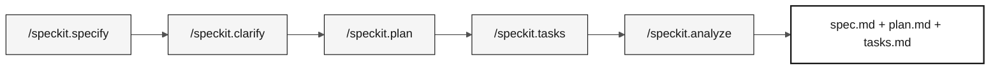

# Stage 2 — Specification (40 min)

> **Path:** [Team Kit](../README.md) › [Stage 2](README.md) › **GUIDE**

**This guide leads the participant using `@architect` step by step through creating the Spec-Kit artifacts: traceable EARS requirements, a technical plan, and implementable tasks, from the start through checkpoint C2.**

  

| Field | Value |
|---|---|
| **Target audience** | Participant using `@architect`, covering Enterprise Architect, Software Architect, Product Owner, QA, and Tech Writer responsibilities; use `@dba` for migration design |
| **Prerequisites** | C1 checkpoint accepted; legacy `.NSN` programs and DDMs read |
| **Estimated time** | 40 min |
| **Stage** | Stage 2 — Specification |
| **Expected outcome** | `.spec/<NNN>-<feature>/spec.md`, `plan.md`, and `tasks.md` with complete traceability |

---

## Concept: Spec-Driven Development

Spec-Driven Development (SDD) is the practice of writing the feature specification, requirements, technical plan, and tasks, before writing any code. The goal is to ensure that everyone on the participant understands what must be built, why, and how to verify that it was built correctly.

For SIFAP, this means that before creating the benefit calculation endpoint, the participant documents exactly which rule from the original `.NSN` program is being modernized, the acceptance criteria, and the tests that validate the behavior.

GitHub Spec-Kit automates this flow with slash commands in Copilot Chat.

### Spec-Kit flow



---

## Artifact location rule

Formal GitHub Spec-Kit deliverables live exclusively in:

```text
.spec/<NNN>-<feature>/
├── spec.md          # EARS requirements and source traceability
├── research.md      # decisions, rationale, alternatives, risks
├── plan.md          # Modular Monolith design and delivery view
├── data-model.md    # source-to-target entities and fields
├── contracts/       # /api/v1 contracts, or a README stating why none
├── quickstart.md    # runnable validation scenarios
├── tasks.md         # ordered tasks, tests, verification ledger
└── checklists/      # requirement-quality gates
```

`spec.md` contains the EARS requirements, `research.md` and `plan.md` record decisions and the technical plan, `data-model.md` and `contracts/` fix data and interfaces, `quickstart.md` proves the feature, and `tasks.md` orders the implementable work. The [SDD artifacts instruction](../.github/instructions/sdd-artifacts.instructions.md) defines each file. `/write-ears-spec` creates the folder and pins it in `.specify/feature.json`. Do not create parallel files with legacy names in `02-modern-spec/`.

`02-modern-spec/` contains supporting material for the stage. Its templates and [`scope-decisions.md`](scope-decisions.md) record scope decisions, trade-offs, and references for the conversation. They do not replace the feature's formal artifacts.

> [!CAUTION]
> **Traceability HARD GATE.** Before drafting any EARS requirement, read the program or DDM that supports it. Every REQ-ID in `.spec/<NNN>-<feature>/spec.md` needs a `source_legacy:` line pointing to `01-archaeology/legacy-sifap/.../*.NSN` or `*.ddm`. A capability with no legacy equivalent uses `[GREENFIELD]` with a rationale. Without this, CI rejects the PR.

---

## Concept: EARS notation

EARS (Easy Approach to Requirements Syntax) is a structured notation for writing unambiguous software requirements. Each requirement starts with a keyword that classifies the type of behavior.

**Why it matters:** natural-language requirements are ambiguous. "The system shall calculate the benefit" does not say when, for whom, or what happens if it fails. EARS notation removes this ambiguity.

**Five basic EARS patterns and their complex combination:**

| Pattern | Keyword | Structure |
|---|---|---|
| **Ubiquitous** | (none) | The `<system>` shall `<action>`. |
| **Event-driven** | When | When `<event>`, the `<system>` shall `<action>`. |
| **State-driven** | While | While `<state>`, the `<system>` shall `<action>`. |
| **Unwanted behavior** | If / Then | If `<condition>`, then the `<system>` shall `<handling action>`. |
| **Optional feature** | Where | Where `<feature is active>`, the `<system>` shall `<action>`. |
| **Complex** | While + When, or another necessary combination | While `<state>`, when `<event>`, the `<system>` shall `<one response>`. |

Fill these structures only after reading the supporting legacy evidence.
They are notation templates, not pre-approved SIFAP requirements.

**REQ-ID:** each requirement receives a unique identifier in the `REQ-NNN` format (for example, `REQ-001`). This ID appears in commits (`Implements REQ-001`), PRs, and tests to trace code behavior back to the specification.

---

## Concept: ADR (Architecture Decision Record)

An ADR is a short document that records an architectural decision: the selected option, the alternatives considered, and the rationale. An ADR is not bureaucracy; it is institutional memory. Without it, in six months no one will remember why PostgreSQL was selected instead of MongoDB.

**When to create an ADR in Stage 2:** only when a decision blocks `plan.md`. Use the template in [`templates/ADR.template.md`](templates/ADR.template.md) or run `/generate-adr` in Copilot Chat.

**Common mistake:** creating ADRs for obvious decisions or decisions already documented elsewhere. If the decision fits in a commit comment, it does not need an ADR.

---

## Concept: Bounded Context

A bounded context is an explicit boundary within which a domain model is valid and consistent. It is the central Domain-Driven Design concept that allows a large system to be divided into smaller, cohesive parts.

**Apply this to SIFAP:** identify rules, vocabulary, data ownership, and access
patterns from the legacy evidence before choosing boundaries. The architects
and DBA decide how contexts communicate through interfaces; a source file or
table is not automatically a ready-made bounded context.

**For the workshop:** use `/carve-bounded-contexts` in Copilot Chat and fill in [`templates/bounded-contexts.template.md`](templates/bounded-contexts.template.md) as a reference for `plan.md`.

---

## Timed schedule

DBA and QA responsibilities stay active throughout this interval. Use the
[data migration guide](../docs/DATA-MIGRATION.md) and [blank records](../docs/data-migration/)
as supporting evidence, linked from the feature's formal Spec-Kit artifacts:

| Artifact | Data work before C2 |
|---|---|
| `spec.md` | PO/RE define authorized listing, search, detail access, and complete beneficiary coverage; QA defines measurable acceptance and traceable requirements |
| `plan.md` | DBA + architects document source-to-target fields and relationships, snapshot boundary, extraction contract, encoding, null/date/precision and MU/PE handling, load order, rejects, rerun/resume, and target recovery |
| `tasks.md` | Order tests, schema creation, extraction, staging, load, reconciliation, API/UI consultation, and rerun/recovery checks; assign DBA, Developer, QA, and reviewers |

Preserve source meaning and identifiers rather than silently correcting
inconsistencies. Approve treatment of anomalies explicitly. An unknown extraction
mechanism remains a blocker; an invented export API or a fresh target seed is
not an acceptable plan.

| Time | Activity | Output |
|---|---|---|
| 14:50–14:55 | Confirm the C1 checkpoint evidence and select the fixed beneficiary consultation slice. | `NNN-<feature>` name and PO-approved scope. |
| 14:55–15:10 | Run `/write-ears-spec` and `/speckit.clarify`. | `.spec/<NNN>-<feature>/spec.md` with traceable requirements. |
| 15:10–15:20 | Run `/speckit.plan` and `/design-modular-monolith`. | `research.md`, `plan.md`, `data-model.md`, `contracts/`, and `quickstart.md`. |
| 15:20–15:25 | Run `/speckit.tasks`. | Prioritized `tasks.md`, including business-rule and data migration tests. |
| 15:25–15:30 | Run `/speckit.analyze`, fix blocking gaps, and complete C2. | Consistent artifacts and first Stage 3 task. |

> [!WARNING]
> If a step consumes the available time, reduce the feature. Do not fill in requirements, contracts, architecture, or acceptance criteria based on assumptions.

---

## Step by step

- [ ] **Confirm evidence.** Reread the findings recorded in Stage 1 before selecting the feature.
- [ ] **Name the folder.** Create `.spec/<NNN>-<feature>/` with a name that reflects the behavior, not the technical solution.
- [ ] **Run `/speckit.specify`.** Generate `spec.md` with REQ-IDs, EARS patterns, and `source_legacy:`.
- [ ] **Run `/speckit.clarify`.** Resolve ambiguities before planning.
- [ ] **Run `/speckit.plan`.** Document architecture, data, risks, and contracts in `plan.md`.
- [ ] **Review the data plan with DBA and QA.** Cover all authorized beneficiaries and required related records, not only a sample; agree source/target accounting and independent validation.
- [ ] **Run `/speckit.tasks`.** Break the plan into small tasks with tests in `tasks.md`.
- [ ] **Run `/speckit.analyze`.** Fix gaps between the spec, plan, and tasks.
- [ ] **Record scope decisions.** Fill in [`scope-decisions.md`](scope-decisions.md) with what was selected, deferred, or marked greenfield.
- [ ] **Conduct the C2 checkpoint.** Self-verify the artifacts against the criteria below before switching to `@builder`.

---

## Scope support and decisions

- Record what was selected, deferred, or marked greenfield in [`scope-decisions.md`](scope-decisions.md), linking the decision to the folder in `.spec/`.
- Use [`ADR-TEMPLATE.md`](ADR-TEMPLATE.md) only for a decision that blocks the plan. The stage has no ADR quantity target.
- A context sketch or diagram may support the conversation, but C4 L1/L2/L3 and a complete architecture are not prerequisites for the C2 checkpoint. The necessary technical rationale belongs in `plan.md`.

---

## C2 checkpoint

Before Stage 3, the participant confirms:

1. The `.spec/<NNN>-<feature>/` folder path.
2. The selected feature, requirements, and their `source_legacy:` entries.
3. The first implementable task and expected tests.
4. Risks, scope decisions, and questions that still need answers.

---

## Completion criteria

- [ ] A small feature has the complete artifact set in `.spec/<NNN>-<feature>/`, pinned in `.specify/feature.json`.
- [ ] Every requirement has a valid `source_legacy:` or a justified `[GREENFIELD]`.
- [ ] `tasks.md` includes tests alongside business-rule implementation.
- [ ] DBA and architects approved the extraction, mapping, load, and recovery design from measured source evidence.
- [ ] QA defined full-population reconciliation, reject accounting, and authorized paginated listing/search/detail checks before loading data.
- [ ] PO approved consultation coverage; unresolved extraction or mapping blockers are recorded, not bypassed to accept C2.
- [ ] Scope decisions are recorded in `02-modern-spec/`.
- [ ] The PO responsibility confirmed the scope and checkpoint C2 occurred by 15:30.

---

## Common mistakes and how to avoid them

| Symptom | Cause | Correction |
|---|---|---|
| Missing `source_legacy:` in `spec.md` | Requirement written without consulting the legacy system | Reread the corresponding `.NSN` program before writing the EARS requirement |
| `spec.md` contains vague requirements ("the system shall work correctly") | EARS notation was not used | Choose the matching basic or complex EARS pattern and an observable response |
| Empty `plan.md` or one copied from another project | Plan based on assumptions | Run `/speckit.plan` with the feature's actual context |
| ADR created for every decision | Confusion between an ADR and a code comment | Reserve ADRs for decisions that would block the plan without a record |
| CI rejects the PR | Missing or invalid `source_legacy:` | Correct the path to the corresponding `.NSN` or `.ddm` file |

---

## References

- [Spec-Kit reference card](../09-cheat-sheets/spec-kit-workflow.md)
- [EARS notation](../07-concepts/05-ears-notation.md)
- [Architecture Decision Records](../07-concepts/06-architecture-decision-records.md)
- [Official Spec-Kit](https://github.com/github/spec-kit)
- [SIFAP legacy system](../01-archaeology/legacy-sifap/)

---

### Continue reading

| Previous | Next |
|---|---|
| [Stage 1 — Archaeology](../01-archaeology/README.md)<br/><sub>Archaeology summary and links to the detailed GUIDE.</sub> | [Stage 3 — Implementation](../03-implementation/GUIDE.md)<br/><sub>15:30–17:10 · Java 21 + Spring Boot + Next.js, with tests and submission.</sub> |

<sub>[Back to the kit index](../README.md)</sub>
