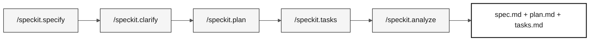

# Etapa 2 — Especificação (40 min)

> **Caminho:** [Kit da equipe](../README.md) › [Etapa 2](README.md) › **GUIA**

**Este guia conduz, passo a passo, o participante que usa `@architect` pela criação dos artefatos do Spec-Kit: requisitos EARS rastreáveis, um plano técnico e tarefas implementáveis, desde o início até o checkpoint C2.**

  

| Campo | Valor |
|---|---|
| **Público-alvo** | Participante usando `@architect`, cobrindo as responsabilidades de Enterprise Architect, Software Architect, Product Owner, QA e Tech Writer; use `@dba` para o projeto de migração |
| **Pré-requisitos** | Checkpoint C1 aceito; programas `.NSN` e DDMs legados lidos |
| **Tempo estimado** | 40 min |
| **Etapa** | Etapa 2 — Especificação |
| **Resultado esperado** | `.spec/<NNN>-<feature>/spec.md`, `plan.md` e `tasks.md` com rastreabilidade completa |

---

## Conceito: Spec-Driven Development

Spec-Driven Development (SDD) é a prática de escrever a especificação da funcionalidade, os requisitos, o plano técnico e as tarefas antes de escrever qualquer código. O objetivo é garantir que o participante entenda o que deve ser construído, por quê e como verificar se foi construído corretamente.

Para o SIFAP, isso significa que, antes de criar o endpoint de cálculo de benefício, o participante documenta exatamente qual regra do programa `.NSN` original está sendo modernizada, os critérios de aceitação e os testes que validam o comportamento.

O GitHub Spec-Kit automatiza esse fluxo com slash commands no Copilot Chat.

### Fluxo do Spec-Kit



---

## Regra de localização dos artefatos

As entregas formais do GitHub Spec-Kit ficam exclusivamente em:

```text
.spec/<NNN>-<feature>/
├── spec.md          # EARS requirements and source traceability
├── research.md      # decisions, rationale, alternatives, risks
├── plan.md          # Modular Monolith design and delivery view
├── data-model.md    # source-to-target entities and fields
├── contracts/       # /api/v1 contracts, or a README stating why none
├── quickstart.md    # runnable validation scenarios
├── tasks.md         # ordered tasks, tests, verification ledger
└── checklists/      # requirement-quality gates
```

`spec.md` contém os requisitos EARS; `research.md` e `plan.md` registram decisões e o plano técnico; `data-model.md` e `contracts/` fixam dados e interfaces; `quickstart.md` comprova a funcionalidade; e `tasks.md` ordena o trabalho implementável. A [instrução de artefatos SDD](../.github/instructions/sdd-artifacts.instructions.md) define cada arquivo. `/write-ears-spec` cria a pasta e a fixa em `.specify/feature.json`. Não crie arquivos paralelos com nomes legados em `02-modern-spec/`.

`02-modern-spec/` contém material de apoio para a etapa. Seus modelos e [`scope-decisions.md`](scope-decisions.md) registram decisões de escopo, trade-offs e referências para a conversa. Eles não substituem os artefatos formais da funcionalidade.

> [!CAUTION]
> **HARD GATE de rastreabilidade.** Antes de redigir qualquer requisito EARS, leia o programa ou DDM que o sustenta. Cada REQ-ID em `.spec/<NNN>-<feature>/spec.md` precisa de uma linha `source_legacy:` apontando para `01-archaeology/legacy-sifap/.../*.NSN` ou `*.ddm`. Uma capacidade sem equivalente no legado usa `[GREENFIELD]` com uma justificativa. Sem isso, a CI rejeita a PR.

---

## Conceito: notação EARS

EARS (Easy Approach to Requirements Syntax) é uma notação estruturada para escrever requisitos de software sem ambiguidade. Cada requisito começa com uma palavra-chave que classifica o tipo de comportamento.

**Por que isso importa:** requisitos em linguagem natural são ambíguos. "The system shall calculate the benefit" não diz quando, para quem nem o que acontece em caso de falha. A notação EARS elimina essa ambiguidade.

**Cinco padrões básicos de EARS e sua combinação complexa:**

| Padrão | Palavra-chave | Estrutura |
|---|---|---|
| **Ubiquitous** | (nenhuma) | The `<system>` shall `<action>`. |
| **Event-driven** | When | When `<event>`, the `<system>` shall `<action>`. |
| **State-driven** | While | While `<state>`, the `<system>` shall `<action>`. |
| **Unwanted behavior** | If / Then | If `<condition>`, then the `<system>` shall `<handling action>`. |
| **Optional feature** | Where | Where `<feature is active>`, the `<system>` shall `<action>`. |
| **Complex** | While + When ou outra combinação necessária | While `<state>`, when `<event>`, the `<system>` shall `<one response>`. |

Preencha essas estruturas somente depois de ler as evidências de apoio do legado.
Elas são modelos de notação, não requisitos do SIFAP previamente aprovados.

**REQ-ID:** cada requisito recebe um identificador exclusivo no formato `REQ-NNN` (por exemplo, `REQ-001`). Esse ID aparece em commits (`Implements REQ-001`), PRs e testes para rastrear o comportamento do código até a especificação.

---

## Conceito: ADR (Architecture Decision Record)

Uma ADR é um documento curto que registra uma decisão arquitetural: a opção selecionada, as alternativas consideradas e a justificativa. Uma ADR não é burocracia; é memória institucional. Sem ela, em seis meses ninguém se lembrará por que PostgreSQL foi selecionado em vez de MongoDB.

**Quando criar uma ADR na Etapa 2:** somente quando uma decisão bloquear `plan.md`. Use o modelo em [`templates/ADR.template.md`](templates/ADR.template.md) ou execute `/generate-adr` no Copilot Chat.

**Erro comum:** criar ADRs para decisões óbvias ou já documentadas em outro lugar. Se a decisão couber em um comentário de commit, ela não precisa de uma ADR.

---

## Conceito: Bounded Context

Um bounded context é um limite explícito dentro do qual um modelo de domínio é válido e consistente. É o conceito central de Domain-Driven Design que permite dividir um sistema grande em partes menores e coesas.

**Aplique isto ao SIFAP:** identifique regras, vocabulário, responsabilidade pelos
dados e padrões de acesso a partir das evidências do legado antes de escolher os
limites. Arquitetos e DBA decidem como os contextos se comunicam por interfaces;
um arquivo ou uma tabela de origem não é automaticamente um bounded context pronto.

**Para o workshop:** use `/carve-bounded-contexts` no Copilot Chat e preencha [`templates/bounded-contexts.template.md`](templates/bounded-contexts.template.md) como referência para `plan.md`.

---

## Cronograma

As responsabilidades de DBA e QA permanecem ativas durante todo este intervalo. Use o
[guia de migração de dados](../docs/DATA-MIGRATION.md) e os [registros em branco](../docs/data-migration/)
como evidências de apoio, vinculadas a partir dos artefatos formais da funcionalidade no Spec-Kit:

| Artefato | Trabalho de dados antes do C2 |
|---|---|
| `spec.md` | PO/RE definem listagem, pesquisa e acesso a detalhes autorizados, além da cobertura completa de beneficiários; QA define aceitação mensurável e requisitos rastreáveis |
| `plan.md` | DBA + arquitetos documentam campos e relacionamentos da origem para o destino, limite do snapshot, contrato de extração, encoding, tratamento de nulos/datas/precisão e MU/PE, ordem de carga, rejeições, reexecução/retomada e recuperação do destino |
| `tasks.md` | Ordena testes, criação de schema, extração, staging, carga, reconciliação, consulta por API/UI e verificações de reexecução/recuperação; atribui DBA, Desenvolvimento, QA e revisores |

Preserve o significado e os identificadores da origem em vez de corrigir
silenciosamente as inconsistências. Aprove explicitamente o tratamento de anomalias.
Um mecanismo de extração desconhecido continua sendo um bloqueio; uma API de
exportação inventada ou um seed novo no destino não é um plano aceitável.

| Horário | Atividade | Resultado |
|---|---|---|
| 14:50–14:55 | Confirme as evidências do checkpoint C1 e selecione o recorte fixo de consulta de beneficiários. | Nome `NNN-<feature>` e escopo aprovado pelo PO. |
| 14:55–15:10 | Execute `/write-ears-spec` e `/speckit.clarify`. | `.spec/<NNN>-<feature>/spec.md` com requisitos rastreáveis. |
| 15:10–15:20 | Execute `/speckit.plan` e `/design-modular-monolith`. | `research.md`, `plan.md`, `data-model.md`, `contracts/` e `quickstart.md`. |
| 15:20–15:25 | Execute `/speckit.tasks`. | `tasks.md` priorizado, incluindo testes de regras de negócio e migração de dados. |
| 15:25–15:30 | Execute `/speckit.analyze`, corrija lacunas bloqueadoras e conclua o C2. | Artefatos consistentes e primeira tarefa da Etapa 3. |

> [!WARNING]
> Se uma atividade consumir o tempo disponível, reduza a funcionalidade. Não preencha requisitos, contratos, arquitetura ou critérios de aceitação com base em suposições.

---

## Passo a passo

- [ ] **Confirme as evidências.** Releia as descobertas registradas na Etapa 1 antes de selecionar a funcionalidade.
- [ ] **Nomeie a pasta.** Crie `.spec/<NNN>-<feature>/` com um nome que reflita o comportamento, não a solução técnica.
- [ ] **Execute `/speckit.specify`.** Gere `spec.md` com REQ-IDs, padrões EARS e `source_legacy:`.
- [ ] **Execute `/speckit.clarify`.** Resolva ambiguidades antes de planejar.
- [ ] **Execute `/speckit.plan`.** Documente arquitetura, dados, riscos e contratos em `plan.md`.
- [ ] **Revise o plano de dados com DBA e QA.** Cubra todos os beneficiários autorizados e os registros relacionados necessários, não apenas uma amostra; acorde a contabilização entre origem e destino e a validação independente.
- [ ] **Execute `/speckit.tasks`.** Divida o plano em tarefas pequenas com testes em `tasks.md`.
- [ ] **Execute `/speckit.analyze`.** Corrija lacunas entre especificação, plano e tarefas.
- [ ] **Registre as decisões de escopo.** Preencha [`scope-decisions.md`](scope-decisions.md) com o que foi selecionado, adiado ou marcado como greenfield.
- [ ] **Realize o checkpoint C2.** Verifique os artefatos pelos critérios abaixo antes de mudar para `@builder`.

---

## Apoio e decisões de escopo

- Registre o que foi selecionado, adiado ou marcado como greenfield em [`scope-decisions.md`](scope-decisions.md), vinculando a decisão à pasta em `.spec/`.
- Use [`ADR-TEMPLATE.md`](ADR-TEMPLATE.md) somente para uma decisão que bloqueie o plano. A etapa não tem meta de quantidade de ADRs.
- Um esboço ou diagrama de contexto pode apoiar a conversa, mas C4 L1/L2/L3 e uma arquitetura completa não são pré-requisitos do checkpoint C2. A justificativa técnica necessária pertence a `plan.md`.

---

## Checkpoint C2

Antes da Etapa 3, o participante confirma:

1. O caminho da pasta `.spec/<NNN>-<feature>/`.
2. A funcionalidade selecionada, os requisitos e suas entradas `source_legacy:`.
3. A primeira tarefa implementável e os testes esperados.
4. Riscos, decisões de escopo e perguntas que ainda precisam de respostas.

---

## Critérios de conclusão

- [ ] Uma funcionalidade pequena tem o conjunto completo de artefatos em `.spec/<NNN>-<feature>/`, fixado em `.specify/feature.json`.
- [ ] Todo requisito tem um `source_legacy:` válido ou um `[GREENFIELD]` justificado.
- [ ] `tasks.md` inclui testes junto à implementação das regras de negócio.
- [ ] DBA e arquitetos aprovaram o projeto de extração, mapeamento, carga e recuperação com base em evidências medidas da origem.
- [ ] QA definiu reconciliação da população completa, contabilização de rejeições e verificações autorizadas e paginadas de listagem/pesquisa/detalhes antes da carga dos dados.
- [ ] O PO aprovou a cobertura da consulta; bloqueios não resolvidos de extração ou mapeamento estão registrados, não foram ignorados para aceitar o C2.
- [ ] As decisões de escopo estão registradas em `02-modern-spec/`.
- [ ] A responsabilidade de PO confirmou o escopo, e o checkpoint C2 ocorreu até 15:30.

---

## Erros comuns e como evitá-los

| Sintoma | Causa | Correção |
|---|---|---|
| `source_legacy:` ausente em `spec.md` | Requisito escrito sem consultar o sistema legado | Releia o programa `.NSN` correspondente antes de escrever o requisito EARS |
| `spec.md` contém requisitos vagos ("the system shall work correctly") | A notação EARS não foi usada | Escolha o padrão EARS básico ou complexo correspondente e uma resposta observável |
| `plan.md` vazio ou copiado de outro projeto | Plano baseado em suposições | Execute `/speckit.plan` com o contexto real da funcionalidade |
| ADR criada para cada decisão | Confusão entre uma ADR e um comentário de código | Reserve ADRs para decisões que bloqueariam o plano sem um registro |
| A CI rejeita a PR | `source_legacy:` ausente ou inválido | Corrija o caminho para o arquivo `.NSN` ou `.ddm` correspondente |

---

## Referências

- [Cartão de referência do Spec-Kit](../09-cheat-sheets/spec-kit-workflow.md)
- [Notação EARS](../07-concepts/05-ears-notation.md)
- [Architecture Decision Records](../07-concepts/06-architecture-decision-records.md)
- [Spec-Kit oficial](https://github.com/github/spec-kit)
- [Sistema legado SIFAP](../01-archaeology/legacy-sifap/)

---

### Continue lendo

| Anterior | Próximo |
|---|---|
| [Etapa 1 — Arqueologia](../01-archaeology/README.md)<br/><sub>Resumo da arqueologia e links para o GUIA detalhado.</sub> | [Etapa 3 — Implementação](../03-implementation/GUIDE.md)<br/><sub>15:30–17:10 · Java 21 + Spring Boot + Next.js, com testes e submissão.</sub> |

<sub>[Voltar ao índice do kit](../README.md)</sub>
