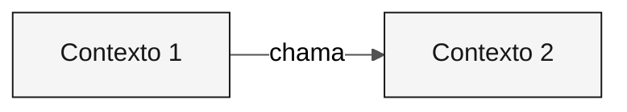

---

title: "Modelo: Bounded Contexts"
description: "Estrutura para definições de bounded contexts por meio de /carve-bounded-contexts"
author: "Paula Silva, AI-Native Software Engineer, Americas Global Black Belt at Microsoft"
date: "2026-04-29"
version: "1.0.0"
status: "aprovado"
tags: ["modelo", "bounded-contexts", "architect", "etapa-2"]
---

<!-- Como usar: execute /carve-bounded-contexts. Clone o bloco de contexto para cada contexto. -->

# Mapa de bounded contexts

 

> **Caminho:** [Kit da equipe](../../README.md) › [Etapa 2](../README.md) › Modelos › **bounded-contexts**

> [!NOTE]
> Este arquivo é um MODELO. Copie-o para o repositório do participante e preencha-o com dados reais. Não edite o original.

---

## Conceito: Bounded Context

Um bounded context é um limite explícito dentro do qual um modelo de domínio é válido e consistente. O termo vem de Domain-Driven Design (DDD) e fornece a base para definir os módulos de um Monólito Modular.

**Por que isso importa:** no SIFAP, o módulo de pagamentos usa o termo "beneficiário" de uma forma, enquanto o módulo de fiscalização pode usar o mesmo termo com regras diferentes. Definir bounded contexts impede que um único modelo seja distorcido para atender a todos os contextos ao mesmo tempo, o que causa acoplamento indesejado e dificulta a evolução.

**Monólito Modular:** uma arquitetura na qual bounded contexts são módulos Java independentes dentro de uma única JVM. Cada módulo tem suas próprias camadas (`domain/`, `application/`, `infrastructure/`) e se comunica com outros módulos apenas por interfaces públicas definidas.

**Strangler Fig:** um padrão de migração incremental no qual o sistema moderno cresce ao redor do sistema legado e substitui funcionalidades uma de cada vez. O SIFAP 2.0 não precisa substituir tudo de uma só vez. Cada bounded context pode ser modernizado de forma independente.

---

## Avaliações de hipóteses

### <!-- espaço reservado: Nome --> — <!-- espaço reservado: ACEITA / REJEITADA -->

| Critério | Avaliação | Evidência |
|---|---|---|
| Coesão | <!-- espaço reservado --> | <!-- espaço reservado --> |
| Acoplamento | <!-- espaço reservado --> | <!-- espaço reservado --> |
| Frequência de mudança | <!-- espaço reservado --> | <!-- espaço reservado --> |

---

## Bounded contexts finais

### <!-- espaço reservado: Nome do contexto -->

| Campo | Valor |
|---|---|
| **Responsabilidade** | <!-- espaço reservado --> |
| **Dados sob responsabilidade** | <!-- espaço reservado --> |
| **Interface pública** | <!-- espaço reservado --> |
| **Por que é um contexto próprio** | <!-- espaço reservado --> |

---

## Comunicação entre contextos

| De | Para | Mecanismo | Dados |
|---|---|---|---|
| <!-- espaço reservado --> | <!-- espaço reservado --> | <!-- espaço reservado --> | <!-- espaço reservado --> |

---

> [!IMPORTANT]
> Definition of Done: hipóteses avaliadas, rejeições documentadas, 2 a 5 contextos nomeados e diagrama Mermaid renderizado sem erros.

---

### Continue lendo

| Anterior | Próximo |
|---|---|
| [GUIA da Etapa 2](../GUIDE.md) Instruções passo a passo. | [Modelo de ADR](ADR.template.md) Modelo de ADR. |

[Voltar ao índice do kit](../../README.md)
