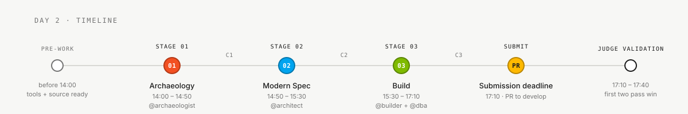

# Stage 3 — Implementation

> **Path:** [Team Kit](../README.md) › **Stage 3 — Implementation**

**In this stage, the participant build the SIFAP 2.0 prototype from scratch: a Java 21 + Spring Boot 3.3 backend, a Next.js 15 frontend, and PostgreSQL 16, guided by the REQ-IDs from Stage 2.**

  

| Field | Value |
|---|---|
| **Target audience** | Participants 3 (TL+Dev) and 4 (DBA+QA); the participant scaffolds CI |
| **Prerequisites** | C2 checkpoint accepted; `spec.md`, `plan.md`, and `tasks.md` ready |
| **Estimated time** | 100 min (15:30–17:10) |
| **Stage** | Stage 3 — Implementation |
| **Expected outcome** | Functional application with PostgreSQL populated from Adabas, reconciled data, beneficiary queries, and tests traced to REQ-IDs |

---

## Where this fits in the day's flow

## Who works here

## Contents of this folder

DBA executes the approved snapshot-to-PostgreSQL migration; QA independently
reconciles it and Developer exposes authorized listing, search, and detail
queries for all beneficiaries in the agreed population. Flyway schema history
and test seeds alone do not meet C3. Follow the
[data migration guide](../docs/DATA-MIGRATION.md).

| File | Purpose |
|---|---|
| [`GUIDE.md`](GUIDE.md) | Stage step-by-step guide |

---

### Continue reading

| Previous | Next |
|---|---|
| [Stage 2 — Specification](../02-modern-spec/README.md) Modern specification summary and links to ADR templates. | [Stage 3 — GUIDE](GUIDE.md) 15:30–17:10 · Java 21 + Spring Boot + Next.js, with tests. |

[Back to the kit index](../README.md)
