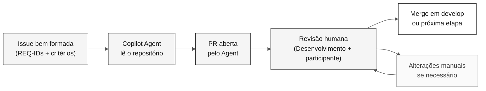

# Etapa 4 — Evolução com Agents (40 min)

> **Caminho:** [Kit da equipe](../README.md) › [Etapa 4](README.md) › **GUIA**

**Este guia conduz o participante por um experimento com o modo Agent do GitHub Copilot: escrever uma Issue bem formada, delegá-la ao Agent, revisar a PR resultante e registrar evidências honestas do que funcionou.**

  

| Campo | Valor |
|---|---|
| **Público-alvo** | O participante (DevOps + Tech Writer) lidera; as responsabilidades de Desenvolvimento colideram a revisão técnica |
| **Pré-requisitos** | Checkpoint C3 recebido; protótipo funcional da Etapa 3; comando de build conhecido |
| **Tempo estimado** | 40 min |
| **Etapa** | Etapa 4 — Evolução |
| **Resultado esperado** | Issue criada, delegação registrada e relatório de experiência concluído |

> [!NOTE]
> Horário oficial: não utilizado no desafio individual em [`00-TEAM-FLOW.md`](../00-TEAM-FLOW.md). O participante lidera, e as responsabilidades de Desenvolvimento colideram a revisão técnica.

---

## Conceito: modo Agent local e coding agent do GitHub

O modo Agent do VS Code executa ações autorizadas no workspace local.
O coding agent do GitHub é um fluxo separado de Issue para PR que exige
disponibilidade do repositório e permissões. Selecionar o modo Agent localmente
não atribui uma Issue do GitHub nem cria automaticamente uma PR remota.

A Etapa 4 explora o coding agent quando disponível. Caso contrário, registre um
rascunho de Issue revisado e uma etapa explícita de continuação; não invente uma
execução remota.

**Por que isso importa:** o Agent não inventa requisitos. Ele lê o que você escreveu na Issue e em `spec.md`. Se a Issue for vaga, a PR será vaga. Se a Issue for precisa, a PR terá chance de aprovação sem grandes alterações.

**Diferenças entre os modos do Copilot:**

| Modo | Quando usar | Controle humano |
|---|---|---|
| **Ask** | Perguntas, explicações e consultas direcionadas | Total |
| **Plan** | Planejar uma alteração antes da execução | Alto |
| **Agent (local)** | Implementar uma tarefa autorizada no workspace | Aprovações de ferramentas e revisão do diff/testes |
| **Coding agent (GitHub)** | Delegar uma Issue no repositório | Verificações separadas de disponibilidade e revisão humana da PR |

**Ciclo Issue → Agent → PR → Revisão:**

---

## Conceito: IaC com Terraform e CI/CD com GitHub Actions

**Terraform** é a ferramenta de infraestrutura como código (IaC) usada neste workshop. Ela descreve recursos do Azure (App Service, PostgreSQL e Key Vault) em arquivos `.tf` e os cria de maneira repetível e auditável.

> [!CAUTION]
> Nunca execute `terraform apply` durante o workshop. Valide com `terraform plan` e documente o resultado. O provisionamento real de infraestrutura está fora do escopo do workshop.

**GitHub Actions** é o mecanismo de CI/CD. Um pipeline bem configurado valida automaticamente toda PR: compila, testa, verifica a rastreabilidade (a presença de `source_legacy:`) e, opcionalmente, faz deploy.

---

## Objetivo

Experimente uma pequena delegação e deixe evidências honestas do resultado. Esta etapa não promete que um Agent abrirá uma PR, que Terraform será criado ou que um merge acontecerá antes da aceitação final.

Em paralelo, o DBA lidera as [verificações de aceitação de dados](../docs/DATA-MIGRATION.md):
QA verifica novamente e de forma independente a reconciliação e a reexecução/recuperação,
Desenvolvimento verifica as consultas de beneficiários, e o PO aceita os resultados
observados ou registra bloqueios. Esta é uma validação do participante, não uma
apresentação nem um exercício do instrutor.

---

## Conceito: fechar o ciclo com algo que o legado não podia fazer

As Etapas 1 a 3 comprovam que o sistema moderno se comporta como o antigo. Isso é
necessário, mas não é o objetivo final. Uma migração que apenas reproduz o comportamento
de 1997 gastou um dia para chegar onde a organização já estava.

A Etapa 4 acrescenta a metade que faltava ao argumento: **uma capacidade que o sistema
legado não podia oferecer**, entregue com base em evidências, no tempo restante.

| Etapa | Pergunta que responde | O que comprova |
|---|---|---|
| 1 — Arqueologia | O que o sistema realmente faz? | O participante lê evidências em vez de supor |
| 2 — Especificação | O que preservamos e o que alteramos deliberadamente? | O comportamento é rastreável até uma origem |
| 3 — Implementação | O novo sistema se comporta como o antigo? | Equivalência nos dados migrados |
| **4 — Evolução** | **O que agora é possível e antes não era?** | **A modernização trouxe algum benefício** |

A regra que mantém isso honesto: uma capacidade só é greenfield quando o participante
consegue **apontar o que a impedia**. Uma tela fixa 24x80, um caminho de saída apenas em
batch, um padrão de acesso por chave única, a largura de um campo — uma restrição que
alguém realmente leu no corpus. "Mainframes são antigos" não é evidência, e o Agent rejeita isso.

O gate de rastreabilidade já oferece suporte a isso. Um requisito sem equivalente no
legado é escrito como `source_legacy: [GREENFIELD]` **mais uma justificativa por escrito**;
sem a justificativa, a CI rejeita a PR exatamente como faria se a origem estivesse ausente.
Essa exceção é estreita de propósito.

> [!WARNING]
> Uma capacidade, deliberadamente pequena. Esta atividade nunca substitui a aceitação
> dos dados e nunca enfraquece um requisito apoiado pelo legado para caber no tempo.
> Uma capacidade cujo escopo foi definido, que foi escrita como requisito e explicitamente
> adiada é um resultado válido e honesto.

---

## Timed schedule

| Time | Activity | Outcome |
|---|---|---|
| 16:10–16:15 | Receive the C3 checkpoint, confirm the build, and choose the Stage 4 item: a capability the legacy system could not offer, or a small pending item when no candidate has a citable constraint. | Safe scope to delegate or record in the backlog. |
| 16:15–16:25 | Scope the item with [`/greenfield-feature`](../.github/prompts/stage-evolution-greenfield-feature.prompt.md) when it is new behavior, then write the Issue with context, REQ-IDs, feature path, verifiable criteria, out-of-scope items, and test method. | Requirement written; Issue created or draft ready. |
| 16:25–16:35 | Delegate to Copilot Agent, if available, and observe the initial status. | Delegation recorded without waiting for full implementation. |
| 16:35–16:45 | If a PR exists, conduct a human review. Otherwise, record the status and prepare a post-workshop review. | Review comments or an explicit next step. |
| 16:45–16:50 | Update the experience report and inform the participant for integrated acceptance. | Factual account of what worked, failed, or remains pending. |

Use [`../.github/prompts/stage-evolution-write-github-issue.prompt.md`](../.github/prompts/stage-evolution-write-github-issue.prompt.md) as a drafting checklist. Do not ask the Agent to invent missing requirements, architecture, legacy sources, or acceptance criteria.

---

## Step by step

- [ ] **Receive the C3 checkpoint.** Confirm build status, populated PostgreSQL, DBA/QA reconciliation evidence, and beneficiary query coverage; identify a small, well-bounded pending item.
- [ ] **Choose the Stage 4 item.** Prefer a capability the legacy system could not offer and whose blocking constraint the participant can cite in the corpus. Fall back to a pending item when no candidate qualifies.
- [ ] **Scope a greenfield item first.** Run `/greenfield-feature` to shrink it and write one `REQ-NNN` with `source_legacy: [GREENFIELD]` plus its justification, which the traceability gate requires.
- [ ] **Write the Issue.** Use the checklist in `.github/prompts/stage-evolution-write-github-issue.prompt.md`.
- [ ] **Verify that the Issue includes:** REQ-IDs with existing `source_legacy:` entries in `spec.md`, verifiable acceptance criteria, limited scope, and a test method.
- [ ] **Delegate to Copilot Agent.** Record the start time and observe the initial status.
- [ ] **Review the PR** if available, following the criteria below.
- [ ] **Record the outcome** in the experience report, regardless of the result.
- [ ] **Inform the participant** of the status for integrated acceptance.
- [ ] **Recheck data after changes.** DBA and QA verify the same snapshot's record accounting, complete beneficiary coverage, rerun behavior, and target recovery; record any differences.

---

## Scope limits

> [!IMPORTANT]
> These limits ensure that the workshop ends with real evidence, not promises.

- The Issue references `.spec/<NNN>-<feature>/spec.md`, `plan.md`, and `tasks.md` when the pending item comes from a specified feature.
- **At most one** greenfield capability, deliberately small, with a citable legacy constraint and a justified `[GREENFIELD]` requirement. A second one is a backlog issue.
- A greenfield item never displaces data acceptance, and never weakens a legacy-backed requirement to fit the clock.
- Every `impl/<NNN>-<feature>` branch starts from `develop` and opens a PR into `develop`; there is no `stage` branch.
- Review every Agent PR as a human PR. Do not merge automatically.
- CI/CD and Terraform are optional during this interval. Validate or document what already exists. Do not create infrastructure only to meet a target.

> [!CAUTION]
> Never run `terraform apply` during the workshop.

---

## Quick PR review

Before approving a PR generated by the Agent, confirm:

- [ ] The scope remains limited to the Issue and referenced REQ-IDs.
- [ ] The referenced requirements and `source_legacy:` entries already exist in `spec.md`.
- [ ] Tests, input validation, and documentation were addressed when applicable.
- [ ] There are no secrets, dependencies without a decision, or out-of-scope changes.
- [ ] The PR targets `develop` and received peer review.

---

## Completion criteria

- [ ] A small Issue was created or left as a reviewable draft.
- [ ] If the item was a greenfield capability, its `REQ-NNN` carries `source_legacy: [GREENFIELD]` with a justification naming a citable legacy constraint; if it was deferred, the reason is recorded.
- [ ] The delegation outcome (PR, in-progress execution, failure, or unavailability) was recorded without promises.
- [ ] An available PR received human review; if no PR exists, a next step is recorded.
- [ ] The experience report was completed.
- [ ] CI/IaC status was communicated for acceptance without running `terraform apply`.
- [ ] DBA and QA verified reconciled data, rerun/recovery, and authorized listing/search/detail across the complete beneficiary population.
- [ ] PO recorded acceptance or explicit blockers; no incomplete migration was presented as complete.

## Integrated validation after Stage 4

Use 17:10-17:40 to organize sanitized evidence and 17:10-17:40 for participant validation,
as scheduled in [participant flow](../00-TEAM-FLOW.md). DBA traces the authorized source
snapshot to PostgreSQL; QA checks completeness, relationships, and agreed
aggregates; Developer exercises real API/UI queries across pages; PO checks
business acceptance. Record failures, owners, and next actions without inventing
successful outcomes or copying source records into reports.

---

## References

- [Participant experience report](agent-experience-report.md)
- [Report template](templates/agent-experience-report.template.md)
- [Stage agent @evolution](../06-stage-agents/04-evolution/README.md)
- [Cheat sheet: 3 Copilot modes](../09-cheat-sheets/copilot-3-modes.md)

---

### Continue reading

| Previous | Next |
|---|---|
| [Stage 3 — Implementation](../03-implementation/GUIDE.md) 15:30–17:10 · Java 21 + Spring Boot + Next.js, with tests. | [Experience report](agent-experience-report.md) Complete it at the end of the stage. |

[Back to the kit index](../README.md)
