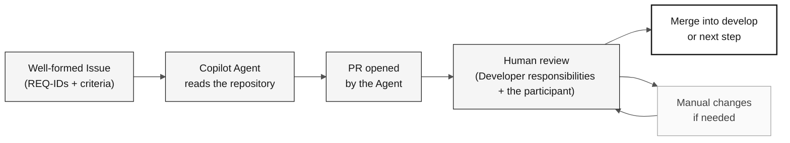

# Stage 4 — Evolution with Agents (40 min)

> **Path:** [Team Kit](../README.md) › [Stage 4](README.md) › **GUIDE**

**This guide leads the participant through experimenting with GitHub Copilot Agent mode: writing a well-formed Issue, delegating it to the Agent, reviewing the resulting PR, and recording honest evidence of what worked.**

  

| Field | Value |
|---|---|
| **Target audience** | the participant (DevOps + Tech Writer) leads; Developer responsibilities co-leads the technical review |
| **Prerequisites** | C3 checkpoint received; functional Stage 3 prototype; known build command |
| **Estimated time** | 40 min |
| **Stage** | Stage 4 — Evolution |
| **Expected outcome** | Issue created, delegation recorded, experience report completed |

> [!NOTE]
> Official time: not used in the individual challenge in [`00-TEAM-FLOW.md`](../00-TEAM-FLOW.md). the participant leads, and Developer responsibilities co-leads the technical review.

---

## Concept: local Agent mode and GitHub coding agent

VS Code Agent mode performs authorized actions in the local workspace.
GitHub's coding agent is a separate issue-to-PR workflow that requires repository
availability and permissions. Selecting Agent mode locally does not assign a
GitHub issue or automatically create a remote PR.

Stage 4 explores the coding agent when available. Otherwise, record a reviewed
issue draft and an explicit continuation step; do not invent a remote run.

**Why it matters:** the Agent does not invent requirements. It reads what you wrote in the Issue and `spec.md`. If the Issue is vague, the PR will be vague. If the Issue is precise, the PR has a chance of approval without major changes.

**Differences between Copilot modes:**

| Mode | When to use it | Human control |
|---|---|---|
| **Ask** | Questions, explanations, and targeted inquiries | Total |
| **Plan** | Plan a change before execution | High |
| **Agent (local)** | Implement an authorized workspace task | Tool approvals and diff/test review |
| **Coding agent (GitHub)** | Delegate an issue in the repository | Separate availability checks and human PR review |

**Issue → Agent → PR → Review cycle:**

---

## Concept: IaC with Terraform and CI/CD with GitHub Actions

**Terraform** is the infrastructure-as-code (IaC) tool used in this workshop. It describes Azure resources (App Service, PostgreSQL, and Key Vault) in `.tf` files and creates them in a repeatable, auditable way.

> [!CAUTION]
> Never run `terraform apply` during the workshop. Validate with `terraform plan` and document the result. Actual infrastructure provisioning is outside the workshop scope.

**GitHub Actions** is the CI/CD engine. A well-configured pipeline automatically validates every PR: it compiles, tests, checks traceability (the presence of `source_legacy:`), and optionally deploys.

---

## Objective

Experiment with one small delegation and leave honest evidence of the outcome. This stage does not promise that an Agent will open a PR, that Terraform will be created, or that a merge will happen before final acceptance.

In parallel, DBA leads the [data acceptance checks](../docs/DATA-MIGRATION.md):
QA independently rechecks reconciliation and rerun/recovery, Developer verifies
the beneficiary queries, and PO accepts the observed results or records blockers.
This is participant validation, not a presentation or an instructor exercise.

---

## Concept: closing the arc with something the legacy could not do

Stages 1 to 3 prove the modern system behaves like the old one. That is necessary
and it is not the point. A migration that only reproduces 1997 behavior has spent
a day to arrive where the organization already was.

Stage 4 adds the missing half of the argument: **one capability the legacy system
could not offer**, delivered on evidence, in the time that remains.

| Stage | Question it answers | What it proves |
|---|---|---|
| 1 — Archaeology | What does the system actually do? | The participant reads evidence instead of assuming |
| 2 — Specification | What do we preserve, and what do we deliberately change? | Behavior is traceable to a source |
| 3 — Implementation | Does the new system behave like the old one? | Equivalence on migrated data |
| **4 — Evolution** | **What is now possible that was not possible before?** | **The modernization bought something** |

The rule that keeps this honest: a capability is greenfield only when the participant can
**point at what prevented it**. A fixed 24x80 screen, a batch-only output path, a
single-key access pattern, a field width — a constraint somebody actually read in
the corpus. "Mainframes are old" is not evidence, and the agent rejects it.

The traceability gate already supports this. A requirement with no legacy
equivalent is written as `source_legacy: [GREENFIELD]` **plus a written
justification**; without the justification, CI rejects the PR exactly as it would
for a missing source. The escape hatch is narrow on purpose.

> [!WARNING]
> One capability, deliberately small. This step never displaces data acceptance,
> and it never weakens a legacy-backed requirement to fit the clock. A capability
> that was scoped, written as a requirement, and explicitly deferred is a valid
> and honest outcome.

---

## Timed schedule

| Time | Activity | Outcome |
|---|---|---|
| 16:10–16:15 | Receive the C3 checkpoint, confirm the build, and choose the Stage 4 item: a capability the legacy system could not offer, or a small pending item when no candidate has a citable constraint. | Safe scope to delegate or record in the backlog. |
| 16:15–16:25 | Scope the item with [`/greenfield-feature`](../.github/prompts/stage-evolution-greenfield-feature.prompt.md) when it is new behavior, then write the Issue with context, REQ-IDs, feature path, verifiable criteria, out-of-scope items, and test method. | Requirement written; Issue created or draft ready. |
| 16:25–16:35 | Delegate to Copilot Agent, if available, and observe the initial status. | Delegation recorded without waiting for full implementation. |
| 16:35–16:45 | If a PR exists, conduct a human review. Otherwise, record the status and prepare a post-workshop review. | Review comments or an explicit next step. |
| 16:45–16:50 | Update the experience report and inform the participant for integrated acceptance. | Factual account of what worked, failed, or remains pending. |

Use [`../.github/prompts/stage-evolution-write-github-issue.prompt.md`](../.github/prompts/stage-evolution-write-github-issue.prompt.md) as a drafting checklist. Do not ask the Agent to invent missing requirements, architecture, legacy sources, or acceptance criteria.

---

## Step by step

- [ ] **Receive the C3 checkpoint.** Confirm build status, populated PostgreSQL, DBA/QA reconciliation evidence, and beneficiary query coverage; identify a small, well-bounded pending item.
- [ ] **Choose the Stage 4 item.** Prefer a capability the legacy system could not offer and whose blocking constraint the participant can cite in the corpus. Fall back to a pending item when no candidate qualifies.
- [ ] **Scope a greenfield item first.** Run `/greenfield-feature` to shrink it and write one `REQ-NNN` with `source_legacy: [GREENFIELD]` plus its justification, which the traceability gate requires.
- [ ] **Write the Issue.** Use the checklist in `.github/prompts/stage-evolution-write-github-issue.prompt.md`.
- [ ] **Verify that the Issue includes:** REQ-IDs with existing `source_legacy:` entries in `spec.md`, verifiable acceptance criteria, limited scope, and a test method.
- [ ] **Delegate to Copilot Agent.** Record the start time and observe the initial status.
- [ ] **Review the PR** if available, following the criteria below.
- [ ] **Record the outcome** in the experience report, regardless of the result.
- [ ] **Inform the participant** of the status for integrated acceptance.
- [ ] **Recheck data after changes.** DBA and QA verify the same snapshot's record accounting, complete beneficiary coverage, rerun behavior, and target recovery; record any differences.

---

## Scope limits

> [!IMPORTANT]
> These limits ensure that the workshop ends with real evidence, not promises.

- The Issue references `.spec/<NNN>-<feature>/spec.md`, `plan.md`, and `tasks.md` when the pending item comes from a specified feature.
- **At most one** greenfield capability, deliberately small, with a citable legacy constraint and a justified `[GREENFIELD]` requirement. A second one is a backlog issue.
- A greenfield item never displaces data acceptance, and never weakens a legacy-backed requirement to fit the clock.
- Every `impl/<NNN>-<feature>` branch starts from `develop` and opens a PR into `develop`; there is no `stage` branch.
- Review every Agent PR as a human PR. Do not merge automatically.
- CI/CD and Terraform are optional during this interval. Validate or document what already exists. Do not create infrastructure only to meet a target.

> [!CAUTION]
> Never run `terraform apply` during the workshop.

---

## Quick PR review

Before approving a PR generated by the Agent, confirm:

- [ ] The scope remains limited to the Issue and referenced REQ-IDs.
- [ ] The referenced requirements and `source_legacy:` entries already exist in `spec.md`.
- [ ] Tests, input validation, and documentation were addressed when applicable.
- [ ] There are no secrets, dependencies without a decision, or out-of-scope changes.
- [ ] The PR targets `develop` and received peer review.

---

## Completion criteria

- [ ] A small Issue was created or left as a reviewable draft.
- [ ] If the item was a greenfield capability, its `REQ-NNN` carries `source_legacy: [GREENFIELD]` with a justification naming a citable legacy constraint; if it was deferred, the reason is recorded.
- [ ] The delegation outcome (PR, in-progress execution, failure, or unavailability) was recorded without promises.
- [ ] An available PR received human review; if no PR exists, a next step is recorded.
- [ ] The experience report was completed.
- [ ] CI/IaC status was communicated for acceptance without running `terraform apply`.
- [ ] DBA and QA verified reconciled data, rerun/recovery, and authorized listing/search/detail across the complete beneficiary population.
- [ ] PO recorded acceptance or explicit blockers; no incomplete migration was presented as complete.

## Integrated validation after Stage 4

Use 17:10-17:40 to organize sanitized evidence and 17:10-17:40 for participant validation,
as scheduled in [participant flow](../00-TEAM-FLOW.md). DBA traces the authorized source
snapshot to PostgreSQL; QA checks completeness, relationships, and agreed
aggregates; Developer exercises real API/UI queries across pages; PO checks
business acceptance. Record failures, owners, and next actions without inventing
successful outcomes or copying source records into reports.

---

## References

- [Participant experience report](agent-experience-report.md)
- [Report template](templates/agent-experience-report.template.md)
- [Stage agent @evolution](../06-stage-agents/04-evolution/README.md)
- [Cheat sheet: 3 Copilot modes](../09-cheat-sheets/copilot-3-modes.md)

---

### Continue reading

| Previous | Next |
|---|---|
| [Stage 3 — Implementation](../03-implementation/GUIDE.md) 15:30–17:10 · Java 21 + Spring Boot + Next.js, with tests. | [Experience report](agent-experience-report.md) Complete it at the end of the stage. |

[Back to the kit index](../README.md)
