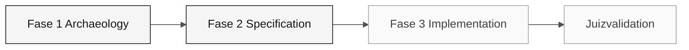

# Persona — Product Owner

> <x5/> <x6/> › <x7/> › <x8/> › <x9/>

<x1/> Define a missão, responsabilidades por fase, ferramentas, auto-controle e rubricas de avaliação.

| Campo | Valor |
|---|---|
|<x1/>|Product Owner|
|<x1/>|Responsabilidade de visão (coberto pelo participante)|
|<x1/>|Etapas 1-3 mais validação final do juiz: escopo, critérios de aceitação e aceitação de dados migrados|
|<x1/>|Contribuições Glossárias, escopo priorizado, Scope/Out da seção Escopo, população beneficiária acordada, aceitação de dados ou bloqueadores|
|<x1/>|Catálogo de regras (Arqueologia), mapa de integração (EA), DBA/QA evidência de prontidão e reconciliação|
|<x1/>|C1/C2/C3 provas de âmbito e aceitação|

<x2/> <x3/>

---

## Conceito

O Product Owner é responsável pela tradução das necessidades de negócios para o escopo executável. Na indústria de software, o PO define o "porquê" — que problema o produto resolve — e decide o que está incluído ou excluído de cada ciclo de entrega.

Em um sistema com aproximadamente 30 anos de história, o PO conecta prioridades
revisaram provas sem inventar intenções históricas. Seguir o
<x1/> e
distinguir uma decisão política moderna da prova do comportamento legado.

<x1/> reveja o comportamento de um candidato a partir do real dos participantes
A ler. Decida se pertence ao incremento fino, com suas dependências
e cobertura de dados, ou precisa de diferimento explícito. Nenhuma decisão prioritária concluída
ou o comportamento da fonte é fornecido aqui.

---

## Onde você atua no SDLC

- <x1/> ninguém — você abre o ciclo
- Responsabilidade de arquitetura (Arquitectura) na Fase 1; Responsabilidade de implementação (Implementação) através da aprovação do escopo

---

## Responsabilidades por estágio

|<x1/>| O que você faz | Entrega que depende de você |
|---|---|---|
|<x1/>|Liderar o desenvolvimento do glossário e capturar os "por quês" por trás das regras. Mantenha uma lista de questões de negócios abertos. Com o DBA, concordar com a população beneficiária autorizada completa e os dados legados relacionados que o recurso deve transportar.|Glossário + lista priorizada de pontos para esclarecer + população beneficiária acordada|
|<x1/>|Decida o que está incluído no v1 e o que se torna backlog. Lançar a votação final sobre o âmbito de aplicativo. Aprovar cobertura de consulta: listagem, busca e detalhes autorizados para cada beneficiário na população acordada.|Secção "Escopo e Não Âmbito" do caderno de especificações, com critérios de aceitação da consulta|
|<x1/>|Validar que histórias de usuários ainda refletem o negócio à medida que o código emerge. Desbloquear perguntas funcionais. Verificar fluxos de dados migrados reais, não simulados ou sementes.|Critérios funcionais de aceitação por recurso|
|<x1/>|Reveja uma edição ou rascunho limitado e qualquer PR de agente de codificação disponível. Na validação integrada, aceitar os dados reconciliados e a evidência de consulta ou registrar bloqueadores explícitos.|Um GitHub Issue/draft com aceitação rastreável (templates não são arquivos de saída de emissão); registro de aceitação de dados ou bloqueadores|

---

## Aceitação de dados: o que você assina

O modernizado SIFAP deve conter e mostrar os dados legados, não só reproduzir suas regras. Antes de aceitar, ask o DBA e QA para o <x1/> e confirmar que:

- PostgreSQL foi povoado a partir do instantâneo aprovado Adabas, não a partir de uma nova semente ou de uma nova amostra;
- cada registro de fonte na população acordada foi carregado ou explicitamente rejeitado, e os rejeitados não resolvidos ainda bloqueiam a aceitação;
- as informações legadas que o escopo exige, tais como identificação, programa, status de benefício e valores, dependentes e pagamentos, correspondem ao registro fonte por registro, não apenas em totais;
- listagem autorizada, busca e detalhes chegam a todos os beneficiários da população acordada, incluindo registros além da primeira página.

Record aceitação ou bloqueadores explícitos; nunca encolher a população para caber o relógio. Ver o <x1/>.

---

## Kit da persona

|<x1/>| Finalidade |
|---|---|
|<x1/>|Capacidade de função que carrega automaticamente para especificação, backlog e aceitação|
|<x2/> — <x3/>|Escreve uma seção de <x1/> de histórias de usuários em EARS|
|<x2/> — <x3/>|Atualiza a especificação quando um recurso muda|
|<x2/> — <x3/>|Verifica se o código satisfaz os critérios de aceitação|

---

## Ferramentas e primitivas

- <x1/> para refinar histórias de usuários e critérios de aceitação.
- <x3/> na Fase 2: utilizar <x4/> e <x5/> para transformar o escopo em requisitos testáveis.
- <x1/> — atalhos para escrever histórias, cortes de escopo e comunicação de risco.

<x1/>

- <x1/> — quando utilizar Ask, Plan e Agente.
- <x3/> — <x4/> e <x5/>.

---

## Checklist de integração

- [ ] Missão, responsabilidades e auto-controle.
- [ ] <x1/> Confirme que agentes e prompts aparecem no chat do Copilot.
- [ ] <x2/> Ver <x3/>.
- [ ] <x1/> A quem recebe e a quem entrega no final de cada fase.
- [ ] <x2/> Ver o modelo em <x3/>.
- [ ] <x2/> Ver <x3/>; assina a população e a aceitação final dos dados.

---

## Como ter sucesso neste papel

- Diga "que fica fora do v1" três vezes por dia sem hesitação.
- Conecte cada ADR a um impacto concreto no usuário ou operação.
- Proteger o foco do participante quando alguém sugere refatorar algo que já funciona.
- Escreva os dois problemas finais de validação com contexto suficiente para o Copilot trabalhar sem perguntas.
- Aceitar dados migrados apenas a partir de evidências: uma tela de trabalho não prova que todos os beneficiários migraram.

---

## Erros comuns e como evitá-los

|<x1/>| Causa | Correção |
|---|---|---|
|Equipa que implementa funcionalidades de baixo valor|Âmbito de aplicativo não foi explicitamente cortado|Listar os itens fora do escopo tão claramente quanto os itens dentro do escopo|
|validação final Agent produz um resultado genérico|As questões foram escritas sem contexto comercial|Incluir critérios de aceitação concretos e uma referência ao REQ-ID|
|Fase 3 termina incompleta|Nenhum recurso fino foi priorizado|Escolha uma funcionalidade completa de ponta a ponta, não metade de três|
|As discussões técnicas consomem o tempo PO|PO entra em detalhes de implementação|Redirecionar para o SA ou TL e registrar a decisão como uma suposição|
|Demonstração aceita porque as telas mostram dados|Uma semente, uma amostra, ou a primeira página foi verificada em vez da população migrada|Ask para o registro de reconciliação e verificar os beneficiários para além da primeira página|

---

## 3 exemplos de prompts

1. <x1/> "Analisar os programas que li e listar as regras confirmadas. Para cada um, propor uma decisão de escopo com justificação."
2. <x1/> "Reveja essas 3 histórias de usuários e reescreva-as como tarefas de implementação com contexto, requisitos funcionais como uma lista de verificação e critérios de aceitação."
3. <x1/> "O participante quer implementar mais recursos do que o tempo permite. Ajude-me a priorizar usando impacto, risco e evidências disponíveis."

---

## Se você ficar travado

|<x1/>| O que fazer |
|---|---|
|Preso na priorização|Comparar impacto, risco, dependências e tempo disponível; registrar a decisão|
|Não saber escrever uma tarefa|Use o formato de tarefa Spec-Kit do recurso atual plan e adapte-o|
|Equipa quer tudo no âmbito|Diga: "Temos 70 minutos para implementação; escolha uma característica fina"|
|Pergunta de negócios não tem resposta|Preservar uma pergunta, evidência e proprietário não confirmada; bloquear o escopo afetado e continuar apenas o trabalho suportado não relacionado|

---

## Dependências

|<x1/>| Relação | Artefato |
|---|---|---|
|Requirements Engineer|Depende de ti.|Priorização das regras para se tornar EARS|
|Technical Lead|Depende de ti.|Âmbito definido para calibrar a Etapa 3|
|Developer|Depende de ti.|Âmbito claro e critérios de aceitação|
|Enterprise Architect|Você depende deles.|Mapa de integração para as decisões de âmbito|
|DBA|Depende de ti.|População beneficiária autorizada e cobertura de consultas|
|DBA + QA Engineer|Você depende deles.|Provas de disponibilidade, reconciliação e consulta para aceitação dos dados|

---

## Como você é avaliado

- <x1/> escopo claro, itens documentados fora do escopo.
- <x1/> PO que protege o foco do participante.

---

### Continue lendo

| Anterior | Próximo |
|---|---|
|<x1/><x2/><x3/>Comparison tabela: foco de papel, uso de estágio, defaults de emergência.<x4/>|<x1/><x2/> <x3/>Vision responsabilidade · escreve EARS com source legacy.<x4/>|

<x1/><x2/><x3/>
