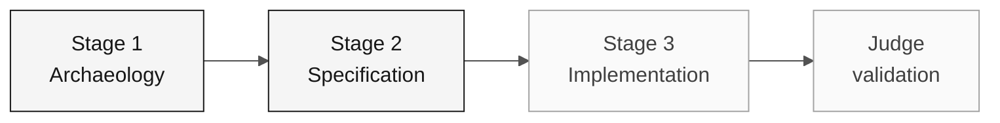

# Persona — Product Owner

> **Trail:** [Team Kit](../../README.md) › [Personas](../OVERVIEW.md) › [Product Owner](README.md) › **PERSONA**

**Complete profile for the Product Owner persona.** Defines the mission, responsibilities by stage, tools, self-check, and evaluation rubrics.

| Field | Value |
|---|---|
| **Role** | Product Owner |
| **Role scope** | Vision responsibility (covered by the participant) |
| **Active stages** | Stages 1-3 plus final judge validation: scope, acceptance criteria, and migrated-data acceptance |
| **Artifacts produced** | Glossary contributions, prioritized scope, Scope/Out of Scope section, agreed beneficiary population, data acceptance or blockers |
| **Artifacts consumed** | Rule catalog (Archaeology), integration map (EA), DBA/QA readiness and reconciliation evidence |
| **Self-check focus** | C1/C2/C3 scope and acceptance evidence |

 

---

## Concept

The Product Owner is responsible for translating business needs into executable scope. In the software industry, the PO defines the "why" — which problem the product solves — and decides what is included in or excluded from each delivery cycle.

In a system with approximately 30 years of history, the PO connects priorities
to reviewed evidence without inventing historical intent. Follow the
[chronology policy](../../README.md#scenario-chronology-and-evidence) and
distinguish a modern policy decision from proof of legacy behavior.

**Team exercise:** review a candidate behavior from the participants' actual
reading. Decide whether it belongs in the thin increment, with its dependencies
and data coverage, or needs explicit deferral. No completed priority decision
or source behavior is supplied here.

---

## Where you work in the SDLC

- **Receives from:** no one — you open the cycle
- **Hands off to:** Architecture responsibility (Architecture) in Stage 1; Implementation responsibility (Implementation) through scope approval

---

## Responsibilities by stage

| **Stage** | What you do | Deliverable that depends on you |
|---|---|---|
| **1 · Archaeology** | Lead glossary development and capture the "whys" behind the rules. Maintain a list of open business questions. With the DBA, agree the complete authorized beneficiary population and the related legacy data the feature must carry. | Glossary + prioritized list of points to clarify + agreed beneficiary population |
| **2 · Specification** | Decide what is included in v1 and what becomes backlog. Cast the final vote on scope. Approve consultation coverage: authorized listing, search, and detail for every beneficiary in the agreed population. | "Scope and Out of Scope" section of the specification, with consultation acceptance criteria |
| **3 · Implementation** | Validate that user stories still reflect the business as the code emerges. Unblock functional questions. Check real migrated-data flows, not mocks or seeds. | Functional acceptance criteria by feature |
| **Final judge validation** | Review one bounded issue or draft and any available coding-agent PR. At the integrated validation, accept the reconciled data and consultation evidence or record explicit blockers. | A GitHub Issue/draft with traceable acceptance (templates are not issue output files); data acceptance record or blockers |

---

## Data acceptance: what you sign

The modernized SIFAP must hold and show the legacy data, not only reproduce its rules. Before you accept, ask the DBA and QA for the [reconciliation record](../../docs/data-migration/reconciliation.template.md) and confirm that:

- PostgreSQL was populated from the approved Adabas snapshot, not from a new seed or sample fixtures;
- every source record in the agreed population was loaded or explicitly rejected, and unresolved rejects still block acceptance;
- the legacy information the scope requires, such as identification, program, benefit status and values, dependents, and payments, matches the source record by record, not only in totals;
- authorized listing, search, and detail reach every beneficiary in the agreed population, including records beyond the first page.

Record acceptance or explicit blockers; never shrink the population to fit the clock. See the [data acceptance gates](../../docs/DATA-MIGRATION.md#self-check-and-acceptance-gates).

---

## Persona kit

| **Artifact** | Purpose |
|---|---|
| `.github/skills/persona-product-owner/SKILL.md` | Role skill that loads automatically for specification, backlog, and acceptance |
| `/spec` — `persona-product-owner-spec.prompt.md` | Writes a section of `.spec/<NNN>-<feature>/spec.md` from user stories in EARS |
| `/update-spec` — `persona-product-owner-update-spec.prompt.md` | Updates the specification when a feature changes |
| `/acceptance-check` — `persona-product-owner-acceptance-check.prompt.md` | Checks whether the code meets the acceptance criteria |

---

## Tools and primitives

- **Copilot Chat** to refine user stories and acceptance criteria.
- **GitHub Spec-Kit** in Stage 2: use `/speckit.specify` and `/speckit.clarify` to turn scope into testable requirements.
- **Kit prompts and skills** — shortcuts for writing stories, scope cuts, and risk communication.

**Relevant cheat sheets:**

- [`../../09-cheat-sheets/copilot-3-modes.md`](../../09-cheat-sheets/copilot-3-modes.md) — when to use Ask, Plan, and Agent.
- [`../../09-cheat-sheets/spec-kit-workflow.md`](../../09-cheat-sheets/spec-kit-workflow.md) — `/speckit.specify` and `/speckit.clarify`.

---

## Onboarding checklist

- [ ] **Read this profile.** Mission, responsibilities, and self-check.
- [ ] **Open the kit `README.md`.** Confirm that agents and prompts appear in Copilot Chat.
- [ ] **Identify your current role focus.** See [00-TEAM-FLOW.md](../../00-TEAM-FLOW.md).
- [ ] **Note the self-check.** Who you receive from and who you deliver to at the end of each stage.
- [ ] **Have an example of a well-written issue.** See the template in [`../../04-evolution/GUIDE.md`](../../04-evolution/GUIDE.md).
- [ ] **Read the data acceptance gates.** See [`../../docs/DATA-MIGRATION.md`](../../docs/DATA-MIGRATION.md); you sign the population and the final data acceptance.

---

## How to succeed in this role

- Say "that stays out of v1" three times a day without hesitation.
- Connect every ADR to a concrete impact on the user or operation.
- Protect the participant's focus when someone suggests refactoring something that already works.
- Write the two final validation issues with enough context for Copilot to work without questions.
- Accept migrated data only from evidence: a working screen does not prove that every beneficiary migrated.

---

## Common mistakes and how to avoid them

| **Symptom** | Cause | Correction |
|---|---|---|
| Team implementing low-value features | Scope was not explicitly cut | List out-of-scope items as clearly as in-scope items |
| final validation Agent produces a generic result | Issues were written without business context | Include concrete acceptance criteria and a reference to the REQ-ID |
| Stage 3 ends incomplete | No thin feature was prioritized | Choose one complete end-to-end feature, not half of three |
| Technical discussions consume the PO's time | PO gets into implementation details | Redirect to the SA or TL and record the decision as an assumption |
| Demo accepted because the screens show data | A seed, a sample, or the first page was checked instead of the migrated population | Ask for the reconciliation record and check beneficiaries beyond the first page |

---

## 3 prompt examples

1. **(Chat)** "Analyze the programs I read and list the confirmed rules. For each one, propose a scope decision with justification."
2. **(Chat)** "Review these 3 user stories and rewrite them as implementation tasks with context, functional requirements as a checklist, and acceptance criteria."
3. **(Chat)** "The participant wants to implement more features than time allows. Help me prioritize using impact, risk, and available evidence."

---

## If you get stuck

| **Situation** | What to do |
|---|---|
| Stuck on prioritization | Compare impact, risk, dependencies, and available time; record the decision |
| Do not know how to write a task | Use the Spec-Kit task format from the current feature plan and adapt it |
| Team wants everything in scope | Say: "We have 70 minutes for implementation; choose one thin feature" |
| Business question has no answer | Preserve an unconfirmed question, evidence and owner; block affected scope and continue only unrelated supported work |

---

## Dependencies

| **Persona** | Relationship | Artifact |
|---|---|---|
| Requirements Engineer | Depends on you | Prioritization of rules to become EARS |
| Technical Lead | Depends on you | Defined scope to calibrate Stage 3 |
| Developer | Depends on you | Clear scope and acceptance criteria |
| Enterprise Architect | You depend on them | Integration map for scope decisions |
| DBA | Depends on you | Authorized beneficiary population and consultation coverage |
| DBA + QA Engineer | You depend on them | Source readiness, reconciliation, and consultation evidence for data acceptance |

---

## How you are evaluated

- **Rubric A2 (Specification Coherence):** clear scope, documented out-of-scope items.
- **Rubric A6 (Collaboration):** PO who protects the participant's focus.

---

### Continue reading

| Previous | Next |
|---|---|
| [OVERVIEW of the 10 personas](../OVERVIEW.md) Comparison table: role focus, stage use, emergency defaults. | [Requirements Engineer](../02-requirements-engineer/PERSONA.md) Vision responsibility · writes EARS with source_legacy. |

[Back to the kit index](../../README.md)
