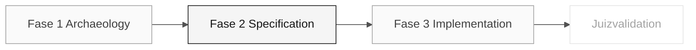

# Persona — Requirements Engineer

> <x5/> <x6/> › <x7/> › <x8/> › <x9/>

<x1/> Define a missão, responsabilidades por fase, ferramentas, auto-controle e rubricas de avaliação.

| Campo | Valor |
|---|---|
|<x1/>|Requirements Engineer|
|<x1/>|Responsabilidade dos requisitos (coberto pelo participante)|
|<x1/>|Fases 1-3: captura de provas, requisitos EARS e controles de rastreabilidade|
|<x1/>|Elementos do catálogo de regras, requisitos EARS, critérios de aceitação, controles de rastreabilidade|
|<x1/>|PO priorização e população beneficiária acordada, programas de Fase 1 <x1/>, mapa de dados e evidência de prontidão|
|<x1/>|C1/C2/C3 Provas de rastreabilidade|

<x2/> <x3/>

---

## Conceito

O Requirements Engineer transforma as regras descobertas no sistema legado em requisitos formais e testáveis. Na indústria, esse profissional assegura que o sistema em construção resolva o problema certo e que haja uma forma objetiva de verificar se foi construído corretamente.

SIFAP tem comentários de fonte e documentação histórica parcial, não um verificado
especificação atual. Compare-os com o comportamento real Natural, então promova
apenas os resultados revistos em EARS com <x1/>.

<x1/> escolha uma regra de candidato da fonte atribuída,
registrar a condição e resposta observadas, e validar sua interpretação.
Somente então atribuir um <x1/> e critérios de aceitação apoiados por evidências. Não
O comportamento do programa, citação de fonte ou requisito final é fornecido aqui.

---

## Onde você atua no SDLC

- <x1/> PO (prioritização) e Fase 1 (catálogo de regras)
- <x1/> Responsabilidade de arquitectura (Arquitectura) na Fase 2

---

## Responsabilidades por estágio

|<x1/>| O que você faz | Entrega que depende de você |
|---|---|---|
|<x1/>|Extrair regras de candidatos de programas Natural. Classificar como regra de negócio, validação, cálculo ou integração. Observe quais registros legados e campos o recurso priorizado deve preservar, com DDM ou evidência do programa.|Catálogo de regras (quadro)|
|<x1/>|Converta o catálogo em requisitos EARS. Manter legado → rastreabilidade de requisitos. Estruturar a especificação com o PO. Cobrir os dados migrados também: cobertura populacional completa, autorizada listing/search/detail e valores legados exatos, cada um com <x1/>.|Secção "Requisitos funcionais" na notação EARS, incluindo os critérios de aceitação dos dados|
|<x1/>|Responda às perguntas durante a codificação. Ajuste o texto quando surgir a ambiguidade real. Rota as ambiguidades de mapeamento de dados para o DBA e arquitetos em vez de reformulá-los.|Vivos, não congelados, especificações|
|<x1/>|Analise se as duas questões abrangem um novo requisito ou ajuste um existente. Confirmar que as alterações mantêm os requisitos de aceitação dos dados intactos.|Coerência entre questões e especificação|

---

## Kit da persona

|<x1/>| Finalidade |
|---|---|
|<x1/>|Capacidade de função que carrega automaticamente para análise de requisitos|
|<x2/> — <x3/>|Sincroniza a especificação com alterações de código|
|<x2/> — <x3/>|Detecta conflitos entre os requisitos|
|<x2/> — <x3/>|Converte o texto livre para EARS|
|<x1/>|Notificação do requisito, prova de origem e verificação da aceitação|

---

## Ferramentas e primitivas

- <x2/> — <x3/> é o espaço de trabalho primário. Especificar CLI gera a base de especificação para refinar na EARS.
- <x1/> para validar a coerência entre os requisitos.
- Repositório <x2/> para navegar arquivos legados <x3/> e correlacioná-los com requisitos.
- Kit prompts e habilidades — extração de regras e conversão para EARS.

<x1/>

- <x3/> — <x4/> e <x5/> com exemplos EARS.
- <x1/> — quando utilizar Claude Sonnet 4. 6 vs. Opus 4. 6.

---

## Checklist de integração

- [ ] Missão, responsabilidades e auto-controle.
- [ ] <x1/> Confirme que agentes e prompts aparecem no chat do Copilot.
- [ ] Abre a secção "EARS Notação" em <x3/>.
- [ ] <x2/> Ver <x3/>.
- [ ] <x1/> A quem recebe e a quem entrega no final de cada fase.

---

## Como ter sucesso neste papel

- Suas exigências usam verbos ativos e são testáveis.
- Cada regra legada tem rastreabilidade explícita para o requisito moderno através de <x1/>.
- Você diz "isso é ambíguo; precisamos de uma decisão" antes que o código seja escrito.
- Use os seis padrões EARS sem confundi-los (onipresente, orientado por eventos, orientado pelo estado, indesejado, opcional, complexo).

---

## Erros comuns e como evitá-los

|<x1/>| Causa | Correção |
|---|---|---|
|O requisito não tem critério de verificação|Escrito como um parágrafo, não como EARS|Reescrever com o verbo "DEVERÁ" e uma condição explícita|
|Regra de legado não tem contrapartida|Arqueologia incompleta|Reveja o catálogo de regras antes de fechar a especificação|
|Teor de ADR em duplicatas de requisito|Confusão entre um requisito e uma decisão de projecto|Um requisito descreve comportamento; um ADR registra uma decisão arquitetônica|
|"O sistema deve usar o Redis" entra na especificação|Confusão entre um requisito e a implementação|Um requisito funcional não menciona tecnologia|
|A especificação abrange as regras, mas não os dados migrados|Dados tratados apenas como uma tarefa DBA|Adicione requisitos para cobertura populacional, consulta e valores legados exatos; veja o <x1/>|

---

## 3 exemplos de prompts

1. <x1/> "Leia esta regra do legado SIFAP e converta-a para EARS notação: [colar a regra]. Identificar qual dos 6 padrões EARS se aplica e explicar por quê."
2. <x1/> "Analisar estes 5 requisitos EARS e encontrar: (a) ambiguidades que precisam de uma decisão PO, (b) dependências entre eles, e (c) requisitos conflitantes."
3. <x2/> "Em <x3/>, plan EARS requisitos para as regras confirmadas no catálogo. Escolha o padrão EARS com base no comportamento observado."

---

## Se você ficar travado

|<x1/>| O que fazer |
|---|---|
|Não familiar com EARS|Abra a seção "EARS Notação" em <x1/> — 6 padrões com exemplos|
|Requisitos ambíguos|Escreva duas interpretações e ask o PO que está correto|
|Muitas regras, pouco tempo|Priorizar regras pelo risco e impacto registrados pelo participante|
|Spec-Kit não funciona|Restaurar a ferramenta antes de criar artefatos formais; eles pertencem a <x1/>|

---

## Dependências

|<x1/>| Relação | Artefato |
|---|---|---|
|Product Owner|Você depende deles.|Priorização das regras|
|Developer|Depende de ti.|Requisitos claros a aplicar|
|QA Engineer|Depende de ti.|Requisitos de ensaio com critérios de verificação|
|Software Architect|Depende de ti.|Requisitos para a concepção de contextos delimitados|
|DBA|Depende de ti.|Requisitos de cobertura de dados para projetar mapeamentos e reconciliação|

---

## Como você é avaliado

- <x1/> requisitos em EARS, numerados e rastreáveis para o sistema legado.
- <x1/> catálogo de regras com classificação.
- Critério: "Toda exigência tem um verbo ativo e é testável."

---

### Continue lendo

| Anterior | Próximo |
|---|---|
|<x1/><x2/> <x3/>Vision responsabilidade · valida escopo e prioridades.<x4/>|<x1/><x2/> <x3/>Architecture responsabilidade · C4 + RAMs estruturais. <x4/>|

<x1/><x2/><x3/>
