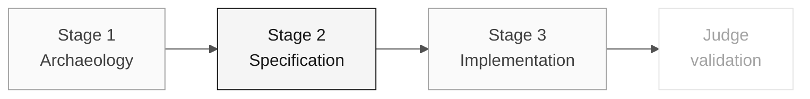

# Persona — Requirements Engineer

> **Trail:** [Team Kit](../../README.md) › [Personas](../OVERVIEW.md) › [Requirements Engineer](README.md) › **PERSONA**

**Complete profile for the Requirements Engineer persona.** Defines the mission, responsibilities by stage, tools, self-check, and evaluation rubrics.

| Field | Value |
|---|---|
| **Role** | Requirements Engineer |
| **Role scope** | Requirements responsibility (covered by the participant) |
| **Active stages** | Stages 1-3: evidence capture, EARS requirements, and traceability checks |
| **Artifacts produced** | Rule catalog entries, EARS requirements, acceptance criteria, traceability checks |
| **Artifacts consumed** | PO prioritization and agreed beneficiary population, Stage 1 `.NSN` programs, DBA data map and readiness evidence |
| **Self-check focus** | C1/C2/C3 traceability evidence |

 

---

## Concept

The Requirements Engineer transforms rules discovered in the legacy system into formal, testable requirements. In the industry, this professional ensures that the system being built solves the right problem — and that there is an objective way to verify that it was built correctly.

SIFAP has source comments and partial historical documentation, not a verified
current specification. Compare them with actual Natural behavior, then promote
only reviewed findings into EARS with `source_legacy:`.

**Team exercise:** choose a candidate rule from the actual assigned source,
record the observed condition and response, and validate its interpretation.
Only then assign a `REQ-NNN` and evidence-backed acceptance criteria. No
program behavior, source citation, or finished requirement is supplied here.

---

## Where you work in the SDLC

- **Receives from:** PO (prioritization) and Stage 1 (rule catalog)
- **Hands off to:** Architecture responsibility (Architecture) in Stage 2

---

## Responsibilities by stage

| **Stage** | What you do | Deliverable that depends on you |
|---|---|---|
| **1 · Archaeology** | Extract candidate rules from Natural programs. Classify them as business rule, validation, calculation, or integration. Note which legacy records and fields the prioritized feature must preserve, with DDM or program evidence. | Rule catalog (table) |
| **2 · Specification** | Convert the catalog into EARS requirements. Maintain legacy → requirement traceability. Structure the specification with the PO. Cover the migrated data too: complete population coverage, authorized listing/search/detail, and exact legacy values, each with `source_legacy:`. | "Functional Requirements" section in EARS notation, including data acceptance criteria |
| **3 · Implementation** | Answer requirement questions during coding. Adjust wording when real ambiguity emerges. Route data-mapping ambiguities to the DBA and architects instead of rewording them away. | Living, not frozen, specification |
| **Final judge validation** | Review whether the two issues cover a new requirement or adjust an existing one. Confirm that changes keep the data acceptance requirements intact. | Coherence between issues and specification |

---

## Persona kit

| **Artifact** | Purpose |
|---|---|
| `.github/skills/persona-requirements-engineer/SKILL.md` | Role skill that loads automatically for requirements analysis |
| `/spec-sync` — `persona-requirements-engineer-spec-sync.prompt.md` | Synchronizes the specification with code changes |
| `/contradiction-check` — `persona-requirements-engineer-contradiction-check.prompt.md` | Detects conflicts between requirements |
| `/ears-convert` — `persona-requirements-engineer-ears-convert.prompt.md` | Converts free text into EARS |
| [EARS validation skill](../../.github/skills/ears-validate/SKILL.md) | Requirement notation, source evidence, and acceptance checks |

---

## Tools and primitives

- **GitHub Spec-Kit** — `/speckit.specify` is the primary workspace. Specify CLI generates the specification foundation to refine in EARS.
- **Copilot Chat** to validate coherence between requirements.
- Repository **MCP/filesystem** to navigate legacy `.NSN` files and correlate them with requirements.
- Kit prompts and skills — rule extraction and conversion to EARS.

**Relevant cheat sheets:**

- [`../../09-cheat-sheets/spec-kit-workflow.md`](../../09-cheat-sheets/spec-kit-workflow.md) — `/speckit.specify` and `/speckit.clarify` with EARS examples.
- [`../../09-cheat-sheets/model-routing.md`](../../09-cheat-sheets/model-routing.md) — when to use Claude Sonnet 4.6 vs. Opus 4.6.

---

## Onboarding checklist

- [ ] **Read this profile.** Mission, responsibilities, and self-check.
- [ ] **Open the kit `README.md`.** Confirm that agents and prompts appear in Copilot Chat.
- [ ] **Review the 6 EARS patterns.** Open the "EARS Notation" section in [`../../02-modern-spec/GUIDE.md`](../../02-modern-spec/GUIDE.md).
- [ ] **Identify your current role focus.** See [00-TEAM-FLOW.md](../../00-TEAM-FLOW.md).
- [ ] **Note the self-check.** Who you receive from and who you deliver to at the end of each stage.

---

## How to succeed in this role

- Your requirements use active verbs and are testable.
- Every legacy rule has explicit traceability to the modern requirement through `source_legacy:`.
- You say "this is ambiguous; we need a decision" before code is written.
- Use the six EARS patterns without confusing them (ubiquitous, event-driven, state-driven, unwanted, optional, complex).

---

## Common mistakes and how to avoid them

| **Symptom** | Cause | Correction |
|---|---|---|
| Requirement has no verification criterion | Written as a paragraph, not as EARS | Rewrite with the verb "SHALL" and an explicit condition |
| Legacy rule has no counterpart | Incomplete archaeology | Review the rule catalog before closing the specification |
| Requirement duplicates ADR content | Confusion between a requirement and a design decision | A requirement describes behavior; an ADR records an architectural decision |
| "The system must use Redis" enters the specification | Confusion between a requirement and implementation | A functional requirement does not mention technology |
| The specification covers rules but not the migrated data | Data treated as a DBA-only task | Add requirements for population coverage, consultation, and exact legacy values; see the [data migration guide](../../docs/DATA-MIGRATION.md) |

---

## 3 prompt examples

1. **(Chat)** "Read this rule from the legacy SIFAP and convert it to EARS notation: [paste the rule]. Identify which of the 6 EARS patterns applies and explain why."
2. **(Chat)** "Analyze these 5 EARS requirements and find: (a) ambiguities that need a PO decision, (b) dependencies among them, and (c) conflicting requirements."
3. **(Plan)** "In `spec.md`, plan EARS requirements for the confirmed rules in the catalog. Choose the EARS pattern based on the observed behavior."

---

## If you get stuck

| **Situation** | What to do |
|---|---|
| Unfamiliar with EARS | Open the "EARS Notation" section in [`../../02-modern-spec/GUIDE.md`](../../02-modern-spec/GUIDE.md) — 6 patterns with examples |
| Ambiguous requirement | Write two interpretations and ask the PO which is correct |
| Many rules, little time | Prioritize rules by the risk and impact recorded by the participant |
| Spec-Kit does not work | Restore the tool before creating formal artifacts; they belong in `.spec/<NNN>-<feature>/spec.md` |

---

## Dependencies

| **Persona** | Relationship | Artifact |
|---|---|---|
| Product Owner | You depend on them | Rule prioritization |
| Developer | Depends on you | Clear requirements to implement |
| QA Engineer | Depends on you | Testable requirements with verification criteria |
| Software Architect | Depends on you | Requirements for designing bounded contexts |
| DBA | Depends on you | Data coverage requirements to design mappings and reconciliation |

---

## How you are evaluated

- **Rubric A2 (Specification Coherence):** requirements in EARS, numbered, and traceable to the legacy system.
- **Rubric A1 (Archaeology):** rule catalog with classification.
- Criterion: "Every requirement has an active verb and is testable."

---

### Continue reading

| Previous | Next |
|---|---|
| [Product Owner](../01-product-owner/PERSONA.md) Vision responsibility · validates scope and priorities. | [Enterprise Architect](../03-enterprise-architect/PERSONA.md) Architecture responsibility · C4 + structural ADRs. |

[Back to the kit index](../../README.md)
