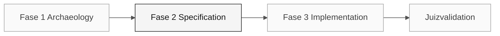

# Persona — Enterprise Architect

> <x5/> <x6/> › <x7/> › <x8/> › <x9/>

<x1/> Define a missão, responsabilidades por fase, ferramentas, auto-controle e rubricas de avaliação.

| Campo | Valor |
|---|---|
|<x1/>|Enterprise Architect|
|<x1/>|Responsabilidade pela arquitectura empresarial (coberto pelo participante)|
|<x1/>|Etapas 1-3: contexto, restrições de integração e decisões de âmbito|
|<x1/>|Contexto do sistema, pressupostos de integração, RAM estruturais quando necessário|
|<x1/>|Catálogo de regras (responsabilidade da visão), requisitos de integração (RE)|
|<x1/>|C1/C2 pressupostos de arquitetura e integração|

<x2/> <x3/>

---

## Conceito

O Enterprise Architect vê o sistema dentro de seu ecossistema organizacional e técnico. No setor, esse papel garante que novas soluções se encaixem no contexto existente — contratos com sistemas externos, padrões de segurança corporativa e requisitos de governança.

Em SIFAP, investigar as partes externas e contratos das fontes fornecidas.
Um nome em um documento histórico não estabelece uma integração ao vivo, atual
propriedade, ou permissão para chamá-lo. Gravar os contratos em falta como lacunas explícitas.

<x1/> traçar um limite externo real, o seu contrato input/output,
e as provas do seu modelo de execução. Rever as opções de coexistência apenas quando
o requisito selecionado precisa deles; não invente um endpoint ou um membro fonte.

---

## Onde você atua no SDLC

- <x1/> Responsabilidade de visão (Visão) na Fase 1 — catálogo de regras e âmbito
- <x1/> Responsabilidade de implementação (Implementação) e Qualidade (Qualidade) na Fase 2; Responsabilidade de apoio à submissão (Operações) para Terraform

---

## Responsabilidades por estágio

|<x1/>| O que você faz | Entrega que depende de você |
|---|---|---|
|<x1/>|Identificar dependências e contratos externos que afetam a fatia.|Provas de integração relevantes|
|<x1/>|Registre apenas decisões topológicas que bloqueiam o plano.|Topologia ADR ou decisão de âmbito quando necessário|
|<x1/>|Validar que a execução respeita os contratos concebidos. Suporte DevOps com Terraform de alto nível.|Validação da disposição implantada|
|<x1/>|Avaliar se as questões finais de validação têm implicações arquitetônicas que requerem revisão prévia.|Avaliação do impacto|

---

## Kit da persona

|<x1/>| Finalidade |
|---|---|
|<x1/>|Capacidade de função que carrega automaticamente para arquitetura e segurança|
|<x2/> — <x3/>|Cria ou atualiza <x1/>|
|<x2/> — <x3/>|Cria um ADR a partir de uma decisão de equipe|
|<x2/> — <x3/>|Revisão de um projeto proposto contra contratos e riscos|
|<x1/>|Convenções de segurança|
|<x1/>|Convenções IaC|

---

## Ferramentas e primitivas

- <x2/> e <x3/> para diagramas de contexto e recipiente.
- <x1/> para decisões de topologia de teste de pressão.
- <x2/> com <x3/> — transforma a especificação em uma técnica plan, decisões e contratos reavaliados.
- Competências de kit — impulsos estruturados para análise de dependência.

<x1/>

- <x3/> — <x4/> e <x5/>.
- <x1/> — use Claude Opus 4.6 para análise de impacto arquitetônico.

---

## Checklist de integração

- [ ] Missão, responsabilidades e auto-controle.
- [ ] <x1/> Confirme que agentes e prompts aparecem no chat do Copilot.
- [ ] <x2/> Ver <x3/>.
- [ ] Lista SIAFI, BB, INCRA e outros sistemas presentes nos programas atribuídos <x3/>.
- [ ] <x1/> Saiba quem recebe o mapa de dependência e para qual artefato.

---

## Como ter sucesso neste papel

- O diagrama C4 nível 1 é legível por qualquer participante não técnico em 30 segundos.
- As suas RAMs nomeiam o "caminho não tomado" e explicam porquê.
- Você ancora a estratégia Estrangulador Fig - coexistência de legado SIFAP com SIFAP 2.0 — no raciocínio técnico, não na moda.
- Você se alinha com o Software Architect onde seu escopo termina e o deles começa.

---

## Erros comuns e como evitá-los

|<x1/>| Causa | Correção |
|---|---|---|
|O diagrama é incompreensível para pessoas não técnicas|C4 L3/L4 utilizado quando L1/L2 era suficiente|Usar L1 primeiro; ir mais fundo apenas para uma questão técnica específica|
|As integrações reais são ignoradas|Foco excessivo na estrutura interna|Lista SIAFI, BB e outros durante a Arqueologia|
|Trabalho duplicado com o Software Architect|Limite de responsabilidade não definido|Concordo no início: EA lida com preocupações externas; SA lida com preocupações internas|
|ADR genérico sem valor|"Vamos usar Spring Boot" não é uma decisão EA|Uma ADR EA responde "como nos conectamos ao X?" não "que framework usamos?"|

---

## 3 exemplos de prompts

1. <x1/> "Criar um diagrama C4 Nível 1 com os atores e sistemas externos confirmados pelo participante."
2. <x1/> "Para esta dependência externa, que riscos de disponibilidade devemos avaliar? Propor alternativas e suas trocas."
3. <x1/> "Comparar as opções de integração levantadas pelo participante e estruturar um ADR sem antecipar a decisão."

---

## Se você ficar travado

|<x1/>| O que fazer |
|---|---|
|Não familiar com C4|Use um fluxograma Mermaid simples: caixas = sistemas, setas = integrações. Marcar as setas|
|Passou muito tempo em C4 Nível 3|Stop. Nível 1 + Nível 2 são suficientes para esta workshop|
|Infamiliar com Sereia|Ask Copiloto: "Criar um diagrama C4 nível 1 na Sereia a partir destes atores confirmados e integrações"|
|Discordo com o Software Architect|Escreva um ADR com ambas as opções e ask o participante a votar|

---

## Dependências

|<x1/>| Relação | Artefato |
|---|---|---|
|Software Architect|Depende de ti.|Dependências e decisões que afetam a fatia|
|DevOps Engineer|Depende de ti.|Topologia para Terraform|
|Developer|Depende de você (indirectamente)|Contratos de integração|
|Requirements Engineer|Você depende deles.|Requisitos de integração|

---

## Como você é avaliado

- <x1/> mapa de dependência legível por pessoas não técnicas.
- <x1/> RAMs nomeiam a "caminho não tomado".
- Critério: "Decisões de escopo e dependências relevantes são rastreáveis."

---

### Continue lendo

| Anterior | Próximo |
|---|---|
|<x1/><x2/> <x3/>Vision responsabilidade · escreve EARS com source legacy.<x4/>|<x1/><x2/> <x3/>Architecture responsabilidade · contextos e módulos limitados.<x4/>|

<x1/><x2/><x3/>
