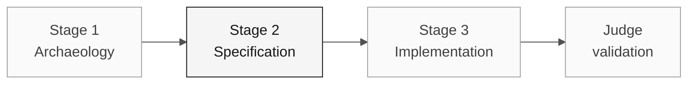

# Persona — Enterprise Architect

> **Trail:** [Team Kit](../../README.md) › [Personas](../OVERVIEW.md) › [Enterprise Architect](README.md) › **PERSONA**

**Complete profile for the Enterprise Architect persona.** Defines the mission, responsibilities by stage, tools, self-check, and evaluation rubrics.

| Field | Value |
|---|---|
| **Role** | Enterprise Architect |
| **Role scope** | Enterprise architecture responsibility (covered by the participant) |
| **Active stages** | Stages 1-3: context, integration constraints, and scope decisions |
| **Artifacts produced** | System context, integration assumptions, structural ADRs when needed |
| **Artifacts consumed** | Rule catalog (Vision responsibility), integration requirements (RE) |
| **Self-check focus** | C1/C2 architecture and integration assumptions |

 

---

## Concept

The Enterprise Architect views the system within its organizational and technical ecosystem. In the industry, this role ensures that new solutions fit the existing context — contracts with external systems, corporate security standards, and governance requirements.

In SIFAP, investigate external parties and contracts from the supplied sources.
A name in a historical document does not establish a live integration, current
ownership, or permission to call it. Record missing contracts as explicit gaps.

**Team exercise:** trace an actual external boundary, its input/output contract,
and the evidence for its execution model. Review coexistence options only when
the selected requirement needs them; do not invent an endpoint or source member.

---

## Where you work in the SDLC

- **Receives from:** Vision responsibility (Vision) in Stage 1 — rule catalog and scope
- **Hands off to:** Implementation responsibility (Implementation) and Quality responsibility (Quality) in Stage 2; Submission support responsibility (Operations) for Terraform

---

## Responsibilities by stage

| **Stage** | What you do | Deliverable that depends on you |
|---|---|---|
| **1 · Archaeology** | Identify dependencies and external contracts that affect the slice. | Relevant integration evidence |
| **2 · Specification** | Record only topology decisions that block the plan. | Topology ADR or scope decision when needed |
| **3 · Implementation** | Validate that the implementation respects the designed contracts. Support DevOps with high-level Terraform. | Validation of the deployed layout |
| **Final judge validation** | Assess whether final validation issues have architectural implications that require prior review. | Impact assessment |

---

## Persona kit

| **Artifact** | Purpose |
|---|---|
| `.github/skills/persona-enterprise-architect/SKILL.md` | Role skill that loads automatically for architecture and security |
| `/create-constitution` — `persona-enterprise-architect-create-constitution.prompt.md` | Creates or updates `.specify/memory/constitution.md` |
| `/create-adr` — `persona-enterprise-architect-create-adr.prompt.md` | Creates an ADR from a team decision |
| `/architecture-review` — `persona-enterprise-architect-architecture-review.prompt.md` | Reviews a proposed design against contracts and risks |
| `.github/instructions/security.instructions.md` | Security conventions |
| `.github/instructions/infrastructure.instructions.md` | IaC conventions |

---

## Tools and primitives

- **Mermaid** and **C4** for context and container diagrams.
- **Copilot Chat** to pressure-test topology decisions.
- **GitHub Spec-Kit** with `/speckit.plan` — turns the specification into a technical plan, decisions, and reviewable contracts.
- Kit skills — structured prompts for dependency analysis.

**Relevant cheat sheets:**

- [`../../09-cheat-sheets/spec-kit-workflow.md`](../../09-cheat-sheets/spec-kit-workflow.md) — `/speckit.plan` and `/speckit.analyze`.
- [`../../09-cheat-sheets/model-routing.md`](../../09-cheat-sheets/model-routing.md) — use Claude Opus 4.6 for architectural impact analysis.

---

## Onboarding checklist

- [ ] **Read this profile.** Mission, responsibilities, and self-check.
- [ ] **Open the kit `README.md`.** Confirm that agents and prompts appear in Copilot Chat.
- [ ] **Identify your current role focus.** See [00-TEAM-FLOW.md](../../00-TEAM-FLOW.md).
- [ ] **Map external integrations.** List SIAFI, BB, INCRA, and other systems present in the assigned `.NSN` programs.
- [ ] **Note the self-check.** Know who receives the dependency map and for which artifact.

---

## How to succeed in this role

- The C4 level 1 diagram is readable by any nontechnical participant in 30 seconds.
- Your ADRs name the "path not taken" and explain why.
- You anchor the Strangler Fig strategy — coexistence of legacy SIFAP with SIFAP 2.0 — in technical reasoning, not fashion.
- You align with the Software Architect on where your scope ends and theirs begins.

---

## Common mistakes and how to avoid them

| **Symptom** | Cause | Correction |
|---|---|---|
| Diagram is incomprehensible to nontechnical people | C4 L3/L4 used where L1/L2 was enough | Use L1 first; go deeper only for a specific technical question |
| Real integrations are ignored | Excessive focus on internal structure | List SIAFI, BB, and others during Archaeology |
| Work duplicated with the Software Architect | Responsibility boundary not defined | Agree at the start: EA handles external concerns; SA handles internal concerns |
| Generic ADR with no value | "We will use Spring Boot" is not an EA decision | An EA ADR answers "how do we connect to X?" not "which framework do we use?" |

---

## 3 prompt examples

1. **(Chat)** "Create a C4 Level 1 diagram with the actors and external systems confirmed by the participant."
2. **(Chat)** "For this external dependency, which availability risks must we assess? Propose alternatives and their trade-offs."
3. **(Chat)** "Compare the integration options raised by the participant and structure an ADR without anticipating the decision."

---

## If you get stuck

| **Situation** | What to do |
|---|---|
| Unfamiliar with C4 | Use a simple Mermaid flowchart: boxes = systems, arrows = integrations. Label the arrows |
| Spent too much time on C4 Level 3 | Stop. Level 1 + Level 2 are sufficient for this workshop |
| Unfamiliar with Mermaid | Ask Copilot: "Create a C4 level 1 diagram in Mermaid from these confirmed actors and integrations" |
| Disagreement with the Software Architect | Write an ADR with both options and ask the participant to vote |

---

## Dependencies

| **Persona** | Relationship | Artifact |
|---|---|---|
| Software Architect | Depends on you | Dependencies and decisions that affect the slice |
| DevOps Engineer | Depends on you | Topology for Terraform |
| Developer | Depends on you (indirectly) | Integration contracts |
| Requirements Engineer | You depend on them | Integration requirements |

---

## How you are evaluated

- **Rubric A1 (Archaeology):** dependency map readable by nontechnical people.
- **Rubric A2 (Specification Coherence):** ADRs name the "path not taken."
- Criterion: "Scope decisions and relevant dependencies are traceable."

---

### Continue reading

| Previous | Next |
|---|---|
| [Requirements Engineer](../02-requirements-engineer/PERSONA.md) Vision responsibility · writes EARS with source_legacy. | [Software Architect](../04-software-architect/PERSONA.md) Architecture responsibility · bounded contexts and modules. |

[Back to the kit index](../../README.md)
