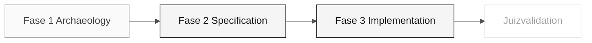

# Persona — Software Architect

> <x5/> <x6/> › <x7/> › <x8/> › <x9/>

<x1/> Define a missão, responsabilidades por fase, ferramentas, auto-controle e rubricas de avaliação.

| Campo | Valor |
|---|---|
|<x1/>|Software Architect|
|<x1/>|Responsabilidade de arquitetura de software (coberto pelo participante)|
|<x1/>|Etapas 2-3: limites do módulo, RAMs e revisão do projeto de implementação|
|<x1/>|Desenho do módulo, RAMs quando necessário, implementação plan, notas de revisão de arquitetura|
|<x1/>|Evidências de dependência (EA), REQ-IDs (RE)|
|<x1/>|Concepção C2 e consistência de implementação C3|

<x2/> <x3/>

---

## Conceito

O Software Architect define a estrutura interna do sistema: como os módulos são organizados, onde os contextos delimitados (uma técnica de Design Dirigido por Domínio para separar responsabilidades) começam e terminam, e quais contratos são expostos entre partes do sistema.

Na indústria, esse papel é responsável por manter o sistema verdadeiramente modular — o que significa que as mudanças em um módulo não quebram inesperadamente outros. Em um Monolito Modular (um único processo implantado com código organizado em módulos independentes), o SA garante que a modularidade do código seja mantida mesmo sob pressão de prazo.

Os SA e DBA determinam os menores limites necessários do módulo revisto
comportamento, vocabulário, propriedade e acesso aos dados. Esta decisão orienta a Fase 3.

<x1/> comparar hipóteses de fronteira do participante com fonte real
dependências e propriedade de dados. Registar a alternativa aceite e o seu
Trade-offs em <x1/>; o kit não fornece nenhum mapa de contexto predeterminado SIFAP.

---

## Onde você atua no SDLC

- <x1/> Enterprise Architect (evidência de dependência) e Requirements Engineer (REQ-IDs)
- <x2/> Responsabilidade de execução (Implementação) na Fase 2 — clara <x3/> e primeira tarefa

---

## Responsabilidades por estágio

|<x1/>| O que você faz | Entrega que depende de você |
|---|---|---|
|<x1/>|Identificar conceitos e dependências recorrentes relevantes para a fatia.|Evidências para discutir limites de contexto|
|<x1/>|Escreva o recurso técnico plan e registre uma decisão somente quando bloquear a tarefa.|<x1/> e suporte de RAM, se necessário|
|<x1/>|Estabelecer a estrutura inicial do projeto Primavera (pacotes, camadas). Reveja RPs que cruzam os limites do contexto.|<x1/> + layout do módulo + revisão das RP estruturais|
|<x1/>|Validar que a RP do Copilot respeita os limites. Rejeitar mescla que quebra modularidade.|Modularidade preservada|

---

## Kit da persona

|<x1/>| Finalidade |
|---|---|
|<x1/>|Capacidade de função que carrega automaticamente para arquitetura de software|
|<x2/> — <x3/>|Gera ou atualiza o <x1/> do projeto|
|<x2/> — <x3/>|Cria a implementação técnica plan|
|<x2/> — <x3/>|Valida os contratos API contra a especificação|
|<x1/>|Java Convenções de infraestrutura|
|<x1/>|Next.js Convenções de frontend|

---

## Ferramentas e primitivas

- <x1/> para projetar esqueletos de módulos antes da implementação.
- <x3/> — x4/> e <x5/> para planos, contratos e consistência.
- <x1/> para diagramas de contexto e componentes.
- Habilidades de kit — alertas para escolher entre padrões (pacotes hexagonais vs. em camadas).

<x1/>

- <x4/> — <x5/>, <x6/> e <x7/>.
- <x1/> — Claude Opus 4.6 para decisões; Sonnet 4.6 para edição em lote.

---

## Checklist de integração

- [ ] Missão, responsabilidades e auto-controle.
- [ ] <x1/> Confirme que agentes e prompts aparecem no chat do Copilot.
- [ ] <x2/> Ver <x3/>.
- [ ] <x1/> Defina onde o escopo de cada pessoa começa e termina.
- [ ] <x2/> Saiba quem recebe <x3/> e o que deve conter.

---

## Como ter sucesso neste papel

- O layout do pacote reflete contextos limitados, não camadas técnicas.
- As RAMs são curtas, específicas e citam a característica correspondente em <x1/> quando relevante.
- O Monolito Modular permanece um monolito em deploy, mas modular em código.
- Você redesenha limites quando há provas, em vez de "pedir perdão mais tarde".

---

## Erros comuns e como evitá-los

|<x1/>| Causa | Correção |
|---|---|---|
|Código organizado por camadas (controller/service/repository)|SA não definiu explicitamente contextos delimitados|Criar pacotes pelo contexto de negócios, não pelo tipo técnico|
|ADR genérico sem valor|"Vamos usar Spring Boot" não é uma decisão arquitetônica|Uma ADR SA responde "como organizamos X?" ou "que padrão usamos aqui?"|
|Dois contextos importam as aulas um do outro|O limite de contexto não foi respeitado|Expor apenas interfaces públicas; nunca usar importações diretas entre contextos|
|Arquitetura hexagonal rígida onde não adiciona nenhum valor|Padrão aplicado pelo hábito|Escolha o padrão que melhor serve ao contexto; grave a escolha|

---

## 3 exemplos de prompts

1. <x1/> "Com base nestes requisitos EARS, propor hipóteses de contexto-fronteiras. Para cada hipótese, listar evidências, entidades e dependências."
2. <x1/> "No projeto Spring Boot, plan a estrutura do pacote para um novo contexto limitado de 'notificação' seguindo o padrão existente (domain/application/infrastructure)."
3. <x1/> "Reveja esta RP e identifique as importações que cruzam limites de contexto limitado. Por cada violação, sugira como isolá-la."

---

## Se você ficar travado

|<x1/>| O que fazer |
|---|---|
|Contextos delimitados não são claros|Começar com evidência de coesão, acoplamento e frequência de mudança; não assumir limites|
|A decisão de limite está bloqueada|Retornar à evidência do legado e registrar a pergunta; não crie um diagrama como substituto para confirmação|
|Equipe organizada por camadas em vez de contextos|Não refatorar agora — documentá-lo no ADR e corrigi-lo se o tempo permanecer|
|Não sabe se algo é domínio ou aplicativo|"Se é uma regra de negócio pura, é domínio. Se orquestra, é aplicativo."|

---

## Dependências

|<x1/>| Relação | Artefato |
|---|---|---|
|Enterprise Architect|Você depende deles.|Provas de dependência para a técnica plan|
|Developer|Depende de ti.|Estrutura do pacote a implementar|
|Technical Lead|Depende de ti.|Modelos de módulos para aplicativo|
|DBA|Depende de ti.|Limites de contexto para o modelo de dados|

---

## Como você é avaliado

- <x1/> técnico plan coerente com requisitos e provas.
- <x1/> contextos limitados respeitados em código.
- Critério: "Nenhuma importação cruza um limite de contexto sem justificação."

---

### Continue lendo

| Anterior | Próximo |
|---|---|
|<x1/><x2/> <x3/>Architecture responsabilidade · C4 + RAMs estruturais. <x4/>|<x1/><x2/> <x3/>Implementation responsabilidade · normas e revisão.<x4/>|

<x1/><x2/><x3/>
