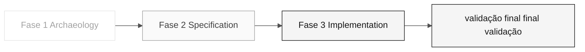

# Persona — Technical Lead

> <x5/> <x6/> › <x7/> › <x8/> › <x9/>

<x1/> Define a missão, responsabilidades por fase, ferramentas, auto-controle e rubricas de avaliação.

| Campo | Valor |
|---|---|
|<x1/>|Technical Lead|
|<x1/>|Responsabilidade técnica de liderança (coberto pelo participante)|
|<x1/>|Etapas 2-3: sequenciamento, padrões, auto-revisão e prontidão para submissão|
|<x1/>|Sequência de tarefas, notas de revisão de normas, controles de prontidão de apresentação C3|
|<x1/>|REQ-IDs, RAMs, C4 (responsabilidade da arquitectura)|
|<x1/>|Preparação da tarefa C2 e porta de submissão C3|

<x2/> <x3/>

---

## Conceito

O Technical Lead conecta a arquitetura definida no papel ao código escrito todos os dias. Na indústria, esse papel define padrões de implementação (convenções de codificação, estilo de teste, estrutura do módulo), desbloqueia o participante quando alguém fica preso em um detalhe técnico, e é responsável pela qualidade técnica das entregas.

Em SIFAP (Sistema de Inspeção de Pagamento e Administração), o TL garante que a aplicativo criada pelo participante realmente termina no final da Etapa 3 — não meramente compila. Isso inclui decisões como qual camada recebe a anotação <x1/>, como os erros são tratados e como os testes de integração são estruturados.

<x1/> quando o Developer implementa o endpoint de busca de benefícios, o TL revisa o PR para verificar se a lógica de negócios está na camada correta, o teste cobre caminhos de sucesso e erro, e nenhuma importação cruza um limite de contexto limitado.

---

## Onde você atua no SDLC

- <x1/> Responsabilidade de arquitectura (Arquitectura) na Fase 2 — REQ-IDs + ADRs + C4
- <x1/> Responsabilidade de apoio à apresentação (Operações) na Fase 3 — código em execução

---

## Responsabilidades por estágio

|<x1/>| O que você faz | Entrega que depende de você |
|---|---|---|
|<x1/>|Participar da análise priorizando programas críticos. Complexidade estimada.|Priorização baseada no esforço|
|<x1/>|Valide que a especificação se encaixa dentro dos 70 minutos da Etapa 3. Bandeira "isto não se encaixa."|Calibração de âmbito|
|<x1/>|Desbloquear. Decida padrões (estilo de teste, transações, manipulação de erros). Revise todas as relações públicas.|Aplicação em execução de fim a fim|
|<x1/>|Reveja a linha de RP do Copilot antes de fundir.|Qualidade de produção PR|

---

## Kit da persona

|<x1/>| Finalidade |
|---|---|
|<x1/>|Capacidade de função que carrega automaticamente para governança técnica|
|<x2/> — <x3/>|Inicializa a estrutura do projeto|
|<x2/> — <x3/>|Gera uma tabela de roteamento por tarefa|
|<x2/> — <x3/>|Auditorias do contexto enviado ao Copiloto|

---

## Ferramentas e primitivas

- <x1/> para refatoração em lote com uma sequência clara.
- <x1/> para decisões de design local e auto-revisão.
- <x4/> — suporte em <x5/>, <x6/>, e a auto- verificação para <x7/>.
- <x1/> para revisão de RP.

<x1/>

- <x1/> — você alterna entre os três modos constantemente.
- <x3/> — <x4/> e <x5/>.
- <x1/> — roteamento do modelo por tipo de tarefa.

---

## Checklist de integração

- [ ] Missão, responsabilidades e auto-controle.
- [ ] <x1/> Confirme que agentes e prompts aparecem no chat do Copilot.
- [ ] <x2/> Ver <x3/>.
- [ ] <x1/> Antes do início da Fase 3, escolha convenções de transação e teste.
- [ ] Saiba o que DevOps deve receber no final da Fase 3.

---

## Como ter sucesso neste papel

- Responda a uma pergunta técnica em menos de 5 minutos. Não deixem ninguém ocioso.
- Escreva resenhas que movem o PR para a frente, não resenhas que o bloqueiam.
- Escolha dois padrões-chave no início da Fase 3 e mantenha-os não negociáveis (por exemplo, <x1/> apenas na camada de serviço).
- Manter sempre verde <x1/>.

---

## Erros comuns e como evitá-los

|<x1/>| Causa | Correção |
|---|---|---|
|Developer bloqueado por mais de 20 minutos|TL escrever código em vez de desbloquear|Pare o que está fazendo e responda à pergunta|
|PR bloqueada por detalhes estéticos|Revisão focada no estilo, não na correção|Reveja os critérios: comportamento correto, teste presente, sem violação de limite|
|Alterações padrão a meio do estágio 3|A decisão não foi registada no início|Defina padrões antes de iniciar e documentá-los em <x1/>|
|O aplicativo não é executado no final|O gargalo não foi identificado no tempo|Execute um teste completo de integração a cada 30 minutos|

---

## 3 exemplos de prompts

1. <x1/> "Reveja esta RP: verifique se segue as 3 camadas (domain/application/infrastructure), o teste cobre o sucesso + caminhos de erro, e nenhuma importação cruza um contexto limitado."
2. <x1/> "Temos 70 minutos. Ajude a comparar esses recursos por evidências, dependências e esforço para escolher um recurso fino; não preencha os requisitos em falta."
3. <x1/> "O ambiente local falha com este erro: [colar]. Diagnose a causa raiz e propor uma correção."

---

## Se você ficar travado

|<x1/>| O que fazer |
|---|---|
|O ambiente local não começa|Verificação: a porta 5432 está ocupada? As versões Java/Node estão corretas? Os contentores antigos estão a interferir? Que erro aparece nos registros de infraestrutura?|
|O trabalho não se encaixa na caixa de tempo|Âmbito de revisão e dependências entre os cinco participantes reais. DBA e Developer possuem suas tarefas; outro participante revisa evidências. Não inventar desenvolvedores extras ou prometer uma mesclagem cronometrada|
|PR tem conflitos|<x1/> e resolvê-los. Não permitir que o ramo diverja sem alinhar com o seu atual foco de funções|
|Não sabe como escolher um padrão|Utilizar as especificações, RAMs e instruções de kit como fontes; documentar a decisão no PR|

---

## Dependências

|<x1/>| Relação | Artefato |
|---|---|---|
|Software Architect|Você depende deles.|Estrutura de pacotes definida|
|Product Owner|Você depende deles.|Âmbito calibrado|
|Developer|Depende de ti.|Normas e revisões|
|QA Engineer|Depende de ti.|Oleoduto verde para ensaios de execução|
|DevOps Engineer|Depende de ti.|Construção estável para o gasoduto|

---

## Como você é avaliado

- <x1/> a aplicativo criada pelo participante é executada localmente e em IC.
- <x1/> ninguém fica bloqueado durante mais de 20 minutos.
- Critério: "<x1/> verde em todos os momentos, RP revisadas em menos de 15 minutos."

---

### Continue lendo

| Anterior | Próximo |
|---|---|
|<x1/><x2/> <x3/>Architecture responsabilidade · contextos e módulos limitados.<x4/>|<x1/><x2/> <x3/>Implementation responsabilidade · Java + Next.js + testes. <x4/>|

<x1/><x2/><x3/>
