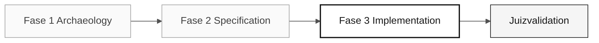

# Persona — Developer

> <x5/> <x6/> › <x7/> › <x8/> › <x9/>

<x1/>

| Campo | Valor |
|---|---|
|<x1/>|Developer|
|<x1/>|Responsabilidade pelo desenvolvimento (coberto pelo participante)|
|<x1/>|Etapa 3: Java/TypeScript implementação, testes e integração|
|<x1/>|Backend/frontend código, testes, evidência de integração, alterações de RP de submissão|
|<x1/>|EARS requisitos (Requirements Engineer), estrutura de pacotes e contextos limitados (Software Architect), Flyway migrações (DBA)|
|<x1/>|C3 implementação testada e prontidão para RP|

---

## O que esta persona é

O Developer escreve o código. Na modernização SIFAP (Sistema de Inspeção e Administração de Pagamentos), esta persona traduz programas Natural e estruturas DDM/Adabas em Java 21 com Spring Boot 3.3, implementa a frontend em Next.js 15 com rígido TypeScript, e garante que cada requisito EARS se torne um desfecho funcional com testes de passagem.

No âmbito da Modernização do Legado Copiloto, o Developer funciona na camada de tradução (Tradução Agent — Fase 3) e segue a Revisão Agent na validação final, intervindo quando o Copiloto se desvia dos padrões de arquitetura definidos pelo participante.

## Onde você atua no SDLC

| Estágio |Responsabilidade|Delivrável|
|---|---|---|
|<x1/>|Leia Natural programas com Copilot Chat e produzir um resumo legível em equipe|Resumos do programa narrativo|
|<x1/>|Aplicar a responsabilidade Developer para antecipar problemas de implementação|Notas preventivas na especificação|
|<x1/>|Implementar, testar, abrir o PR de submissão, auto-revisão, iterar|Infraestrutura + interface para a fatia priorizada|
|<x1/>|Corrigir defeitos declarados pelo juiz se rejeitados e manter o PR mergeable|PR de submissão em um estado de mesclagem|

## Responsabilidade principal

Transforme a especificação em código executável usando o modo Copilot deliberadamente—Ask para entender, o modo Plan para plan mudanças de arquivos múltiplos, e o modo Agent apenas para tarefas de implementação local bem definidas. Mantenha as alterações avaliáveis.

## Competências essenciais

- Java 21 implementação: registros, interfaces seladas, threads virtuais, Opcional, Validação de Feijão
- TypeScript implementação: Next.js 15 App Router, Server Actions, <x1/>
- TDD com JUnit 5, Testcontainers e Vitest
- Refatoração incremental com commits separados por intenção
- Mudança deliberada entre os três modos do Copilot

## Kit da persona

| Artefato | Caminho |Utilização|
|---|---|---|
|Implementação agent|<x1/>|Implementação, TDD e correção de erros|
|Prompt <x1/>|<x1/>|Iniciar a implementação de uma especificação|
|Prompt <x1/>|<x1/>|Entenda → reproduzir → corrigir → verificar ciclo|
|Prompt <x1/>|<x1/>|Escreva um teste antes da implementação|
|Prompt <x1/>|<x1/>|Refator sem alterar o comportamento|

## Ferramentas e modos co-piloto

|Ferramenta / Modo|Quando utilizar|
|---|---|
|<x1/>|Compreender Natural código legado e discutir design antes da implementação|
|<x1/>|Modo primário no estágio 3—plan alterações que afetam vários arquivos|
|<x1/>|Etapa 3 — executar tarefas de implementação bem definidas a partir da especificação|
|<x3/> (<x4/>, <x5/>)|Consome artefatos Software Architect e Requirements Engineer|
|<x1/>|Trabalhar com questões e relações públicas sem deixar o Código VS|

## Folhas de fraude recomendadas

- <x1/> — mapa do dia; use-o constantemente
- <x4/> — <x5/>, <x6/> e <x7/>
- <x1/> — Haiku 4.5 para trechos simples, Sonnet 4.6 por padrão, Opus 4.6 para design

## Como executar bem

- [ ] <x1/> Chat nem sempre é o modo certo.
- [ ] <x1/> Um tópico por RP.
- [ ] <x1/> Nunca depois.
- [ ] <x1/> Prefere clareza sobre elegância.

## Erros comuns e como evitá-los

| Sintoma | Causa | Correção |
|---|---|---|
|Grande ramo acumulando por horas|PR sem foco|Abrir uma PR por recurso ou camada|
|Co- piloto usado para uma tarefa simples|Modo errado selecionado|Reserva Agent para tarefas com escopo claro e artefatos de entrada completos|
|Código não testado descoberto às 16h.|TDD adiado|Escreva o teste antes de passar para o próximo comportamento|
|Longa espera por Opus 4.6|Modelo sobredimensionado|Usar o Sonnet 4.6 por padrão; Opus apenas para decisões de design|

## Combinações com outras pessoas

|Combinação|Nota|
|---|---|
|<x1/>|Duas responsabilidades de um participante; utilizar auto-revisão antes da validação do juiz|
|<x1/>|Escrever a aplicativo e os controles independentes sem os tratar como os mesmos elementos de prova|
|<x1/>|Manter a implementação alinhada com as necessidades reais build/run|

## Avisos prontos para usar

1. <x1/>  "Explique o código legado selecionado e identifique apenas comportamentos confirmados. Então proponha perguntas antes de implementá-las em Java."
2. <x1/>  "Selecione os arquivos para o recurso priorizado. Plan a mudança entre domínio, aplicativo, infraestrutura, dados e testes."
3. <x1/>  "Implementar o recurso descrito nesta edição: [colar o problema]. Siga a arquitetura de três camadas e inclua testes."

## Predefinição de emergência

| Situação | O que fazer |
|---|---|
|O código não compila|Executar <x1/> para ver o erro exato — geralmente é uma importação em falta|
|A estrutura do pacote é desconhecida|Consulte a estrutura definida pelo participante: <x3/> → <x4/> → <x5/>|
|Copiloto gera código inadequado|Mude de Ask para Plan—selecione os arquivos relevantes e descreva a alteração|
|O teste falha sem nenhuma razão óbvia|Leia o erro: um NPE geralmente significa uma simulação em falta; uma asserção errada significa um valor esperado incorreto|

## Dependências

| Persona | Relação | Artefato |
|---|---|---|
|Software Architect|Você depende deles.|Estrutura do pacote e contextos delimitados|
|Requirements Engineer|Você depende deles.|EARS requisitos a aplicar|
|Technical Lead|Depende de ti.|PRs a rever|
|QA Engineer|Depende de ti.|Código de ensaio|
|DBA|Você depende deles.|Migrações e modelo de dados|

## Como você é avaliado

- Endpoints funcionais <x1/>, testes de aprovação
- <x1/> mudança deliberada entre Ask, Plan e Agent
- <x1/> pequenos commits, RPs reviewáveis, testes escritos ao lado do código

---

### Continue lendo

| Anterior | Próximo |
|---|---|
|<x1/><x2/> <x3/>Implementation responsabilidade — Implementação — normas e revisão de código.<x4/>|<x1/><x2/> <x3/>Quality responsabilidade — Qualidade — Flyway migrações e otimização de consultas.<x4/>|

<x1/><x2/><x3/>
