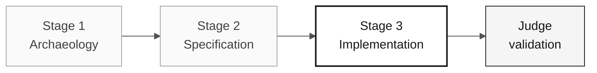

# Persona — Developer

> **Track:** [Team Kit](../../README.md) › [Personas](../OVERVIEW.md) › [Developer](README.md) › **PERSONA**

**Reference profile for the Developer persona in the SIFAP modernization workshop.**

| Field | Value |
|---|---|
| **Role** | Developer |
| **Role scope** | Development responsibility (covered by the participant) |
| **Active stages** | Stage 3: Java/TypeScript implementation, tests, and integration |
| **Artifacts produced** | Backend/frontend code, tests, integration evidence, submission PR changes |
| **Artifacts consumed** | EARS requirements (Requirements Engineer), package structure and bounded contexts (Software Architect), Flyway migrations (DBA) |
| **Self-check focus** | C3 tested implementation and PR readiness |

---

## What this persona is

The Developer writes the code. In the SIFAP (Payment Inspection and Administration System) modernization, this persona translates Natural programs and DDM/Adabas structures into Java 21 with Spring Boot 3.3, implements the frontend in Next.js 15 with strict TypeScript, and ensures that every EARS requirement becomes a functional endpoint with passing tests.

Within Copilotic Legacy Modernization framework, the Developer works in the translation layer (Translation Agent — Stage 3) and follows the Review Agent in final validation, intervening when the Copilot deviates from the architecture standards defined by the participant.

## Where you work in the SDLC

| Stage | Responsibility | Deliverable |
|---|---|---|
| **1 — Archaeology** | Read Natural programs with Copilot Chat and produce a team-readable summary | Narrative program summaries |
| **2 — Specification** | Apply the Developer responsibility to anticipate implementation problems | Preventive notes in the spec |
| **3 — Implementation** | Implement, test, open the submission PR, self-review, iterate | Backend + frontend for the prioritized slice |
| **Final judge validation** | Fix judge-reported defects if rejected and keep the PR mergeable | Submission PR in a mergeable state |

## Core responsibility

Transform the spec into executable code using Copilot deliberately—Ask mode to understand, Plan mode to plan multi-file changes, and Agent mode only for well-defined local implementation tasks. Keep changes reviewable.

## Key skills

- Java 21 implementation: records, sealed interfaces, virtual threads, Optional, Bean Validation
- TypeScript implementation: Next.js 15 App Router, Server Actions, `strict: true`
- TDD with JUnit 5, Testcontainers, and Vitest
- Incremental refactoring with commits separated by intent
- Deliberate switching among Copilot's three modes

## Persona kit

| Artifact | Path | Use |
|---|---|---|
| Implementation agent | `.github/skills/persona-developer/SKILL.md` | Implementation, TDD, and bug fixing |
| Prompt `/implement` | `.github/prompts/persona-developer-implement.prompt.md` | Start implementation from a spec |
| Prompt `/fix-bug` | `.github/prompts/persona-developer-fix-bug.prompt.md` | Understand → reproduce → fix → verify cycle |
| Prompt `/tdd` | `.github/prompts/persona-developer-tdd.prompt.md` | Write a test before implementation |
| Prompt `/refactor` | `.github/prompts/persona-developer-refactor.prompt.md` | Refactor without changing behavior |

## Copilot tools and modes

| Tool / Mode | When to use |
|---|---|
| **Copilot Ask** | Understand Natural legacy code and discuss design before implementation |
| **Copilot Plan** | Primary mode in Stage 3—plan changes affecting multiple files |
| **Copilot Agent mode** | Stage 3—execute well-defined implementation tasks from the spec |
| **Spec-Kit** (`/speckit.tasks`, `/speckit.implement`) | Consume Software Architect and Requirements Engineer artifacts |
| **GitHub MCP** | Work with Issues and PRs without leaving VS Code |

## Recommended cheat sheets

- [`09-cheat-sheets/copilot-3-modes.md`](../../09-cheat-sheets/copilot-3-modes.md) — map for the day; use it constantly
- [`09-cheat-sheets/spec-kit-workflow.md`](../../09-cheat-sheets/spec-kit-workflow.md) — `/speckit.tasks`, `/speckit.implement`, and `/speckit.analyze`
- [`09-cheat-sheets/model-routing.md`](../../09-cheat-sheets/model-routing.md) — Haiku 4.5 for simple snippets, Sonnet 4.6 by default, Opus 4.6 for design

## How to perform well

- [ ] **Use all three Copilot modes deliberately.** Chat is not always the right mode.
- [ ] **Keep commits small and PRs reviewable.** One topic per PR.
- [ ] **Write tests at the same time as the code.** Never afterward.
- [ ] **Do not invest in premature abstractions during Stage 3.** Prefer clarity over elegance.

## Common mistakes and how to avoid them

| Symptom | Cause | Correction |
|---|---|---|
| Huge branch accumulating for hours | Unfocused PR | Open one PR per feature or layer |
| Copilot used for a simple task | Wrong mode selected | Reserve Agent for tasks with clear scope and complete input artifacts |
| Untested code discovered at 4 p.m. | TDD postponed | Write the test before moving to the next behavior |
| Long wait for Opus 4.6 | Oversized model | Use Sonnet 4.6 by default; Opus only for design decisions |

## Combinations with other personas

| Combination | Note |
|---|---|
| **Developer + Technical Lead** | Two responsibilities held by one participant; use self-review before judge validation |
| **Developer + QA** | Write implementation and independent checks without treating them as the same evidence |
| **Developer + DevOps** | Keep implementation aligned with actual build/run needs |

## Ready-to-use prompts

1. **(Ask)** _"Explain the selected legacy code and identify only confirmed behaviors. Then propose questions before implementing them in Java."_
2. **(Plan)** _"Select the files for the prioritized feature. Plan the change across domain, application, infrastructure, data, and tests."_
3. **(Agent)** _"Implement the feature described in this Issue: [paste the issue]. Follow the three-layer architecture and include tests."_

## Emergency defaults

| Situation | What to do |
|---|---|
| Code does not compile | Run `mvn test-compile` to see the exact error—it is usually a missing import |
| Package structure is unknown | Consult the structure defined by the participant: `domain/` → `application/` → `infrastructure/` |
| Copilot generates unsuitable code | Switch from Ask to Plan—select the relevant files and describe the change |
| Test fails for no obvious reason | Read the error: an NPE usually means a missing mock; a wrong assertion means an incorrect expected value |

## Dependencies

| Persona | Relationship | Artifact |
|---|---|---|
| Software Architect | You depend on them | Package structure and bounded contexts |
| Requirements Engineer | You depend on them | EARS requirements to implement |
| Technical Lead | Depends on you | PRs to review |
| QA Engineer | Depends on you | Testable code |
| DBA | You depend on them | Migrations and data model |

## How you are evaluated

- **Rubric A3 — Technical Integrity:** functional endpoints, passing tests
- **Rubric A4 — Deliberate Copilot Use:** deliberate switching among Ask, Plan, and Agent
- **Criterion:** small commits, reviewable PRs, tests written alongside the code

---

### Continue reading

| Previous | Next |
|---|---|
| [Technical Lead — PERSONA](../05-technical-lead/PERSONA.md) Implementation responsibility — Implementation — standards and code review. | [DBA — PERSONA](../07-dba/PERSONA.md) Quality responsibility — Quality — Flyway migrations and query optimization. |

[Back to the kit index](../../README.md)
