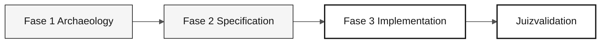

# Persona — QA Engineer

> <x5/> <x6/> › <x7/> › <x8/> › <x9/>

<x1/>

| Campo | Valor |
|---|---|
|<x1/>|QA Engineer (Engenheiro de Garantia de Qualidade)|
|<x1/>|Responsabilidade pela qualidade (coberto pelo participante)|
|<x1/>|Etapas 1-3 mais validação final do juiz: projeto de teste, reconciliação e verificação de evidências|
|<x1/>|Casos de teste, verificações de reconciliação, notas de cobertura, provas de defeito|
|<x1/>|Revisão REQ-IDs, código testável, fonte snapshot/mapping/load evidência de DBA e expectativas estabelecidas de forma independente|
|<x1/>|Provas de verificação C2 plan e C3|

---

## O que esta persona é

O QA Engineer transforma os requisitos EARS em testes executáveis que provam equivalência funcional entre o comportamento legado Natural/Adabas e o código moderno Java 21. Na modernização SIFAP (Sistema de Inspeção e Administração de Pagamentos), esta persona define a estratégia de teste, escreve os testes que importam e não todos os testes possíveis, e mantém o gasoduto CI verde durante todo o Estágio 3.

Por que importa: na modernização do legado, a equivalência funcional entre sistemas antigos e novos só pode ser comprovada por testes rastreáveis às exigências. Sem o QA Engineer, o participante não pode saber se a tradução Natural-para-Java preservou o comportamento correto dos negócios.

Dentro do quadro de Modernização do Legado Copiloto, o QA Engineer trabalha com o Test Gen Agent e Segurança Agent na Fase 3 e valida a cobertura no feedback do juiz ou nas correções CI durante a validação final.

## Onde você atua no SDLC

| Estágio |Responsabilidade|Delivrável|
|---|---|---|
|<x1/>|Verificar reading/source-data evidência com DBA; identificar cenários críticos reais|Análise das lacunas iniciais e explícitas|
|<x1/>|Definir os testes REQ-ID, as regras de reconciliação e os controles completos de consulta dos beneficiários|Aceitação independente plan antes da implementação|
|<x1/>|Teste o comportamento e concilie dados, consultas e rejeita de forma independente|Conjunto de testes e evidência de migração|
|<x1/>|Verificar de novo as alterações, replay/resume, a recuperação do alvo e a cobertura de todos os beneficiários|Evidências para PO aceitação ou bloqueadores|

## Responsabilidade principal

Defina a estratégia de teste do projeto. Escreva os testes críticos — não para perseguir 100% de cobertura, mas para cobrir os caminhos que importam. Validar a rastreabilidade especíca ao ensaio. Proteger o participante de um pipeline falsamente verde CI cujos testes sempre passam independentemente do comportamento.

O <x1/> requer independência
Controlos de origem para o alvo. Não derivar todos os resultados esperados do mesmo
código de transformação sendo testado, aceitar contagens iguais como paridade de campo, ou usar
telas exclusivamente para certificar a cobertura de todos os beneficiários.

## Competências essenciais

- JUnit 5: <x3/>, <x4/>, <x5/>, AssertJ
- Testcontainers para integração real PostgreSQL 16
- Vitest + Testing Library para Next.js 15 componentes
- Rastreabilidade do ID do teste para o REQ através de comentários em linha
- Análise de cobertura orientada para o risco em vez de cobertura orientada para a percentagem

## Kit da persona

| Artefato | Caminho |Utilização|
|---|---|---|
|QA Engineer agent|<x1/>|Geração de teste, análise de cobertura e portões de qualidade|
|Prompt <x1/>|<x1/>|Gerar testes a partir de um requisito EARS|
|Prompt <x1/>|<x1/>|Identificar lacunas de cobertura|
|Prompt <x1/>|<x1/>|Definir a estratégia de teste do projeto|
|Instruções de ensaio|<x1/>|Convenções de testes obrigatórios|

## Ferramentas e modos co-piloto

|Ferramenta / Modo|Quando utilizar|
|---|---|
|<x1/>|Gerar cenários de teste a partir de requisitos EARS; discutir a falta de cobertura|
|<x1/>|Plan JUnit esqueletos em lotes para uma fatia inteira|
|<x1/>|Integrar com real PostgreSQL—preferir para Mockito para camadas de repositório|
|<x2/> (<x3/>)|Tarefas de teste de revisão derivadas de <x1/>|
|<x1/>|Monitor CI sem deixar o código VS|

## Folhas de fraude recomendadas

- <x3/> — <x4/> e tarefas de teste em <x5/>
- <x1/> — uso Plan para planejamento de cobertura e Ask para discutir lacunas

## Como executar bem

- [ ] <x1/> Usar REQ-IDs e evidências legadas, não uma porcentagem de cobertura.
- [ ] <x1/> Use testes direcionados e registre um orçamento de tempo de execução acordado em equipe; não reclame um limite de dois minutos não medido.
- [ ] <x1/> Testes que sempre passam não validam o comportamento.
- [ ] Adicionar <x2/> a todos os métodos de ensaio.

## Erros comuns e como evitá-los

| Sintoma | Causa | Correção |
|---|---|---|
|Perseguindo 100% de cobertura e perdendo o prazo|Tratando a métrica como objetivo|Priorizar caminhos de risco identificados pelo participante|
|Testes validam o framework em vez do domínio|Foco na infraestrutura em vez de comportamento|Ask se a asserção falha quando o comportamento comercial muda|
|Mock utilizado onde era necessário Testcontainers|Conveniência|Usar Testcontainers para repositórios e Mockito para serviços de domínio|
|Vermelho CI ignorado durante 20 minutos|Nenhum proprietário|O QA Engineer possui verde CI; não delegue esta responsabilidade|

## Combinações com outras pessoas

|Combinação|Nota|
|---|---|
|<x1/>|Mais comum e produtivo; escreva o recurso e testes na mesma sessão|
|<x1/>|Escreva o requisito e seu teste de correspondência|
|<x1/>|Evite quando possível – sobrecarrega o estágio 3|

## Avisos prontos para usar

1. <x1/>  "Para este requisito EARS, gerar cenários de teste cobrindo o comportamento principal, limites e falhas relevantes."
2. <x1/>  "Para a classe de características priorizadas, plan testes de integração com os dados e verificações necessários."
3. <x1/>  "Analisar a cobertura atual e identificar os caminhos não testados de maior risco. Priorize-os usando evidências da equipe."

## Predefinição de emergência

| Situação | O que fazer |
|---|---|
|JUnit 5 é desconhecido|Utilizar o padrão existente: <x2/>, <x3/> e AssertJ asserções|
|Testcontainers não funciona|Corrigir as verificações de integração do ambiente ou dos registros como bloqueadas; Mockito testes unitários não substituem PostgreSQL/data validação da migração|
|Demasiados cenários, muito pouco tempo|Foco no comportamento de maior risco identificado pelo participante|
|CI é vermelho enquanto os testes locais passam|Problema de ambiente—verifique Docker/Testcontainers e a versão Docker do corredor|

## Dependências

| Persona | Relação | Artefato |
|---|---|---|
|Requirements Engineer|Você depende deles.|Requisitos de ensaio com critérios de aceitação|
|Developer|Você depende deles.|Código de ensaio|
|Technical Lead|Depende de ti.|Oleoduto verde|
|DevOps Engineer|Depende de ti.|Confiável CI|

## Como você é avaliado

- <x1/> testes de passagem, verde CI
- <x1/> todos os requisitos têm critérios de verificação
- <x1/> testes falham no primeiro erro em vez de sempre passar

---

### Continue lendo

| Anterior | Próximo |
|---|---|
|<x1/><x2/> <x3/>Quality responsabilidade — Qualidade — Flyway migrações e otimização de consultas.<x4/>|<x1/><x2/><x3/>Submission responsabilidade de apoio — Operações — Terraform, GitHub Actions e runbook.<<x4/>|

<x1/><x2/><x3/>
