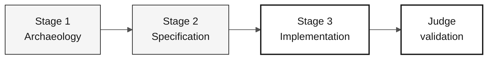

# Persona — QA Engineer

> **Track:** [Team Kit](../../README.md) › [Personas](../OVERVIEW.md) › [QA Engineer](README.md) › **PERSONA**

**Reference profile for the QA Engineer persona in the SIFAP modernization workshop.**

| Field | Value |
|---|---|
| **Role** | QA Engineer (Quality Assurance Engineer) |
| **Role scope** | Quality responsibility (covered by the participant) |
| **Active stages** | Stages 1-3 plus final judge validation: test design, reconciliation, and evidence checks |
| **Artifacts produced** | Test cases, reconciliation checks, coverage notes, defect evidence |
| **Artifacts consumed** | Reviewed REQ-IDs, testable code, source snapshot/mapping/load evidence from DBA, and independently established expectations |
| **Self-check focus** | C2 test plan and C3 verification evidence |

---

## What this persona is

The QA Engineer transforms EARS requirements into executable tests that prove functional equivalence between legacy Natural/Adabas behavior and modern Java 21 code. In the SIFAP (Payment Inspection and Administration System) modernization, this persona defines the test strategy, writes the tests that matter rather than every possible test, and keeps the CI pipeline green throughout Stage 3.

Why it matters: in legacy modernization, functional equivalence between old and new systems can only be proven by tests traceable to requirements. Without the QA Engineer, the participant cannot know whether the Natural-to-Java translation preserved correct business behavior.

Within Copilotic Legacy Modernization framework, the QA Engineer works with the Test Gen Agent and Security Agent in Stage 3 and validates coverage in judge feedback or CI fixes during final validation.

## Where you work in the SDLC

| Stage | Responsibility | Deliverable |
|---|---|---|
| **1 — Archaeology** | Verify reading/source-data evidence with DBA; identify actual critical scenarios | Reviewed baseline and explicit gaps |
| **2 — Specification** | Define REQ-ID tests, reconciliation rules, and complete beneficiary consultation checks | Independent acceptance plan before implementation |
| **3 — Implementation** | Test behavior and reconcile source-to-target data, queries, and rejects independently | Test suite and migration evidence |
| **Final judge validation** | Recheck changes, replay/resume, target recovery, and all-beneficiary coverage | Evidence for PO acceptance or blockers |

## Core responsibility

Define the project's test strategy. Write the critical tests—not to chase 100% coverage, but to cover the paths that matter. Validate spec-to-test traceability. Protect the participant from a falsely green CI pipeline whose tests always pass regardless of behavior.

The [data lifecycle](../../docs/DATA-MIGRATION.md) requires independent
source-to-target checks. Do not derive every expected result from the same
transformation code being tested, accept equal counts as field parity, or use
sample-only screens to certify all-beneficiary coverage.

## Key skills

- JUnit 5: `@Test`, `@DisplayName`, `@ParameterizedTest`, AssertJ
- Testcontainers for real PostgreSQL 16 integration
- Vitest + Testing Library for Next.js 15 components
- Test-to-REQ-ID traceability through inline comments
- Risk-driven coverage analysis rather than percentage-driven coverage

## Persona kit

| Artifact | Path | Use |
|---|---|---|
| QA Engineer agent | `.github/skills/persona-qa-engineer/SKILL.md` | Test generation, coverage analysis, and quality gates |
| Prompt `/create-tests` | `.github/prompts/persona-qa-engineer-create-tests.prompt.md` | Generate tests from an EARS requirement |
| Prompt `/coverage-gaps` | `.github/prompts/persona-qa-engineer-coverage-gaps.prompt.md` | Identify coverage gaps |
| Prompt `/test-strategy` | `.github/prompts/persona-qa-engineer-test-strategy.prompt.md` | Define the project's test strategy |
| Testing instructions | `.github/instructions/tests.instructions.md` | Mandatory testing conventions |

## Copilot tools and modes

| Tool / Mode | When to use |
|---|---|
| **Copilot Ask** | Generate test scenarios from EARS requirements; discuss missing coverage |
| **Copilot Plan** | Plan JUnit skeletons in batches for an entire slice |
| **Testcontainers** | Integrate with real PostgreSQL—prefer it to Mockito for repository layers |
| **Spec-Kit** (`/speckit.analyze`) | Review test tasks derived from `tasks.md` |
| **GitHub Actions MCP** | Monitor CI without leaving VS Code |

## Recommended cheat sheets

- [`09-cheat-sheets/spec-kit-workflow.md`](../../09-cheat-sheets/spec-kit-workflow.md) — `/speckit.analyze` and test tasks in `tasks.md`
- [`09-cheat-sheets/copilot-3-modes.md`](../../09-cheat-sheets/copilot-3-modes.md) — use Plan for coverage planning and Ask to discuss gaps

## How to perform well

- [ ] **Cover the paths that matter.** Use REQ-IDs and legacy evidence, not a coverage percentage.
- [ ] **Measure feedback time.** Use targeted tests and record a team-agreed runtime budget; do not claim an unmeasured two-minute limit.
- [ ] **Write tests that fail on the first bug.** Tests that always pass do not validate behavior.
- [ ] **Maintain traceability.** Add `// REQ-NNN` to every test method.

## Common mistakes and how to avoid them

| Symptom | Cause | Correction |
|---|---|---|
| Chasing 100% coverage and missing the deadline | Treating the metric as the goal | Prioritize risk paths identified by the participant |
| Tests validate the framework rather than the domain | Infrastructure focus instead of behavior | Ask whether the assertion fails when business behavior changes |
| Mock used where Testcontainers was needed | Convenience | Use Testcontainers for repositories and Mockito for domain services |
| Red CI ignored for 20 minutes | No owner | The QA Engineer owns green CI; do not delegate this responsibility |

## Combinations with other personas

| Combination | Note |
|---|---|
| **QA + Developer** | Most common and productive; write the feature and tests in the same session |
| **QA + Requirements Engineer** | Write the requirement and its matching test |
| **QA + DevOps Engineer** | Avoid when possible—it overloads Stage 3 |

## Ready-to-use prompts

1. **(Ask)** _"For this EARS requirement, generate test scenarios covering the main behavior, boundaries, and relevant failures."_
2. **(Plan)** _"For the prioritized feature class, plan integration tests with the required data and verifications."_
3. **(Ask)** _"Analyze current coverage and identify the highest-risk untested paths. Prioritize them using team evidence."_

## Emergency defaults

| Situation | What to do |
|---|---|
| JUnit 5 is unfamiliar | Use the existing pattern: `@Test`, `@DisplayName`, and AssertJ assertions |
| Testcontainers does not work | Fix the environment or record integration checks as blocked; Mockito unit tests do not replace PostgreSQL/data migration validation |
| Too many scenarios, too little time | Focus on the highest-risk behavior identified by the participant |
| CI is red while local tests pass | Environment issue—check Docker/Testcontainers and the runner's Docker version |

## Dependencies

| Persona | Relationship | Artifact |
|---|---|---|
| Requirements Engineer | You depend on them | Testable requirements with acceptance criteria |
| Developer | You depend on them | Testable code |
| Technical Lead | Depends on you | Green pipeline |
| DevOps Engineer | Depends on you | Reliable CI |

## How you are evaluated

- **Rubric A3 — Technical Integrity:** passing tests, green CI
- **Rubric A2 — Spec:** every requirement has verification criteria
- **Criterion:** tests fail on the first bug rather than always passing

---

### Continue reading

| Previous | Next |
|---|---|
| [DBA — PERSONA](../07-dba/PERSONA.md) Quality responsibility — Quality — Flyway migrations and query optimization. | [DevOps Engineer — PERSONA](../09-devops-engineer/PERSONA.md) Submission support responsibility — Operations — Terraform, GitHub Actions, and runbook. |

[Back to the kit index](../../README.md)
