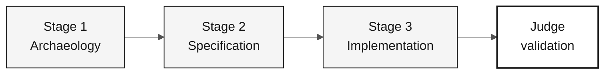

# Persona — DevOps Engineer

> **Track:** [Team Kit](../../README.md) › [Personas](../OVERVIEW.md) › [DevOps Engineer](README.md) › **PERSONA**

**Reference profile for the DevOps Engineer persona in the SIFAP modernization workshop.**

| Field | Value |
|---|---|
| **Role** | DevOps Engineer |
| **Role scope** | Submission CI responsibility (covered by the participant) |
| **Active stages** | Stages 1-3: local readiness, required CI checks, and submission evidence |
| **Artifacts produced** | Required CI workflow updates, local execution notes, CI evidence for the PR |
| **Artifacts consumed** | Stable build (Technical Lead / Developer), infrastructure topology (Enterprise Architect / Software Architect), stable schema (DBA) |
| **Self-check focus** | C3 required CI and local execution evidence |

---

## What this persona is

The DevOps Engineer owns reproducible execution and relevant CI checks for the
participant-created increment. Verify actual commands and timings; do not promise
sub-minute startup, an image registry, or deployed Azure resources.

Why it matters: a fragile pipeline or ambiguous local environment creates friction for every responsibility you must complete. The Developer loses time to environment errors, the QA Engineer lacks a stable test foundation, and integrated acceptance risks operational rather than functional failure.

Support the DBA's [source readiness and migration](../../docs/DATA-MIGRATION.md)
before Stage 1. Confirm authorized availability with the source owner without
publishing access details, provisioning instructions, or credentials in this kit.

Within Copilotic Legacy Modernization framework, the DevOps Engineer works with the Deployment Agent in final validation and the Security Agent in Stage 3, configuring infrastructure for continuous deployment and coexistence between legacy and modern systems.

## Where you work in the SDLC

| Stage | Responsibility | Deliverable |
|---|---|---|
| **1 — Archaeology** | Validate local tools and plan what the prototype needs for local execution | Validated work environment |
| **2 — Specification** | Review actual execution constraints; record an ADR only when an unresolved decision needs one | Reviewed plan and optional supporting decision, not a preassigned ADR |
| **3 — Implementation** | Maintain scoped build/test checks and local execution; container/IaC work only if required | Actual run evidence and relevant CI results |
| **Final judge validation** | Validate judge feedback or CI fixes that change the pipeline or infrastructure | Pipeline remains green after Copilot |

## Core responsibility

Document reproducible local execution and relevant validation for the approved
slice. Terraform planning is optional and provisioning is outside the workshop.
Performance goals need an agreed measurement envelope; no startup-time result
is supplied by the kit.

## Key skills

- GitHub Actions: CI/CD workflows, dependency caching, Docker image builds
- Terraform (Azure provider ~> 3.x): modules by service area (networking, compute, database, monitoring)
- Docker and Docker Compose: Maven dependency caching, slim final image, and health checks
- Minimum observability: structured JSON logs, `/actuator/health`, and basic metrics
- Secret management: Azure Key Vault and CI environment variables, never code or versioned `.env`

## Persona kit

| Artifact | Path | Use |
|---|---|---|
| DevOps Engineer agent | `.github/skills/persona-devops-engineer/SKILL.md` | CI/CD, infrastructure as code, monitoring, and incident analysis |
| Prompt `/pipeline` | `.github/prompts/persona-devops-engineer-pipeline.prompt.md` | Create or improve a GitHub Actions workflow |
| Prompt `/iac-module` | `.github/prompts/persona-devops-engineer-iac-module.prompt.md` | Create a Terraform module for an Azure service |
| Prompt `/incident-rca` | `.github/prompts/persona-devops-engineer-incident-rca.prompt.md` | Incident root-cause analysis |
| CI/CD instructions | `.github/instructions/cicd.instructions.md` | Mandatory pipeline conventions |
| Infrastructure instructions | `.github/instructions/infrastructure.instructions.md` | Mandatory IaC conventions |

## Copilot tools and modes

| Tool / Mode | When to use |
|---|---|
| **Copilot Ask** | Generate GitHub Actions workflows and understand CI errors |
| **Copilot Plan** | Create Terraform modules in batches and plan multi-file infrastructure changes |
| **Copilot** | final validation—long, multi-step CI chains |
| **Azure / Terraform MCP** (if enabled) | Inspect Azure resources and Terraform state |
| **Spec-Kit** (`/speckit.taskstoissues`) | Create operational Issues from tasks |

## Recommended cheat sheets

- [`09-cheat-sheets/spec-kit-workflow.md`](../../09-cheat-sheets/spec-kit-workflow.md) — `/speckit.taskstoissues`, `/speckit.analyze`, and release self-check
- [`09-cheat-sheets/copilot-3-modes.md`](../../09-cheat-sheets/copilot-3-modes.md) — use Agent for pipelines with many sequential steps

## How to perform well

- [ ] **Verify documented local startup**, recording actual duration and blockers after the prototype exists.
- [ ] **Require applicable build/test checks through `develop` and reviewed promotion to `main`**; image publishing is not mandatory.
- [ ] **Validate scoped Terraform only when relevant**, without provisioning.
- [ ] **Add structured logs and health checks in Stage 3.** Do not leave them for final validation.

## Common mistakes and how to avoid them

| Symptom | Cause | Correction |
|---|---|---|
| Team loses an hour at startup | Ambiguous or undocumented local setup | Document the exact startup command before Stage 3 |
| CI runs only unit tests | Pipeline scope is too narrow | Include image build and linting from the first version |
| Terraform has 500 lines and unclear output | Monolithic module | Use one module per Azure service area |
| Real secret in a versioned `.env` | Early convenience | Store secrets only in Azure Key Vault or CI variables; add `.env` to `.gitignore` immediately |

## Combinations with other personas

| Combination | Note |
|---|---|
| **DevOps + DBA** | Manage PostgreSQL and the Terraform module that provisions it |
| **DevOps + Tech Writer** | In final validation, monitor Copilot while the Tech Writer documents the runbook |

## Ready-to-use prompts

1. **(Ask)** _"Create a `.github/workflows/ci.yml` GitHub Actions workflow that runs on push, configures Java 21 with Maven caching, runs tests, and builds a Docker image."_
2. **(Plan)** _"Plan the backend Dockerfile: Maven dependency caching, a smaller final image, and a health check."_
3. **(Ask)** _"The local environment takes 3 minutes to start. Analyze the files created by the participant and propose 3 optimizations."_

## Emergency defaults

| Situation | What to do |
|---|---|
| Local environment does not start | Checklist: (1) Is Docker Desktop running? (2) Are ports 5432/8080/3000 free? (3) Are environment variables set? (4) Do logs show the root cause? |
| CI fails | Read GitHub Actions logs—the most common error is the wrong Java version or a cache miss |
| `terraform plan` fails | Check: (1) Did `terraform init` run? (2) Is the provider version compatible? (3) Are required variables set? |
| GitHub Actions is unfamiliar | Copy `.github/workflows/build.yml` and adapt it |

## Dependencies

| Persona | Relationship | Artifact |
|---|---|---|
| Technical Lead | You depend on them | Stable build for the pipeline |
| Enterprise Architect | You depend on them | Topology for Terraform |
| Developer | Depends on you | Documented local environment, green CI |
| DBA | Depends on you for infrastructure | Provisioned PostgreSQL |
| QA Engineer | Depends on you | Pipeline that runs tests |

## How you are evaluated

- **Rubric A3 — Technical Integrity:** local execution works, CI is green
- **Rubric A4 — Copilot:** Agent used for multi-step pipelines
- **Criterion:** another participant can reproduce the documented execution, with actual timing and limitations recorded

---

### Continue reading

| Previous | Next |
|---|---|
| [QA Engineer — PERSONA](../08-qa-engineer/PERSONA.md) Quality responsibility — Quality — equivalence tests and coverage. | [Tech Writer — PERSONA](../10-tech-writer/PERSONA.md) Submission support responsibility — Operations — living documentation and submission evidence notes. |

[Back to the kit index](../../README.md)
