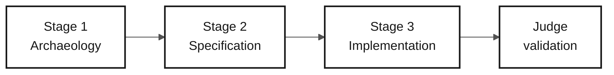

# Persona — Tech Writer

> **Track:** [Team Kit](../../README.md) › [Personas](../OVERVIEW.md) › [Tech Writer](README.md) › **PERSONA**

**Reference profile for the Tech Writer persona in the SIFAP modernization workshop.**

| Field | Value |
|---|---|
| **Role** | Tech Writer (Technical Writer) |
| **Role scope** | Documentation responsibility (covered by the participant) |
| **Active stages** | Stages 1-3: glossary, spec/ADR clarity, README, and factual run notes |
| **Artifacts produced** | Glossary, discovery notes, readable spec/ADRs, README/run notes, factual PR text |
| **Artifacts consumed** | Decisions, code, tests, CI output, and data evidence you create during the challenge |
| **Self-check focus** | C1/C2/C3 clarity, glossary, README, and PR text |

---

## What this persona is

The Tech Writer transforms decisions and code into durable project memory. In the SIFAP (Payment Inspection and Administration System) modernization, this persona maintains the glossary of Natural/Adabas legacy terms (MU, PE, FDT, DDM, monthly cycle), formalizes architecture decisions as ADRs (Architecture Decision Records), and ensures that the README reflects the application's real state every hour of the workshop, not only at the end.

Why it matters: without a deliberate Tech Writer, ADRs remain empty files, the README stays at "TODO: add instructions," and knowledge discovered during the workshop disappears. The Tech Writer makes team learning traceable and transferable.

Within the modernization workflow, the Tech Writer responsibility maintains traceability and an audit trail of decisions across Stages 1-3.

## Where you work in the SDLC

| Stage | Responsibility | Deliverable |
|---|---|---|
| **1 — Archaeology** | Maintain the glossary and catalog in readable form; write the discovery report at the end | Stage 1 report |
| **2 — Specification** | Review the spec for consistency, terminology, and clarity; format ADRs with the template | Spec and ADRs in standard format |
| **3 — Implementation** | Turn the placeholder README into real documentation; record decisions under `docs/` as they emerge | Complete README + `docs/` |
| **Final judge validation** | Make the README, glossary, PR checklist, and evidence notes clear for the judge | Clear submission notes |

## Core responsibility

Keep documentation alive throughout the day—not only at the end. Grow the README every hour, write ADRs when decisions are made, maintain the changelog, and keep terminology consistent throughout the workshop.

## Key skills

- Technical writing in the Diátaxis style: tutorials, how-to guides, reference, explanation
- ADR formalization: status, context, alternatives, decision, consequences and review evidence, following the actual template
- Documentation-to-code traceability: real endpoints, commands, and environment variables
- Drift detection between documentation and code using `/doc-drift`
- Glossary maintenance and consistent terminology across the project

## Persona kit

| Artifact | Path | Use |
|---|---|---|
| Tech Writer agent | `.github/skills/persona-tech-writer/SKILL.md` | API docs, README, `CODEMAP.md`, changelog, and drift detection |
| Prompt `/generate-docs` | `.github/prompts/persona-tech-writer-generate-docs.prompt.md` | Generate documentation from code |
| Prompt `/update-codemap` | `.github/prompts/persona-tech-writer-update-codemap.prompt.md` | Update the code map |
| Prompt `/doc-drift` | `.github/prompts/persona-tech-writer-doc-drift.prompt.md` | Detect divergence between docs and code |

## Copilot tools and modes

| Tool / Mode | When to use |
|---|---|
| **Copilot Ask** | Review style, clarity, and terminology consistency |
| **Copilot Ask (long-form writing)** | Draft long technical documentation sections |
| **Spec-Kit** (`/speckit.*`) | Keep Specify CLI-generated `spec.md`, `plan.md`, and `tasks.md` consistent with team documentation |
| **GitHub MCP** | Commit to `docs/` while other responsibilities work on code |

## Recommended cheat sheets

- [`09-cheat-sheets/spec-kit-workflow.md`](../../09-cheat-sheets/spec-kit-workflow.md) — Specify CLI generates `spec.md`, `plan.md`, and `tasks.md`; keep them consistent with documentation
- [`09-cheat-sheets/model-routing.md`](../../09-cheat-sheets/model-routing.md) — Haiku 4.5 for style review; Sonnet 4.6 for content writing

## Hourly checkpoints

The Tech Writer is the participant's most cross-cutting persona. To avoid waiting for something to document, follow these checkpoints:

| Period | What to do | Visible deliverable |
|---|---|---|
| 14:00–14:50 | Record terms from the legacy sources supporting the selected scope | Glossary with relevant terms |
| 14:50–15:30 | Review `spec.md`, `plan.md`, and `tasks.md` for clarity; record the scope decision | Consistent formal artifacts |
| 15:30–17:10 | Document real endpoints and commands created by the prototype | Updated factual documentation |
| 17:10–17:40 | Organize evidence, then record actual integrated data/application validation | Acceptance or explicit blockers |

> [!NOTE]
> If you have nothing to document after 30 minutes, ask the current stage responsibility: _"What did you decide in the last 30 minutes that has not been written down yet?"_ There is almost always something.

## How to perform well

- [ ] **Follow the ADR template**, including alternatives and actual approval state; do not omit required evidence to meet a section-count rule.
- [ ] **Evolve the README every hour.** Not only at the end of the day.
- [ ] **Keep terminology consistent from start to finish.** If the project uses "cycle," do not use "round" in the next paragraph.
- [ ] **Write factual submission notes.** Document real commands, evidence, and blockers without embellishment.

## Common mistakes and how to avoid them

| Symptom | Cause | Correction |
|---|---|---|
| Nothing written by the end of Stage 3 | Waiting for code to be "ready" | Document in real time—capture each decision when it is made |
| One-line ADRs | Confusing a record with a note | Use the template: context, decision, consequences |
| README still says "TODO: add instructions" | Postponement | Start with: (1) what the system is, (2) how to run it, (3) available endpoints |
| Submission notes claim success without evidence | Positive bias | Link real commands, data checks, failures, and corrections |

## Combinations with other personas

| Combination | Note |
|---|---|
| **Tech Writer + Product Owner** | Document the project's why, vision, and purpose |
| **Tech Writer + DevOps Engineer** | Document while the pipeline runs, producing a natural runbook |
| **Tech Writer + Requirements Engineer** | Strong for small teams—structure and write clear requirements |

## Ready-to-use prompts

1. **(Ask)** _"Review this README and identify TODO sections, inconsistent terminology, and outdated information such as ports, credentials, and endpoints. Propose corrections."_
2. **(Plan)** _"In ADR-001.md, plan how to complete Context, Decision, and Consequences using the template in `02-modern-spec/ADR-TEMPLATE.md`."_
3. **(Ask)** _"Create an honest Copilot submission evidence notes: what worked, what surprised us, and what failed. Use the template in `04-evolution/agent-experience-report.md`."_

## Emergency defaults

| Situation | What to do |
|---|---|
| ADR format is unknown | Follow the actual template, including alternatives and review state; do not invent decisions |
| README is empty | Start with: (1) what the system is, (2) how to run it, (3) available endpoints |
| Glossary is blocked | Record abbreviations from actual source reading; expand only evidence-backed meanings, leaving unknown terms as questions |
| submission evidence notes is empty | Open `04-evolution/agent-experience-report.md`; the template has ready-to-fill sections |

## Dependencies

| Persona | Relationship | Artifact |
|---|---|---|
| All role responsibilities | You depend on them | Decisions and code to document |
| Product Owner | Depends on you | Readable glossary and reports |
| QA Engineer | Indirectly depends on you | Consistent terminology in the spec |
| Facilitators | Depend on you | Final final validation report |

## How you are evaluated

- **Rubric A2 — Spec:** consistent documentation and standardized terminology
- **Rubric A7 — Agent:** honest, detailed Copilot submission evidence notes
- **Criterion:** README evolved every hour; ADRs have context, decision, and consequences; no section says TODO

---

### Continue reading

| Previous | Next |
|---|---|
| [DevOps Engineer — PERSONA](../09-devops-engineer/PERSONA.md) Submission support responsibility — Operations — Terraform, GitHub Actions, and runbook. | [Stage 1 — Archaeology](../../01-archaeology/GUIDE.md) 14:00–14:50 — Read the legacy system and catalog business rules. |

[Back to the kit index](../../README.md)
