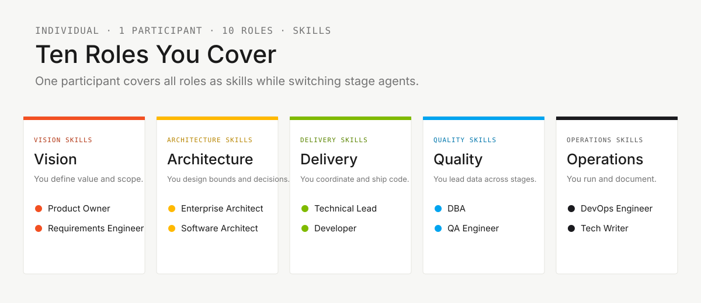
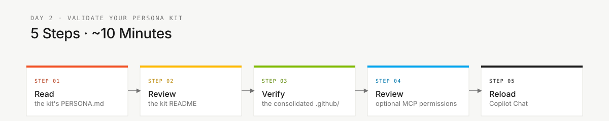

# Persona Kits

> **Track:** [Team Kit](../README.md) › **Personas**

**Onboarding guide for the workshop's 10 role personas.** Each persona is a Copilot toolkit specialized for an SDLC responsibility. In the individual challenge, one participant covers all 10 responsibilities while the role skills load automatically.

| Field | Value |
|---|---|
| **Target audience** | Individual workshop participants |
| **Prerequisites** | [00-SETUP.md](../00-SETUP.md) completed before 14:00 |
| **Estimated time** | 15 min pre-work |
| **Expected outcome** | Role responsibilities understood, `.github/` validated, Copilot reloaded |



---

## Concept

A persona is a Copilot toolkit specialized for a specific responsibility in the development lifecycle. Each kit includes a **role skill**, prompts for recurring tasks, instructions, and the `PERSONA.md` profile. The skill guides how Copilot responds and loads **automatically** from its description, so you never select your role — it composes into whichever stage agent you selected.

> [!IMPORTANT]
> Roles are skills, not agents. The individual challenge uses three stage agents — `@archaeologist`, `@architect`, and `@builder` — plus cross-stage `@dba`. Looking for `@product-owner` in the agent picker means the model has changed under you; keep the stage agent selected and describe the role's work instead. See [ADR-0002](../docs/adr/0002-team-roles-as-skills-not-agents.md) and [ADR-0003](../docs/adr/0003-individual-challenge-format.md).

In the SIFAP (Payment Inspection and Administration System) context, each role has direct responsibilities for concrete artifacts — from the Natural/Adabas rule catalog to acceptance tests and the CI pipeline. By studying the personas, you know what to produce and how to self-check at C1, C2, and C3.

---

## The 10 responsibilities

The challenge is not divided among people. Use the role kits as checklists for work you perform yourself.

| Responsibility area | Personas | Kits |
|---|---|---|
| **Vision** | Product Owner + Requirements Engineer | `01-product-owner/` + `02-requirements-engineer/` |
| **Architecture** | Enterprise Architect + Software Architect | `03-enterprise-architect/` + `04-software-architect/` |
| **Implementation** | Technical Lead + Developer | `05-technical-lead/` + `06-developer/` |
| **Quality and data** | DBA + QA Engineer | `07-dba/` + `08-qa-engineer/` |
| **Submission support** | DevOps Engineer + Tech Writer | `09-devops-engineer/` + `10-tech-writer/` |

---

## What each kit contains

| **Artifact** | Purpose |
|---|---|
| `PERSONA.md` | Complete profile: responsibilities, prompts, self-checks, and evaluation criteria |
| `README.md` | Inventory of Copilot artifacts (paths under `.github/`) |
| Optional integrations | Use only approved, actually configured tools; no executable MCP or hook configuration is installed from persona folders |

Active artifacts are consolidated in the root `.github/` directory:

| **Artifact** | Path |
|---|---|
| Role skill, loaded automatically by its description | `.github/skills/persona-*/SKILL.md` |
| Prompts for recurring tasks | `.github/prompts/persona-*.prompt.md` |
| Shared technique skills | `.github/skills/*/SKILL.md` |
| File-type-specific rules | `.github/instructions/*.instructions.md` |
| Stage agents plus cross-stage `dba`, selected with `@name` | `.github/agents/*.agent.md` |

---

## Available kits

| **#** | Kit | Challenge responsibility |
|---|---|---|
| 01 | [Product Owner](./01-product-owner/PERSONA.md) | Priority, scope, value, and migrated-data acceptance |
| 02 | [Requirements Engineer](./02-requirements-engineer/PERSONA.md) | EARS requirements, acceptance criteria, and traceability |
| 03 | [Enterprise Architect](./03-enterprise-architect/PERSONA.md) | External dependencies and scope decisions |
| 04 | [Software Architect](./04-software-architect/PERSONA.md) | Technical plan, module boundaries, and ADRs when needed |
| 05 | [Technical Lead](./05-technical-lead/PERSONA.md) | Standards, technical coordination, and PR self-review |
| 06 | [Developer](./06-developer/PERSONA.md) | Java/TypeScript code, tests, and integration |
| 07 | [DBA](./07-dba/PERSONA.md) | Source readiness, data discovery, migration design, PostgreSQL population, reconciliation, and recovery |
| 08 | [QA Engineer](./08-qa-engineer/PERSONA.md) | Independent data reconciliation, consultation tests, coverage, and gates |
| 09 | [DevOps Engineer](./09-devops-engineer/PERSONA.md) | CI green for submission and documented local execution |
| 10 | [Tech Writer](./10-tech-writer/PERSONA.md) | Glossary, ADR clarity, README, and factual run notes |

---

## How to activate the role skills



> [!IMPORTANT]
> Complete [00-SETUP.md](../00-SETUP.md) before 14:00. The challenge starts directly in `@archaeologist`.

- [ ] **Skim all 10 personas.** Use [OVERVIEW.md](OVERVIEW.md) to understand the responsibilities you cover yourself.
- [ ] **Read deeply for the current stage.** Open the personas most relevant to the stage before you switch agents.
- [ ] **Validate the consolidated `.github/`.** Confirm that agents, prompts, instructions, and skills are present:

  ```bash
  ls .github/agents .github/prompts .github/instructions .github/skills
  ```

- [ ] **Review optional tool availability.** Persona folders do not contain runnable MCP or hook manifests. If a task needs an integration, verify its approved transport, permissions, credentials handling, and connectivity. Do not overwrite an existing `.vscode/mcp.json` or confuse a capability list with the VS Code `servers` configuration.
- [ ] **Reload Copilot.** Open the Command Palette and run **Developer: Reload Window**.
- [ ] **Verify agents and prompts.** Type `@` in the Copilot panel and confirm `@archaeologist`, `@architect`, `@builder`, and `@dba`. Type `/` and confirm the slash commands.

---

## How to study a kit in 10 minutes

- [ ] **Read `PERSONA.md` first.** Mission, responsibilities, self-checks, and evaluation rubrics.
- [ ] **Open the kit's `README.md`.** Inventory of prompts, skills, and instructions.
- [ ] **Review the available prompts.** They are shortcuts for recurring tasks, not substitutes for judgment.
- [ ] **Check skills and instructions.** Skills contain workflows; instructions apply rules by file type.
- [ ] **Note the self-check outputs.** C1, C2, and C3 replace the former team gates in the individual challenge.

---

## Installation Definition of Done

- [ ] All 10 persona responsibilities have been skimmed; current-stage personas have been read.
- [ ] The consolidated `.github/` contains agents, prompts, instructions, and skills.
- [ ] Optional integrations were verified if needed; unavailable tools remain explicit, and no persona manifest was copied as configuration.
- [ ] VS Code reloaded.
- [ ] Stage agents appear when typing `@` in Copilot Chat.
- [ ] Prompts appear when typing `/` in Copilot Chat.

---

### Continue reading

| Previous | Next |
|---|---|
| [SETUP](../00-SETUP.md)<br/><sub>Pre-work setup: Git, VS Code, Copilot, Spec-Kit, branch protection.</sub> | [OVERVIEW of the 10 personas](OVERVIEW.md)<br/><sub>Role-by-stage responsibility checklist.</sub> |

<sub>[Back to the kit index](../README.md)</sub>
