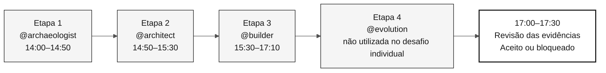

# Agentes de etapa — 4 agentes de contexto do workshop

> **Caminho:** [Kit da equipe](../README.md) › **Agentes de etapa**

**Os agentes de etapa são agentes personalizados do GitHub Copilot que concentram o contexto técnico de cada fase do workshop, garantindo que todo o participante interaja com o Copilot de forma consistente durante a mesma etapa.**

| Campo | Valor |
|---|---|
| **Público-alvo** | Todo o participante; leitura obrigatória antes do início do workshop |
| **Pré-requisitos** | GitHub Copilot ativo no VS Code |
| **Tempo estimado** | 10 min |
| **Etapa** | Todas |
| **Resultado esperado** | Saber qual agente usar, quando usá-lo e qual é sua função |

---

## O que é um agente personalizado do Copilot?

Um agente personalizado é definido em `.github/agents/<name>.agent.md`.
Instruções globais, instruções específicas por caminho e skills fornecem orientações
adicionais; esta pasta numerada contém documentação, não a instalação do agente.

Quando você seleciona `@archaeologist` no Copilot Chat, o Copilot carrega as instruções desse agente e responde dentro desse escopo, sem exigir que você repita o contexto em cada mensagem.

**Por que isso é importante neste workshop:** sem agentes personalizados, cada membro participante precisaria repetir o contexto do SIFAP, as regras de rastreabilidade e a stack de destino em cada conversa. Os agentes de etapa eliminam essa repetição e criam um ritual compartilhado.

---

## Duas camadas de configuração

Este workshop usa duas camadas de configuração do Copilot que trabalham em conjunto:

| Camada | O que faz | Primitiva | Local |
|---|---|---|---|
| **Papel** (coluna) | Define a responsabilidade individual: Product Owner, Desenvolvedor, QA e outros | **Skill**, carregada automaticamente a partir de sua descrição | [`.github/skills/`](../.github/skills/), documentadas em [`05-personas/`](../05-personas/) |
| **Etapa** (linha) | Define o contexto da fase e o escopo das ferramentas | **Agente**, selecionado com `@name` | [`.github/agents/`](../.github/agents/); esta pasta explica o uso |

O papel responde "quem sou eu neste participante?". O agente responde "em qual fase estamos
agora?". Cada participante cobre todas as responsabilidades dos papéis durante o desafio, enquanto o agente de etapa
muda conforme o cronograma avança.

Os papéis são **skills**, e não agentes, para que possam ser combinados com qualquer agente de etapa
ativo: você mantém `@builder` selecionado, e o papel de QA é carregado automaticamente quando você pergunta
sobre lacunas de cobertura. Um papel é exceção. O `@dba` continua sendo um agente porque o
ciclo de vida dos dados abrange as quatro etapas e possui prompts com escopo de ferramentas. Consulte a
[ADR-0002](../docs/adr/0002-participant-roles-as-skills-not-agents.md).

---

## Os 4 agentes de etapa e o cronograma

| Etapa | Horário | Agente | Abordagem do agente | Objetivo |
|---|---|---|---|---|
| Etapa 1 — Arqueologia | 14:00–14:50 | [@archaeologist](01-archaeologist/README.md) | Investigativa | Ler o sistema legado, registrar evidências e definir o escopo de uma funcionalidade |
| Etapa 2 — Especificação | 14:50–15:30 | [@architect](02-architect/README.md) | Analítica | Criar `spec.md`, `plan.md` e `tasks.md` com decisões de escopo |
| Etapa 3 — Implementação | 15:30–17:10 | [@builder](03-builder/README.md) | Construtiva | Construir código Java/Next.js, testes, migrações e endpoints rastreáveis |
| Etapa 4 — Evolução | Não utilizada no desafio individual | [@evolution](04-evolution/README.md) | Operacional | Delegar uma Issue pequena e registrar o resultado da revisão |

---

## Como selecionar o agente no Copilot Chat

- [ ] **Confirme a etapa atual** em [00-TEAM-FLOW.md](../00-TEAM-FLOW.md).
- [ ] **Abra o Copilot Chat** no VS Code (`Ctrl+Alt+I` / `Cmd+Alt+I`).
- [ ] **Abra o seletor de agentes** (o ícone de arroba ou o menu de contexto no campo da mensagem).
- [ ] **Selecione o agente da etapa atual** (por exemplo, `@archaeologist`).
- [ ] **Abra o README do agente** na tabela acima e copie o prompt inicial.
- [ ] **Conclua as entregas da Definição de pronto do agente** até o gate de autoavaliação.

> [!WARNING]
> Não ignore o gate de autoavaliação entre as etapas. Ele garante que o próximo agente receba evidências, decisões e trabalhos pendentes explícitos, e não apenas uma conversa de chat.

---

## Matriz de responsabilidades entre persona e agente

O **Líder** conduz a conversa com o agente. Um **Colaborador** participa ativamente. Um **Observador** acompanha e responde a perguntas quando solicitado.

| Persona | @archaeologist | @architect | @builder | @evolution |
|---|---|---|---|---|
| Product Owner | Observador | Colaborador | Observador | Colaborador |
| Engenheiro de Requisitos | **Líder** | Colaborador | Observador | Observador |
| Arquiteto Corporativo | Colaborador | Colaborador | Observador | Observador |
| Arquiteto de Software | Observador | **Líder** | Colaborador | Observador |
| Líder Técnico | Colaborador | Colaborador | Colaborador | **Colíder técnico** |
| Desenvolvedor | Observador | Observador | **Líder** | Colaborador |
| DBA | **Líder de dados** | **Líder de dados** | **Líder de dados** | **Líder de dados** |
| Engenheiro de QA | Colaborador | Colaborador | Colaborador | Colaborador |
| Engenheiro de DevOps | Colaborador | Colaborador | Colaborador | **Líder da etapa (o participante)** |
| Redator Técnico | Colaborador | Colaborador | Colaborador | **Líder da etapa (o participante)** |

Para obter a versão detalhada, consulte [docs/persona-agent-matrix.md](../docs/persona-agent-matrix.md).
Cada participante cobre todas as responsabilidades dos papéis. A verificação
independente dos dados exige outro participante; cada dupla ainda lê suas fontes
atribuídas. Use o período das 17:10 às 17:40 para preparar evidências para a validação das 17:10 às 17:40.

---

## Princípio: o agente não conhece seu sistema legado

Os agentes sabem **como** modernizar Natural/Adabas. Eles não sabem **o que** existe no sistema legado do participante. Isso é intencional. O aprendizado ocorre quando o participante lê, discute e registra evidências.

| Solicitação inadequada | Resposta esperada do agente |
|---|---|
| "Conte-me tudo o que o sistema faz" | "Abra o primeiro arquivo, e vamos lê-lo juntos." |
| "Crie a arquitetura sem ler o sistema legado" | "Ainda não temos evidências. Volte à Etapa 1." |
| "Implemente sem um REQ-ID" | "A rastreabilidade está ausente. Crie ou identifique o requisito." |

---

## Critérios de conclusão por etapa

- [ ] O participante usa o mesmo agente durante a mesma etapa.
- [ ] O líder sabe qual entrega deve resultar da conversa.
- [ ] A etapa termina com artefatos versionados no repositório, e não apenas com uma conversa de chat.
- [ ] O próximo checkpoint recebe evidências, decisões e trabalhos pendentes explícitos.

---

### Continue lendo

| Anterior | Próximo |
|---|---|
| [Kits de personas](../05-personas/) Configuração individual por papel do participante. | [@archaeologist](01-archaeologist/README.md) Etapa 1: leia o sistema legado Natural/Adabas. |

[Voltar ao índice do kit](../README.md)
