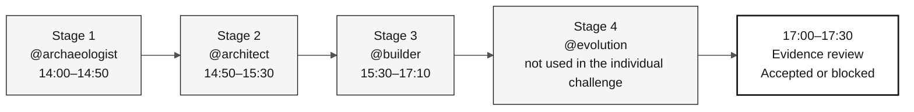

# Stage Agents — 4 Workshop Context Agents

> **Path:** [Team Kit](../README.md) › **Stage Agents**

**Stage agents are custom GitHub Copilot agents that concentrate the technical context for each workshop phase, ensuring that the entire participant interacts with Copilot consistently during the same stage.**

| Field | Value |
|---|---|
| **Target audience** | Entire participant, required reading before the workshop starts |
| **Prerequisites** | GitHub Copilot active in VS Code |
| **Estimated time** | 10 min |
| **Stage** | All |
| **Expected outcome** | Know which agent to use, when to use it, and its role |

---

## What is a custom Copilot agent?

A custom agent is defined in `.github/agents/<name>.agent.md`.
Global instructions, path-scoped instructions and skills provide additional
guidance; this numbered folder is documentation, not the agent installation.

When you select `@archaeologist` in Copilot Chat, Copilot loads that agent's instructions and responds within that scope, without requiring you to repeat the context in every message.

**Why this matters in this workshop:** without custom agents, every participant member would need to repeat the SIFAP context, traceability rules, and target stack in each conversation. Stage agents remove this repetition and create a shared ritual.

---

## Two configuration layers

This workshop uses two Copilot configuration layers that work together:

| Layer | What it does | Primitive | Location |
|---|---|---|---|
| **Role** (column) | Defines the individual responsibility: Product Owner, Developer, QA, and others | **Skill**, loaded automatically from its description | [`.github/skills/`](../.github/skills/), documented in [`05-personas/`](../05-personas/) |
| **Stage** (row) | Defines phase context and tool scope | **Agent**, selected with `@name` | [`.github/agents/`](../.github/agents/); this folder explains usage |

The role answers "who am I on this participant?" The agent answers "which phase are we in
now?" Each participant covers all role responsibilities during the challenge, while the stage agent
changes as the schedule advances.

Roles are **skills** rather than agents so they compose into whatever stage agent
is active: you keep `@builder` selected and the QA role loads itself when you ask
for coverage gaps. One role is an exception. `@dba` stays an agent because the
data lifecycle spans all four stages and owns tool-scoped prompts. See
[ADR-0002](../docs/adr/0002-participant-roles-as-skills-not-agents.md).

---

## The 4 stage agents and schedule

| Stage | Time | Agent | Agent approach | Purpose |
|---|---|---|---|---|
| Stage 1 — Archaeology | 14:00–14:50 | [@archaeologist](01-archaeologist/README.md) | Investigative | Read the legacy system, record evidence, and scope a feature |
| Stage 2 — Specification | 14:50–15:30 | [@architect](02-architect/README.md) | Analytical | Create `spec.md`, `plan.md`, and `tasks.md` with scope decisions |
| Stage 3 — Implementation | 15:30–17:10 | [@builder](03-builder/README.md) | Constructive | Build traceable Java/Next.js code, tests, migrations, and endpoints |
| Stage 4 — Evolution | not used in the individual challenge | [@evolution](04-evolution/README.md) | Operational | Delegate a small Issue and record the review outcome |

---

## How to select the agent in Copilot Chat

- [ ] **Confirm the current stage** in [00-TEAM-FLOW.md](../00-TEAM-FLOW.md).
- [ ] **Open Copilot Chat** in VS Code (`Ctrl+Alt+I` / `Cmd+Alt+I`).
- [ ] **Open the agent selector** (the at-sign icon or context menu in the message field).
- [ ] **Select the agent for the current stage** (for example, `@archaeologist`).
- [ ] **Open the agent README** from the table above and copy the opening prompt.
- [ ] **Work through the agent's Definition of Done deliverables** until the self-checkpoint gate.

> [!WARNING]
> Do not skip the self-checkpoint gate between stages. It ensures that the next agent receives explicit evidence, decisions, and pending work rather than only a chat conversation.

---

## Persona × agent responsibility matrix

The **Lead** conducts the conversation with the agent. A **Contributor** participates actively. An **Observer** follows along and answers questions when requested.

| Persona | @archaeologist | @architect | @builder | @evolution |
|---|---|---|---|---|
| Product Owner | Observer | Contributor | Observer | Contributor |
| Requirements Engineer | **Lead** | Contributor | Observer | Observer |
| Enterprise Architect | Contributor | Contributor | Observer | Observer |
| Software Architect | Observer | **Lead** | Contributor | Observer |
| Technical Lead | Contributor | Contributor | Contributor | **Technical co-lead** |
| Developer | Observer | Observer | **Lead** | Contributor |
| DBA | **Data lead** | **Data lead** | **Data lead** | **Data lead** |
| QA Engineer | Contributor | Contributor | Contributor | Contributor |
| DevOps Engineer | Contributor | Contributor | Contributor | **Stage lead (the participant)** |
| Tech Writer | Contributor | Contributor | Contributor | **Stage lead (the participant)** |

For the detailed version, see [docs/persona-agent-matrix.md](../docs/persona-agent-matrix.md).
Each participant covers all role responsibilities. Independent data
verification requires another participant; every pair still reads its assigned
sources. Use 17:10-17:40 to prepare evidence for the 17:10-17:40 validation.

---

## Principle: the agent does not know your legacy system

The agents know **how** to modernize Natural/Adabas. They do not know **what** exists in your participant's legacy system. This is intentional. Learning occurs when the participant reads, discusses, and records evidence.

| Inappropriate request | Expected agent response |
|---|---|
| "Tell me everything the system does" | "Open the first file, and we will read it together." |
| "Create the architecture without reading the legacy system" | "We still lack evidence. Return to Stage 1." |
| "Implement without a REQ-ID" | "Traceability is missing. Create or identify the requirement." |

---

## Completion criteria by stage

- [ ] The participant uses the same agent during the same stage.
- [ ] The lead knows which deliverable must result from the conversation.
- [ ] The stage ends with versioned repository artifacts, not only a chat conversation.
- [ ] The next checkpoint receives explicit evidence, decisions, and pending work.

---

### Continue reading

| Previous | Next |
|---|---|
| [Persona Kits](../05-personas/) Individual configuration by participant role. | [@archaeologist](01-archaeologist/README.md) Stage 1: read the Natural/Adabas legacy system. |

[Back to the kit index](../README.md)
