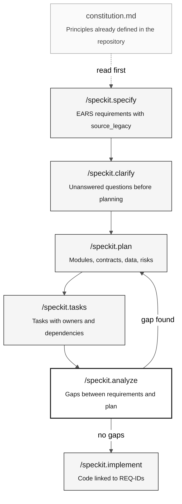

# Spec-Driven Development and Spec-Kit

> **Path:** [Team Kit](../README.md) › [Concepts](00-README.md) › **Spec-Driven Development**

**Spec-Driven Development (SDD) is the practice of fully specifying expected behavior before writing code—and Spec-Kit is the command set that structures this process in Copilot Chat.**

  

| Field | Value |
|---|---|
| **Target audience** | All personas, especially Requirements Engineers and Software Architects |
| **Prerequisites** | Read the `.NSN` programs assigned in Stage 1 |
| **Estimated time** | 20 minutes |
| **Stage** | Stage 2 — Specification |
| **Expected outcome** | Understand the Spec-Kit cycle and know when to run each command |

---

## Concept

Spec-Driven Development is an approach in which a participant produces a formal specification—with requirements, an architecture plan, and tasks—before writing any code. As a result, the implementation follows a single traceable understanding of the system instead of a guess based on memory.

**Spec-Kit** (official repository: [github/spec-kit](https://github.com/github/spec-kit)) is the practical implementation of SDD for people using GitHub Copilot. It provides a sequence of commands in Copilot Chat that guides a participant from a vague idea to concrete tasks with ownership and traceability.

---

## Why it matters in this workshop

Each participant has 14:00-17:40 to modernize the fixed SIFAP beneficiary consultation increment from approximately 30 years of source history. A specification helps prevent incompatible interpretations, duplicated rules and missing behavior; it does not replace source review, data reconciliation or judge validation.

Official Spec-Kit supports the following cycle; self-checkpoints, CI and judge validation provide the applicable gates:

> specify expected behavior → plan the architecture → distribute tasks → implement

No code should be written before `/speckit.plan` has been run and validated.

---

## How it works

The complete Spec-Kit cycle has seven commands. Each produces a concrete artifact:



| Command | What it produces | When to use it |
|---|---|---|
| `/speckit.constitution` | General system principles (stack, patterns, constraints) | Once per project—already in `.specify/memory/constitution.md` |
| `/speckit.specify` | EARS requirements with REQ-IDs and `source_legacy:` | At the start of Stage 2, for each confirmed feature |
| `/speckit.clarify` | Questions about behaviors with no legacy evidence | After `specify`, before planning |
| `/speckit.plan` | Modules, API contracts, data model, and risks | After answering all `clarify` questions |
| `/speckit.tasks` | Tasks with estimates, owners, and dependencies | After C2 confirms the plan is ready |
| `/speckit.analyze` | Consistency report: gaps, conflicts, and coverage | Before implementation—mandatory |
| `/speckit.implement` | Code, tests, and migrations with traceable REQ-IDs | Only after `analyze` reports no critical gaps |

---

## Apply the workflow to your evidence

Select a behavior the participants actually reviewed in Stage 1. Read the
constitution and discovery artifacts first. Then use these commands in
**Copilot Chat**, not a terminal:

```text
/speckit.specify <reviewed behavior and authorized population>
Use the actual source intervals you read and include source_legacy.

/speckit.clarify
Preserve missing evidence as blockers. Do not invent historical intent.

/speckit.plan
Use the fixed workshop stack and DBA-reviewed migration constraints.

/speckit.tasks
/speckit.analyze
After C2 self-check, implement the next approved task with tests first:
/speckit.implement
```

Every new `REQ-NNN` must carry an unbulleted `source_legacy:` within the next
20 lines, using a supported source path or justified `[GREENFIELD]`. A passing
syntax check does not prove that the source supports the behavior.

---

## Use case

Use Spec-Kit whenever you start the Stage 2 specification. Even when a feature appears simple, running the full cycle prevents the workshop's primary risk: **modernizing what you think the system does rather than what it actually does**.

---

## Common mistakes and how to avoid them

| Symptom | Cause | Correction |
|---|---|---|
| Code written before `plan` | The initial steps were skipped | Return to `specify`. Code without a spec guarantees rework. |
| Missing `source_legacy:` in a REQ-ID | Requirement written from memory without legacy evidence | Open the corresponding `.NSN` and locate the exact section. |
| Twelve questions from `clarify` | Normal—not a problem | Answer all of them. Every unanswered question becomes a bug. |
| `analyze` reports gaps | Incomplete or inconsistent plan | Do not continue to `implement`. Correct the plan and rerun it. |
| Spec-Kit not found | Incomplete installation | See [`09-cheat-sheets/spec-kit-workflow.md`](../09-cheat-sheets/spec-kit-workflow.md). |

---

## Usage checklist

- [ ] **Read `constitution.md` first.** Confirm the project's stack, patterns, and constraints.
- [ ] **Run `/speckit.specify` based on legacy evidence.** Never rely on memory.
- [ ] **Answer every `/speckit.clarify` question.** Record decisions.
- [ ] **Complete the C2 self-check before `/speckit.tasks`.** The plan must be ready for implementation and judge validation.
- [ ] **Run `/speckit.analyze` and correct gaps before implementing.**
- [ ] **Every REQ-ID has `source_legacy:` or `[GREENFIELD] + justification`.**

---

## References

- [Official Spec-Kit repository](https://github.com/github/spec-kit)
- [Command cheat sheet](../09-cheat-sheets/spec-kit-workflow.md)
- [Stage 2 Guide](../02-modern-spec/GUIDE.md)

---

### Continue reading

| Previous | Next |
|---|---|
| [Concepts Index](00-README.md)<br/><sub>What you will learn and in what order.</sub> | [Agents and Personas](02-agents-and-personas.md)<br/><sub>The two context layers in Copilot Chat.</sub> |

<sub>[Back to the kit index](../README.md)</sub>
