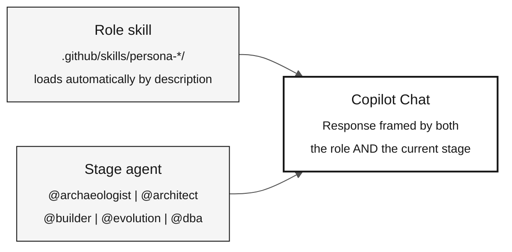

# Agents and Personas — The Two Context Layers

> **Path:** [Team Kit](../README.md) › [Concepts](00-README.md) › **Agents and Personas**

**Copilot Chat operates with two context layers at the same time: role skills, which define responsibilities you cover yourself, and the stage agent, which defines the current work framing. Knowing how to combine them is essential for relevant answers during the workshop.**

  

| Field | Value |
|---|---|
| **Target audience** | All participants |
| **Prerequisites** | None—read before Stage 1 |
| **Estimated time** | 20 minutes |
| **Stage** | All stages |
| **Expected outcome** | Know how to select a stage agent and rely on role skills in Copilot Chat |

---

## Concept

The workshop uses **two primitives that compose**, not two agents that compete:

- **Role skill** — the responsibility you personally carry. It lives in `.github/skills/` and loads **automatically** when your request matches its description. You never select it.
- **Stage agent** — the phase you are working in. You select it with `@name` once per stage, and it stays selected.

The layers coexist by design. You switch stage agents as the challenge advances, and the relevant role skill composes into the active agent whenever the work calls for that responsibility.

> [!IMPORTANT]
> There are **five agents**, not fifteen: the four stage agents plus `@dba`. Every
> other role is a skill, because a responsibility travels across the work while
> an agent marks one. The data lifecycle is the exception that proves the rule —
> it spans every stage, so it cannot live inside one. See
> [ADR-0002](../docs/adr/0002-team-roles-as-skills-not-agents.md).

---

## Why it matters

Without a stage agent, Copilot answers with generic framing and may suggest work for the wrong moment. Without the role knowledge, Copilot answers as a generic assistant that does not know the responsibility or its boundaries.

With both layers active, Copilot simultaneously knows:

- **Who is asking** (role boundary, procedure, and quality gate)
- **What context the work is in** (Stage 1: archaeology; Stage 2: specification; and so on)

The reason roles are skills is that a responsibility does not belong to only one stage.
A design that forced you to re-select your role in every conversation — and then
re-select the stage agent to get stage context back — made the two layers fight
over one selector. Skills remove the selection entirely.

---

## How they combine



---

## Layer 1 — Roles (loaded automatically)

Each participant covers **all 10 roles** in the individual challenge. The reference profile for each is in [`05-personas/`](../05-personas/); the operational knowledge is the matching skill under `.github/skills/`.

| Persona | Workshop role | Most active stage |
|---|---|---|
| **Product Owner** | Defines scope and validates requirements with the business | Stages 1 and 2 |
| **Requirements Engineer** | Reads the legacy system and converts rules into EARS | Stages 1 and 2 |
| **Enterprise Architect** | Provides the system-wide view (C4 L1 and L2) | Stage 2 |
| **Software Architect** | Defines bounded contexts and API contracts | Stage 2 |
| **Technical Lead** | Leads PR readiness and implementation decisions | Stage 3 |
| **Developer** | Implements Java and Next.js code | Stage 3 |
| **DBA** | Leads source readiness, discovery, mapping, population and recovery | Preparation and Stages 1-3 |
| **QA Engineer** | Defines independent evidence checks, tests, reconciliation and consultation acceptance | Stages 1-3 and judge validation |
| **DevOps Engineer** | Configures CI/CD, Terraform, and Actions | Post-challenge Stage 4 only |
| **Tech Writer** | Documents APIs, ADRs, and runbooks | Stages 2 and 3 |

### What each role includes

| Artifact | Location | Purpose |
|---|---|---|
| `PERSONA.md` | `05-personas/0X-name/` | Role profile: responsibilities, deliverables, and slash commands |
| `SKILL.md` | `.github/skills/persona-*/` | The role's boundary, procedure, and quality gate — loaded automatically |
| `*.prompt.md` | `.github/prompts/` | Role-specific slash commands, bound to the stage agent that owns their moment |
| `*.instructions.md` | `.github/instructions/` | Rules applied automatically to matching file paths |

> [!IMPORTANT]
> Review the role `PERSONA.md` files before starting the challenge. You do not
> select a role skill: describe the work and it loads. Slash commands work
> only when the repository context is loaded in Copilot Chat.

---

## Layer 2 — Stage agents (shared kit)

At the start of each work block, select the matching stage agent in Copilot Chat. This keeps Copilot aligned with the current phase.

| Stage | Agent | Thematic framing | Lead roles |
|---|---|---|---|
| Stage 1 — Archaeology | [`@archaeologist`](../06-stage-agents/01-archaeologist/) | Reading and interpreting legacy Natural/Adabas code | Requirements Engineer, Tech Writer |
| Stage 2 — Specification | [`@architect`](../06-stage-agents/02-architect/) | EARS specifications, ADRs, and the C4 model | Enterprise Architect, Software Architect |
| Stage 3 — Implementation | [`@builder`](../06-stage-agents/03-builder/) | Java 21, JPA, Testcontainers, and Next.js 15 code | Developer, DBA, QA Engineer |
| Stage 4 — Evolution | [`@evolution`](../06-stage-agents/04-evolution/) | Delegation to Agent mode, IaC, and CI/CD | Kept for post-challenge work; not used in the individual challenge |

> [!NOTE]
> Stage 4 — Evolution is kept in the kit for post-challenge work, but it is not used in the individual challenge. The challenge ends at Stage 3 and judge validation. See [ADR-0003](../docs/adr/0003-individual-challenge-format.md).

### Practical difference

| Without a selected stage agent | With a selected stage agent |
|---|---|
| Copilot responds in the repository's general context | Copilot adopts the current stage's framing |
| Answers drift away from the current work block | Answers stay consistent with the selected stage |
| It may suggest actions inappropriate for the moment (for example, code in Stage 1) | It remains within the current stage's scope |

---

## How to select them

### Role skill

You do not select it. Describe the work in your own words and the matching skill
loads from its `description`. Asking `@builder` "where are our coverage gaps?"
loads the QA role without any selection.

To force a specific role, name it: "use the `persona-qa-engineer` skill".

### Stage agent

1. At the start of each stage, select the stage agent named in the challenge flow.
2. Leave that agent selected until you reach the next self-checkpoint.
3. Selecting another agent **replaces** the active one; agents do not stack. The
   role skills continue to load into whichever agent is active.
4. A prompt may select its own agent through `agent:`; preserve the current
   stage's read/write boundaries.

### The cross-stage exception

`@dba` is an agent, not a skill, because the data lifecycle runs across the challenge and owns tool-scoped prompts. Select it when the work is data migration,
reconciliation, or query auditing, then return to the stage agent.

---

## SIFAP example

**Scenario:** You are covering Requirements Engineering in Stage 2. You have just completed C1 at the end of Stage 1.

```
1. The challenge flow says to select `@architect` in chat.

2. You select @architect.
   Result: Copilot Chat now frames responses
   in the specification and architecture context.

3. You use Ask mode for guidance:
   "@architect, what is the recommended order for specifying
   the rules in business-rules-catalog.md?"

4. Use the appropriate stage/persona prompt with a reviewed rule:
   /write-ears-spec feature=<NNN>-<feature>
   Cite the actual source interval you read.
   Do not supply a completed rule or a guessed program name.

5. The EARS requirement includes a REQ-ID and source_legacy.
   CI validates traceability in the PR.
```

---

## Common mistakes and how to avoid them

| Symptom | Cause | Correction |
|---|---|---|
| Copilot suggests code during Stage 1 | Wrong or missing stage agent | Select `@archaeologist` and confirm the current stage |
| Slash command is not recognized | Copilot window opened outside the repository root | Reopen VS Code at the repository root |
| Answers do not match the current stage | The wrong agent is selected | Confirm the active agent at the start of each stage |
| The role knowledge never appears | The request was too vague to match a skill description | Name the work, or name the skill: "use the `persona-qa-engineer` skill" |
| Looking for `@product-owner` in the picker | Roles became skills; only stages and `@dba` are agents | Keep the stage agent and describe the role's work |

---

## Activation checklist

- [ ] **Review the role `PERSONA.md` files.** Find them in `05-personas/`.
- [ ] **Test a role slash command** in Copilot Chat to confirm the repository context is loaded.
- [ ] **At the start of each stage, select the correct agent.**
- [ ] **Confirm the active agent before asking critical technical questions.**

---

## References

- [Complete persona list](../05-personas/OVERVIEW.md)
- [Stage agents](../06-stage-agents/)
- [Copilot's 3 Modes cheat sheet](../09-cheat-sheets/copilot-3-modes.md)

---

### Continue reading

| Previous | Next |
|---|---|
| [Spec-Driven Development](01-spec-driven-development.md)<br/><sub>Why to specify before coding and the Spec-Kit cycle.</sub> | [Visual Glossary](03-visual-glossary.md)<br/><sub>30+ terms with a definition, SIFAP example, and reference.</sub> |

<sub>[Back to the kit index](../README.md)</sub>
