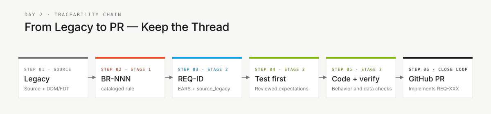

# Glossário — o jargão da imersão decifrado

> **Trilha:** [Kit do Time](../README.md) › [Conceitos](00-README.md) › **Glossário visual**

**Uma referência com mais de 30 termos técnicos usados na imersão do SIFAP, organizados por área, com definição em uma frase, exemplo do domínio e link para aprofundar.**

 

| Campo | Valor |
|---|---|
| **Público-alvo** | Qualquer participante, principalmente ao cobrir responsabilidades de Product Owner, Tech Writer ou análise |
| **Como usar** | Mantenha esta aba aberta durante a imersão. Você não precisa memorizar nada — consulte sempre que encontrar um termo desconhecido. |

---

## Mapa por estágio

| Estágio | Termos usados com frequência |
|---|---|
| Estágio 1 — Arqueologia | Natural, NSN, DDM, Adabas, MU, PE, BR-NNN |
| Estágio 2 — Especificação | EARS, REQ-ID, source_legacy, ADR, C4, bounded context, greenfield, Spec-Kit |
| Estágio 3 — Implementação | JPA, Flyway, migração, Testcontainers, controller, service, repository, Bean Validation, Server Component, Swagger |
| Estágio 4 — Evolução posterior ao desafio | Agent, Issue, PR, Terraform, IaC, CI/CD, Actions |

---

## Referência de terminologia

| Termo | Significado em linguagem simples | Contexto de uso |
|---|---|---|
| self-checkpoint | autoavaliação segundo a definição de pronto do estágio | Transição entre estágios |
| stakeholder | parte interessada ou afetada | Personas Product Owner e Requirements Engineer |
| backlog | lista de trabalho pendente | Gestão de tarefas no GitHub Projects |
| commit | versão registrada | Controle de versão com Git |
| push | enviar mudanças para o repositório remoto | Git — compartilhar mudanças para revisão |
| pull request (PR) | proposta de mudança | Revisão de código antes do merge |
| merge | integrar uma branch | Incorporação de mudanças na branch principal |
| code review | avaliação do código por pares | Revisão do PR antes do merge |
| CI verde | pipeline de CI bem-sucedido | Todos os testes passaram |
| CI vermelho | pipeline de CI com falha | Ao menos um teste ou verificação falhou |
| breaking change | mudança incompatível | Alteração que quebra contratos de API existentes |
| rollback | restaurar uma versão anterior | Desfazer um deploy problemático |
| feature flag | chave liga/desliga de funcionalidade | Habilitar uma funcionalidade sem novo deploy |
| deployment | publicação de uma versão | Disponibilizar uma versão em um ambiente |
| produção | ambiente em uso real | Ambiente usado pelas pessoas usuárias finais |
| staging | ambiente de pré-produção | Validação antes da produção |
| sandbox | ambiente experimental isolado | Testar sem risco para o sistema em uso |
| bug | defeito de software | Comportamento incorreto identificado |
| hotfix | correção urgente | Correção aplicada diretamente em produção |
| refactor | reestruturar sem mudar o comportamento | Melhorar o código preservando a funcionalidade |
| dívida técnica | trabalho de engenharia adiado | Atalhos que precisarão ser corrigidos |
| smoke test | teste mínimo de sanidade | Verificação rápida de que o sistema funciona |
| spike | investigação técnica curta | Explorar uma solução antes de se comprometer com ela |

---

## Área: legado

### Adabas

O banco de dados do cenário de aproximadamente 30 anos do SIFAP. Seus campos de valores múltiplos (MU), grupos periódicos (PE) e definições de origem exigem investigação. Arquivos DDM/FDT descrevem a estrutura, não comprovam a existência de um banco de dados atualmente populado.

### DDM — Data Definition Module

Um arquivo `.ddm` do Adabas que descreve a estrutura de um "file" (equivalente a uma tabela): campos, tipos, tamanhos e ocorrências. Exemplo no SIFAP: `BENEFIC.ddm` define os campos do arquivo de beneficiários. Localização: `01-archaeology/legacy-sifap/adabas-ddms/`.

### MU — Multiple-Value field

Campo do Adabas que armazena vários valores em um único registro — por exemplo, um campo `TELEFONES` com até cinco números. O equivalente em SQL seria uma tabela filha com chave estrangeira. Documente em um ADR como preservar essa multiplicidade no modelo moderno.

### Natural (linguagem de programação)

Uma linguagem de programação dos anos 1980 usada com o Adabas. Os membros Natural usam `.NSP` para programas, `.NSN` para subprogramas, `.NSC` para copycodes, `.NSA` e `.NSL` para áreas de dados e `.jcl` para jobs batch. Tem sintaxe imperativa, com `IF`/`END-IF` e `FOR`/`END-FOR`, sem orientação a objetos. Guia de leitura: [`01-archaeology/legacy-sifap/HOW-TO-READ-NATURAL.md`](../01-archaeology/legacy-sifap/HOW-TO-READ-NATURAL.md).

### Membros Natural atribuídos

O SIFAP tem 15 membros Natural atribuídos em `01-archaeology/legacy-sifap/natural-programs/`: 12 programas `.NSP` e três subprogramas `.NSN`.

### PE — Periodic Group

Um grupo de campos do Adabas que se repete várias vezes dentro do mesmo registro — por exemplo, até 12 ocorrências de histórico mensal de pagamento. É mais complexo que o MU porque cada ocorrência contém vários campos correlacionados. Mapeá-lo para o modelo relacional moderno exige uma decisão documentada em um ADR.

### BR-NNN — Business Rule

O identificador de uma regra de negócio extraída do legado durante o Estágio 1 (por exemplo, `BR-042`). É usado em `business-rules-catalog.md`. Sem esse identificador, a regra não pode ser rastreada até o requisito que a implementa.

---

## Área: requisitos

### EARS — Easy Approach to Requirements Syntax

Notação padronizada para escrever requisitos sem ambiguidade. Fornece seis padrões de sintaxe (ubiquitous, event-driven, state-driven, optional, unwanted e complex) que substituem afirmações vagas por frases de formato fixo e testes objetivos. Detalhes em [05 — Notação EARS](05-ears-notation.md).

### REQ-ID

Identificador único de requisito (por exemplo, `REQ-042`). Todo commit do Estágio 3 que implementa um requisito precisa incluir `Implements REQ-042` na mensagem. Sem REQ-ID, não há rastreabilidade.

### `source_legacy:`

Campo obrigatório em todo REQ-ID que aponta para o trecho de origem no legado. Formato: `01-archaeology/legacy-sifap/natural-programs/CALCDSCT.NSP#L120-L198`. Para funcionalidades novas, use `[GREENFIELD] <justificativa>`. Se estiver ausente, o CI rejeita a mudança.

### Greenfield

Requisito sem equivalente no legado — uma funcionalidade genuinamente nova. Precisa ser documentado como `source_legacy: "[GREENFIELD] <motivo>"` e justificado com o Product Owner.

### Spec-Kit

Ferramenta oficial do GitHub para Spec-Driven Development. Fornece os comandos `/speckit.specify`, `/speckit.clarify`, `/speckit.plan`, `/speckit.tasks`, `/speckit.analyze` e `/speckit.implement` no GitHub Copilot. Detalhes em [01 — Spec-Driven Development](01-spec-driven-development.md).

---

## Área: arquitetura

### ADR — Architecture Decision Record

Arquivo Markdown curto que registra uma decisão de arquitetura: o contexto, a decisão tomada, as alternativas consideradas e as consequências. Garante que futuras pessoas mantenedoras entendam as decisões tomadas hoje. Template: `02-modern-spec/ADR-TEMPLATE.md`. Detalhes em [06 — Architecture Decision Records](06-architecture-decision-records.md).

### Bounded Context

Segmento do sistema claramente delimitado, com vocabulário e regras próprios. No SIFAP, "beneficiário" significa coisas diferentes nos contextos de Cadastro, Cálculo e Fiscalização. As fronteiras são hipóteses que você valida e documenta em um ADR. Este conceito aparece nos Estágios 2 e 3.

### C4 (modelo C4)

Abordagem para documentar arquitetura em quatro níveis de zoom: contexto de sistema (L1), containers (L2), componentes (L3) e código (L4). A imersão usa apenas L1 e L2. Aparece no Estágio 2 como entregável do Enterprise Architect.

### Modular Monolith

O padrão de arquitetura adotado nesta imersão: um único processo implantável dividido em módulos internos com fronteiras bem definidas. Foi escolhido em vez de microsserviços por se adequar melhor ao tempo da imersão. Documentado no ADR-001.

### Strangler Fig

Padrão de migração incremental em que o novo sistema gradualmente "envolve" o legado, substituindo uma funcionalidade por vez, sem migração big-bang. Aplica-se quando a imersão produz apenas parte do SIFAP 2.0.

---

## Área: implementação

### Bean Validation

Anotações Java (`@NotNull`, `@Email`, `@Size`, `@Pattern`) que validam automaticamente os dados de entrada na camada de controller. Impedem que dados inválidos cheguem à lógica de negócio.

### Controller

Classe Java que recebe requisições HTTP e devolve respostas. Suas responsabilidades são receber e validar a entrada com `@Valid`, delegar para o service e retornar o status HTTP correto. Localização no código: `infrastructure/`.

### DTO — Data Transfer Object

Estrutura Java com campos usada para transportar dados através da API, sem lógica de negócio. No SIFAP, um `BeneficiarioDTO` carrega os dados necessários para criar ou atualizar um beneficiário sem expor diretamente a entidade JPA.

### Flyway

Ferramenta de migração de banco de dados. Aplica scripts SQL versionados na ordem correta (`V1__init.sql`, `V2__add_coluna.sql`). Depois de executado, um script nunca é alterado — mudanças posteriores exigem um novo script. Localização: `src/main/resources/db/migration/`.

### JPA — Java Persistence API

O padrão Java para mapear classes em tabelas de banco de dados. Uma classe anotada com `@Entity` mapeia para uma tabela; campos anotados com `@Column` mapeiam para colunas. O Hibernate é a implementação usada nesta imersão.

### JWT — JSON Web Token

Formato de token usado em alguns projetos de autenticação. JWTs geralmente são assinados, não cifrados; um payload legível não deve ser tratado como confidencial. Valide assinatura, emissor, público e expiração na fronteira aprovada. Não presuma que o projeto já tenha implementado um emissor ou fluxo de autenticação.

### Repository (Spring Data)

Interface Java que fornece métodos prontos de leitura e escrita no banco (`findById`, `save`, `deleteAll`, `findByStatus`). O Spring Data JPA a implementa automaticamente. Localização: `infrastructure/`.

### Server Component (Next.js)

Componente React que roda no servidor, sem enviar JavaScript ao navegador da pessoa usuária. É ideal para buscar dados e renderizar HTML estático. Componentes que precisam de interação do usuário devem ser Client Components, marcados explicitamente com `"use client"`.

### Service

Classe Java que contém a lógica de negócio. Fica entre o Controller (que recebe a requisição) e o Repository (que acessa o banco). Toda transação de banco deve ser gerenciada na camada de service com `@Transactional`. Localização: `application/`.

### Swagger UI

Interface web que pode documentar e exercitar as APIs quando o SpringDoc estiver configurado. Verifique o path, a porta e a política de acesso reais depois que o backend existir; o kit não inclui um endpoint Swagger em execução.

### Testcontainers

Biblioteca Java que sobe um container Docker com uma instância real do PostgreSQL durante os testes. Elimina mocks de banco e garante que os testes de integração reflitam o comportamento real do sistema. O Docker precisa estar em execução.

---

## Área: operações

### CI/CD — Continuous Integration and Continuous Delivery

CI valida mudanças integradas por meio de jobs e gatilhos configurados. Continuous delivery mantém uma versão pronta para deploy; continuous deployment publica automaticamente mudanças elegíveis. O kit fornece workflows de validação, não um deployment ativo, e as verificações aplicáveis bloqueiam merges revisados.

### DoD — Definition of Done

Lista de critérios verificáveis que comprovam que um entregável está completo. O `GUIDE.md` de cada estágio termina com o DoD daquele estágio. Terminar o código não basta — todo o DoD precisa estar marcado.

### IaC — Infrastructure as Code

A prática de descrever servidores, bancos de dados e redes em arquivos de código (Terraform) em vez de configurá-los manualmente no portal do Azure. Torna a infraestrutura reproduzível e auditável. Neste desafio individual, o Estágio 4 não é usado; arquivos `.tf` em `infra/` ficam para trabalho posterior ao desafio ou trabalho de infraestrutura separado.

### Issue (GitHub Issue)

Ticket do GitHub que descreve uma tarefa, funcionalidade ou defeito. A delegação de Issue para PR do Estágio 4 permanece para trabalho posterior ao desafio; ela não faz parte do desafio individual.

### PR — Pull Request

Pedido para integrar uma branch a outra. O trabalho da imersão tem `develop` como destino; depois, uma promoção revisada tem `main` como destino. Todos os prefixos de branch de trabalho nascem de `develop`; a aprovação das verificações aplicáveis e a revisão do juiz são obrigatórias para a submissão do desafio.

### Terraform

Ferramenta de IaC para descrever infraestrutura. `plan` antecipa as mudanças propostas; `apply` modifica recursos. Durante esta imersão, use somente validação e planejamento com escopo; o provisionamento está fora do escopo.

---

## Cadeia de rastreabilidade

Essa cadeia é o que o CI verifica em cada PR. Sempre que você ficar em dúvida sobre o que está fazendo, volte ao elo anterior da cadeia.

---

### Continue lendo

| Anterior | Próximo |
|---|---|
| [Agentes e personas](02-agents-and-personas.md) As duas camadas de contexto no GitHub Copilot. | [Os 3 modos do Copilot](04-3-copilot-modes.md) Ask, Plan e Agent — critérios objetivos de escolha. |

[Voltar ao índice do kit](../README.md)
