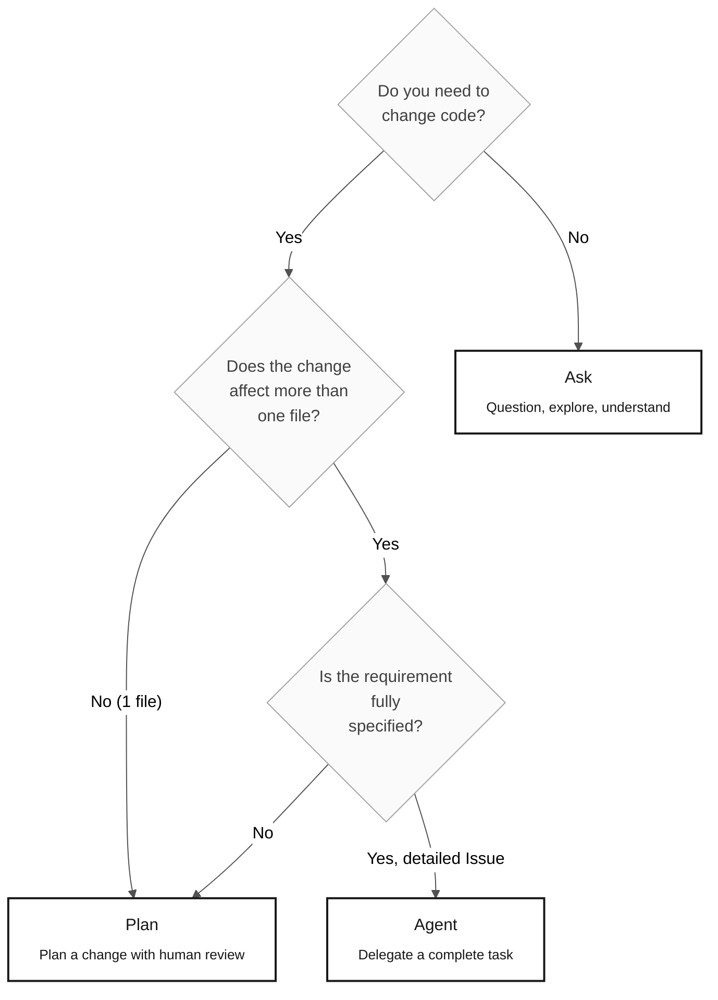

# Copilot's 3 Modes — Ask, Plan, and Agent

> **Path:** [Team Kit](../README.md) › [Concepts](00-README.md) › **Copilot's 3 Modes**

**GitHub Copilot operates in three distinct modes—Ask, Plan, and Agent—and choosing the wrong mode for a task wastes time. This document provides objective criteria for selecting the right mode in each workshop situation.**

  

| Field | Value |
|---|---|
| **Target audience** | All participants |
| **Prerequisites** | Read [Agents and Personas](02-agents-and-personas.md) |
| **Estimated time** | 15 minutes |
| **Stage** | All stages |
| **Expected outcome** | Know which mode to use for each task without hesitation |

---

## Concept

Copilot Chat provides three operating modes with different levels of autonomy, time costs, and outputs:

- **Ask** — conversational mode. You ask questions and receive text answers. No code is changed.
- **Plan** — planning mode. You describe a change, and Copilot proposes a plan listing the files to touch and the changes to make—before execution.
- **Agent** — autonomous mode. You provide a well-defined task, usually as an Issue, and Copilot reads the code, implements the change, and opens a PR autonomously.

---

## Why it matters

Using the wrong mode has direct consequences:

- **Ask when you should use Plan:** You receive correct guidance but must perform everything manually, making the work slower than necessary.
- **Agent when you should use Ask:** Copilot changes multiple files based on incomplete context, generating a faulty PR that takes longer to correct than a manual change.
- **Plan when you should use Agent:** You review a step-by-step plan for a large, well-defined task, creating unnecessary manual effort.

---

## Decision tree



---

## Comparing the three modes

| Criterion | Ask | Plan | Agent |
|---|---|---|---|
| **What it does** | Explains selected context | Proposes a plan without implementing | Performs authorized local workspace actions; not automatic GitHub issue assignment |
| **Autonomy** | No requested workspace changes | Planning only | Bounded by task, permissions, and human review |
| **Time cost** | Depends on scope | Includes plan review | Includes implementation, tool execution and verification |
| **When to use** | Explore, understand, answer questions | Multi-file change with human review | Fully specified Issue with context and acceptance criteria |
| **Prerequisite** | None | Context for what to change | Issue containing context, REQ-IDs, acceptance criteria, and traceability |
| **Rework risk** | None | Low | High if the Issue is incomplete |

---

## Prompt examples by mode — SIFAP context

### Ask — explore the legacy system

```text
"Read the selected source interval with me.
Include declarations, dependencies, I/O and error/transaction paths
that affect the observed behavior. Keep unknowns explicit."
```

```text
"@archaeologist, which fields in BENEFIC.ddm
are mandatory, and which are multiple-value fields (MU)?"
```

### Plan — implement a requirement with review

```text
"Plan the implementation of the selected REQ-NNN.
List the files to create or modify, the order of changes,
and the required integration tests.
DO NOT implement yet—I am completing the C2 self-check."
```

```text
"Plan the next reviewed schema change from the DBA mapping.
Inspect existing Flyway versions and the actual query contract.
Do not invent a target field or resolve a source-data ambiguity."
```

### Local Agent and GitHub coding agent

```text
[For a local reviewed task:]
- Governing requirement and task: <actual references>
- Allowed files/actions: <reviewed scope>
- Source evidence: <actual paths and intervals>
- Verification: <approved acceptance tests>

[For post-challenge Stage 4 issue-to-PR work:]
Verify GitHub coding-agent availability and assign the reviewed issue
through the repository's supported action. Selecting local Agent mode
does not assign an issue. Record unavailability instead of inventing a run.

Stage 4 is not used in the individual challenge; do not run parallel subagent
orchestration or worker harnesses during the 14:00-17:40 challenge.
```

---

## Anti-patterns — what not to do

| Anti-pattern | Consequence | Correct alternative |
|---|---|---|
| Use Agent for a two-minute question | Delay, context consumption, and risk of unwanted changes | Use Ask |
| Use Ask to implement an entire service | You receive guidance but perform everything manually | Use Plan or Agent |
| Delegate to Agent without a detailed Issue | Generated PR contains incorrect or incomplete code | Write the complete Issue before starting Agent |
| Use Plan during Stage 1 (archaeology) | Copilot may try to modify the legacy system | Use Ask with `@archaeologist` |
| Ignore the Plan output before execution | Unexpected changes to unplanned files | Read and approve the plan before confirming |

---

## Estimated time cost

Measure the participant's actual work. Local reasoning, tool execution, remote-agent
queues and peer review have different costs; no fixed duration follows from
the mode name. Use the stage budgets and 20-minute escalation rule without
weakening evidence requirements.

> [!WARNING]
> Agent time includes review of the generated PR. PRs with incomplete context may require multiple iterations.

---

## References

- [One-page cheat sheet for the 3 modes](../09-cheat-sheets/copilot-3-modes.md)
- [Agents and Personas](02-agents-and-personas.md)
- [Stage 4 Guide — Agent mode in practice](../04-evolution/GUIDE.md) (post-challenge; not used in the individual challenge)

---

### Continue reading

| Previous | Next |
|---|---|
| [Visual Glossary](03-visual-glossary.md)<br/><sub>30+ terms with definitions and SIFAP examples.</sub> | [EARS Notation](05-ears-notation.md)<br/><sub>How to write unambiguous requirements.</sub> |

<sub>[Back to the kit index](../README.md)</sub>
