# EARS Notation — Unambiguous Requirements

> **Path:** [Team Kit](../README.md) › [Concepts](00-README.md) › **EARS Notation**

**EARS (Easy Approach to Requirements Syntax) is a set of six language patterns that transforms vague requirements into fixed-format statements that can be tested automatically. It is the mandatory notation for all SIFAP 2.0 requirements.**

  

| Field | Value |
|---|---|
| **Target audience** | Requirements Engineer, Software Architect, Product Owner |
| **Prerequisites** | Read the assigned `.NSN` programs and [Spec-Driven Development](01-spec-driven-development.md) |
| **Estimated time** | 25 minutes |
| **Stage** | Stage 2 — Specification |
| **Expected outcome** | Write valid EARS requirements with a REQ-ID and `source_legacy:` |

---

## Concept

A poorly written requirement is the leading cause of rework in modernization projects. Statements such as "the system must be secure" or "process data correctly" do not specify what the system does, when it does it, or how to verify the outcome.

EARS solves this problem with six syntax patterns. Each pattern maps to a type of behavior and produces a statement with an objective test. If you cannot imagine an automated test for a requirement, the requirement is vague.

---

## Why it matters in SIFAP

SIFAP's assigned reading covers 15 Natural members and four DDMs, with supporting
sources in the local corpus. Without EARS, each team member can interpret the
rules differently. The team links each confirmed rule to its actual source and
tests rather than copying a completed example.

---

## Basic requirement structure

Use this unfilled structure for a requirement in the feature's `spec.md`:

```yaml
REQ-NNN:
  pattern: <ubiquitous | event-driven | state-driven | optional | unwanted | complex>
  text: "<complete EARS statement>"
  source_legacy: "<path>.NSN#L<start>-L<end>"
  acceptance:
    - "<verifiable criterion 1>"
    - "<verifiable criterion 2>"
```

> [!CAUTION]
> The `source_legacy:` field is mandatory in every requirement. The `legacy-traceability` CI job rejects PRs containing REQ-IDs without this field.

---

## The EARS patterns

### Pattern 1 — Ubiquitous (always applies)

**When to use:** The rule applies at all times without a condition.

**Template:**

```
The system shall <action>.
```

**Team exercise:** identify an always-applicable rule in the source and record
the evidence and acceptance criteria in the unfilled structure above.

**Poor example:**

```
The system shall provide complete auditing.
```

Problem: "complete auditing" is not testable.

---

### Pattern 2 — Event-driven (when something happens)

**When to use:** The rule is triggered by a specific event.

**Template:**

```
When <event>, the system shall <action>.
```

**Team exercise:** identify a source event and its response. Derive expected
values from confirmed evidence; do not invent a rate, status, or target table.

**Poor example:**

```
When there is a payment, process it.
```

Problem: "process" does not describe the expected action.

---

### Pattern 3 — State-driven (while a state persists)

**When to use:** The rule applies while the system or entity is in a particular state.

**Template:**

```
While <state condition>, the system shall <action>.
```

**Team exercise:** find an observed state condition and establish what changes
while it holds. Cite the actual program and test both sides of the condition.

---

### Pattern 4 — Optional (when the user chooses)

**When to use:** The rule applies only when the user has enabled an option or selected a configuration.

**Template:**

```
Where <selected option>, the system shall <action>.
```

**Team exercise:** establish whether an option exists in the source. If the team
proposes a new capability, label it `[GREENFIELD]` with a justification instead
of claiming a legacy equivalent.

---

### Pattern 5 — Unwanted behavior (what must not happen)

**When to use:** The system must respond to an unwanted condition or failure.

**Template:**

```
If <unwanted condition>, then the system shall <response>.
```

**Team exercise:** distinguish observed error handling from a proposed security
requirement. Record the actual evidence or greenfield justification; do not
attribute a modern API behavior to an unrelated source line.

---

## Pattern 6 — Complex (combination of patterns)

The sixth EARS pattern combines state, event, and option conditions in a single requirement. It is consistent with the terminology in [`09-cheat-sheets/spec-kit-workflow.md`](../09-cheat-sheets/spec-kit-workflow.md), which lists all six EARS patterns.

**Template:**

```
While <state>, when <event>, where <option>, the system shall <action>.
```

**Team exercise:** combine only conditions supported by the team's findings.
Check whether separate requirements would be clearer before selecting this pattern.

> [!TIP]
> Use the Complex pattern sparingly. If a requirement combines no more than two conditions without losing clarity, Complex may be appropriate. If it is difficult to read, split it into two REQ-IDs.

---

## From an EARS requirement to a test

```mermaid
%%{init: {'theme':'neutral','themeVariables':{'fontFamily':'ui-sans-serif, system-ui, sans-serif','primaryColor':'#F5F5F5','primaryTextColor':'#171717','primaryBorderColor':'#171717','lineColor':'#525252','secondaryColor':'#FFFFFF','tertiaryColor':'#FAFAFA','background':'#FFFFFF'}}}%%
flowchart LR
    classDef step fill:#F5F5F5,stroke:#171717,color:#171717
    classDef gate fill:#FFFFFF,stroke:#171717,color:#171717,stroke-width:2px
    classDef muted fill:#FAFAFA,stroke:#A3A3A3,color:#404040

    A["Legacy rule<br/><sub>.NSN or .ddm</sub>"]:::muted
    B["BR-NNN<br/><sub>business-rules-catalog.md</sub>"]:::step
    C["REQ-NNN (EARS)<br/><sub>pattern + text + source_legacy</sub>"]:::step
    D["Acceptance criteria<br/><sub>acceptance: [...]</sub>"]:::step
    E["Automated test<br/><sub>JUnit 5 + Testcontainers</sub>"]:::step
    F["Green CI<br/><sub>legacy-traceability passed</sub>"]:::gate

    A --> B --> C --> D --> E --> F
```



---

## The mirror test

Before considering an EARS requirement complete, ask:

> "How would I test this automatically?"

If the answer is vague or nonexistent, the requirement is incomplete.

| Vague requirement | Question needed before writing it |
|---|---|
| The system shall be secure | Which boundary, threat, and observable response does the requirement cover? |
| Process data | Which input, transformation, and source-backed expected result apply? |
| Complete auditing | Which events and fields are required, and where is that established? |
| Work well | Which measurable threshold and workload have stakeholders approved? |

---

## EARS validation checklist

- [ ] **Unique identifier.** The REQ-ID exists and follows the `REQ-NNN` format.
- [ ] **Correct pattern.** The pattern declared in `pattern:` matches the text structure.
- [ ] **Unambiguous text.** It does not use "appropriate," "efficient," "complete," or "secure" without a quantitative definition.
- [ ] **Completed `source_legacy:`.** It points to a specific file and lines or declares `[GREENFIELD]` with a justification.
- [ ] **Verifiable acceptance criteria.** Every `acceptance:` item describes a scenario with input, action, and expected result.
- [ ] **Test can be imagined.** An automated test can be described for every acceptance criterion.
- [ ] **Appropriate size.** If the requirement covers more than one distinct behavior, split it into two REQ-IDs.

---

## Common mistakes and how to avoid them

| Symptom | Cause | Correction |
|---|---|---|
| Unsure which pattern to use | The rule has not yet been categorized | Start with event-driven (`When…`)—it covers 60% of cases |
| Cannot find `source_legacy:` | Requirement written from memory | Return to the `.NSN` and locate the section. Without evidence, there is no requirement. |
| Requirement is three paragraphs long | It contains two or more distinct requirements | Split it. One REQ-ID = one atomic behavior. |
| Team cannot agree on the text | Ambiguity in the legacy system | Run `/speckit.clarify` and record the decision in an ADR. |

---

## Useful prompts in Copilot Chat

```text
# Convert a catalog rule to EARS
/ears-convert BR-NNN: <text of the rule confirmed by the team>.
Use <actual source path and verified line range> as source_legacy.

# Validate a written EARS requirement
"@architect, is this EARS requirement testable? How would you write the test?
REQ-NNN: <requirement text>"

# Identify coverage gaps
/speckit.analyze
Which confirmed catalog rules do not yet have a REQ-ID?
```

---

## References

- [Stage 2 Guide](../02-modern-spec/GUIDE.md)
- [Spec-Kit cheat sheet](../09-cheat-sheets/spec-kit-workflow.md)
- [LEGACY-EXPLORATION-CHECKLIST](../01-archaeology/LEGACY-EXPLORATION-CHECKLIST.md)

---

### Continue reading

| Previous | Next |
|---|---|
| [Copilot's 3 Modes](04-3-copilot-modes.md)<br/><sub>Ask, Plan, and Agent—selection criteria.</sub> | [Architecture Decision Records](06-architecture-decision-records.md)<br/><sub>How to record decisions for the future team.</sub> |

<sub>[Back to the kit index](../README.md)</sub>
