# Notação EARS — requisitos sem ambiguidade

> **Trilha:** [Kit do Time](../README.md) › [Conceitos](00-README.md) › **Notação EARS**

**EARS (Easy Approach to Requirements Syntax) é um conjunto de seis padrões de linguagem que transforma requisitos vagos em declarações de formato fixo, testáveis automaticamente. É a notação obrigatória para todos os requisitos do SIFAP 2.0.**

  

| Campo | Valor |
|---|---|
| **Público-alvo** | Requirements Engineer, Software Architect, Product Owner |
| **Pré-requisitos** | Ler os programas `.NSN` atribuídos e [Spec-Driven Development](01-spec-driven-development.md) |
| **Tempo estimado** | 25 minutos |
| **Estágio** | Estágio 2 — Especificação |
| **Resultado esperado** | Escrever requisitos EARS válidos com REQ-ID e `source_legacy:` |

---

## Conceito

Um requisito mal escrito é a principal causa de retrabalho em projetos de modernização. Afirmações como "o sistema deve ser seguro" ou "processar os dados corretamente" não especificam o que o sistema faz, quando faz nem como verificar o resultado.

O EARS resolve esse problema com seis padrões de sintaxe. Cada padrão corresponde a um tipo de comportamento e produz uma declaração com teste objetivo. Se você não consegue imaginar um teste automatizado para um requisito, o requisito está vago.

---

## Por que isso importa no SIFAP

A leitura atribuída do SIFAP cobre 15 membros Natural e quatro DDMs, com fontes de apoio no acervo local. Sem EARS, cada pessoa pode interpretar as regras de um jeito. A equipe vincula cada regra confirmada à sua fonte e aos testes reais, em vez de copiar um exemplo pronto.

---

## Estrutura básica de um requisito

Use esta estrutura não preenchida para um requisito no `spec.md` da funcionalidade:

```yaml
REQ-NNN:
  pattern: <ubiquitous | event-driven | state-driven | optional | unwanted | complex>
  text: "<declaração EARS completa>"
  source_legacy: "<caminho>.NSN#L<início>-L<fim>"
  acceptance:
    - "<critério verificável 1>"
    - "<critério verificável 2>"
```

> [!CAUTION]
> O campo `source_legacy:` é obrigatório em todos os requisitos. O job de CI `legacy-traceability` rejeita PRs que contenham REQ-IDs sem esse campo.

---

## Os padrões EARS

### Padrão 1 — Ubiquitous (sempre se aplica)

**Quando usar:** a regra vale a todo momento, sem condição.

**Template:**

```
O sistema deve <ação>.
```

**Exercício da equipe:** identifique uma regra sempre aplicável na fonte e registre as evidências e os critérios de aceitação na estrutura não preenchida acima.

**Exemplo ruim:**

```
O sistema deve prover auditoria completa.
```

Problema: "auditoria completa" não é testável.

---

### Padrão 2 — Event-driven (quando algo acontece)

**Quando usar:** a regra é disparada por um evento específico.

**Template:**

```
Quando <evento>, o sistema deve <ação>.
```

**Exercício da equipe:** identifique um evento de origem e sua resposta. Derive os valores esperados de evidências confirmadas; não invente alíquota, status nem tabela de destino.

**Exemplo ruim:**

```
Quando houver um pagamento, processe-o.
```

Problema: "processe" não descreve a ação esperada.

---

### Padrão 3 — State-driven (enquanto um estado persiste)

**Quando usar:** a regra vale enquanto o sistema ou a entidade estiver em determinado estado.

**Template:**

```
Enquanto <condição de estado>, o sistema deve <ação>.
```

**Exercício da equipe:** encontre uma condição de estado observada e estabeleça o que muda enquanto ela vigora. Cite o programa real e teste os dois lados da condição.

---

### Padrão 4 — Optional (quando uma funcionalidade opcional está presente)

**Quando usar:** a regra só vale quando a pessoa usuária habilitou uma opção ou selecionou uma configuração.

**Template:**

```
Onde <funcionalidade opcional estiver presente>, o sistema deve <ação>.
```

**Exercício da equipe:** estabeleça se uma opção existe na fonte. Se a equipe propuser uma capacidade nova, marque-a como `[GREENFIELD]` com uma justificativa, em vez de afirmar um equivalente no legado.

---

### Padrão 5 — Unwanted behavior (o que não pode acontecer)

**Quando usar:** o sistema precisa responder a uma condição indesejada ou falha.

**Template:**

```
Se <condição indesejada>, então o sistema deve <resposta de mitigação>.
```

**Exercício da equipe:** diferencie o tratamento de erro observado de um requisito de segurança proposto. Registre a evidência real ou a justificativa greenfield; não atribua um comportamento moderno de API a uma linha de fonte não relacionada.

---

## Padrão 6 — Complex (combinação de padrões)

O sexto padrão EARS combina condições de estado, evento e opção em um único requisito. Ele é consistente com a terminologia de [`09-cheat-sheets/spec-kit-workflow.md`](../09-cheat-sheets/spec-kit-workflow.md), que lista os seis padrões EARS.

**Template:**

```
Enquanto <estado>, quando <evento>, onde <opção>, o sistema deve <ação>.
```

**Exercício da equipe:** combine somente condições sustentadas pelos achados da equipe. Verifique se requisitos separados seriam mais claros antes de escolher este padrão.

> [!TIP]
> Use o padrão Complex com parcimônia. Se um requisito combina no máximo duas condições sem perder clareza, o Complex pode ser adequado. Se ficar difícil de ler, divida em dois REQ-IDs.

---

## De um requisito EARS para um teste

```mermaid
%%{init: {'theme':'neutral','themeVariables':{'fontFamily':'ui-sans-serif, system-ui, sans-serif','primaryColor':'#F5F5F5','primaryTextColor':'#171717','primaryBorderColor':'#171717','lineColor':'#525252','secondaryColor':'#FFFFFF','tertiaryColor':'#FAFAFA','background':'#FFFFFF'}}}%%
flowchart LR
    classDef step fill:#F5F5F5,stroke:#171717,color:#171717
    classDef gate fill:#FFFFFF,stroke:#171717,color:#171717,stroke-width:2px
    classDef muted fill:#FAFAFA,stroke:#A3A3A3,color:#404040

    A["Regra do legado<br/><sub>.NSN ou .ddm</sub>"]:::muted
    B["BR-NNN<br/><sub>business-rules-catalog.md</sub>"]:::step
    C["REQ-NNN (EARS)<br/><sub>pattern + text + source_legacy</sub>"]:::step
    D["Critérios de aceitação<br/><sub>acceptance: [...]</sub>"]:::step
    E["Teste automatizado<br/><sub>JUnit 5 + Testcontainers</sub>"]:::step
    F["CI verde<br/><sub>legacy-traceability aprovado</sub>"]:::gate

    A --> B --> C --> D --> E --> F
```



---

## O teste do espelho

Antes de considerar um requisito EARS concluído, pergunte:

> "Como eu testaria isso automaticamente?"

Se a resposta for vaga ou inexistente, o requisito está incompleto.

| Requisito vago | Pergunta necessária antes de escrevê-lo |
|---|---|
| O sistema deve ser seguro | Qual fronteira, ameaça e resposta observável o requisito cobre? |
| Processar os dados | Qual entrada, transformação e resultado esperado sustentado pela fonte se aplicam? |
| Auditoria completa | Quais eventos e campos são obrigatórios, e onde isso está estabelecido? |
| Funcionar bem | Qual limite mensurável e carga de trabalho foram aprovados pelas partes interessadas? |

---

## Checklist de validação EARS

- [ ] **Identificador único.** O REQ-ID existe e segue o formato `REQ-NNN`.
- [ ] **Padrão correto.** O padrão declarado em `pattern:` corresponde à estrutura do texto.
- [ ] **Texto sem ambiguidade.** Não usa "adequado", "eficiente", "completo" ou "seguro" sem definição quantitativa.
- [ ] **`source_legacy:` preenchido.** Aponta para um arquivo e linhas específicos ou declara `[GREENFIELD]` com justificativa.
- [ ] **Critérios de aceitação verificáveis.** Todo item de `acceptance:` descreve um cenário com entrada, ação e resultado esperado.
- [ ] **Teste imaginável.** É possível descrever um teste automatizado para cada critério de aceitação.
- [ ] **Tamanho adequado.** Se o requisito cobre mais de um comportamento distinto, divida em dois REQ-IDs.

---

## Erros comuns e como evitá-los

| Sintoma | Causa | Correção |
|---|---|---|
| Dúvida sobre qual padrão usar | A regra ainda não foi categorizada | Comece por event-driven (`Quando…`) — cobre 60% dos casos |
| Não encontra o `source_legacy:` | Requisito escrito de memória | Volte ao `.NSN` e localize o trecho. Sem evidência, não há requisito. |
| O requisito tem três parágrafos | Ele contém dois ou mais requisitos distintos | Divida. Um REQ-ID = um comportamento atômico. |
| O time não chega a um acordo sobre o texto | Ambiguidade no legado | Rode `/speckit.clarify` e registre a decisão em um ADR. |

---

## Prompts úteis no modo Ask do GitHub Copilot

```text
# Converter uma regra do catálogo para EARS
/ears-convert BR-NNN: <texto da regra confirmada pela equipe>.
Use <path real da fonte e intervalo de linhas verificado> como source_legacy.

# Validar um requisito EARS já escrito
"@architect, este requisito EARS é testável? Como você escreveria o teste?
REQ-NNN: <texto do requisito>"

# Identificar lacunas de cobertura
/speckit.analyze
Quais regras confirmadas do catálogo ainda não têm um REQ-ID?
```

---

## Referências

- [Guia do Estágio 2](../02-modern-spec/GUIDE.md)
- [Cartão de referência do Spec-Kit](../09-cheat-sheets/spec-kit-workflow.md)
- [LEGACY-EXPLORATION-CHECKLIST](../01-archaeology/LEGACY-EXPLORATION-CHECKLIST.md)

---

### Continue lendo

| Anterior | Próximo |
|---|---|
| [Os 3 modos do Copilot](04-3-copilot-modes.md)<br/><sub>Ask, Plan e Agent — critérios de escolha.</sub> | [Architecture Decision Records](06-architecture-decision-records.md)<br/><sub>Como registrar decisões para o time do futuro.</sub> |

<sub>[Voltar ao índice do kit](../README.md)</sub>
