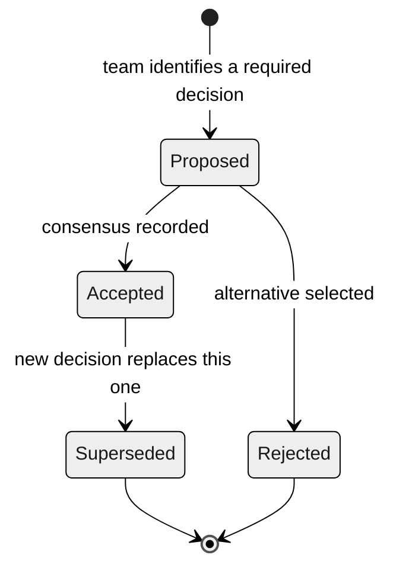

# Architecture Decision Records (ADR)

> **Path:** [Team Kit](../README.md) › [Concepts](00-README.md) › **Architecture Decision Records**

**An Architecture Decision Record (ADR) is a short document that records a significant architecture decision: the context that prompted it, the decision made, the alternatives considered, and the consequences. It ensures that today's reasoning remains understandable to anyone who works on the system in the future.**

  

| Field | Value |
|---|---|
| **Target audience** | Software Architect, Enterprise Architect, Technical Lead, Product Owner |
| **Prerequisites** | [Spec-Driven Development](01-spec-driven-development.md) |
| **Estimated time** | 20 minutes |
| **Stage** | Stage 2 — Specification |
| **Expected outcome** | Know when and how to write a valid ADR for SIFAP 2.0 |

---

## Concept

An architecture decision is any technical choice that affects the system's structure, contracts, or long-term operation. Examples include selecting an architecture pattern, defining how to represent Adabas multiple-value fields in the relational model, or choosing an authentication strategy.

Undocumented technical decisions become "tribal knowledge" that depends on who was in the room. When this knowledge is not recorded, future teams make contradictory decisions, introduce redundancy, or discard work because they lack context.

An ADR formalizes the reasoning in a Markdown file stored in the repository alongside the code it governs.

---

## Why it matters in SIFAP

SIFAP represents approximately 30 years of history. Record reviewed mapping,
module and contract decisions so future maintainers can understand their
evidence and trade-offs. The workshop does not establish a 30-year service-life
requirement for the replacement.

Without ADRs, maintenance costs increase every time the team changes.

---

## ADR anatomy

```markdown
# ADR-NNN: Decision title

**Status:** Proposed | Accepted | Rejected | Superseded by ADR-NNN
**Date:** YYYY-MM-DD
**Authors:** [names]

## Context

Describe the situation requiring a decision: evidence, constraints,
risks, and what happens if no decision is made now.

## Decision

One sentence. "We chose X using Y."

## Alternatives considered

- **Alternative A:** <description and reason to accept or reject>
- **Alternative B:** <description and reason to accept or reject>

## Consequences

- Positive: <expected benefit>
- Negative: <accepted cost or risk>
- Note: <condition that would make this decision obsolete>
```

---

## ADR lifecycle



> [!IMPORTANT]
> Never delete an ADR. When a decision is replaced, update its status to `Superseded by ADR-NNN` and create a new ADR explaining the new decision. The reasoning history is valuable.

---

## When to write an ADR

Use the three-question test:

1. Does the decision **affect multiple files, modules, or people**?
2. Would **reversing** the decision cost more than one day of work?
3. Would someone on the team ask, "Why did we do it this way?" six months from now?

If two or more answers are yes, write an ADR.

### Examples

| Decision | ADR required | Rationale |
|---|---|---|
| Use Spring Boot 3.3 instead of Quarkus | Yes | Affects every module and is irreversible within the workshop timeframe |
| Represent Adabas MU fields as a child table | Yes | Affects the data model and JPA mappings in multiple modules |
| Adopt a Modular Monolith instead of microservices | Yes | Structural decision with project-wide impact |
| Version the API with the `/api/v1` prefix | Yes | Affects every API contract |
| Replace `final` with `var` in a local variable | No | Local, reversible, and has no external impact |
| Add Lombok as a dependency | Yes | Affects every module that adopts it |
| Use `@Autowired` versus constructor injection | Yes, if it becomes the team standard | Affects every Spring component |

---

## Apply the method to SIFAP

Architects and DBA investigate the actual DDM/FDT definitions and source records
before choosing a representation. Use the [blank ADR template](../docs/adr/0000-template.md)
and [data migration guide](../docs/DATA-MIGRATION.md).

| Question to investigate | Evidence the team supplies |
|---|---|
| Which source structure needs a mapping decision? | Actual source path, fields, and observed occurrences |
| Which relationships and ordering must survive? | Program access patterns and measured source records |
| Which target options satisfy the query needs? | Alternatives, constraints, and tests |
| How will the team detect lost or changed data? | Reconciliation, rerun, and recovery criteria |
| Who approved the decision? | Reviewer names, date, and actual status |

Do not copy an accepted decision from a reference solution or infer occurrence
counts from an illustrative example. The team completes the decision itself.

---

## Completed ADR checklist

- [ ] **Sequential number** in the `ADR-NNN` format.
- [ ] **Declared status:** Proposed, Accepted, Rejected, or Superseded.
- [ ] **Date and authors** recorded.
- [ ] **Context** explains why the decision is needed now, not only what was decided.
- [ ] **Decision in one sentence**—objective and unambiguous.
- [ ] **At least two alternatives** listed with reasons for rejection.
- [ ] **Consequences** include negatives as well as positives.
- [ ] **Fits on one page**—if it does not, it probably contains two separate decisions.
- [ ] **The Product Owner can read and understand** the context and decision without technical expertise.

---

## Common mistakes and how to avoid them

| Symptom | Cause | Correction |
|---|---|---|
| ADR does not list alternatives | Time pressure | List at least two, even briefly. Without alternatives, the reader cannot understand the trade-off. |
| ADR describes only benefits | Confirmation bias | Every decision has a cost. If there are no negative consequences, the reasoning is incomplete. |
| Decision without context | Started with the decision instead of the problem | Write the context first. "Why now?" matters more than "what?" |
| ADR is five pages long | Multiple decisions are mixed together | Split it. One ADR = one decision. |
| ADR deleted when superseded | Manual file management | Mark it as `Superseded by ADR-NNN`. Never delete it. |

---

## Useful prompts in Copilot Chat

```text
# Structure an ADR
"@architect, record an ADR about <open decision>.
Use the alternatives and evidence provided by the team.
DO NOT choose for the team—present the trade-offs."

# Challenge a decision before accepting it
"@architect, read ADR-002 and play devil's advocate.
What are the three strongest arguments for REJECTING this decision?"

# Resolve a team deadlock
/speckit.clarify
"Within the required Modular Monolith, compare the team's alternatives
for this unresolved module or data-ownership boundary.
Keep the decision pending until the accountable reviewers agree."
```

---

## References

- [Blank ADR template](../02-modern-spec/ADR-TEMPLATE.md)
- [Stage 2 Guide](../02-modern-spec/GUIDE.md)
- [adr.github.io — official pattern](https://adr.github.io)

---

### Continue reading

| Previous | Next |
|---|---|
| [EARS Notation](05-ears-notation.md)<br/><sub>How to write unambiguous requirements.</sub> | [Personas (Overview)](../05-personas/OVERVIEW.md)<br/><sub>Choose your two workshop roles.</sub> |

<sub>[Back to the kit index](../README.md)</sub>
