# 07 — The Method Beyond Mainframe

> **Path:** [Team Kit](../README.md) › [Core Concepts](00-README.md) › **Beyond Mainframe**

**The evidence-first method applies to any system nobody fully understands anymore, and SIFAP is only the corpus this kit happens to ship.** After reading this you can adapt the same approach to COBOL, Delphi, VB6, PL/SQL, or an undocumented Java or .NET monolith.

| Field | Value |
|---|---|
| **Target audience** | Anyone who will apply the method outside this workshop |
| **Prerequisites** | [Spec-Driven Development](01-spec-driven-development.md), [Copilot's 3 modes](04-3-copilot-modes.md) |
| **Estimated time** | 12 min |
| **Stage** | All challenge stages — read after Stage 1, apply after the workshop |
| **Expected outcome** | You can map each stage's technique onto your own legacy stack |

 

---

## Concept: what is actually being taught

Natural and Adabas are incidental. What makes SIFAP hard is not its syntax; it is
four conditions that have nothing to do with the mainframe:

| Condition | Why it defeats a rewrite | Where it also appears |
|---|---|---|
| Behavior lives only in code | No specification survived, so "what should it do" has no owner | Any undocumented system of any age |
| The authors are gone | Intent cannot be asked for, only inferred | Any system older than its team |
| Documentation drifted | Reading the manual produces confident wrong answers | Every system with a manual |
| The data outlived the code | Schema, values, and rules disagree with each other | Every long-lived database |

A system that meets these four conditions is a legacy system, whether it was
written in 1997 in Natural or in 2016 in Spring Boot. The method answers those
conditions, not the language.

> [!IMPORTANT]
> The inverse also holds. A COBOL system with a current specification, its
> original team, and reconciled data is not a modernization problem — it is an
> ordinary refactor. Do not run this method where it is not needed.

---

## How the method translates

Each stage has one technique. Only the *file extensions* change between stacks.

```mermaid
%%{init: {'theme':'neutral','themeVariables':{'fontFamily':'ui-sans-serif, system-ui, sans-serif','primaryColor':'#F5F5F5','primaryTextColor':'#171717','primaryBorderColor':'#171717','lineColor':'#525252','secondaryColor':'#FFFFFF','tertiaryColor':'#FAFAFA','background':'#FFFFFF'}}}%%
flowchart LR
    classDef step fill:#F5F5F5,stroke:#171717,color:#171717
    classDef muted fill:#FAFAFA,stroke:#A3A3A3,color:#404040
    classDef result fill:#FFFFFF,stroke:#171717,color:#171717,stroke-width:2px

    A["Stage 1<br/>Inventory + read<br/><sub>evidence with line citations</sub>"]:::step
    B["Stage 2<br/>Specify what to preserve<br/><sub>traceable requirements</sub>"]:::step
    C["Stage 3<br/>Prove equivalence<br/><sub>tests + migrated data</sub>"]:::step
    D["Post-challenge extension<br/><sub>one capability that was blocked</sub>"]:::step
    L["Any legacy stack"]:::muted
    R["A system you<br/>can now change"]:::result

    L --> A --> B --> C --> D --> R
```

### Stage 1 — Inventory and read

| Technique | Natural/Adabas | COBOL/CICS/DB2 | Delphi / VB6 | PL/SQL / Oracle Forms | Java or .NET monolith |
|---|---|---|---|---|---|
| Enumerate units | Library members `.NSP`, `.NSN` | Programs + `COPY` books | `.pas`, `.dfm`, `.frm` | Packages, procedures | Classes by package |
| Find the entry points | JCL `CMSYNIN` | JCL `EXEC PGM=` | Form event handlers | Job schedules, triggers | Controllers, `main`, jobs |
| Trace the call graph | `CALLNAT`, `INCLUDE`, `USING` | `CALL`, `COPY`, `EXEC CICS LINK` | `uses`, direct calls | Package dependencies | Import graph, DI wiring |
| Read the data contract | DDM + FDT | Copybook + DCLGEN | Types embedded in the UI | Data dictionary views | ORM entities, DDL |
| Cite evidence | `CALCBENF.NSN#L40-L58` | `PGM.cbl#L40-L58` | `Unit.pas#L40-L58` | `pkg_calc.sql#L40-L58` | `BenefitService.java#L40-L58` |

The output is identical in every column: a rule catalog where each row cites a
file and a line range, plus a register of questions nobody can answer yet.

### Stage 2 — Specify what to preserve

The stage-2 question never changes: **which observed behavior is a business rule,
and which is an accident of the platform?** The accidents differ by stack.

| Stack | Typical accident that must not be preserved |
|---|---|
| Natural/Adabas | Field widths driven by 3270 geometry; a century window added for Y2K |
| COBOL | `PIC` clauses sized for tape records; `88`-level flags standing in for enums |
| Delphi / VB6 | Validation living in a form event because there was nowhere else to put it |
| PL/SQL | Business logic in a trigger because the application could not be redeployed |
| Java or .NET monolith | A workaround for a framework version nobody can upgrade |

Every preserved behavior gets a requirement with a source citation. Every
deliberate change gets a decision record stating what is being dropped and why.

### Stage 3 — Prove equivalence

Equivalence is claimed with tests that run the same inputs through both
descriptions of the behavior, and with data reconciliation from source to target.
Neither depends on the source language. What changes is how you obtain a baseline:

| Baseline source | When to use it |
|---|---|
| Recorded production inputs and outputs | Available and authorized — the strongest baseline |
| Test cases derived from the read code | The common case; weaker, and must say so |
| Parallel run against the legacy system | Possible only when the legacy system is still running and authorized |
| No baseline | Record the gap; do not claim equivalence |

### Post-challenge extension — Delegate and extend

> [!NOTE]
> Stage 4 — Evolution is kept in the kit for post-challenge work, but it is not used in the individual challenge. The challenge ends at Stage 3 and judge validation. See [ADR-0003](../docs/adr/0003-individual-challenge-format.md).

The delegation discipline is stack-independent: a bounded issue, an authorized
run, and a human review of the diff. So is the closing move — one capability the
legacy system could not offer, justified by a constraint the team can cite.

| Stack | A constraint that typically blocks capability |
|---|---|
| Natural/Adabas | Fixed screen geometry; batch-only output paths |
| COBOL | Record-oriented files without a query surface |
| Delphi / VB6 | Desktop-only deployment; no remote access path |
| PL/SQL | No API boundary — every consumer is a database client |
| Java or .NET monolith | A single deployable that cannot be scaled or released independently |

---

## Apply the method to your system

Answer these before adopting the method anywhere. Blanks are findings, not
failures.

- [ ] **Which four conditions hold?** Name them for your system, with evidence.
- [ ] **What is the smallest unit of enumeration?** A member, a program, a form, a package, a class.
- [ ] **Which four edge types build your call graph?** Name your equivalents of `CALLNAT`, `INCLUDE`, `USING`, and job scheduling.
- [ ] **Where is the data contract declared, and does it still match the data?** Never assume it does.
- [ ] **What is your evidence citation format?** Agree on it before anyone reads code.
- [ ] **What baseline can you legitimately obtain?** Decide this before promising equivalence.
- [ ] **Which capability is currently blocked, and by what?** If you cannot name the constraint, you do not yet have Act V.

---

## Use cases

**Use the method when** the system's behavior is undocumented, the original team
is unavailable, and the data must survive the migration intact.

**Do not use it when** a current specification exists and is trusted, when the
system is small enough to read in an afternoon, or when the decision is to retire
the system rather than migrate it. Archaeology on a system you are switching off
is wasted effort.

---

## Common errors and how to avoid them

| Symptom | Cause | Correction |
|---|---|---|
| You rewrite instead of reading | The stack looks familiar, so the four conditions are assumed away | Run the Stage 1 gate anyway; familiarity is not documentation |
| Requirements have no source | The technique was ported but the traceability rule was dropped | Keep the citation requirement; it is the part that carries over |
| Equivalence is claimed without a baseline | No recorded production behavior was available and nobody said so | Record the baseline's strength alongside the claim |
| "Legacy" is used to mean "old" | The four conditions were never tested | A system qualifies by its conditions, not by its age or language |
| The new capability has no justification | Act V was treated as a feature slot | Require a citable constraint, or drop the claim |

---

## References

- [Spec-Driven Development](01-spec-driven-development.md) — the specification cycle this method feeds
- [Copilot's 3 modes](04-3-copilot-modes.md) — which mode carries which act
- [EARS notation](05-ears-notation.md) — the requirement format and its traceability field
- [Stage 1 — Archaeology](../01-archaeology/GUIDE.md) — the technique in its Natural/Adabas form
- [Stage 4 — Evolution](../04-evolution/GUIDE.md) — post-challenge delegation and the closing capability

---

### Continue reading

| Previous | Next |
|---|---|
| [06 — Architecture Decision Records](06-architecture-decision-records.md) How to record decisions for the future team. | [Stage 1 — Archaeology](../01-archaeology/GUIDE.md) Run the method against this kit's corpus. |

[Back to the kit index](../README.md)
