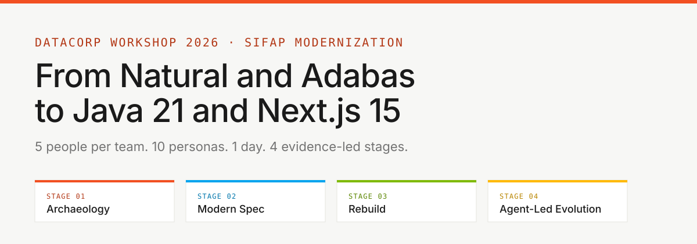

# SIFAP 2.0 individual challenge kit

Start at [`00-START-HERE.md`](00-START-HERE.md).

## Repository languages

**`main` is always the English edition and the default branch.** Brazilian Portuguese lives on `portugues-br`, and Spanish on `espanol`.

| Language | Branch | Documentation | Clone |
|---|---|---|---|
| **English** | [`main`](https://github.com/workshop-gbb/datacorp-sifap-modernization-team-kit/tree/main) | [Start here](00-START-HERE.md) · [Documentation index](docs/README.md) · [Copilot instructions](.github/copilot-instructions.md) | `git clone --branch main https://github.com/workshop-gbb/datacorp-sifap-modernization-team-kit.git` |
| **Português (BR)** | [`portugues-br`](https://github.com/workshop-gbb/datacorp-sifap-modernization-team-kit/tree/portugues-br) | [Start here (pt-BR)](https://github.com/workshop-gbb/datacorp-sifap-modernization-team-kit/blob/portugues-br/00-START-HERE.md) · [Documentation index (pt-BR)](https://github.com/workshop-gbb/datacorp-sifap-modernization-team-kit/blob/portugues-br/docs/README.md) · [Copilot instructions (pt-BR)](https://github.com/workshop-gbb/datacorp-sifap-modernization-team-kit/blob/portugues-br/.github/copilot-instructions.md) | `git clone --branch portugues-br https://github.com/workshop-gbb/datacorp-sifap-modernization-team-kit.git` |
| **Español** | [`espanol`](https://github.com/workshop-gbb/datacorp-sifap-modernization-team-kit/tree/espanol) | [Start here (ES)](https://github.com/workshop-gbb/datacorp-sifap-modernization-team-kit/blob/espanol/00-START-HERE.md) · [Documentation index (ES)](https://github.com/workshop-gbb/datacorp-sifap-modernization-team-kit/blob/espanol/docs/README.md) · [Copilot instructions (ES)](https://github.com/workshop-gbb/datacorp-sifap-modernization-team-kit/blob/espanol/.github/copilot-instructions.md) | `git clone --branch espanol https://github.com/workshop-gbb/datacorp-sifap-modernization-team-kit.git` |

Keep documentation and Copilot primitive prose on `main` and `develop` in English. Preserve file names, paths, technical identifiers, and original Natural/Adabas sources when translating.

---



**Mission:** one participant modernizes a bounded SIFAP capability — beneficiary listing, search, and detail — from Natural/Adabas evidence to Java 21 + Next.js 15 with reconciled PostgreSQL data.

  

---

## Scenario, chronology, and evidence

The exercise models a long-lived payment system, not a complete production migration in one afternoon. Its supplied architecture and source history begin in **1997**. At the **2026** workshop reference year, that spans approximately three decades. "30-year-old" is rounded scenario language, not a reason to change source dates.

The dates, authors, and name index this kit stands behind are transcribed from [`01-archaeology/legacy-sifap/CHRONOLOGY.md`](01-archaeology/legacy-sifap/CHRONOLOGY.md), with deliberate divergences registered in [declared drift](01-archaeology/legacy-sifap/DECLARED-DRIFT.md). Cite the legacy representation actually read. Do not copy sensitive production data into Git, issues, logs, or screenshots.

---

## Where to start

| I need... | Start here |
|---|---|
| **The pre-work and 14:00 action** | [`00-START-HERE.md`](00-START-HERE.md) |
| **The challenge schedule** | [`00-TEAM-FLOW.md`](00-TEAM-FLOW.md) |
| **Laptop setup** | [`00-SETUP.md`](00-SETUP.md) |
| **Git and PR rules** | [`00-GIT-WORKFLOW.md`](00-GIT-WORKFLOW.md) |
| **A visual map** | [`00-SITEMAP.md`](00-SITEMAP.md) |
| **Concepts and glossary** | [`07-concepts/`](07-concepts/) |
| **Cross-cutting docs** | [`docs/README.md`](docs/README.md) |
| **Progress template** | [`docs/STATUS.md`](docs/STATUS.md) |

---

## Participant kit scope

This repository contains participant exercise materials only.

| Included | Purpose |
|---|---|
| Stage guides and role kits | Guide the responsibilities one participant covers alone |
| Local Natural sources, DDMs, FDT, and historical documents | Supply evidence for discovery and traceability |
| Specification, decision, progress, and data-validation templates | Capture your findings and deliverables |
| Copilot primitives and CI checks | Support implementation and validation |

> [!IMPORTANT]
> The website, Pages publication, instructor demos, answer keys, running reference solutions, and judge scripts belong to the private instructor repository. The local legacy corpus is reading material; you build your own solution.

Data is part of the delivery. You must establish authorized source readiness, plan extraction and loading, migrate to PostgreSQL, reconcile records with QA-style evidence, and prove listing, search, and detail for the complete migrated beneficiary population. Follow [the data migration guide](docs/DATA-MIGRATION.md); source administration and credentials remain outside this kit.

---

## How the challenge is organized

The individual challenge has three build stages followed by judge validation. Stage 4 materials remain in the repository for post-challenge learning, but they are not used in the timed challenge. See [ADR-0003](docs/adr/0003-individual-challenge-format.md).

```mermaid
%%{init: {'theme':'neutral','themeVariables':{'fontFamily':'ui-sans-serif, system-ui, sans-serif','primaryColor':'#F5F5F5','primaryTextColor':'#171717','primaryBorderColor':'#171717','lineColor':'#525252','secondaryColor':'#FFFFFF','tertiaryColor':'#FAFAFA','background':'#FFFFFF'}}}%%
flowchart LR
    classDef step fill:#F5F5F5,stroke:#171717,color:#171717
    classDef check fill:#FFFFFF,stroke:#525252,color:#171717
    classDef result fill:#FFFFFF,stroke:#171717,color:#171717,stroke-width:2px

    E1["Stage 1<br/>Archaeology<br/>@archaeologist"]:::step
    C1["C1<br/>self-check"]:::check
    E2["Stage 2<br/>Specification<br/>@architect"]:::step
    C2["C2<br/>self-check"]:::check
    E3["Stage 3<br/>Implementation + migration<br/>@builder"]:::step
    C3["C3<br/>submission PR"]:::check
    J["Judge validation"]:::result

    E1 --> C1 --> E2 --> C2 --> E3 --> C3 --> J
```



| Time | Step | Agent |
|---|---|---|
| 14:00-14:50 | Stage 1 — Archaeology | `@archaeologist` + `@dba` as needed |
| 14:50-15:30 | Stage 2 — Specification | `@architect` + `@dba` as needed |
| 15:30-17:10 | Stage 3 — Implementation and data migration | `@builder` + `@dba` |
| 17:10-17:40 | Final judge validation | Judge |

The first two participants whose submission PRs pass judge validation win.

---

## Kit structure

```text
workspace/
├── README.md
├── 00-START-HERE.md
├── 00-SETUP.md
├── 00-TEAM-FLOW.md
├── 00-SITEMAP.md
├── 00-GIT-WORKFLOW.md
├── 01-archaeology/          Stage 1 - read legacy SIFAP
├── 02-modern-spec/          Stage 2 - write EARS, ADRs, design
├── 03-implementation/       Stage 3 - Java + Next.js + tests + migration
├── 04-evolution/            Post-challenge reference only
├── 05-personas/             10 role responsibilities you cover yourself
├── 06-stage-agents/         Stage agents plus cross-stage @dba
├── 07-concepts/             Core concepts
├── 09-cheat-sheets/         Quick reference cards
├── docs/                    Cross-cutting docs, ADRs, STATUS
└── .spec/                   Spec-Kit artifacts
```

---

## Stage agents and role skills

| Layer | Primitive | How it loads | What it answers |
|---|---|---|---|
| [`06-stage-agents/`](06-stage-agents/) | **Agent** — `@archaeologist`, `@architect`, `@builder` | You select it once per stage | Which phase am I in now? |
| [`05-personas/`](05-personas/) | **Skill** — one per role in `.github/skills/` | Loads automatically from its description | Which responsibility applies to this task? |

`@dba` is cross-stage because data discovery, migration, and reconciliation span the whole challenge. Every other role is a skill. The reasoning is in [ADR-0002](docs/adr/0002-team-roles-as-skills-not-agents.md).

---

## Git branch rules

Use one repository per participant.

```text
spec/<NNN>-<feature>  <- Stage 2, from develop
impl/<NNN>-<feature>  <- Stage 3 and submission, from develop
```

The judged submission PR is `impl/<NNN>-<feature>` -> `develop`. Details: [`00-GIT-WORKFLOW.md`](00-GIT-WORKFLOW.md).

---

## Finish line

A submission is accepted only if all pass:

1. CI green, including `legacy-traceability` and test jobs.
2. Every requirement has REQ-ID, EARS, and `source_legacy:`.
3. Tests pass: backend `mvn verify`; frontend tests if a frontend was built.
4. Data reconciled: source count = loaded + explained rejects; source keys and agreed aggregates reconciled; no unexplained losses; rerun without duplicates.
5. Listing, search, and detail cover the complete migrated beneficiary population.

---

## Approved tools

Use the fixed workshop stack: VS Code, GitHub Copilot (Ask + Plan + Agent), GitHub Copilot CLI if instructed, official Spec-Kit, GitHub, Docker / Docker Compose, and Terraform for optional planning. Do not mix in other AI assistants, IDEs, SDD frameworks, or inherited containerization.

---

### Continue reading

| Previous | Next |
|---|---|
| - | [00 - Start here](00-START-HERE.md)<br/><sub>Pre-work, 14:00 launch, finish line, submission.</sub> |

<sub>[Back to the kit index](README.md)</sub>
