# Kit do desafio individual SIFAP 2.0

Comece por [`00-START-HERE.md`](00-START-HERE.md).

## Idiomas do repositório

**Esta cópia do workshop é a edição em Português do Brasil (PT-BR).** A documentação e a prosa dos primitivos do Copilot são apresentadas em PT-BR, enquanto nomes de arquivos, caminhos, identificadores técnicos e fontes Natural/Adabas legados são preservados.

| Idioma | Branch | Documentação | Clone |
|---|---|---|---|
| **English** | [`main`](https://github.com/workshop-gbb/datacorp-sifap-modernization-team-kit/tree/main) | [Comece aqui](00-START-HERE.md) · [Índice da documentação](docs/README.md) · [Instruções do Copilot](.github/copilot-instructions.md) | `git clone --branch main https://github.com/workshop-gbb/datacorp-sifap-modernization-team-kit.git` |
| **Português (BR)** | [`portugues-br`](https://github.com/workshop-gbb/datacorp-sifap-modernization-team-kit/tree/portugues-br) | [Comece aqui (pt-BR)](https://github.com/workshop-gbb/datacorp-sifap-modernization-team-kit/blob/portugues-br/00-START-HERE.md) · [Índice da documentação (pt-BR)](https://github.com/workshop-gbb/datacorp-sifap-modernization-team-kit/blob/portugues-br/docs/README.md) · [Instruções do Copilot (pt-BR)](https://github.com/workshop-gbb/datacorp-sifap-modernization-team-kit/blob/portugues-br/.github/copilot-instructions.md) | `git clone --branch portugues-br https://github.com/workshop-gbb/datacorp-sifap-modernization-team-kit.git` |
| **Español** | [`espanol`](https://github.com/workshop-gbb/datacorp-sifap-modernization-team-kit/tree/espanol) | [Comece aqui (ES)](https://github.com/workshop-gbb/datacorp-sifap-modernization-team-kit/blob/espanol/00-START-HERE.md) · [Índice da documentação (ES)](https://github.com/workshop-gbb/datacorp-sifap-modernization-team-kit/blob/espanol/docs/README.md) · [Instruções do Copilot (ES)](https://github.com/workshop-gbb/datacorp-sifap-modernization-team-kit/blob/espanol/.github/copilot-instructions.md) | `git clone --branch espanol https://github.com/workshop-gbb/datacorp-sifap-modernization-team-kit.git` |

Ao traduzir, preserve nomes de arquivos, caminhos, identificadores técnicos e fontes Natural/Adabas originais.

---


**Missão:** um participante moderniza uma capacidade delimitada do SIFAP — listagem, pesquisa e detalhes de beneficiários — partindo de evidências Natural/Adabas para Java 21 + Next.js 15, com dados PostgreSQL reconciliados.

  

---

## Cenário, cronologia e evidências

O exercício representa um sistema de pagamentos de longa duração, não uma migração completa de produção em uma única tarde. A arquitetura e o histórico dos fontes fornecidos começam em **1997**. No ano de referência do workshop, **2026**, isso corresponde a aproximadamente três décadas. A expressão "30 anos" é uma descrição arredondada do cenário, não um motivo para alterar as datas dos fontes.

As datas, os autores e o índice de nomes garantidos por este kit foram transcritos de [`01-archaeology/legacy-sifap/CHRONOLOGY.md`](01-archaeology/legacy-sifap/CHRONOLOGY.md), com divergências intencionais registradas em [desvios declarados](01-archaeology/legacy-sifap/DECLARED-DRIFT.md). Cite a representação legada realmente lida. Não copie dados sensíveis de produção para o Git, issues, logs nem capturas de tela.

---

## Por onde começar

| Preciso de... | Comece aqui |
|---|---|
| **Atividades prévias e ação das 14:00** | [`00-START-HERE.md`](00-START-HERE.md) |
| **Cronograma do desafio** | [`00-TEAM-FLOW.md`](00-TEAM-FLOW.md) |
| **Configuração do computador** | [`00-SETUP.md`](00-SETUP.md) |
| **Regras de Git e PR** | [`00-GIT-WORKFLOW.md`](00-GIT-WORKFLOW.md) |
| **Um mapa visual** | [`00-SITEMAP.md`](00-SITEMAP.md) |
| **Conceitos e glossário** | [`07-concepts/`](07-concepts/) |
| **Documentos transversais** | [`docs/README.md`](docs/README.md) |
| **Template de progresso** | [`docs/STATUS.md`](docs/STATUS.md) |

---

## Escopo do kit do participante

Este repositório contém somente os materiais do exercício do participante.

| Incluído | Finalidade |
|---|---|
| Guias das etapas e kits de funções | Orientar as responsabilidades que um participante cobre sozinho |
| Fontes Natural locais, DDMs, FDT e documentos históricos | Fornecer evidências para descoberta e rastreabilidade |
| Templates de especificação, decisão, progresso e validação de dados | Registrar suas descobertas e entregáveis |
| Primitivos do Copilot e verificações de CI | Apoiar a implementação e a validação |

> [!IMPORTANT]
> O site, a publicação no Pages, as demonstrações do instrutor, os gabaritos, as soluções de referência em execução e os scripts da banca pertencem ao repositório privado do instrutor. O corpus legado local é material de leitura; você cria sua própria solução.

Os dados fazem parte da entrega. Você deve estabelecer a preparação autorizada da origem, planejar a extração e a carga, migrar para o PostgreSQL, reconciliar os registros com evidências no estilo de QA e comprovar listagem, pesquisa e detalhes para a população completa de beneficiários migrados. Siga o [guia de migração de dados](docs/DATA-MIGRATION.md); a administração da origem e as credenciais permanecem fora deste kit.

---

## Como o desafio está organizado

O desafio individual tem três etapas de construção, seguidas pela validação da banca. Os materiais da Etapa 4 permanecem no repositório para aprendizado após o desafio, mas não são usados durante o desafio cronometrado. Consulte a [ADR-0003](docs/adr/0003-individual-challenge-format.md).

```mermaid
%%{init: {'theme':'neutral','themeVariables':{'fontFamily':'ui-sans-serif, system-ui, sans-serif','primaryColor':'#F5F5F5','primaryTextColor':'#171717','primaryBorderColor':'#171717','lineColor':'#525252','secondaryColor':'#FFFFFF','tertiaryColor':'#FAFAFA','background':'#FFFFFF'}}}%%
flowchart LR
    classDef step fill:#F5F5F5,stroke:#171717,color:#171717
    classDef check fill:#FFFFFF,stroke:#525252,color:#171717
    classDef result fill:#FFFFFF,stroke:#171717,color:#171717,stroke-width:2px

    E1["Etapa 1<br/>Arqueologia<br/>@archaeologist"]:::step
    C1["C1<br/>autoverificação"]:::check
    E2["Etapa 2<br/>Especificação<br/>@architect"]:::step
    C2["C2<br/>autoverificação"]:::check
    E3["Etapa 3<br/>Implementação + migração<br/>@builder"]:::step
    C3["C3<br/>PR de envio"]:::check
    J["Validação da banca"]:::result

    E1 --> C1 --> E2 --> C2 --> E3 --> C3 --> J
```



| Horário | Etapa | Agente |
|---|---|---|
| 14:00-14:50 | Etapa 1 — Arqueologia | `@archaeologist` + `@dba` conforme necessário |
| 14:50-15:30 | Etapa 2 — Especificação | `@architect` + `@dba` conforme necessário |
| 15:30-17:10 | Etapa 3 — Implementação e migração de dados | `@builder` + `@dba` |
| 17:10-17:40 | Validação final da banca | Banca |

Os dois primeiros participantes cujos PRs de envio passarem na validação da banca vencem.

---

## Estrutura do kit

```text
workspace/
├── README.md
├── 00-START-HERE.md
├── 00-SETUP.md
├── 00-TEAM-FLOW.md
├── 00-SITEMAP.md
├── 00-GIT-WORKFLOW.md
├── 01-archaeology/          Stage 1 - read legacy SIFAP
├── 02-modern-spec/          Stage 2 - write EARS, ADRs, design
├── 03-implementation/       Stage 3 - Java + Next.js + tests + migration
├── 04-evolution/            Post-challenge reference only
├── 05-personas/             10 role responsibilities you cover yourself
├── 06-stage-agents/         Stage agents plus cross-stage @dba
├── 07-concepts/             Core concepts
├── 09-cheat-sheets/         Quick reference cards
├── docs/                    Cross-cutting docs, ADRs, STATUS
└── .spec/                   Spec-Kit artifacts
```

---

## Agentes de etapa e skills de função

| Camada | Primitivo | Como é carregado | O que responde |
|---|---|---|---|
| [`06-stage-agents/`](06-stage-agents/) | **Agente** — `@archaeologist`, `@architect`, `@builder` | Você o seleciona uma vez por etapa | Em qual fase estou agora? |
| [`05-personas/`](05-personas/) | **Skill** — uma por função em `.github/skills/` | Carregada automaticamente com base em sua descrição | Qual responsabilidade se aplica a esta tarefa? |

`@dba` atua entre etapas porque a descoberta de dados, a migração e a reconciliação abrangem todo o desafio. Todas as outras funções são skills. A justificativa está na [ADR-0002](docs/adr/0002-team-roles-as-skills-not-agents.md).

---

## Regras de branches Git

Use um repositório por participante.

```text
spec/<NNN>-<feature>  <- Stage 2, from develop
impl/<NNN>-<feature>  <- Stage 3 and submission, from develop
```

O PR avaliado é `impl/<NNN>-<feature>` -> `develop`. Detalhes: [`00-GIT-WORKFLOW.md`](00-GIT-WORKFLOW.md).

---

## Linha de chegada

Um envio será aceito somente se todos os itens passarem:

1. CI verde, incluindo `legacy-traceability` e os jobs de teste.
2. Todo requisito tem REQ-ID, EARS e `source_legacy:`.
3. Os testes passam: `mvn verify` no backend; testes do frontend, caso um frontend tenha sido criado.
4. Dados reconciliados: contagem da origem = carregados + rejeições explicadas; chaves da origem e agregados acordados reconciliados; nenhuma perda sem explicação; reexecução sem duplicidades.
5. Listagem, pesquisa e detalhes cobrem toda a população migrada de beneficiários.

---

## Ferramentas aprovadas

Use a stack fixa do workshop: VS Code, GitHub Copilot (Ask + Plan + Agent), GitHub Copilot CLI quando orientado, Spec-Kit oficial, GitHub, Docker/Docker Compose e Terraform para planejamento opcional. Não misture outros assistentes de IA, IDEs, frameworks de SDD nem containerização herdada.

---

### Continue a leitura

| Anterior | Próximo |
|---|---|
| - | [00 — Comece aqui](00-START-HERE.md)<br/><sub>Atividades prévias, início às 14:00, linha de chegada e envio.</sub> |

<sub>[Voltar ao índice do kit](README.md)</sub>
