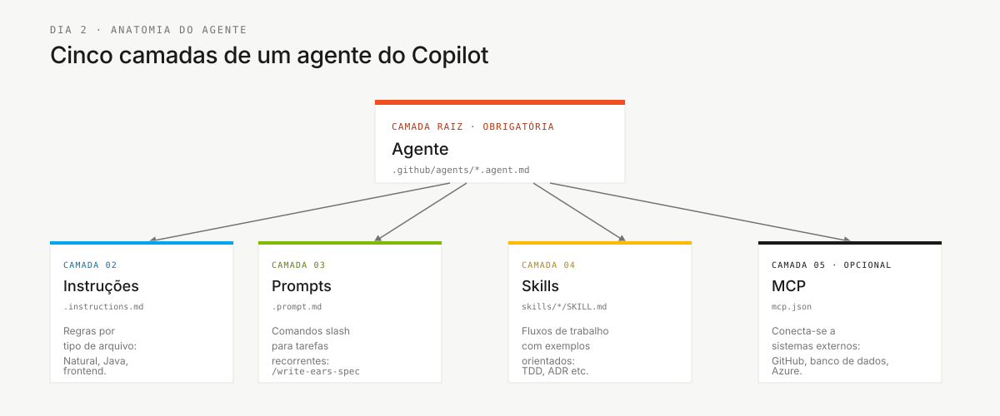

# Agentes de etapa do desafio — explicados


> **Caminho:** [Kit da equipe](../README.md) › [Documentação](README.md) › **Agentes do desafio explicados**

**Explica por que o desafio individual usa agentes de etapa enquanto os papéis permanecem como skills de carregamento automático.** Leia quando alguém perguntar: “Por que seleciono um agente de etapa se cubro todos os papéis?”

| Campo | Valor |
|---|---|
| **Público-alvo** | Participantes individuais do workshop |
| **Pré-requisitos** | Ler rapidamente a visão geral das personas |
| **Resultado esperado** | Entender por que uma fase é um agente e um papel é uma skill |

---

## Conceito

Uma **skill de papel** responde: “Qual responsabilidade estou aplicando?” Um **agente de etapa** responde: “Como o Copilot deve se comportar nesta fase?”

Ambos são necessários e complementares. No desafio individual, um participante cobre todos os 10 papéis, e essas skills de papel são carregadas automaticamente pela descrição. Você seleciona deliberadamente apenas o agente da etapa atual porque cada etapa tem limites, entregas permitidas e definição de pronto diferentes.

> [!NOTE]
> O desafio usa três agentes de etapa — `@archaeologist`, `@architect` e `@builder` — além do agente transversal `@dba`. `@evolution` permanece no repositório para o kit de SDLC mais longo, mas não é usado no desafio individual, que termina na Etapa 3 e na validação do juiz. Consulte a [ADR-0003](adr/0003-individual-challenge-format.md).

---

## Por que existem três agentes de etapa do desafio mais o `@dba`

| Etapa | Modo de trabalho | Agente | Regra principal |
|---|---|---|---|
| 1 — Arqueologia | Observar e catalogar | `@archaeologist` | Não escrever código; citar evidências do legado |
| 2 — Especificação | Estruturar e decidir | `@architect` | Não aceitar um requisito sem `source_legacy:` |
| 3 — Implementação e migração de dados | Construir, migrar e verificar | `@builder` | Não programar sem REQ-ID e caminho de teste |
| Ciclo de vida dos dados entre etapas | Descobrir, mapear, carregar, reconciliar e recuperar | `@dba` | Não substituir dados migrados por seed data |

A Etapa 1 é somente leitura **para as entradas legadas**, mas produz artefatos de descoberta. A Etapa 2 produz requisitos rastreáveis e design. A Etapa 3 produz código, artefatos de migração, testes e evidências. Separar esses limites torna o fluxo de trabalho mais claro.

---

## Anatomia do agente



| Camada | Finalidade | Exemplo |
|---|---|---|
| Agente | Define missão, ferramentas e comportamento para uma fase | `@builder` sabe como implementar e testar |
| Skill | Contém um papel ou técnica, carregado automaticamente pela descrição | `persona-qa-engineer`, TDD, ADR, extração de regras de negócio |
| Instruções | Regras sensíveis ao tipo de arquivo | Natural/Adabas, Java, frontend |
| Prompts | Ações reutilizáveis vinculadas ao agente responsável pelo momento | `/translate-natural-to-java`, `/write-ears-spec` |
| MCP | Conecta o agente a sistemas externos | GitHub, bancos de dados e Azure, quando configurados |

---

## Como usar os agentes durante o desafio

- [ ] **Comece pela etapa.** Consulte [`00-TEAM-FLOW.md`](../00-TEAM-FLOW.md) para ver o orçamento atual e o checkpoint de autoverificação.
- [ ] **Selecione o agente de etapa no Copilot Chat.** Exemplo: `@architect` na Etapa 2.
- [ ] **Use as personas de papel como checklists.** Você cobre por conta própria do Product Owner ao Tech Writer; as skills de papel se compõem automaticamente.
- [ ] **Acione `@dba` para o trabalho com dados.** Use-o durante descoberta, mapeamento, carga, reconciliação e evidências de nova execução/recuperação.
- [ ] **Pare em C1, C2 e C3.** Avance apenas quando a definição de pronto da autoverificação estiver atendida.

---

## Fluxo de interação

Durante a Etapa 2, leve uma descoberta confirmada ao `@architect` e peça requisitos rastreáveis:

```text
@architect
I confirmed this rule in the legacy sources:
"<confirmed rule>"
Help structure it in EARS with a REQ-ID, acceptance criteria, and source_legacy.
```

O artefato deve registrar apenas evidências que você revisou:

```yaml
REQ-XXX:
  pattern: <EARS pattern>
  text: "<requirement>"
  source_legacy: <file:lines or [GREENFIELD] + justification>
  acceptance: "<verifiable scenario>"
```

---

## Regra: nenhuma resposta pronta do exercício

Os agentes orientam a leitura e registram evidências revisadas pelo participante. Eles não usam uma solução pronta como substituta da descoberta nem respondem ou encerram mistérios sem validação responsável. Prompts de persona podem selecionar o especialista pertinente, como `@dba`, dentro dos limites da etapa atual.

| Se você pedir... | O agente responderá... |
|---|---|
| “Diga quais são os bounded contexts” | “Mostre-me o catálogo de programas e o mapa de dados.” |
| “Crie requisitos para tudo” | “Vamos começar com uma regra que tenha uma fonte legada.” |
| “Implemente esta funcionalidade sem uma especificação” | “Faltam o REQ-ID, o critério de aceitação e `source_legacy`.” |

---

## Como saber se você entendeu

Você entende o modelo quando consegue explicar estas três afirmações a outra pessoa:

1. Uma skill de papel define uma responsabilidade e carrega a si mesma; um agente de etapa define uma fase e é selecionado.
2. O agente de etapa muda durante o desafio; as responsabilidades dos 10 papéis permanecem disponíveis automaticamente.
3. Todo artefato importante deve sobreviver fora do chat em um arquivo versionado.

---

## Referências

- [Kits de agentes](../06-stage-agents/README.md)
- [Matriz de personas e agentes](persona-agent-matrix.md)
- [Fluxo do desafio](../00-TEAM-FLOW.md)
- [Kits de personas](../05-personas/README.md)

---

### Continue lendo

| Anterior | Próximo |
|---|---|
| [Matriz de personas e agentes](persona-agent-matrix.md)<br/><sub>Checklist de papéis por etapa.</sub> | [Fluxo do desafio](../00-TEAM-FLOW.md)<br/><sub>Cronograma e checkpoints de autoverificação.</sub> |

<sub>[Voltar ao índice do kit](../README.md)</sub>
