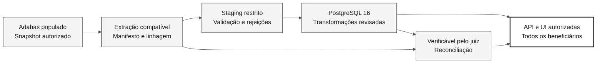

# Migração de dados: Adabas para PostgreSQL

> **Caminho:** [Kit da equipe](../README.md) > [Documentação](README.md) > **Migração de dados**

**O participante cobre as responsabilidades de DBA no ciclo de vida dos dados de origem, desde uma fonte Adabas populada e verificada até registros reconciliados no PostgreSQL que a aplicação moderna consegue consultar.**

| Campo | Valor |
|---|---|
| Público-alvo | Participante individual que cobre as responsabilidades de DBA, QA, PO/RE, Arquitetura, Desenvolvimento e DevOps |
| Pré-requisitos | Fonte Adabas populada e autorizada, com rota de extração acordada e pronta antes das 14:00, além de evidências da leitura da origem |
| Etapa | Pré-trabalho e Etapas 1-3; validação final do juiz |
| Resultado esperado | Registros derivados da origem, reconciliação verificável pelo juiz, consulta completa de beneficiários e recuperação testada |

## O que o kit fornece

O [corpus legado local](../01-archaeology/legacy-sifap/) fornece fontes Natural,
DDMs, uma listagem FDT arquivada e documentos históricos somente para leitura.
Esses materiais estabelecem evidências para investigação, não um banco de dados
em execução, um mapa de dados concluído, um schema aprovado nem uma solução de migração.

O [conjunto de dados legados sintéticos](../01-archaeology/legacy-seed-data/README.md)
documenta os registros de largura fixa que a pessoa responsável pela origem
carrega no Adabas e seus layouts. Use-o como proveniência da população, prática
de decodificação, expectativas independentes de teste e fixtures de casos extremos.
Ele não é a fonte da migração nem prova o conteúdo atual do Adabas.

O sistema legado autorizado tem seu próprio processo de população. Durante o
pré-trabalho, o participante coordena com a pessoa responsável pela origem para
garantir que o Adabas esteja populado antes das 14:00 e registra a versão da
origem, a proveniência dos dados sintéticos e as contagens medidas. As contagens
pretendidas por um gerador, os arquivos seed de largura fixa ou as estatísticas
arquivadas da FDT não comprovam o conteúdo atual do Adabas.

O acesso à origem, a administração da população e as credenciais permanecem fora
deste kit. Nunca redefina um banco de dados compartilhado nem execute uma carga
em um ambiente não confirmado. Se a origem estiver indisponível ou vazia,
registre a pessoa responsável e o bloqueio. A leitura do código pode continuar,
mas o gate de prontidão dos dados não pode ser aprovado.

## Responsabilidades ao longo das etapas

| Etapa | Responsabilidade de DBA | Colaboração e evidências |
|---|---|---|
| Pré-trabalho | Confirmar a origem autorizada e populada e a capacidade compatível de leitura/extração antes das 14:00 | A pessoa responsável pela origem fornece evidências da população; DevOps apoia a disponibilidade; o participante registra as medições de referência |
| 1 - Arqueologia | Inventariar definições, registros, chaves, formatos, relacionamentos e incertezas sobre a qualidade dos dados | O participante define as necessidades de população e consulta enquanto lê somente a origem necessária para a capacidade fixa |
| 2 - Especificação | Projetar mapeamentos, contrato de snapshot/extração, staging, ordem de carga, tratamento de rejeições, nova execução/retomada e recuperação | O participante define limites dos módulos, escopo, reconciliação e testes de consulta |
| 3 - Implementação | Criar o schema e implementar/executar o pipeline aprovado de dados da origem ao destino | O participante integra API/UI, reconcilia o snapshot e testa o acesso completo aos beneficiários |
| Validação do juiz | Verificar reconciliação, consultas completas de beneficiários, nova execução/retomada, evidências de recuperação e CI | Scripts do juiz e valores esperados fornecem independência |

O participante cobre por conta própria as responsabilidades de DBA e QA.
A independência vem da verificação do juiz, não de outro participante nem de
uma segunda persona sob a mesma pessoa operadora. Registre como os dados foram
carregados, como foram verificados e quais evidências o juiz pode inspecionar.

## Limite viável do workshop

Antes das 14:00, a pessoa responsável pela origem deve fornecer um Adabas
autorizado e populado e uma rota compatível e verificável de snapshot/extração.
Solicitações de acesso, licenças, provisionamento da origem e engenharia reversa
de uma exportação binária desconhecida não são tarefas ocultas no orçamento de
implementação da Etapa 3.

O participante seleciona a menor amplitude de capacidade ponta a ponta que
preserva a população acordada da origem e os dados relacionados obrigatórios.
Cobrir toda a população não significa reimplementar todos os pagamentos,
relatórios, batches ou fluxos de trabalho históricos. Registre explicitamente
o tratamento dos campos, a linhagem e as capacidades adiadas. Nunca omita
silenciosamente registros ou campos exigidos pela aceitação.

Em C2, compare o trabalho restante com a complexidade real da origem e a
prontidão do participante. Se ele não couber no prazo, mantenha a migração como
bloqueada/incompleta e registre um plano de continuação revisável. Um incremento
menor e verificado é um resultado de aprendizagem válido, mas não comprova que
a migração completa foi bem-sucedida. Nenhuma estimativa de duração deste kit
foi comprovada por um teste cronometrado com participantes.

## Da origem ao destino, não de seed para seed

O Flyway versiona o schema e aplica cada versão uma vez. Ele não extrai registros
do Adabas, não acompanha novas tentativas por registro nem desfaz automaticamente
uma carga de dados. O pipeline de registros precisa de seus próprios
identificadores de execução, checkpoints, limites de transação, prevenção de
duplicidades e evidências de recuperação. Fixtures de teste isoladas são úteis,
mas não substituem a população no caminho de aceitação.

## Etapa 1: gerar evidências por meio de arqueologia orientada

Estas são saídas que o participante cria durante a leitura, não respostas fornecidas:

| Saída | Modelo | Prompt |
|---|---|---|
| Inventário da origem e registro de leitura | [Inventário](../01-archaeology/templates/inventory.template.md), [cobertura](../01-archaeology/templates/reading-coverage.md) | `/archaeology-kickoff`, depois atualize a cobertura real da leitura |
| Mapa da origem DDM/FDT e declarações dos programas | [Mapa de dados](../01-archaeology/templates/data-map.md), [dicionário](../01-archaeology/templates/program-data-dictionary.md) | `/map-source-data` com DBA e `@archaeologist` |
| Prontidão da origem populada | [Prontidão](data-migration/source-readiness.template.md) | Selecione `@dba` e peça o preenchimento do registro com medições reais e bloqueios explícitos |
| Questões em aberto | [Registro de mistérios](../01-archaeology/templates/mysteries-found.template.md) | `/catalog-mysteries` usando IDs atribuídos pela pessoa leitora |
| Relatório C1 | [Relatório de descoberta](../01-archaeology/templates/discovery-report.template.md) | `/discovery-report` após a revisão das evidências |

A descoberta de dados registra **o que a origem declara ou contém**. Ela não
aprova tabelas do PostgreSQL nem resolve inconsistências. Diferencie formatos
lógicos de DDM, tamanhos físicos de bytes da FDT e declarações Natural. Preserve
ambiguidades como questões. Consultas de acesso somente leitura e capturas de
tela, isoladamente, não estabelecem um contrato completo de extração.

> [!NOTE]
> A Etapa 4 não é usada no desafio individual (14:00-17:40). O desafio termina na Etapa 3 e na validação do juiz. Consulte a [ADR-0003](adr/0003-individual-challenge-format.md).

## Etapa 2: definir um contrato de migração verificável

Use o [modelo de plano de migração](data-migration/migration-plan.template.md) e
o [modelo de mapeamento origem-destino](data-migration/source-to-target.template.md)
como registros de apoio vinculados a `spec.md`, `plan.md` e `tasks.md` da
funcionalidade. Os requisitos formais permanecem em `.spec/<NNN>-<feature>/`,
com `REQ-NNN` e `source_legacy:` ou um `[GREENFIELD]` justificado.

Antes de C2, o participante registra decisões para as responsabilidades de DBA, Arquitetura e QA:

- Versão e população autorizadas da origem e limite consistente do snapshot, incluindo gravações simultâneas e arquivos relacionados.
- Método de extração compatível, formato/versão, layout dos campos, codificação, enquadramento dos registros, checksums, chaves da origem e verificações de completude. Uma extração desconhecida é um bloqueio, não uma permissão para inventar uma API.
- Tratamento no nível dos campos para identificadores e zeros à esquerda, valores vazios/nulos/suprimidos, datas e fusos horários, decimais exatos, relacionamentos, ocorrências MU/PE e ordenação.
- Linhagem da origem ao destino e ordem de carga orientada por dependências. Normalize dados repetidos estruturados, exceto quando evidências medidas justificarem outra representação.
- Regras de validação e rejeição, quem pode aprovar a correção e preservação das evidências originais. Nunca trunque, preencha com valor padrão, descarte nem "corrija" silenciosamente os valores da origem.
- Identificadores de execução, batches limitados, checkpoints de reinício, comportamento de repetição e isolamento de dados não relacionados no destino.
- Recuperação do destino e compatibilidade da aplicação, separadamente do rollback do schema. Não suponha a existência de um recurso licenciado de undo do Flyway.
- Consultas de aceitação para listagem, pesquisa e detalhes autorizados de **todos os beneficiários da população acordada**, com paginação e verificações de acesso.

Não traduza tamanhos packed mecanicamente. Determine os dígitos inteiros e
fracionários, o sinal e a representação em runtime na origem antes de escolher
`NUMERIC(precision, scale)` no PostgreSQL e `BigDecimal` no Java. Nunca use
ponto flutuante para dados financeiros.

## Etapa 3: popular, reconciliar e consultar

1. Escreva testes para mapeamentos, registros inválidos, preservação de chaves, ocorrências repetidas e falhas antes de implementar o pipeline.
2. Extraia o snapshot acordado do Adabas pela rota aprovada. Registre um manifesto com versão, IDs de snapshot/execução, população, arquivos, verificações de integridade e locais restritos das evidências.
3. Armazene a entrada imutável em staging e valide-a. Carregue o PostgreSQL usando os mapeamentos e a ordem aprovados, com batches recuperáveis e rejeições explícitas.
4. Reconcilie o mesmo snapshot de forma verificável pelo juiz: conjuntos de chaves da origem, contabilização de registros aceitos/rejeitados, campos obrigatórios, relacionamentos, contagens de ocorrências e agregados financeiros acordados.
5. Exercite a API e a UI reais sobre o PostgreSQL, sem mocks nem fallbacks que apenas simulam sucesso. Verifique paginação estável, comportamento da pesquisa e dos detalhes, autorização e cobertura completa da população.
6. Execute novamente ou retome o mesmo snapshot sem duplicidades. Teste a recuperação do destino em um ambiente isolado sem alterar o Adabas.

Use o [modelo de reconciliação](data-migration/reconciliation.template.md).
Mantenha explícita a unidade de comparação: um registro da origem pode criar
várias linhas relacionadas, portanto os totais de tabelas diferentes não
precisam ser iguais. Cada registro da origem ainda precisa de uma destinação
explicada e uma representação rastreável no destino.

**Contabilização não significa migração bem-sucedida.** Uma rejeição pode
explicar o destino de um registro, mas não torna esse beneficiário consultável.
Rejeições ou diferenças de dados não resolvidas mantêm a aceitação bloqueada.
Nunca reduza silenciosamente a população aprovada a uma amostra conveniente nem
aceite contagens iguais como prova de paridade dos campos.

## O que o sistema moderno deve conter

A migração tem sucesso quando o sistema moderno armazena e apresenta as
informações legadas, não quando o schema existe ou as contagens coincidem.
Para cada beneficiário da população acordada, o PostgreSQL e a consulta
autorizada apresentam os dados da origem exigidos pela aceitação, rastreados
até seu registro de origem:

- identificação exatamente como armazenada, incluindo zeros à esquerda no CPF e no NIS;
- cadastro, programa e status, incluindo situações inativas ou encerradas;
- valores de benefícios e pagamentos como decimais exatos, com seus status e períodos de referência, incluindo estornos e devoluções quando estiverem no escopo;
- dependentes e outras ocorrências MU/PE, com suas contagens e ordem;
- histórico de auditoria, quando o escopo acordado o incluir.

O participante determina os campos exatos por meio de sua própria leitura de
DDMs, FDTs e programas. Essas categorias orientam as verificações de QA, não um
mapeamento fornecido. Registre uma categoria fora do escopo acordado como um
adiamento explícito nas decisões de escopo. Nunca a omita silenciosamente.

O participante compara cada registro aceito da origem com sua representação no
destino, campo a campo, usando verificações automatizadas sobre o mesmo snapshot.
Agregados financeiros acordados, como totais por programa, status e período de
referência, são um controle adicional, não um substituto. O participante também
abre na aplicação moderna beneficiários comuns e de casos extremos, por exemplo
aqueles relacionados às [fixtures de aprendizagem](../01-archaeology/legacy-seed-data/README.md#fixtures-de-aprendizagem)
do conjunto de dados, e compara o conteúdo apresentado com o registro decodificado da origem.

## Autoverificação e gates de aceitação

| Gate | Evidências obrigatórias | Quem revisa |
|---|---|---|
| C1 | Leitura real, linha de base da origem populada, lacunas de qualidade dos dados, população autorizada e prontidão da extração compatível | O participante faz a autoverificação; o juiz pode inspecionar as evidências depois |
| C2 | Mapeamentos e projeto de snapshot/carga/recuperação aprovados, requisitos rastreáveis, tarefas e plano de validação | O participante faz a autoverificação antes da implementação |
| C3 | População do PostgreSQL derivada da origem, reconciliação, consultas completas de beneficiários e resultados de nova execução/retomada e recuperação | O participante submete para validação do juiz |
| Validação final do juiz | Os dados reconciliam; as consultas atendem ao escopo; a CI está verde; evidências e limitações estão registradas | O juiz valida de forma independente |

## Tratamento das evidências

- Use dados sintéticos autorizados para este exercício. Não importe dados pessoais de produção.
- Mantenha extrações brutas, credenciais, snapshots, dumps e rejeições no nível dos registros em armazenamento restrito aprovado, fora do Git, dos prompts, dos PRs e dos logs públicos.
- Faça commit somente de contagens, métodos, decisões, hashes e referências de evidências sanitizadas.
- Registre responsáveis, controles de acesso, retenção e limpeza dos artefatos restritos.
- Deixe os campos de aprovação e execução em branco até que a pessoa ou verificação correspondente forneça evidências.

## Critérios de conclusão

- [ ] A população do Adabas e a versão da origem foram verificadas, não presumidas.
- [ ] Os artefatos de arqueologia e as decisões de migração produzidos pelo participante são rastreáveis.
- [ ] O PostgreSQL contém a população aprovada derivada da origem, sem diferenças inexplicadas.
- [ ] As informações legadas obrigatórias, incluindo valores de benefícios e pagamentos, correspondem à origem registro a registro, não somente nos totais.
- [ ] Todos os beneficiários autorizados estão acessíveis pelas consultas aprovadas da aplicação.
- [ ] A reconciliação, a nova execução/retomada e a recuperação são automatizadas ou comprovadas para que o juiz consiga verificá-las de forma independente.
- [ ] O resultado da validação do juiz está comprovado; bloqueios não resolvidos permanecem visíveis.

## Referências

- [Fluxo do desafio](../00-TEAM-FLOW.md)
- [Guia da Etapa 1](../01-archaeology/GUIDE.md)
- [Persona DBA](../05-personas/07-dba/PERSONA.md)
- [Registros em branco da migração](data-migration/README.md)
