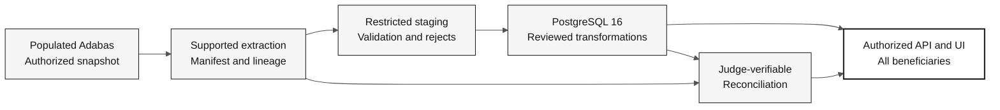

# Data Migration: Adabas to PostgreSQL

> **Path:** [Team Kit](../README.md) > [Documentation](README.md) > **Data migration**

**The participant covers DBA responsibilities for the source-data lifecycle, from a verified populated Adabas source to reconciled PostgreSQL records that the modern application can consult.**

| Field | Value |
|---|---|
| Audience | Individual participant covering DBA, QA, PO/RE, Architecture, Developer, and DevOps responsibilities |
| Prerequisites | Authorized populated Adabas source and agreed extraction route ready before 14:00, plus source-reading evidence |
| Stage | Pre-work and Stages 1-3; final judge validation |
| Expected outcome | Source-derived records, judge-verifiable reconciliation, complete beneficiary consultation, and tested recovery |

## What the kit supplies

The [local legacy corpus](../01-archaeology/legacy-sifap/) supplies read-only
Natural sources, DDMs, an archived FDT listing, and historical documents.
These establish evidence to investigate, not a running database, completed data
map, approved schema, or migration solution.

The [synthetic legacy dataset](../01-archaeology/legacy-seed-data/README.md)
documents the fixed-width records the source owner loads into Adabas and their
layouts. Use it as population provenance, decoding practice, independent test
expectations, and edge-case fixtures. It is neither the migration source nor
proof of what Adabas currently contains.

The authorized legacy system has its own population process. The participant coordinates
with the source owner during pre-work to ensure Adabas is populated before 14:00 and records
the source version, synthetic-data provenance, and measured counts. A generator's
intended counts, fixed-width seed files, or archived FDT statistics do not prove
the current contents of Adabas.

Source access, population administration, and credentials stay outside this kit.
Never reset a shared database or run a load against an unconfirmed environment.
If the source is unavailable or empty, record the owner and blocker. Code reading
may continue, but the data-readiness gate cannot pass.

## Ownership throughout the stages

| Stage | DBA responsibility | Collaboration and evidence |
|---|---|---|
| Pre-work | Confirm authorized, populated source and supported read/extract capability before 14:00 | Source owner supplies population evidence; DevOps supports availability; participant records baseline measurements |
| 1 - Archaeology | Inventory definitions, records, keys, formats, relationships, and data-quality uncertainties | Participant agrees population and query needs while reading only the source needed for the fixed capability |
| 2 - Specification | Design mappings, snapshot/extraction contract, staging, load order, reject handling, rerun/resume, and recovery | Participant defines module boundaries, scope, reconciliation, and consultation tests |
| 3 - Implementation | Create schema and implement/run the approved source-to-target data pipeline | Participant integrates API/UI, reconciles the snapshot, and tests complete beneficiary access |
| Judge validation | Verify reconciliation, full beneficiary queries, rerun/resume, recovery evidence, and CI | Judge scripts and expected values provide independence |

The participant covers DBA and QA responsibilities themselves. Independence comes from judge verification, not another participant or a second persona under the same operator. Record how the data was loaded, how it was verified, and which evidence the judge can inspect.

## Feasible workshop boundary

Before 14:00, the source owner must provide authorized populated Adabas and
a supported, verifiable snapshot/extraction route. Access requests, licenses,
source provisioning, and reverse-engineering an unknown binary export are not
hidden tasks for the Stage 3 implementation budget.

The participant selects the smallest end-to-end capability breadth that preserves
the agreed source population and required related data. Full population coverage
does not mean reimplementing every payment, report, batch, or historical
workflow. Record field treatment, lineage, and deferred capabilities explicitly;
never silently omit records or fields that acceptance requires.

At C2, compare the remaining work with actual source complexity and participant
readiness. If it does not fit, retain a blocked/incomplete migration and a
reviewable continuation plan. A smaller verified increment is a valid learning
result, but not proof that the full migration succeeded. No elapsed-time estimate
in this kit has been established by a timed participant trial.

## Source to target, not seed to seed

Flyway versions the schema and applies each version once. It does not extract
Adabas records, track record-level retries, or automatically undo a data load.
The record pipeline needs its own run identifiers, checkpoints, transaction
boundaries, duplicate prevention, and recovery evidence. Isolated test fixtures
are useful, but cannot replace the population in the acceptance path.

## Stage 1: generate evidence through guided archaeology

These are outputs the participant creates during reading, not supplied answers:

| Output | Template | Prompt |
|---|---|---|
| Source inventory and reading ledger | [Inventory](../01-archaeology/templates/inventory.template.md), [coverage](../01-archaeology/templates/reading-coverage.md) | `/archaeology-kickoff`, then update actual reading coverage |
| DDM/FDT source map and program declarations | [Data map](../01-archaeology/templates/data-map.md), [dictionary](../01-archaeology/templates/program-data-dictionary.md) | `/map-source-data` with DBA and `@archaeologist` |
| Populated-source readiness | [Readiness](data-migration/source-readiness.template.md) | `/migration phase=readiness` with DBA |
| Open questions | [Mystery record](../01-archaeology/templates/mysteries-found.template.md) | `/catalog-mysteries` using reader-assigned IDs |
| C1 report | [Discovery report](../01-archaeology/templates/discovery-report.template.md) | `/discovery-report` after evidence review |

Data discovery records **what the source declares or contains**. It does not
approve PostgreSQL tables or resolve inconsistencies. Distinguish logical DDM
formats, physical FDT byte lengths, and Natural declarations; preserve ambiguity
as a question. Read-only access queries and screenshots alone do not establish
a complete extraction contract.

> [!NOTE]
> Stage 4 is not used in the individual challenge (14:00-17:40). The challenge ends at Stage 3 and judge validation. See [ADR-0003](adr/0003-individual-challenge-format.md).

## Stage 2: define a verifiable migration contract

Use the [migration plan template](data-migration/migration-plan.template.md) and
[source-to-target mapping template](data-migration/source-to-target.template.md)
as supporting records linked from the feature's `spec.md`, `plan.md`, and `tasks.md`.
Formal requirements remain in `.spec/<NNN>-<feature>/`, with `REQ-NNN` and
`source_legacy:` or a justified `[GREENFIELD]`.

Before C2, the participant records decisions for DBA, Architecture, and QA responsibilities:

- Authorized source version, population, and consistent snapshot boundary, including concurrent writes and related files.
- Supported extraction method, format/version, field layout, encoding, record framing, checksums, source keys, and completeness checks. Unknown extraction is a blocker, not permission to invent an API.
- Field-level treatment of identifiers and leading zeros, empty/null/suppressed values, dates and time zones, exact decimals, relationships, MU/PE occurrences, and ordering.
- Source-to-target lineage and dependency-aware load order. Normalize structured repeating data unless measured evidence justifies another representation.
- Validation and rejection rules, who may approve remediation, and preservation of the original evidence. Never silently truncate, default, drop, or "fix" source values.
- Run identifiers, bounded batches, restart checkpoints, replay behavior, and isolation from unrelated target data.
- Target recovery and application compatibility, separately from schema rollback. Do not assume a licensed Flyway undo feature exists.
- Acceptance queries for authorized listing, search, and detail access across **all beneficiaries in the agreed population**, with pagination and access checks.

Do not translate packed lengths mechanically: establish source integer digits,
fractional digits, sign, and runtime representation before choosing PostgreSQL
`NUMERIC(precision, scale)` and Java `BigDecimal`. Never use floating point for
financial data.

## Stage 3: populate, reconcile, and consult

1. Write tests for mappings, invalid records, key preservation, repeat occurrences, and failures before implementing the pipeline.
2. Extract the agreed Adabas snapshot through the approved route. Record a manifest with version, snapshot/run IDs, population, files, integrity checks, and restricted evidence locations.
3. Stage immutable input and validate it. Load PostgreSQL using the approved mappings and order, with recoverable batches and explicit rejects.
4. Reconcile the same snapshot in a judge-verifiable way: source-key sets, accepted/rejected accounting, required fields, relationships, occurrence counts, and agreed financial aggregates.
5. Exercise the real API and UI over PostgreSQL, not mocks or success-shaped fallbacks. Verify stable pagination, search and detail behavior, authorization, and complete population coverage.
6. Rerun or resume the same snapshot without duplicates; test target recovery in an isolated environment without altering Adabas.

Use the [reconciliation template](data-migration/reconciliation.template.md).
Keep the unit of comparison explicit: one source record can create several
related rows, so unrelated table totals need not be equal. Every source record
still needs an explained disposition and traceable target representation.

**Accounting is not successful migration.** A reject can explain where a record
went, but cannot make that beneficiary queryable. Unresolved rejects or data
differences keep acceptance blocked. Never silently reduce the approved
population to a convenient sample or accept equal counts as proof of field parity.

## What the modern system must contain

Migration succeeds when the modern system holds and shows the legacy
information, not when the schema exists or the counts match. For every
beneficiary in the agreed population, PostgreSQL and the authorized
consultation carry the source data that acceptance requires, traced to its
source record:

- identification exactly as stored, including CPF and NIS leading zeros;
- registration, program, and status, including inactive or terminated situations;
- benefit and payment values as exact decimals, with their statuses and reference periods, including reversals and returns when in scope;
- dependents and other MU/PE occurrences, with their counts and order;
- audit history, when the agreed scope includes it.

The team establishes the exact fields from its own DDM, FDT, and program
reading; these categories are what QA checks, not a supplied mapping. A
category outside the agreed scope is recorded as an explicit deferral in the
scope decisions, never silently omitted.

The participant compares every accepted source record with its target representation field
by field, using automated checks against the same snapshot. Agreed financial
aggregates, such as totals by program, status, and reference period, are an
additional control, not a substitute. The participant also opens ordinary and
edge-case beneficiaries in the modern application, for example those behind
the dataset's [learning fixtures](../01-archaeology/legacy-seed-data/README.md#learning-fixtures),
and compare what it shows with the decoded source record.

## Self-check and acceptance gates

| Gate | Required evidence | Who reviews |
|---|---|---|
| C1 | Actual reading, populated-source baseline, data-quality gaps, authorized population, supported extraction readiness | Participant self-checks; judge can inspect evidence later |
| C2 | Approved mappings and snapshot/load/recovery design, traceable requirements, tasks, and validation plan | Participant self-checks before implementation |
| C3 | Source-derived PostgreSQL population, reconciliation, full beneficiary queries, rerun/resume and recovery results | Participant submits for judge validation |
| Final judge validation | Data reconciles; queries meet scope; CI is green; evidence and limitations are recorded | Judge validates independently |

## Evidence handling

- Use synthetic data authorized for this exercise; do not import production personal data.
- Keep raw extracts, credentials, snapshots, dumps, and record-level rejects in approved restricted storage outside Git, prompts, PRs, and public logs.
- Commit only sanitized counts, methods, decisions, hashes, and non-sensitive evidence references.
- Record owners, access controls, retention and cleanup for restricted artifacts.
- Leave approval and execution fields blank until the corresponding person or check supplies evidence.

## Completion criteria

- [ ] Adabas population and source version were verified, not assumed.
- [ ] Participant-generated archaeology artifacts and migration decisions are traceable.
- [ ] PostgreSQL contains the approved source-derived population with no unexplained differences.
- [ ] Required legacy information, including benefit and payment values, matches the source record by record, not only in totals.
- [ ] All authorized beneficiaries are accessible through the approved application queries.
- [ ] Reconciliation, rerun/resume, and recovery are automated or evidenced so the judge can verify them independently.
- [ ] Judge validation outcome is evidenced; unresolved blockers remain visible.

## References

- [Challenge flow](../00-TEAM-FLOW.md)
- [Stage 1 guide](../01-archaeology/GUIDE.md)
- [DBA persona](../05-personas/07-dba/PERSONA.md)
- [Blank migration records](data-migration/README.md)
