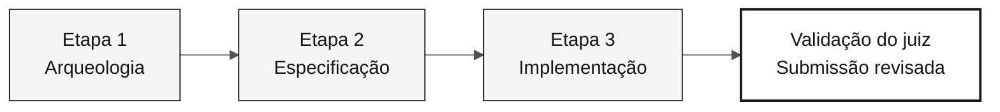

# Guia de estilo da documentação

> **Caminho:** [Kit da equipe](../README.md) › [Documentação](README.md) › **Guia de estilo da documentação**

Este é o **contrato único de estilo** para TODOS os arquivos `.md` do
repositório `datacorp-sifap-modernization-team-kit`, **exceto** os primitivos
do Copilot em `.github/`, que seguem seu próprio padrão estrutural.

Objetivo: documentação moderna, educativa, profissional e sóbria, sem emojis,
sem analogias ao Super Mario e com diagramas Mermaid em tons neutros
(branco/cinza/preto), tabelas, checklists e blocos de destaque.

---

## 1. Regras absolutas (nunca viole)

| # | Regra |
|---|---|
| R1 | **Nenhum emoji.** Remova todos os emojis e caracteres pictográficos de headings, tabelas, listas, destaques, blocos ASCII e corpo do texto. Substitua-os por palavras, badges cinza ou nada. |
| R2 | **Nenhuma analogia a Super Mario/Nintendo.** Remova Mario, Luigi, Peach, Daisy, Rosalina, Toad, Yoshi, Koopa, Goomba, Bowser, princesa, castelo, cogumelo, power-up, world 1-1, cano verde, estrela de invencibilidade, mana, XP, "raid", "game over", "boss" e "co-op". Consulte o §2 para ver o vocabulário substituto. |
| R3 | **"hackathon"/"hackaton" → "workshop".** Isso inclui nomes de diretórios de exemplo (`hackathon-team-XX` → `workshop-team-XX`), headings e corpo do texto. |
| R4 | **Este guia rege `docs/` e as pastas numeradas das etapas, não `.github/`.** Os primitivos do Copilot em `.github/` seguem seu próprio padrão estrutural (modelos de agentes, prompts, instruções e skills). Uma revisão da documentação não deve reestruturá-los como prosa. Links que apontam para `.github/...` permanecem válidos e devem ser preservados. |
| R5 | **Não invente fatos.** Corrija um erro instrucional somente com base em evidências ou em uma decisão explícita do workshop. Preserve entradas legadas somente leitura, datas das fontes, identificadores técnicos e registros reais de aceitação. Diferencie observações históricas de medições atuais e resultados pretendidos do exercício. |
| R6 | **Não quebre links.** Ao renomear um arquivo, atualize todos os links que apontam para ele. Os paths relativos devem permanecer corretos. |
| R7 | Mantenha a prosa da documentação em **inglês em `main` e `develop`**, **português brasileiro em `portugues-br`** e **espanhol em `espanol`**. Siga a [política de idiomas do repositório](../README.md#idiomas-do-repositório). Nomes nativos dos idiomas são permitidos no seletor; não duplique seções traduzidas em `main`. Preserve nomes de arquivos, paths, schemas, identificadores técnicos, comportamento do código e fontes legadas originais. Os primitivos do Copilot estão fora do escopo deste guia. O idioma e a estrutura deles seguem [`.github/PRIMITIVE-STANDARD.md`](../.github/PRIMITIVE-STANDARD.md). |

---

Use a [cronologia do cenário](../README.md#cenário-cronologia-e-evidências)
para a narrativa atual e a [escala de evidências dos mistérios](../01-archaeology/mysteries-checklist.md)
para a dificuldade do exercício. Datas de autoria e conversões de documentos
não atualizam a data efetiva da fonte histórica. Antes de declarar qualquer
data, autoria ou versão do SIFAP em um arquivo de `docs/` ou das pastas das
etapas, consulte
[`01-archaeology/legacy-sifap/CHRONOLOGY.md`](../01-archaeology/legacy-sifap/CHRONOLOGY.md).
O job `chronology` da CI falha quando um documento do kit contradiz o cabeçalho de uma fonte.

## 2. Vocabulário substituto (Mario → linguagem profissional)

| Termo anterior | Novo termo |
|---|---|
| World 1 / 1-1 / Overworld | Etapa 1 — Arqueologia |
| World 2 / 2-1 / Underground | Etapa 2 — Especificação |
| World 3 / 3-1 / Athletic | Etapa 3 — Implementação |
| Castle / 4-Castle / Bowser | Validação final do juiz ou Etapa 4 após o desafio, conforme o contexto |
| Princess / rescue the princess | Objetivo final: SIFAP 2.0 com dados migrados e verificados |
| Green pipe | Checkpoint de autoverificação entre etapas |
| Star / invincibility star | Pipeline de CI aprovado (CI verde) |
| Power-up / inventory / backpack | Kit da persona (prompts, skills, instruções) |
| Playable character (Mario, Peach…) | A própria persona (Product Owner, Developer…) |
| Attack / special move / mana / XP | Modo do Copilot / comando slash / custo de tempo |
| Combat scene / raid / boss | Cenário de uso / exemplo prático / revisão de PR |
| Game over / fall into a pit | Falha do projeto / risco / antipadrão |
| 5-player co-op | Participante do desafio individual que cobre as responsabilidades de todos os papéis |
| Mario Maker | Ferramenta de criação de especificações (Spec-Kit) |
| Mushroom recipe | Modelo de requisito |
| Letter from the princess | Registro formal de decisão (ADR) |
| Yoshi swallows tables | Reescreva literalmente: modelagem e otimização de dados |

Quando uma analogia era o *único* conteúdo de uma seção, **substitua-a por
conteúdo educativo real**: definição do conceito, importância, perguntas de
investigação e caso de uso. Nunca forneça uma resposta pronta para o exercício
do SIFAP nem uma decisão de exemplo já aceita. Não deixe a seção vazia nem
somente renomeie seu rótulo.

---

## 3. Estrutura canônica dos documentos

Todos os arquivos `.md` (exceto modelos puros e arquivos de dados) seguem esta ordem:

```markdown
# Document Title

> **Path:** [Team Kit](../README.md) › [Section](README.md) › **Current document**

**One-sentence summary.** A single, direct sentence explaining what the reader
will be able to do after reading.

| Field | Value |
|---|---|
| **Target audience** | who should read it |
| **Prerequisites** | what they need to know/have beforehand |
| **Estimated time** | 15 min |
| **Stage** | Stage 2 — Specification |
| **Expected outcome** | concrete artifact produced |

---

## Concept

Educational explanation of the concept (what it is, why it exists, which problem it solves).

## How it works

Mermaid diagram + explanation.

## Step by step

Executable checklist.

## Apply the method to SIFAP

Questions and blank structures the participant fills from evidence, never ready-made answers.

## Use cases

When to use / when not to use.

## Completion criteria

- [ ] verifiable item

## Common errors and how to avoid them

Symptom → cause → correction table.

## References

Related links.

---

### Continue reading
(navigation block—see §8)
```

Adapte as seções ao conteúdo real do arquivo. Não force seções vazias.
O importante é: **contexto → conceito → prática → verificação → próximos passos**.

---

## 4. Diagramas Mermaid: tema neutro obrigatório

Substitua desenhos em ASCII por Mermaid quando o diagrama representar fluxo,
hierarquia, sequência, estados ou relacionamentos. Preserve blocos de
terminal/código-fonte como estão, pois eles não são diagramas.

### Paleta única (use exatamente estes valores)

| Papel | fill | stroke | color |
|---|---|---|---|
| Principal / destaque | `#F5F5F5` | `#171717` | `#171717` |
| Secundário | `#FFFFFF` | `#525252` | `#171717` |
| Terciário / apoio | `#FAFAFA` | `#A3A3A3` | `#404040` |
| Sombreado / inativo | `#E5E5E5` | `#737373` | `#404040` |
| Contorno forte (resultado) | `#FFFFFF` | `#171717` | `#171717` (stroke-width 2px) |

### Cabeçalho padrão obrigatório em todos os blocos Mermaid



Regras do Mermaid:

- Sempre inclua o bloco `%%{init: ...}%%` acima. Copie-o literalmente.
- Nunca use cores saturadas (azul, laranja, verde, vermelho, amarelo).
- Coloque os rótulos entre aspas duplas: `A["Text"]`. Use `<br/>` para quebras de linha.
- Não use emojis no diagrama.
- Tipos permitidos: `flowchart`, `sequenceDiagram`, `stateDiagram-v2`,
  `journey`, `gantt`, `mindmap`, `timeline`, `erDiagram`, `classDiagram`,
  `quadrantChart`, `C4Context`.
- Em diagramas grandes, prefira `flowchart TB` com um `subgraph` nomeado para cada área.
- Não use `linkStyle` com cores saturadas. Use `stroke:#525252` quando necessário.

### Substitua sequências ASCII por Mermaid

Blocos como `A ──> B ──> C` ou caixas desenhadas com `┌─┐` devem se tornar
Mermaid. Árvores de diretórios (`├──`) **podem permanecer** como blocos de
código `text`, mas sem emojis nos nós.

---

## 5. Componentes visuais permitidos

### 5.1 Blocos de destaque (GitHub Alerts): use no lugar de emojis

```markdown
> [!NOTE]
> Useful supplementary information.

> [!TIP]
> Shortcut or good practice.

> [!IMPORTANT]
> Information required for success.

> [!WARNING]
> Risk of losing work or breaking CI.

> [!CAUTION]
> Serious negative consequence; prohibited action.
```

### 5.2 Badges: somente em escala de cinza

Use `flat-square` e somente estas cores: `171717`, `404040`, `737373`, `A3A3A3`, `E5E5E5`.

```markdown


```

Use no máximo três badges por documento, sempre imediatamente após o resumo. Nunca use cores.

### 5.3 Tabelas

Prefira uma tabela a uma lista quando houver duas ou mais dimensões
(item × atributo). Use headers em **negrito** somente na primeira coluna quando
ela for uma chave. Alinhamento: `|---|---|` (padrão). Evite tabelas com mais de
cinco colunas.

### 5.4 Checklists

Toda seção que descreve ações executáveis se torna um checklist GFM:

```markdown
## Step by step

- [ ] **Step 1 — Read the assigned programs.** Open `01-archaeology/legacy-sifap/natural-programs/`.
- [ ] **Step 2 — Record rules.** Complete `business-rules-catalog.md`.
- [ ] **Step 3 — Validate.** Run `npm run lint:docs`.
```

Padrão do item: `- [ ] **Verbo no infinitivo — título curto.** Detalhe com path/comando.`

### 5.5 Blocos `<details>` para conteúdo opcional longo

```markdown
<details>
<summary><strong>Complete example of the generated file</strong></summary>

...content...

</details>
```

### 5.6 Separadores

Use `---` entre áreas principais do documento. Não use mais de um `---` consecutivo.

### 5.7 Imagens/SVGs existentes

Mantenha todas as referências existentes a `assets/*.svg`. Não remova imagens.
Garanta que todo `![...]` tenha **texto alternativo descritivo** (acessibilidade),
sem emojis.

---

## 6. Tom educativo (obrigatório)

Cada conceito novo deve incluir, nesta ordem:

1. **Definição**: o que é, em uma frase objetiva.
2. **Por que importa**: qual problema resolve neste workshop.
3. **Como se aplica ao SIFAP**: um exemplo concreto do domínio (programas `.NSP`,
   subprogramas `.NSN`, DDMs `.ddm`, pagamentos, benefícios, fiscalizações).
4. **Caso de uso**: uma situação real em que a pessoa leitora usará o conceito.
5. **Erro comum**: o que costuma dar errado.

Diretrizes de escrita:

- Use voz ativa e a segunda pessoa ("você faz", "abra o arquivo").
- Mantenha as frases curtas. Um parágrafo corresponde a uma ideia.
- Explique termos de domínio e arquitetura (`bounded context`, `pull request`,
  `packed decimal`) na primeira ocorrência. A pessoa leitora é iniciante em
  pelo menos um lado da modernização do legado.
- Não force humor, jargão de jogos nem exageros. Seja profissional e acolhedor.
- Nunca use "simplesmente", "apenas" nem "é fácil".

---

## 7. Glossário e termos do domínio

Mantenha e reforce: SIFAP (Sistema de Fiscalização e Administração de Pagamentos),
Natural, Adabas, DDM, FDT, EARS, REQ-ID, `source_legacy`, ADR, bounded context,
Spec-Kit, Strangler Fig, Monólito Modular, Testcontainers.

Ao mencionar um termo pela primeira vez em um documento, forneça uma definição
curta entre parênteses ou em uma nota.

---

## 8. Rodapé de navegação padrão

Substitua os rodapés atuais por este formato (sem emojis):

```markdown
---

### Continue reading

| Previous | Next |
|---|---|
| Previous title (`previous-file.md`)<br/><sub>One-line summary.</sub> | Next title (`next-file.md`)<br/><sub>One-line summary.</sub> |

<sub>[Back to the kit index](../README.md)</sub>
```

Se não houver documento anterior ou seguinte, use `—` na célula.
Converta blocos HTML `<table>` existentes para este formato.

---

## 9. Cabeçalho do arquivo

**Não adicione comentários inline `<!-- markdownlint-disable ... -->`.**
O arquivo `.markdownlint-cli2.jsonc` do repositório é a fonte única de verdade
para a configuração do lint e já desabilita todas as regras que o kit precisa
flexibilizar (`MD003`, `MD013`, `MD025`, `MD026`, `MD028`, `MD029`, `MD033`,
`MD034`, `MD036`, `MD040`, `MD041`, `MD051`, `MD060`).

Pragmas inline são prejudiciais por dois motivos:

1. Eles duplicam a configuração, portanto as duas fontes divergem com o tempo.
2. Nos primitivos do Copilot (`.github/agents/`, `.github/prompts/`,
   `.github/skills/`, `.github/instructions/`), o comentário entra na janela de
   contexto do modelo e consome tokens sem transmitir valor instrucional.

Adicione um pragma **somente** quando um único arquivo realmente precisar
flexibilizar uma regra que não está desabilitada globalmente. Desabilite somente
essa regra. O único exemplo atual é `docs/adr/0000-template.md`, que precisa de
`MD024` porque o modelo repete headings deliberadamente:

```markdown
<!-- markdownlint-disable MD024 -->
```

A primeira linha de cada arquivo é, portanto, o título `# H1` (ou o frontmatter
YAML, quando o arquivo for um primitivo do Copilot). Use somente um `# H1` por
arquivo. Não pule níveis de headings (`#` → `##` → `###`).

---

## 10. Renomeações de arquivos acordadas (07-concepts)

| Arquivo atual | Novo nome |
|---|---|
| `07-concepts/01-spec-kit-como-mario-maker.md` | `07-concepts/01-spec-driven-development.md` |
| `07-concepts/02-agentes-como-super-mario.md` | `07-concepts/02-agents-and-personas.md` |
| `07-concepts/05-ears-receita-de-cogumelo.md` | `07-concepts/05-ears-notation.md` |
| `07-concepts/06-adr-carta-da-princesa.md` | `07-concepts/06-architecture-decision-records.md` |

Os outros arquivos (`00-README.md`, `03-visual-glossary.md`,
`04-3-copilot-modes.md`) mantêm seus nomes.

Renomeie arquivos com `git mv`. Todo agente que encontrar links para os nomes
anteriores deve atualizá-los para os novos nomes.

---

## 11. Checklist de verificação por arquivo

Antes de considerar um arquivo concluído:

- [ ] Nenhum emoji (`grep -P '[\x{1F300}-\x{1FAFF}\x{2600}-\x{27BF}\x{2B00}-\x{2BFF}\x{FE0F}\x{2190}-\x{21FF}]'` não retorna resultados pertinentes)
- [ ] Nenhuma referência a analogias de Mario/Nintendo/jogos
- [ ] Nenhuma ocorrência de "hackathon"/"hackaton"
- [ ] Todo bloco Mermaid tem o cabeçalho `%%{init:...}%%` e a paleta neutra
- [ ] Todas as ações executáveis estão em checklists `- [ ]`
- [ ] Tabelas são usadas quando há duas ou mais dimensões
- [ ] GFM alerts (`> [!NOTE]`) são usados no lugar de emojis de aviso
- [ ] O rodapé de navegação usa o formato do §8
- [ ] Os links relativos são válidos (o arquivo de destino existe)
- [ ] O conteúdo factual foi preservado

---

### Continue lendo

| Anterior | Próximo |
|---|---|
| [Índice da documentação](README.md)<br/><sub>Todos os documentos de apoio do kit.</sub> | [FAQ](FAQ.md)<br/><sub>Perguntas frequentes sobre o workshop.</sub> |

<sub>[Voltar ao índice do kit](../README.md)</sub>
