# Workshop SDLC Flow and Self-Checkpoints

> **Path:** [Team Kit](../README.md) › [Docs](README.md) › **SDLC Flow**

**Guide to the contracts between individual challenge stages** — summarizes self-checkpoints without changing schedules or expanding deliverables.

| Field | Value |
|---|---|
| **Target audience** | Every participant |
| **Prerequisites** | Read [`00-TEAM-FLOW.md`](../00-TEAM-FLOW.md) |
| **Expected outcome** | Understand what each stage produces and what you verify before moving on |

---

## Flow overview

```mermaid
%%{init: {'theme':'neutral','themeVariables':{'fontFamily':'ui-sans-serif, system-ui, sans-serif','primaryColor':'#F5F5F5','primaryTextColor':'#171717','primaryBorderColor':'#171717','lineColor':'#525252','secondaryColor':'#FFFFFF','tertiaryColor':'#FAFAFA','background':'#FFFFFF'}}}%%
flowchart LR
    classDef step fill:#F5F5F5,stroke:#171717,color:#171717
    classDef check fill:#FFFFFF,stroke:#525252,color:#171717
    classDef result fill:#FFFFFF,stroke:#171717,color:#171717,stroke-width:2px

    E1["Stage 1<br/>Archaeology<br/>14:00-14:50"]:::step
    C1["C1 self-check"]:::check
    E2["Stage 2<br/>Specification<br/>14:50-15:30"]:::step
    C2["C2 self-check"]:::check
    E3["Stage 3<br/>Implementation and data migration<br/>15:30-17:10"]:::step
    C3["C3 submission check"]:::check
    ACCEPT["Judge validation<br/>17:10-17:40"]:::result

    E1 --> C1 --> E2 --> C2 --> E3 --> C3 --> ACCEPT
```



---

## Official challenge schedule

See [`00-TEAM-FLOW.md`](../00-TEAM-FLOW.md) for the source-of-truth schedule. Summary:

| Time | Stage | Agent | Expected outcome |
|---|---|---|---|
| 14:00-14:50 | 1 — Archaeology | `@archaeologist` + `@dba` for data discovery | Legacy evidence, discovered validation rules, measured population and open questions |
| 14:50-15:30 | 2 — Specification | `@architect` + `@dba` for migration design | `spec.md`, `plan.md`, `tasks.md`, migration design and reconciliation tests |
| 15:30-17:10 | 3 — Implementation and data migration | `@builder` + `@dba` | Tested increment, populated PostgreSQL, reconciliation and query evidence |
| 17:10-17:40 | Final judge validation | judge | Validated submission or recorded blockers |

> [!NOTE]
> Stage 4 — Evolution is kept in the kit for post-challenge work, but it is not used in the individual challenge. The challenge ends at Stage 3 and judge validation. See [ADR-0003](adr/0003-individual-challenge-format.md).

---

## Formal artifact structure

Formal Spec-Kit artifacts for a feature live in:

```text
.spec/<NNN>-<feature>/
├── spec.md          # EARS requirements and source traceability
├── research.md      # decisions, rationale, alternatives, risks
├── plan.md          # Modular Monolith design and delivery view
├── data-model.md    # source-to-target entities and fields
├── contracts/       # /api/v1 contracts, or a README stating why none
├── quickstart.md    # runnable validation scenarios
├── tasks.md         # ordered tasks, tests, verification ledger
└── checklists/      # requirement-quality gates
```

`02-modern-spec/` stores only supporting material and scope decisions. Do not create parallel formal artifacts outside the feature folder.

---

## Self-checkpoint checklist

| Checkpoint | When | Verify before moving on | Confirmation question |
|---|---|---|---|
| **C1** | End of Stage 1 | Scope, source evidence, measured population, extraction readiness, and open questions | "Do I have evidence for both behavior and source data?" |
| **C2** | End of Stage 2 | `spec.md`, `plan.md`, `tasks.md`, migration design, and QA reconciliation tests | "Can I migrate and validate the complete authorized population?" |
| **C3** | End of Stage 3 | Working increment, populated PostgreSQL, reconciliation, query and recovery evidence, and submission PR checklist | "Is data acceptance complete, and what remains blocked?" |

A checkpoint gap does not authorize inventing requirements, legacy sources, or architecture — reduce capability breadth or record the pending item. Do not reduce the migrated beneficiary population or verification standard.

DBA responsibilities cover the [data lifecycle](DATA-MIGRATION.md) from source readiness before Stage 1. Feature scope may be narrow; beneficiary population coverage must not be silently reduced. Unavailable extraction or unresolved data differences block migration acceptance, even when the build passes.

---

## Traceability

Before EARS, read the assigned sources and verify the selected behavior. Every `REQ-NNN` needs an unbulleted `source_legacy:` within the next 20 lines, using an actual supported Natural/JCL/DDM/FDT path or justified `[GREENFIELD]`. CI checks this syntax and file existence, not human reading or behavioral truth.

---

## Branches

Create `spec/<NNN>-<feature>` from `develop` during Stage 2. Then create `impl/<NNN>-<feature>`, also from `develop`, during Stage 3. The submission PR is `impl/<NNN>-<feature>` → `develop` in the participant repository. There is no `stage` branch, and Stage 4 branch prefixes are not used in the challenge.

---

### Continue reading

| Previous | Next |
|---|---|
| [Persona-Agent Matrix](persona-agent-matrix.md)<br/><sub>Which responsibilities are active at each stage.</sub> | [Four Agents Explained](4-agents-explained.md)<br/><sub>Why there are four stage agents.</sub> |

<sub>[Back to the kit index](../README.md)</sub>
